# Name: Siddhant Abhijit Raje

<!-- document_mode: ocr -->

<!-- page 1 mode: hybrid_paper -->

CMPE 286 – LAB – 1

Student ID: 018179954

Part 1: Installation

Part 2:

HTTP Traffic:

---

<!-- page 2 mode: ocr -->

<!-- OCR page 2 -->

DNS Traffic:

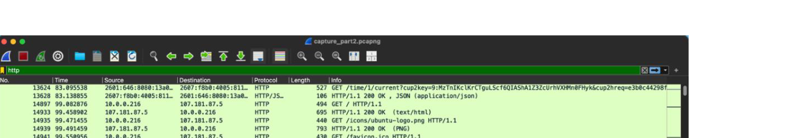

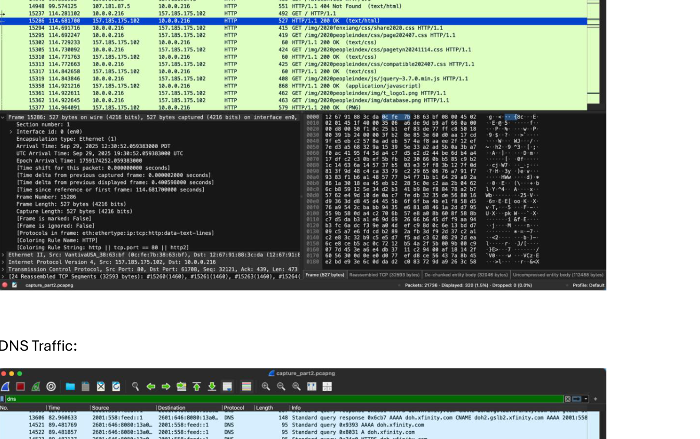

---

<!-- page 3 mode: ocr -->

<!-- OCR page 3 -->

TCP Traffic:

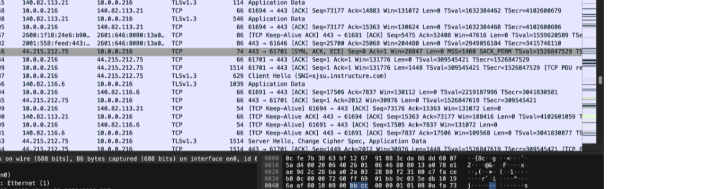

UDP Traffic:

---

<!-- page 4 mode: hybrid_paper -->

Normal browsing instantly produces DNS lookups, then TCP/TLS or UDP/QUIC connections, followed by application data. Background traffic (e.g., mDNS, DHCPv6, ARP/ND) is typical on LANs and may appear even when you aren’t actively browsing.

Part 3: Identify HTTP Requests and Responses:

- Filter for HTTP packets and identify GET and POST requests (any one request is fine).

- Click on a packet and expand the Hypertext Transfer Protocol section to see details of the request (like

the URL, Host, and User-Agent).

---

<!-- page 5 mode: ocr -->

<!-- OCR page 5 -->

Analyze DNS Packets:

---

<!-- page 6 mode: ocr -->

<!-- OCR page 6 -->

Part 4: Custom Columns:

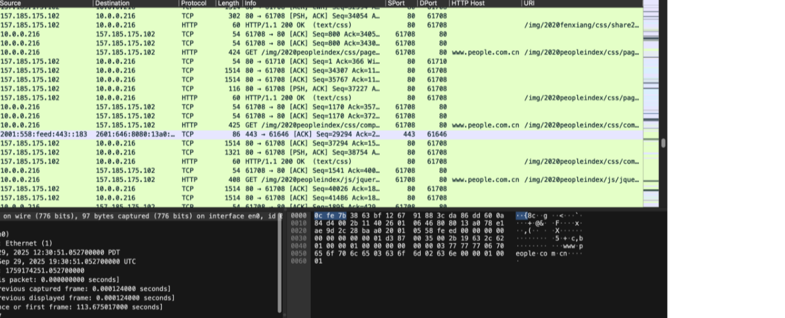

Custom Coloring rules:

HTTP:

---

<!-- page 7 mode: ocr -->

<!-- OCR page 7 -->

DNS:

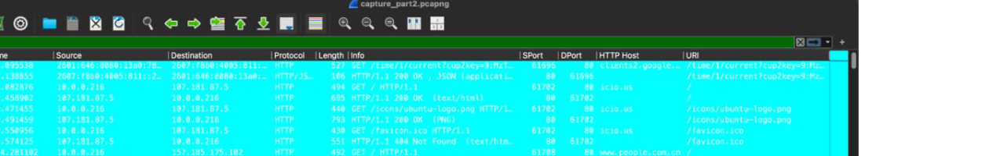

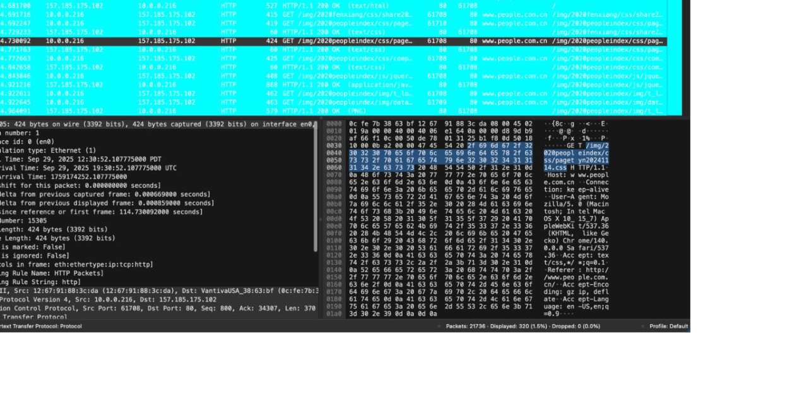

---

<!-- page 8 mode: ocr -->

<!-- OCR page 8 -->

Part 5: Advanced Analysis

Protocol Hierarchy:

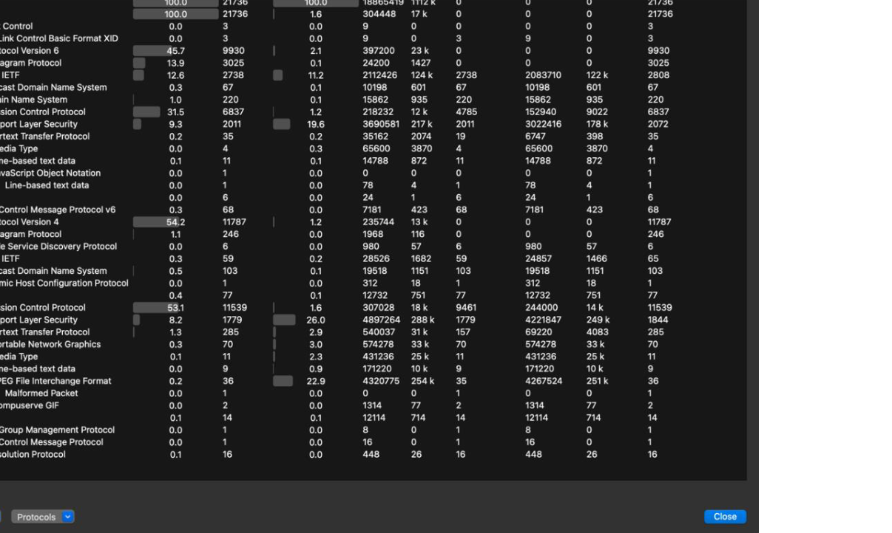

TCP Stream:

---

<!-- page 9 mode: hybrid_paper -->

Part 6: Delay and Jitter

Hosts selected:

## Harvard.edu

MIT Pings:

---

<!-- page 10 mode: ocr -->

<!-- OCR page 10 -->

UTexas Pings:

---

<!-- page 11 mode: ocr -->

<!-- OCR page 11 -->

Histogram of RTT:

Harvard.edu:

---

<!-- page 12 mode: ocr -->

<!-- OCR page 12 -->

RTT Histogram - Combined

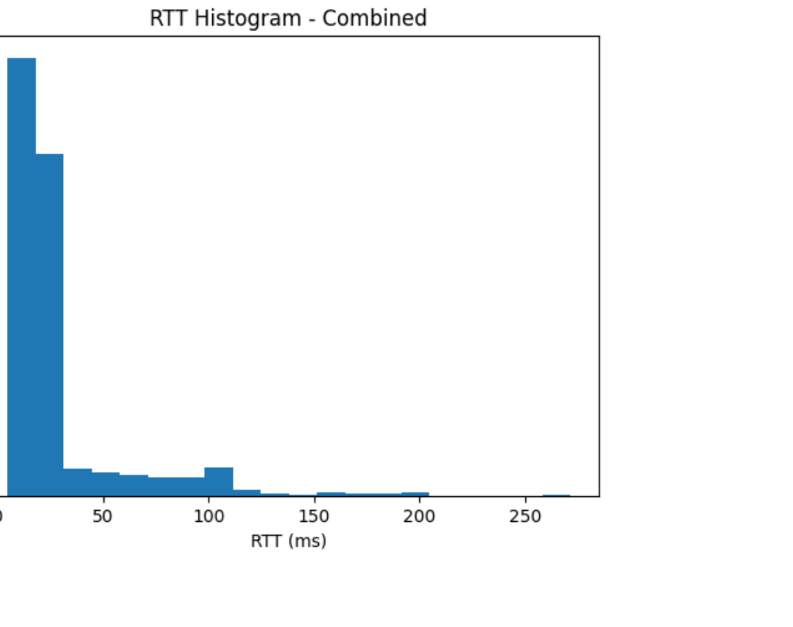

Stats:

<table>
  <tr>
    <th>file</th>
    <th>count</th>
    <th>min_ms</th>
    <th>max_ms</th>
    <th>avg_ms</th>
    <th>median_ms</th>
    <th>stdev_ms</th>
    <th>p50_ms</th>
    <th>p90_ms</th>
    <th>p95_ms</th>
    <th>p99_ms</th>
    <th>mad_successive_ms</th>
  </tr>
  <tr>
    <td>ping_harvard_run1.txt</td>
    <td>100</td>
    <td>12.596</td>
    <td>111.842</td>
    <td>30.0007300000000000</td>
    <td>21.429</td>
    <td>23.83009767943080</td>
    <td>21.397</td>
    <td>62.126</td>
    <td>96.159</td>
    <td>110.857</td>
    <td>16.198676767676800</td>
  </tr>
  <tr>
    <td>ping_harvard_run2.txt</td>
    <td>100</td>
    <td>10.184</td>
    <td>134.758</td>
    <td>30.15724</td>
    <td>21.1685</td>
    <td>25.402209517403400</td>
    <td>21.161</td>
    <td>74.64</td>
    <td>88.054</td>
    <td>113.405</td>
    <td>18.009181818181800</td>
  </tr>
  <tr>
    <td>ping_harvard_run3.txt</td>
    <td>99</td>
    <td>4.852</td>
    <td>14.135</td>
    <td>8.233737373737380</td>
    <td>9.854</td>
    <td>2.376013423250490</td>
    <td>9.854</td>
    <td>10.424</td>
    <td>10.692</td>
    <td>14.135</td>
    <td>1.661520408163270</td>
  </tr>
  <tr>
    <td>ping_harvard_run4.txt</td>
    <td>100</td>
    <td>9.926</td>
    <td>101.44</td>
    <td>25.32239</td>
    <td>16.828</td>
    <td>22.344149006081200</td>
    <td>16.755</td>
    <td>69.008</td>
    <td>82.838</td>
    <td>100.646</td>
    <td>14.49489898989900</td>
  </tr>
  <tr>
    <td>ping_harvard_run5.txt</td>
    <td>100</td>
    <td>9.519</td>
    <td>197.653</td>
    <td>30.3989600000000000</td>
    <td>18.6205</td>
    <td>31.3955756082949</td>
    <td>18.555</td>
    <td>65.316</td>
    <td>98.098</td>
    <td>151.659</td>
    <td>22.68414141414140</td>
  </tr>
  <tr>
    <td>ping_harvard_run6.txt</td>
    <td>100</td>
    <td>12.646</td>
    <td>172.883</td>
    <td>28.9711600000000000</td>
    <td>21.9605</td>
    <td>24.400183962595100</td>
    <td>21.945</td>
    <td>49.054</td>
    <td>80.21</td>
    <td>108.435</td>
    <td>14.6630000000000000</td>
  </tr>
  <tr>
    <td>ping_harvard_run7.txt</td>
    <td>100</td>
    <td>9.254</td>
    <td>198.974</td>
    <td>40.05934</td>
    <td>17.7635</td>
    <td>44.26631123493210</td>
    <td>17.731</td>
    <td>101.842</td>
    <td>145.092</td>
    <td>190.03</td>
    <td>26.294202020202000</td>
  </tr>
  <tr>
    <td>ping_harvard_run8.txt</td>
    <td>100</td>
    <td>10.765</td>
    <td>161.236</td>
    <td>28.2374100000000000</td>
    <td>17.6175</td>
    <td>27.069216220082800</td>
    <td>17.522</td>
    <td>68.564</td>
    <td>98.905</td>
    <td>108.536</td>
    <td>18.209505050505100</td>
  </tr>
  <tr>
    <td>ping_harvard_run9.txt</td>
    <td>100</td>
    <td>11.422</td>
    <td>177.277</td>
    <td>28.3411300000000000</td>
    <td>18.1575</td>
    <td>27.91743156859120</td>
    <td>18.154</td>
    <td>65.272</td>
    <td>96.096</td>
    <td>103.608</td>
    <td>18.685666666666700</td>
  </tr>
  <tr>
    <td>ping_harvard_run10.txt</td>
    <td>100</td>
    <td>12.369</td>
    <td>271.383</td>
    <td>32.6562900000000000</td>
    <td>21.9675</td>
    <td>36.53653678068660</td>
    <td>21.864</td>
    <td>57.739</td>
    <td>98.227</td>
    <td>199.556</td>
    <td>23.190262626262600</td>
  </tr>
</table>

Mit.edu:

---

<!-- page 13 mode: ocr -->

<!-- OCR page 13 -->

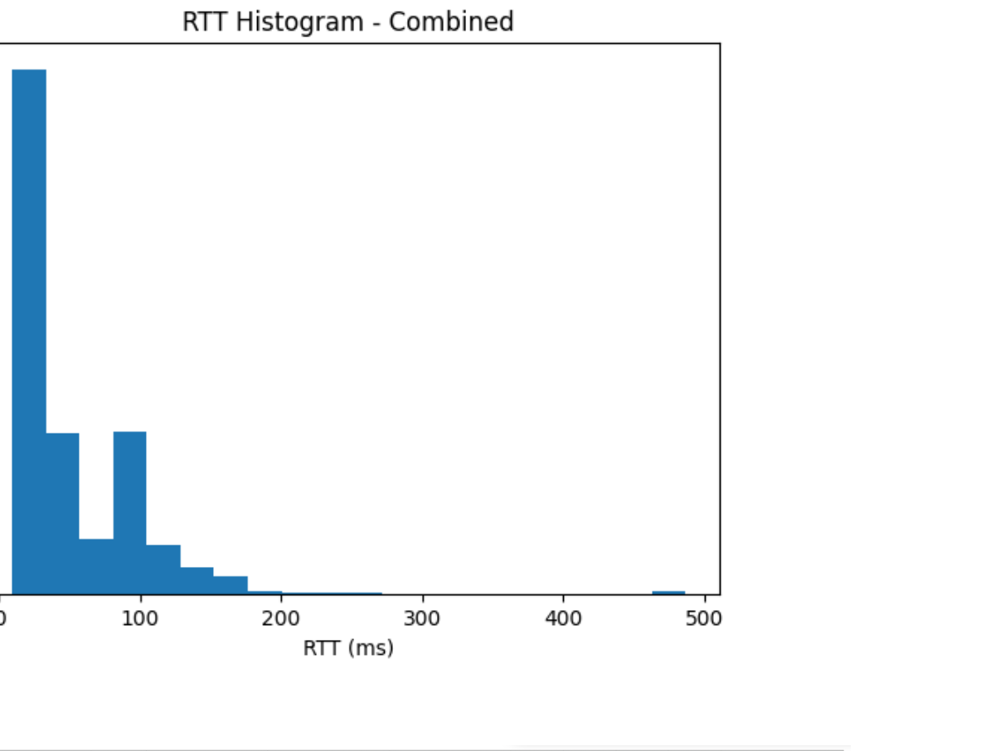

Stats:

<table>
  <tr>
    <th>file</th>
    <th>count</th>
    <th>min_ms</th>
    <th>max_ms</th>
    <th>avg_ms</th>
    <th>median_ms</th>
    <th>stdev_ms</th>
    <th>p50_ms</th>
    <th>p90_ms</th>
    <th>p95_ms</th>
    <th>p99_ms</th>
    <th>mad_successive_ms</th>
  </tr>
  <tr>
    <td>ping_mit_run1.txt</td>
    <td>100</td>
    <td>77.279</td>
    <td>255.307</td>
    <td>107.73970000000000</td>
    <td>87.906</td>
    <td>36.37414637090640</td>
    <td>87.539</td>
    <td>157.787</td>
    <td>164.105</td>
    <td>243.77</td>
    <td>30.462373737373700</td>
  </tr>
  <tr>
    <td>ping_mit_run2.txt</td>
    <td>100</td>
    <td>29.042</td>
    <td>193.71</td>
    <td>54.15174000000000</td>
    <td>37.6685</td>
    <td>35.69516777092310</td>
    <td>37.637</td>
    <td>111.719</td>
    <td>129.3</td>
    <td>161.94</td>
    <td>24.409929292929300</td>
  </tr>
  <tr>
    <td>ping_mit_run3.txt</td>
    <td>100</td>
    <td>12.013</td>
    <td>59.759</td>
    <td>15.57745000000000</td>
    <td>16.2915</td>
    <td>4.824693377759250</td>
    <td>16.287</td>
    <td>16.689</td>
    <td>16.804</td>
    <td>18.056</td>
    <td>2.5175757575757600</td>
  </tr>
  <tr>
    <td>ping_mit_run4.txt</td>
    <td>100</td>
    <td>29.995</td>
    <td>126.099</td>
    <td>47.24466</td>
    <td>36.1415</td>
    <td>25.391198357794200</td>
    <td>36.131</td>
    <td>90.636</td>
    <td>103.867</td>
    <td>125.2</td>
    <td>15.124909090909100</td>
  </tr>
  <tr>
    <td>ping_mit_run5.txt</td>
    <td>100</td>
    <td>19.256</td>
    <td>149.346</td>
    <td>40.59334000000000</td>
    <td>31.3855</td>
    <td>25.24223794934420</td>
    <td>31.364</td>
    <td>84.344</td>
    <td>101.801</td>
    <td>116.538</td>
    <td>15.345404040404000</td>
  </tr>
  <tr>
    <td>ping_mit_run6.txt</td>
    <td>100</td>
    <td>20.839</td>
    <td>156.987</td>
    <td>42.49267</td>
    <td>28.1415</td>
    <td>30.755618106161000</td>
    <td>28.024</td>
    <td>95.675</td>
    <td>113.447</td>
    <td>141.767</td>
    <td>19.33853535353540</td>
  </tr>
  <tr>
    <td>ping_mit_run7.txt</td>
    <td>100</td>
    <td>11.001</td>
    <td>486.49</td>
    <td>36.01467000000000</td>
    <td>20.289</td>
    <td>53.18523695653070</td>
    <td>20.22</td>
    <td>82.48</td>
    <td>105.466</td>
    <td>137.659</td>
    <td>25.874232323232300</td>
  </tr>
  <tr>
    <td>ping_mit_run8.txt</td>
    <td>100</td>
    <td>9.795</td>
    <td>105.008</td>
    <td>24.98635000000000</td>
    <td>16.86700000000000</td>
    <td>21.839448832805000</td>
    <td>16.851</td>
    <td>61.67</td>
    <td>80.484</td>
    <td>99.585</td>
    <td>15.588171717171700</td>
  </tr>
  <tr>
    <td>ping_mit_run9.txt</td>
    <td>100</td>
    <td>9.376</td>
    <td>180.535</td>
    <td>28.00679000000000</td>
    <td>18.3775</td>
    <td>27.12876389574380</td>
    <td>18.295</td>
    <td>61.991</td>
    <td>97.414</td>
    <td>107.26</td>
    <td>18.147757575757600</td>
  </tr>
  <tr>
    <td>ping_mit_run10.txt</td>
    <td>100</td>
    <td>74.293</td>
    <td>470.234</td>
    <td>100.32610000000000</td>
    <td>84.89500000000000</td>
    <td>44.54853299027770</td>
    <td>84.79</td>
    <td>141.307</td>
    <td>153.539</td>
    <td>171.251</td>
    <td>24.806030303030300</td>
  </tr>
</table>

Utexas.edu:

---

<!-- page 14 mode: ocr -->

<!-- OCR page 14 -->

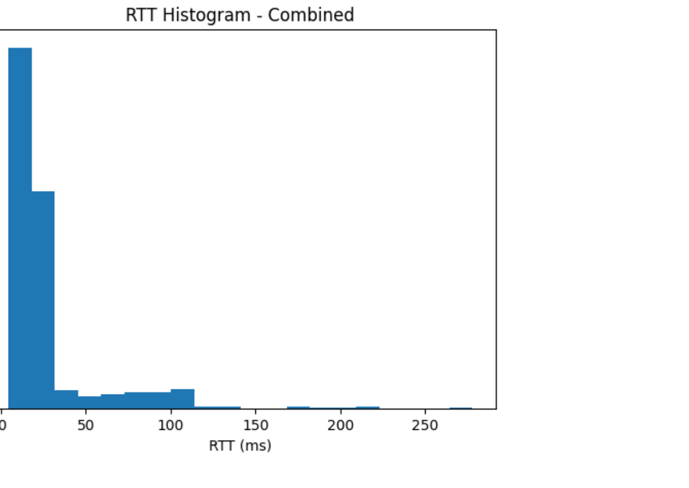

Stats:

<table>
  <tr>
    <th>file</th>
    <th>count</th>
    <th>min_ms</th>
    <th>max_ms</th>
    <th>avg_ms</th>
    <th>median_ms</th>
    <th>stdev_ms</th>
    <th>p50_ms</th>
    <th>p90_ms</th>
    <th>p95_ms</th>
    <th>p99_ms</th>
    <th>mad_successive_ms</th>
  </tr>
  <tr>
    <td>ping_utexas_run1.txt</td>
    <td>100</td>
    <td>10.082</td>
    <td>210.406</td>
    <td>29.142510000000000</td>
    <td>18.6785</td>
    <td>32.95998957306370</td>
    <td>18.664</td>
    <td>68.471</td>
    <td>87.26</td>
    <td>209.14</td>
    <td>22.249626262626300</td>
  </tr>
  <tr>
    <td>ping_utexas_run2.txt</td>
    <td>100</td>
    <td>9.76</td>
    <td>105.378</td>
    <td>29.403850000000000</td>
    <td>19.555500000000000</td>
    <td>24.3860994128465</td>
    <td>19.495</td>
    <td>65.69</td>
    <td>91.348</td>
    <td>102.19</td>
    <td>18.402535353535400</td>
  </tr>
  <tr>
    <td>ping_utexas_run3.txt</td>
    <td>100</td>
    <td>4.361</td>
    <td>72.799</td>
    <td>8.807780000000000</td>
    <td>9.089500000000000</td>
    <td>7.3137865782867400</td>
    <td>9.067</td>
    <td>10.445</td>
    <td>11.254</td>
    <td>30.328</td>
    <td>4.070686868686870</td>
  </tr>
  <tr>
    <td>ping_utexas_run4.txt</td>
    <td>100</td>
    <td>11.16</td>
    <td>104.085</td>
    <td>23.858760000000000</td>
    <td>17.241</td>
    <td>20.678955518003200</td>
    <td>17.211</td>
    <td>39.976</td>
    <td>77.421</td>
    <td>103.835</td>
    <td>13.364838383838400</td>
  </tr>
  <tr>
    <td>ping_utexas_run5.txt</td>
    <td>100</td>
    <td>9.679</td>
    <td>277.873</td>
    <td>29.052200000000000</td>
    <td>15.412000000000000</td>
    <td>39.37691618835900</td>
    <td>15.388</td>
    <td>72.371</td>
    <td>96.472</td>
    <td>219.974</td>
    <td>24.9071313131313</td>
  </tr>
  <tr>
    <td>ping_utexas_run6.txt</td>
    <td>100</td>
    <td>8.749</td>
    <td>193.262</td>
    <td>29.947050000000000</td>
    <td>19.197</td>
    <td>30.032436894560500</td>
    <td>19.025</td>
    <td>76.703</td>
    <td>101.213</td>
    <td>110.304</td>
    <td>17.56334343434340</td>
  </tr>
  <tr>
    <td>ping_utexas_run7.txt</td>
    <td>100</td>
    <td>8.763</td>
    <td>168.538</td>
    <td>26.182520000000000</td>
    <td>15.878</td>
    <td>27.250535890377000</td>
    <td>15.871</td>
    <td>64.722</td>
    <td>97.566</td>
    <td>106.962</td>
    <td>16.42637373737370</td>
  </tr>
  <tr>
    <td>ping_utexas_run8.txt</td>
    <td>100</td>
    <td>8.159</td>
    <td>129.364</td>
    <td>28.178940000000000</td>
    <td>19.1655</td>
    <td>25.06672746801940</td>
    <td>19.152</td>
    <td>57.806</td>
    <td>91.927</td>
    <td>117.226</td>
    <td>17.854959595959600</td>
  </tr>
  <tr>
    <td>ping_utexas_run9.txt</td>
    <td>100</td>
    <td>8.583</td>
    <td>180.15</td>
    <td>27.59482</td>
    <td>19.1225</td>
    <td>26.574062335626800</td>
    <td>19.104</td>
    <td>58.284</td>
    <td>89.658</td>
    <td>110.551</td>
    <td>16.240818181818200</td>
  </tr>
  <tr>
    <td>ping_utexas_run10.txt</td>
    <td>100</td>
    <td>10.545</td>
    <td>132.189</td>
    <td>29.313550000000000</td>
    <td>18.569500000000000</td>
    <td>28.35691817228730</td>
    <td>18.563</td>
    <td>85.76</td>
    <td>101.405</td>
    <td>124.089</td>
    <td>20.368898989899000</td>
  </tr>
</table>

UST:

---

<!-- page 15 mode: ocr -->

<!-- OCR page 15 -->

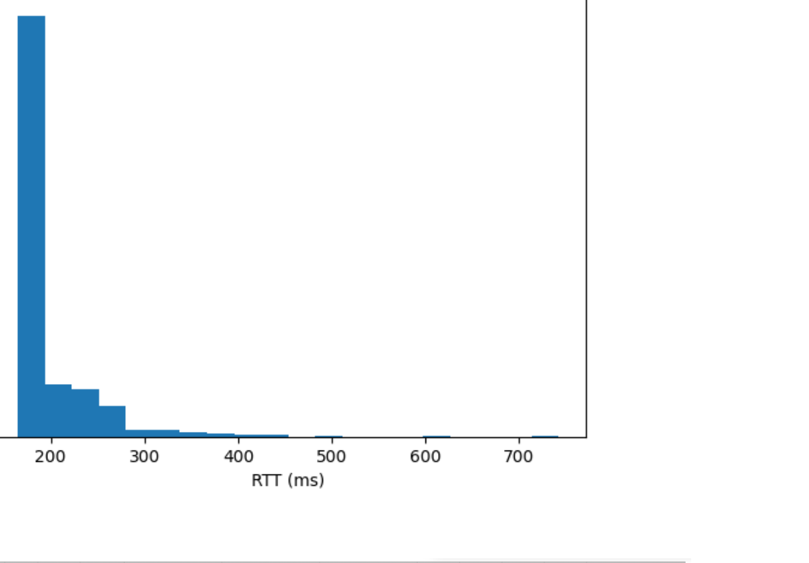

Stats:

<table>
  <tr>
    <th>file</th>
    <th>count</th>
    <th>min_ms</th>
    <th>max_ms</th>
    <th>avg_ms</th>
    <th>median_ms</th>
    <th>stdev_ms</th>
    <th>p50_ms</th>
    <th>p90_ms</th>
    <th>p95_ms</th>
    <th>p99_ms</th>
    <th>mad_successive_ms</th>
  </tr>
  <tr>
    <td>ping_ust_run1.txt</td>
    <td>100</td>
    <td>165.216</td>
    <td>441.416</td>
    <td>202.8927200000000</td>
    <td>177.334</td>
    <td>55.03462058037520</td>
    <td>177.042</td>
    <td>262.46</td>
    <td>323.257</td>
    <td>419.295</td>
    <td>43.26264646464650</td>
  </tr>
  <tr>
    <td>ping_ust_run2.txt</td>
    <td>100</td>
    <td>165.363</td>
    <td>322.076</td>
    <td>190.93506000000000</td>
    <td>177.135</td>
    <td>29.679454092838200</td>
    <td>176.781</td>
    <td>241.075</td>
    <td>255.776</td>
    <td>274.166</td>
    <td>24.357212121212100</td>
  </tr>
  <tr>
    <td>ping_ust_run3.txt</td>
    <td>100</td>
    <td>167.088</td>
    <td>284.895</td>
    <td>187.93784000000000</td>
    <td>175.59750000000000</td>
    <td>27.250913435425400</td>
    <td>175.568</td>
    <td>232.172</td>
    <td>256.404</td>
    <td>275.601</td>
    <td>21.84889898989900</td>
  </tr>
  <tr>
    <td>ping_ust_run4.txt</td>
    <td>100</td>
    <td>164.96</td>
    <td>277.41</td>
    <td>190.12985</td>
    <td>175.4975</td>
    <td>29.686713610935100</td>
    <td>175.473</td>
    <td>240.9</td>
    <td>259.605</td>
    <td>267.5</td>
    <td>25.371686868686900</td>
  </tr>
  <tr>
    <td>ping_ust_run5.txt</td>
    <td>100</td>
    <td>165.867</td>
    <td>404.178</td>
    <td>194.69113000000000</td>
    <td>175.2835</td>
    <td>41.23967455407920</td>
    <td>175.271</td>
    <td>243.698</td>
    <td>261.759</td>
    <td>363.114</td>
    <td>33.157252525252500</td>
  </tr>
  <tr>
    <td>ping_ust_run6.txt</td>
    <td>100</td>
    <td>168.238</td>
    <td>741.713</td>
    <td>218.27052</td>
    <td>178.24100000000000</td>
    <td>88.52738597955620</td>
    <td>178.022</td>
    <td>309.875</td>
    <td>377.153</td>
    <td>608.705</td>
    <td>59.0361717171717</td>
  </tr>
  <tr>
    <td>ping_ust_run7.txt</td>
    <td>100</td>
    <td>169.24</td>
    <td>486.457</td>
    <td>212.2392100000000</td>
    <td>178.02300000000000</td>
    <td>66.64111056896150</td>
    <td>177.954</td>
    <td>315.225</td>
    <td>363.251</td>
    <td>428.402</td>
    <td>44.37959595959600</td>
  </tr>
  <tr>
    <td>ping_ust_run8.txt</td>
    <td>100</td>
    <td>169.169</td>
    <td>351.402</td>
    <td>190.96145</td>
    <td>178.515</td>
    <td>28.676503842585800</td>
    <td>178.452</td>
    <td>227.167</td>
    <td>243.392</td>
    <td>261.199</td>
    <td>25.718959595959600</td>
  </tr>
  <tr>
    <td>ping_ust_run9.txt</td>
    <td>100</td>
    <td>165.613</td>
    <td>302.791</td>
    <td>191.67509000000000</td>
    <td>176.513</td>
    <td>30.86045715965550</td>
    <td>176.464</td>
    <td>249.619</td>
    <td>260.409</td>
    <td>269.196</td>
    <td>26.237666666666700</td>
  </tr>
  <tr>
    <td>ping_ust_run10.txt</td>
    <td>100</td>
    <td>167.718</td>
    <td>318.014</td>
    <td>189.63009</td>
    <td>177.232</td>
    <td>31.477688288400700</td>
    <td>177.162</td>
    <td>230.503</td>
    <td>257.973</td>
    <td>307.74</td>
    <td>22.096656565656600</td>
  </tr>
</table>

Ethz:

---

<!-- page 16 mode: hybrid_paper -->

Stats:

Observation: U.S. destinations generally have lower RTTs than overseas ones; transoceanic links produce the largest hop-to-hop increases in traceroute. Wireless links and last-mile congestion raise jitter. Larger ICMP payloads may slightly increase RTT and variability due to serialization time and buffering.

---

<!-- page 17 mode: hybrid_paper -->

Part 7: TCP 3-Way Handshake and Packet Timing

## rd Entry: ACK

Time between SYN and SYN, ACK: 0.025380

Time between SYN, ACK and ACK: 0.000256

(Changed the time view as: Set View -> Time Display Format -> Seconds Since Previous
Displayed Packet)

Final Observations:

## Protocol mix &

1. Protocol mix & encryption. The capture shows a contemporary web stack where

encryption and UDP-based transports are first-class: DNS to map names to IPs, then either TLS over TCP (HTTPS) or QUIC over UDP (HTTP/3). QUIC’s presence

---

<!-- page 18 mode: simple_text -->

under the generic udp filter explains why DNS and QUIC co-appear; protocol hierarchy confirms their relative shares.

## Name resolution

2. Name resolution precedes data flows. For each site, DNS queries precede

connection establishment. Cached domains reduce or eliminate network DNS lookups. Where DNS is slow or fails, application flows stall, a reminder that name resolution is on the critical path.

## Latency, jitter, and

3. Latency, jitter, and paths. Repeated 100-ping batches reveal that where the server is

(and when you measure) matters: nearby U.S. hosts exhibit low median RTTs and tight dispersion, while overseas hosts have higher medians with larger tails. Traceroute highlights the longest link(s)-often a transoceanic or inter-regional backbone, and occasional path changes across runs.

SYN,ACK->ACK is almost entirely host processing. ECN flags (ECE/CWR) may appear during handshake on networks that negotiate congestion-experienced signaling.

5. Practical analysis aids. Custom columns for ports and HTTP fields, plus simple

coloring rules, significantly speed up triage-particularly when QUIC, DNS, and TLS traffic interleave. Protocol Hierarchy and “Follow TCP Stream” provide fast summaries and per-flow clarity, respectively.

---
