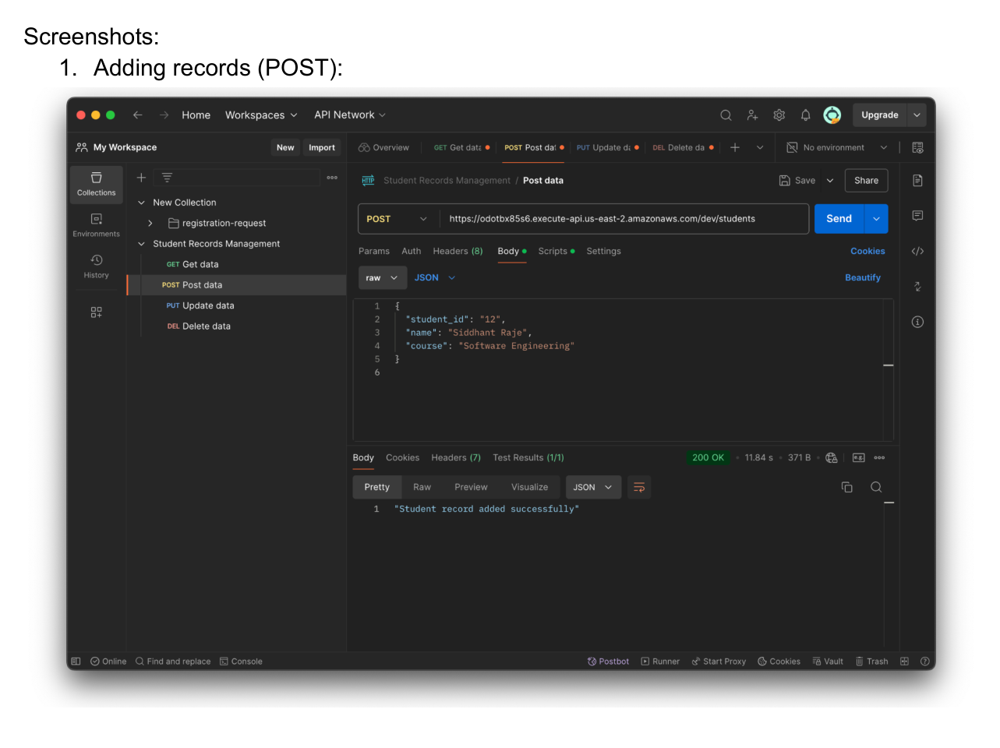
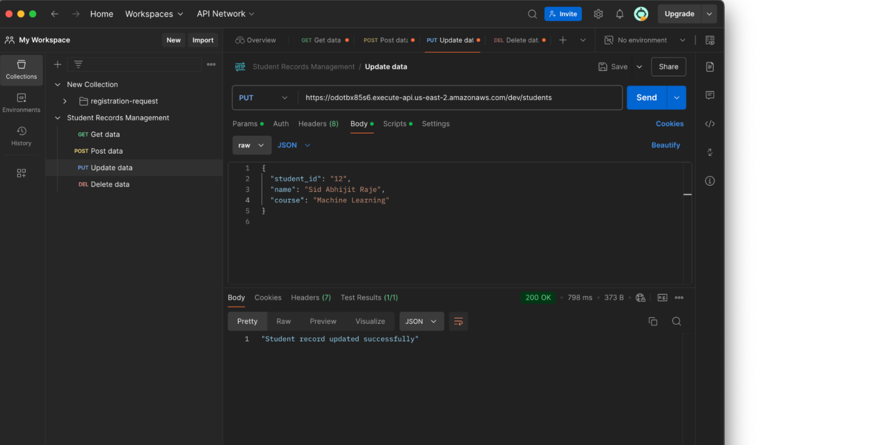
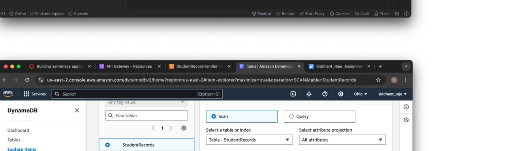
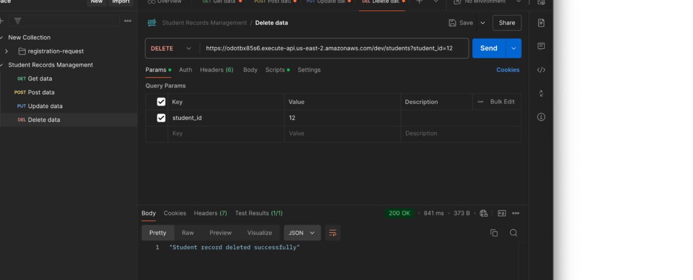
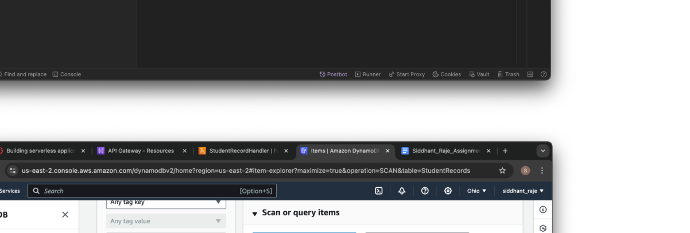
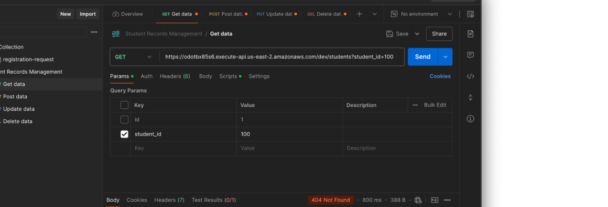
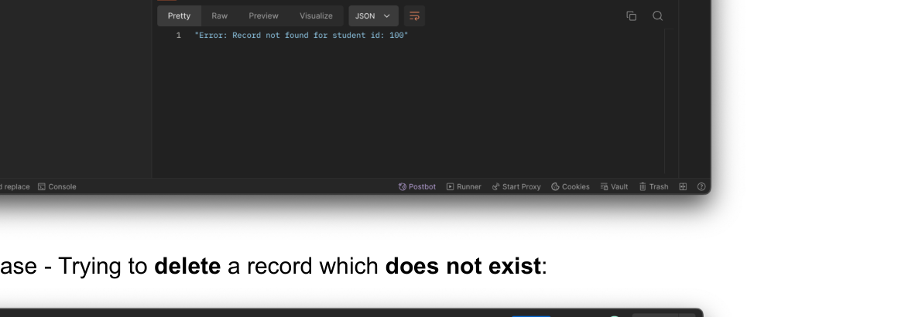

a002
<!-- document_mode: hybrid_paper -->
<!-- page 1 mode: simple_text -->
In this assignment I have created a lambda function in AWS which gets triggered by the API gateway to perform the CRUD operations (POST, GET, PUT, DELETE) in DynamoDB.
AWS Services used:
1. Lambda: AWS Lambda is a serverless function which is event-driven and does not need
pre-provisioned servers to execute the code. It gets triggered in response to certain events while automatically managing the computing resources.
2. DynamoDB: DynamoDB is a serverless NoSQL database which is highly scalable and can
handle a varied amount of traffic. It is a key-value datastore with built-in support for replication.
3. API Gateway: API Gateway is a service which is used to build and monitor scalable APIs to
connect the applications to various backend services.
Lambda function Code:
lambda_function.py:
import json import boto3 from boto3.dynamodb.conditions import Key
dynamodb = boto3.resource('dynamodb') student_table = dynamodb.Table('StudentRecords')
def lambda_handler(event, context):
if event['httpMethod'] == 'POST':
# create student record student_record = json.loads(event['body']) student_table.put_item(Item = student_record)
return {
'statusCode': 200, 'body': json.dumps('Student record added successfully')
}
elif event['httpMethod'] == 'GET':
fetch student record by student id
---
<!-- page 2 mode: simple_text -->
student_id = event['queryStringParameters']['student_id'] response = student_table.get_item(Key={'student_id': student_id})
if 'Item' not in response:
if record is not present for the given student id return {
'statusCode': 404, 'body': json.dumps(f'Error: Record not found for student id: {student_id}')
}
return {
'statusCode': 200, 'body': json.dumps(response['Item'])
}
elif event['httpMethod'] == 'PUT':
# update student record by student id student_record = json.loads(event['body'])
student_table.update_item(
Key={'student_id': student_record['student_id']}, UpdateExpression="set #name=:n, #course=:c", ExpressionAttributeNames={
'#name': 'name', '#course': 'course'
}, ExpressionAttributeValues={
':n': student_record['name'], ':c': student_record['course']
}
)
return {
'statusCode':200, 'body': json.dumps('Student record updated successfully')
}
elif event['httpMethod'] == 'DELETE':
# delete student record student_id = event['queryStringParameters']['student_id']
response = student_table.get_item(Key={'student_id': student_id})
---
<!-- page 3 mode: hybrid_paper -->
if 'Item' not in response:
if record is not present for the given student id return {
'statusCode': 404, 'body': json.dumps(f'Error: Record not found for student id: {student_id}')
}
student_table.delete_item(Key={'student_id': student_id})
return {
'statusCode':200, 'body': json.dumps('Student record deleted successfully')
}

---
<!-- page 4 mode: ocr -->
<!-- OCR page 4 -->

## Fetching record by student_id (GET)
---
<!-- page 5 mode: ocr -->
<!-- OCR page 5 -->

## Updating the data (PUT)

---
<!-- page 6 mode: ocr -->
<!-- OCR page 6 -->

## Deleting a record (DELETE)

---
<!-- page 7 mode: ocr -->
<!-- OCR page 7 -->
5. Edge Case - Trying to fetch a record which does not exist:

6. Edge Case - Trying to delete a record which does not exist:

---
<!-- page 8 mode: simple_text -->
Challenges and Learnings:

## Challenges
a. Problem: After building the lambda function and creating respective APIs for
CRUD operations, when I tried to test the data in POSTMAN, I was getting a ‘KeyError’ - ‘httpMethod’
Observation: After going through and debugging the code, I found out that the
‘event’ object was empty.
Solution: While creating the APIs, I turned on the ‘Lambda Proxy Integration’ in the ‘Integration request’ option which ensured that the API gateway would send the requests as a structured event.
b. Problem: While testing various CRUD operations, when a student_id which is
non-existent is being given in the GET or DELETE request, an empty response was getting in return.
Observation: Edge cases for GET and DELETE operations were not handled in the Lambda function.
Solution: Added the code to first check if the given student_id exists in the database or not. If it does not exist, it should return a response which addresses the situation to the user.

## Learnings
a. Firstly I learnt about the serverless architecture, its pros and cons, and the use
cases of a serverless architecture. I understood the applications and the best practices of using this architecture.
b. I learnt how to set up and configure the AWS Lambda to trigger based on REST
API calls and perform CRUD operations on DynamoDB.
c. I researched about DynamoDB and its use cases and understood when a
NoSQL database should be used. I got hands-on experience on performing various operations in the DynamoDB.
d. I gained insights on creating REST APIs using the AWS API Gateway.
e. I also understood the importance of cloud computing and various features like
Scalability, Availability, Security etc. which is an integral part of any Enterprise level software.
---
