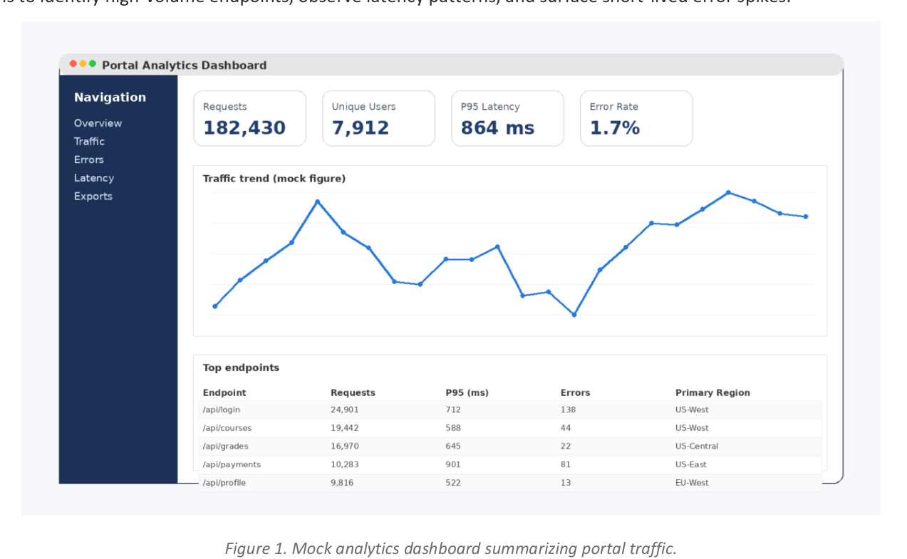
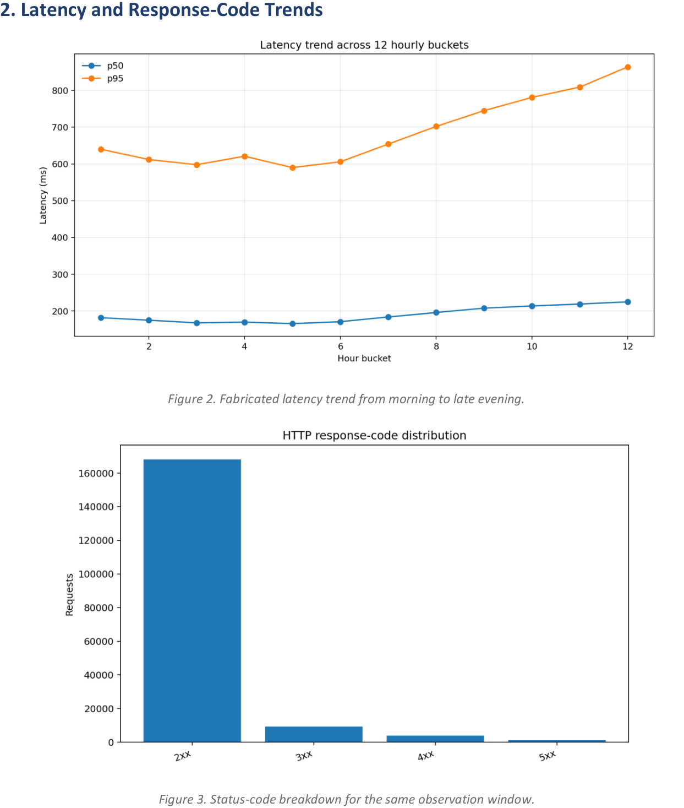

a004
<!-- document_mode: hybrid_paper -->
<!-- page 1 mode: hybrid_paper -->
Name: Jordan Lee | Student ID: 018563244
Generated sample submission with dummy data, tables, and figures for PDF extraction evaluation.
This mock assignment analyzes one day of student-portal access logs. The document includes generated dashboards, summary tables, and fabricated incident notes so it can be used as a realistic PDF-to-Markdown test input.

## Dataset and Goal

---
<!-- page 2 mode: hybrid_paper -->

## Latency and Response-Code Trends

---
<!-- page 3 mode: hybrid_paper -->

## Tabular Findings

## Incident Notes and Conclusions
1. Traffic patterns were stable for most of the day, but the evening grade-release window amplified both
concurrency and latency.
2. The fabricated 5xx spike coincided with an application rollout, which suggests that deployment timing
matters as much as raw capacity.
3. Endpoints that depend on external payment services showed the broadest tail, so separate alert thresholds
should be used for third-party integrations.
4. Even with dummy data, the report structure approximates the dense mix of screenshots, charts, and tables
often seen in student analytics submissions.
---
