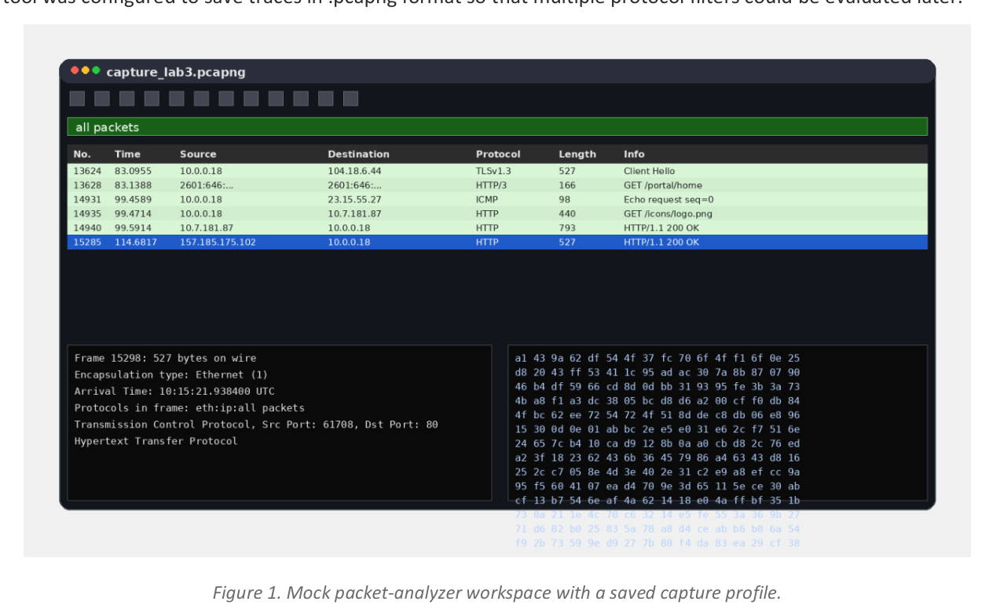
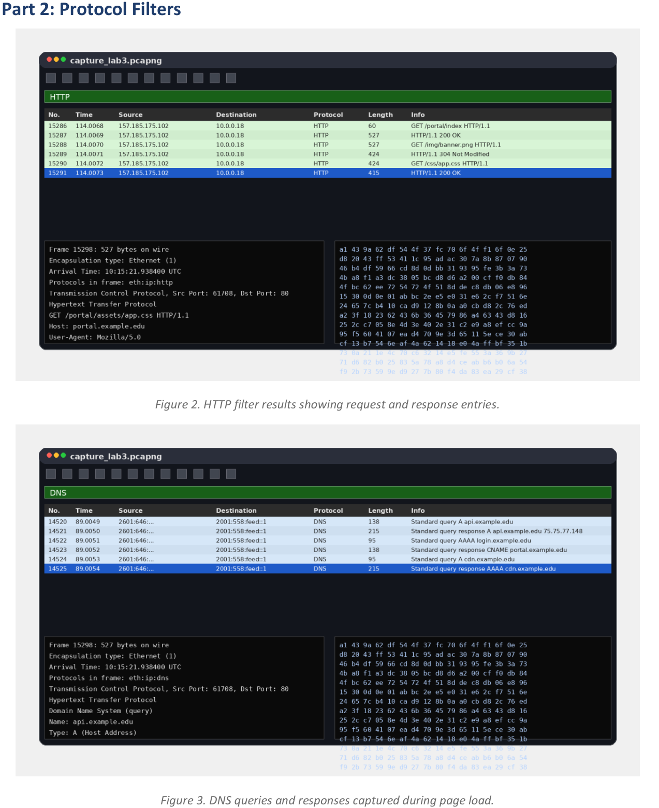
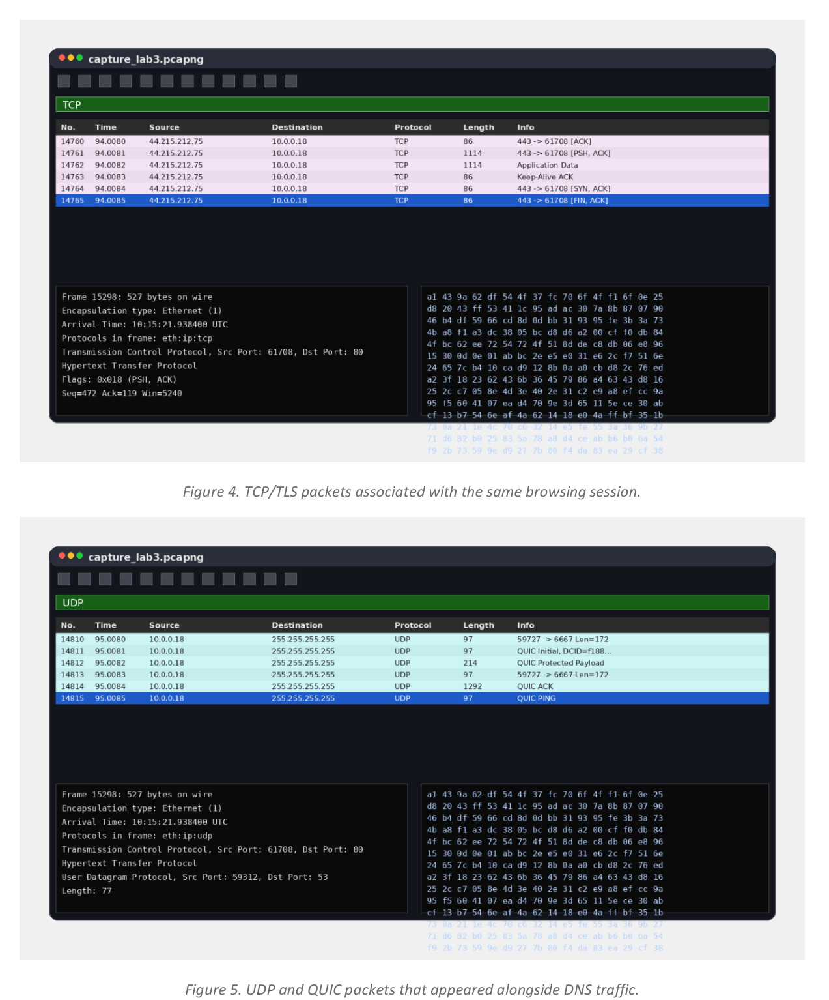
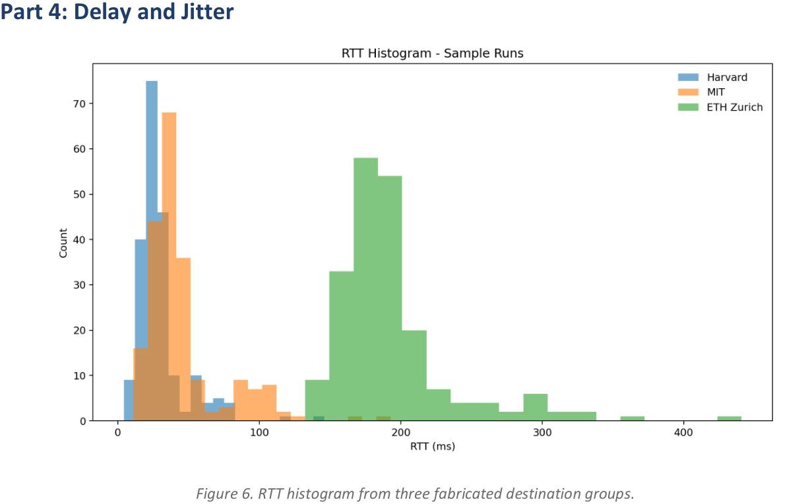

a005
<!-- document_mode: hybrid_paper -->
<!-- page 1 mode: hybrid_paper -->
Study
Name: Alex Morgan | Student ID: 019845672
Generated sample submission with dummy data, tables, and figures for PDF extraction evaluation.
Objective: Capture normal browser activity and inspect HTTP, DNS, TCP, and UDP traffic using a packet analyzer.
The report also summarizes delay, jitter, and handshake timing using dummy measurements.

## Part 1: Environment Setup

---
<!-- page 2 mode: hybrid_paper -->

## Part 2: Protocol Filters

---
<!-- page 3 mode: hybrid_paper -->

## Part 3: HTTP Request Summary
The following table summarizes sample requests identified from the filtered capture. All values below are fabricated for benchmarking purposes but follow realistic web-traffic patterns.

---
<!-- page 4 mode: hybrid_paper -->

## Part 4: Delay and Jitter
Host Runs Median RTT (ms) P95 RTT (ms) Std Dev (ms) MAD Successive (ms)
harvard.edu 10 21.7 98.2 27.3 18.4
mit.edu 10 36.1 129.3 35.8 24.8

---
<!-- page 5 mode: hybrid_paper -->

## Part 5: TCP 3-Way Handshake and Observations
A single connection was isolated and the time display was changed to “Seconds Since Previous Displayed Packet.” The sample handshake timings are shown below.
1. Name resolution appeared before every application flow, reinforcing that DNS latency is on the critical path.
2. The TCP and TLS filters highlighted the same sessions that later carried HTTP payloads.
3. Domestic destinations showed tighter RTT distributions than overseas destinations, while long-tail spikes
were more visible in the remote host sample.
4. Custom columns for ports, host, and URI made triage substantially faster when multiple protocols
interleaved in the same capture.
---
