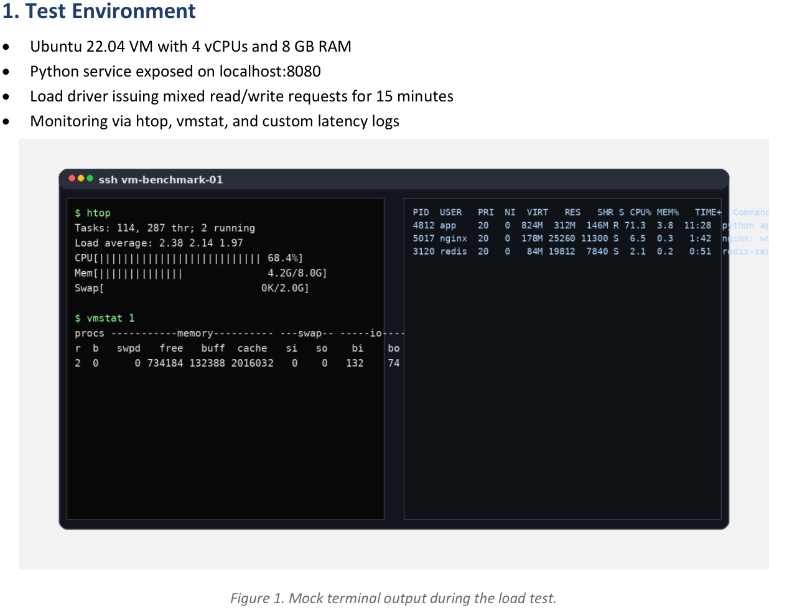
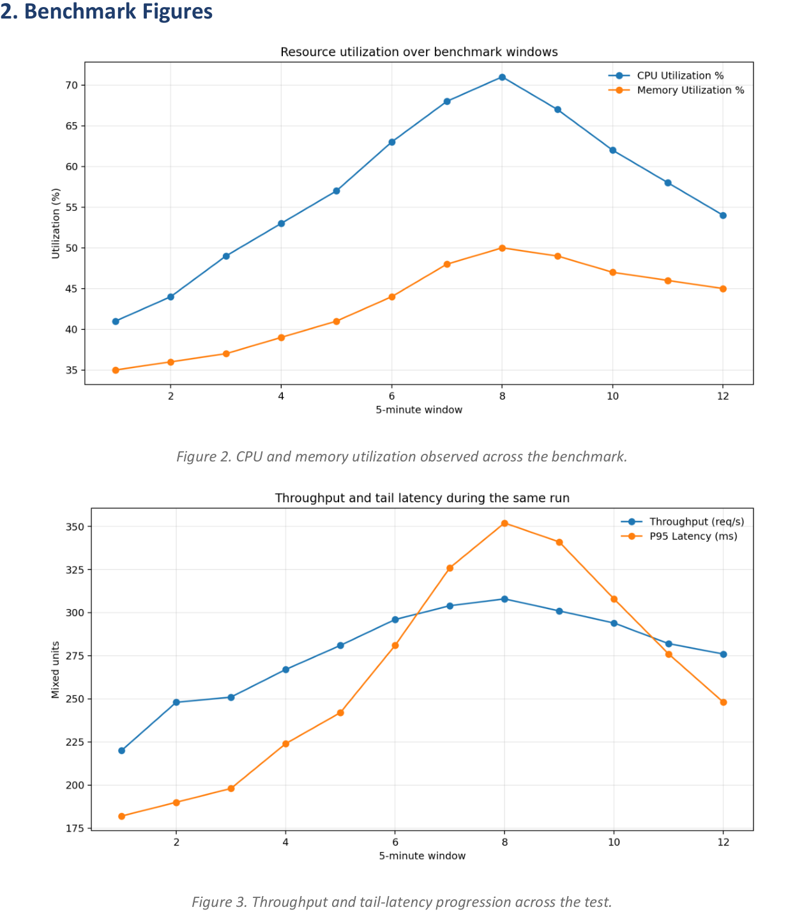

a007
<!-- document_mode: hybrid_paper -->
<!-- page 1 mode: hybrid_paper -->
Benchmarking
Name: Mina Alvarez | Student ID: 017904118
Generated sample submission with dummy data, tables, and figures for PDF extraction evaluation.
This sample report summarizes a synthetic benchmarking exercise on a Linux virtual machine. The write-up includes console screenshots, generated charts, and summary tables to emulate a realistic systems assignment.

## Test Environment

---
<!-- page 2 mode: hybrid_paper -->

## Benchmark Figures

---
<!-- page 3 mode: hybrid_paper -->

## Summary Table and Findings
1. The cache-enabled scenario produced the highest throughput without exhausting CPU or memory
headroom.
2. Tail latency increased sharply during the write-burst phase, which is consistent with queue buildup inside
the Python service.
3. Reducing worker count lowered resource usage slightly but pushed response times beyond the acceptable
threshold.
4. A mix of console screenshots, charts, and compact summary tables makes this document useful for PDF
extraction testing.
---
