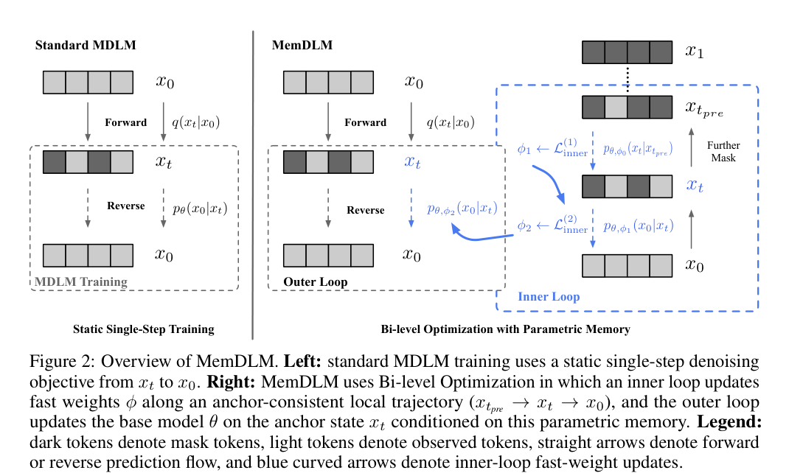
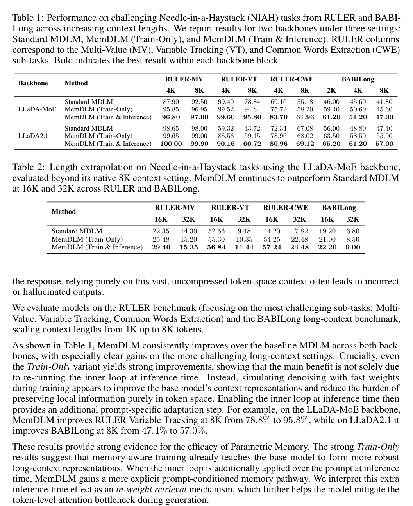
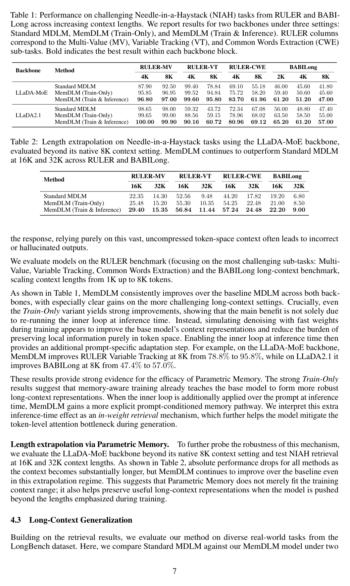
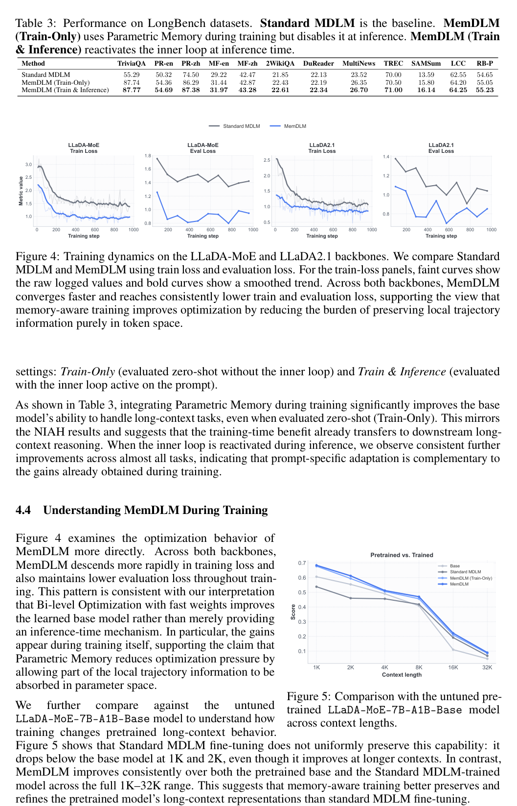

p112
<!-- document_mode: hybrid_paper -->
<!-- page 1 mode: hybrid_paper -->
arXiv:2603.22241v1 [cs.CL] 23 Mar 2026
Standard MDLM MemDLM
RULER-MV
RULER-VT
100
100
100
80
80
80
LLaDA-MoE
60
60
60
40
40
40
20
20
20
Score
RULER-MV
RULER-VT
100
100
100
80
80
80
LLaDA2.1
60
60
60
40
40
40
20
20
20
Context length
MemDLM: Memory-Enhanced DLM Training
1The Chinese University of Hong Kong 2Huawei Technologies Co., Ltd

## Abstract
Diffusion Language Models (DLMs) offer attractive advantages over AutoRegressive (AR) models, such as full-attention parallel decoding and flexible generation. However, they suffer from a notable train-inference mismatch: DLMs are trained with a static, single-step masked prediction objective, but deployed through a multi-step progressive denoising trajectory. We propose MemDLM (Memory-Enhanced DLM), which narrows this gap by embedding a simulated denoising process into training via Bi-level Optimization. An inner loop updates a set of fast weights, forming a Parametric Memory that captures the local trajectory experience of each sample, while an outer loop updates the base model conditioned on this memory. By offloading memorization pressure from token representations to parameters, MemDLM yields faster convergence and lower training loss. Moreover, the inner loop can be re-enabled at inference time as an adaptation step, yielding additional gains on long-context understanding. We find that, when activated at inference time, this Parametric Memory acts as an emergent in-weight retrieval mechanism, helping MemDLM further reduce token-level attention bottlenecks on challenging Needle-in-a-Haystack retrieval tasks. Code:
https://github.com/JarvisPei/MemDLM.

## Avg. Absolute Improvement
100
80
25
60
40
20
20

## Improvement
15

## BABILong
100
10
80
60
5
40
20
0

## VT CWE BABI
Figure 1: Needle-in-a-Haystack results overview. Gray bars denote Standard MDLM and blue bars denote MemDLM. Left: detailed results on RULER-MV, RULER-VT, RULER-CWE, and BABILong for the LLaDA-MoE-7B-A1B-Base and LLaDA2.1-mini backbones. Right: mean absolute improvement of MemDLM over Standard MDLM for each task, averaged across the evaluated context lengths within each backbone.
Preprint.
---
<!-- page 2 mode: simple_text -->
1

## Introduction
Diffusion Language Models (DLMs) have emerged as a promising alternative to traditional AutoRegressive (AR) models, offering parallel generation, bidirectional context awareness, and flexible text manipulation capabilities [1, 2, 3, 4, 5, 6, 7, 8, 9]. Despite these architectural advantages, DLMs face an optimization challenge stemming from a train-inference mismatch. During training, DLMs optimize a static Masked Diffusion Language Modeling (MDLM) objective: they receive heavily masked text and must predict the clean sequence in a single, isolated step. In contrast, during inference, DLMs generate text through an iterative, progressive denoising trajectory, conditioning predictions on their own intermediate, noisy outputs. Because the base model is never trained on these progressive, sequential trajectories, errors can compound during generation, and the optimization landscape during training is not well aligned with the model’s actual deployment [10, 11, 12, 13].
To bridge this gap, we propose MemDLM (Memory-Enhanced DLM), a framework that mitigates exposure bias by internalizing local trajectory experiences into the model’s parameters. Our core insight is that exposure bias is exacerbated because standard DLMs must rely entirely on their noisy, intermediate token representations to maintain context across the generative trajectory; if prediction errors corrupt these tokens, the context can be significantly degraded. To address this, we introduce an inner optimization loop into the training graph that steps through a simulated progressive denoising trajectory. During this sequential simulation, we dynamically update a set of parameter-efficient fast weights. These fast weights act as a Parametric Memory that explicitly captures the local trajectory experience of the current sample [14, 15, 16, 17].
Figure 2 summarizes how MemDLM bridges the gap between static masked training and iterative denoising inference by internalizing local trajectory information into transient fast weights. Because this localized experience is internalized within the parameter space, it provides a stable anchor that is more robust to the compounding, token-level noise inherent to iterative denoising. The base model is then updated in an outer loop, conditioned on this Parametric Memory. By offloading part of the local memorization burden to these fast weights during training, the base model is no longer forced to preserve context solely through vulnerable token-space representations. This memory internalization improves optimization and yields stronger zero-shot robustness to sequential noise, while also enabling an optional inference-time adaptation pathway when the inner loop is re-enabled.
Empirically, on LLaDA-MoE [18], MemDLM improves RULER Variable Tracking [19] at 8K from 78.8% to 95.8%, and on LLaDA2.1 [20], it improves BABILong [21] at 8K from 47.4% to 57.0%.
In summary, our contributions are threefold. First, we identify and empirically demonstrate the traininference mismatch and the resulting context memorization difficulty in standard DLMs. Second, we introduce MemDLM, a Bi-level Optimization framework that simulates progressive denoising during training, naturally inducing a Parametric Memory mechanism. We demonstrate that this memoryaware training improves optimization and long-context performance even when the fast weights are discarded at inference time. Finally, we show that re-enabling the inner loop at inference time provides an additional prompt-specific adaptation pathway by explicitly internalizing the extended prompt into fast weights. We interpret this inference-time effect as an emergent in-weight retrieval mechanism, which further improves challenging Needle-in-a-Haystack tasks on top of the gains already obtained from training.
2

## Preliminaries and Motivation
Before formalizing our method, we first review the standard training and inference paradigms of Masked Diffusion Language Models (MDLMs) [2, 4]. We then conduct an empirical analysis to quantify a structural optimization gap inherent in this paradigm: the train-inference mismatch.

### Preliminaries: Masked Diffusion Language Models
Consider a sequence of clean text comprising L tokens, denoted as x0 = (x1 0, . . . , xL 0 ), where each token belongs to a discrete vocabulary V. Discrete diffusion models operate by defining a forward corruption process that gradually introduces noise over a continuous time variable t ∈[0, 1]. At t = 0, the sequence is completely clean (x0), and at t = 1, the sequence reaches a state of pure noise (x1). The model is then trained to approximate the reverse generative process, learning to map a noisy state xt back to the original text x0.
2
---
<!-- page 3 mode: hybrid_paper -->
**Table 1 (Page 3)**
| Standard MDLM x <latexit sha1_base64="G1LpNPRTW6qHuZEmv28cJf8x4bo=">AAAB6nicbVDLSgNBEOyNrxhfUY9eBoPgKexKUI8RLx4jmgckS5idzCZDZmeXmV4xLAF/wIsHRbz6Rd78GyePgyYWNBRV3XR3BYkUBl3328mtrK6tb+Q3C1vbO7t7xf2DholTzXidxTLWrYAaLoXidRQoeSvRnEaB5M1geD3xmw9cGxGrexwl3I9oX4lQMIpWunvsut1iyS27U5Bl4s1JCeaodYtfnV7M0ogrZJIa0/bcBP2MahRM8nGhkxqeUDakfd62VNGIGz+bnjomJ1bpkTDWthSSqfp7IqORMaMosJ0RxYFZ9Cbif147xfDSz4RKUuSKzRaFqSQYk8nfpCc0ZyhHllCmhb2VsAHVlKFNp2BD8BZfXiaNs7J3Xq7cVkrVq6dZHHk4gmM4BQ8uoAo3UIM6MOjDM7zCmyOdF+fd+Zi15px5hIfwB87nDzLNjic=</latexit> 0 Forward q<latexit sha1_base64="gPh7poeYsEPbBzPAgw9b+zTXe9k=">AAAB8XicbVDLTsJAFJ3iC/GFunQzkZjghrSG+NiRuHGJiTwiNM10mMKE6bTO3BpI5S/cuNAYt/6NO//GAbpQ8CQ3OTnn3tx7jx8LrsG2v63cyura+kZ+s7C1vbO7V9w/aOooUZQ1aCQi1faJZoJL1gAOgrVjxUjoC9byh9dTv/XIlOaRvINxzNyQ9CUPOCVgpPuH8siDp5Fnn3rFkl2xZ8DLxMlICWWoe8Wvbi+iScgkUEG07jh2DG5KFHAq2KTQTTSLCR2SPusYKknItJvOLp7gE6P0cBApUxLwTP09kZJQ63Hom86QwEAvelPxP6+TQHDpplzGCTBJ54uCRGCI8PR93OOKURBjQwhV3NyK6YAoQsGEVDAhOIsvL5PmWcU5r1Rvq6XaVRZHHh2hY1RGDrpANXSD6qiBKJLoGb2iN0tbL9a79TFvzVnZzCH6A+vzB/S9kG4=</latexit> (xt| x0) x<latexit sha1_base64="/msnSwU/bn8YjEYC7MhWxtsQXt4=">AAAB6nicbVDLSgNBEOyNrxhfUY9eBoPgKexKUI8RLx4jmgckS5idzCZDZmeXmV4xLAF/wIsHRbz6Rd78GyePgyYWNBRV3XR3BYkUBl3328mtrK6tb+Q3C1vbO7t7xf2DholTzXidxTLWrYAaLoXidRQoeSvRnEaB5M1geD3xmw9cGxGrexwl3I9oX4lQMIpWunvsYrdYcsvuFGSZeHNSgjlq3eJXpxezNOIKmaTGtD03QT+jGgWTfFzopIYnlA1pn7ctVTTixs+mp47JiVV6JIy1LYVkqv6eyGhkzCgKbGdEcWAWvYn4n9dOMbz0M6GSFLlis0VhKgnGZPI36QnNGcqRJZRpYW8lbEA1ZWjTKdgQvMWXl0njrOydlyu3lVL16mkWRx6O4BhOwYMLqMIN1KAODPrwDK/w5kjnxXl3PmatOWce4SH8gfP5A5ndjms=</latexit> t Reverse <latexit sha1_base64="7LZCJ2zFKk6FaOoTRHKJUIGm3pI=">AAAB/HicbVDLSsNAFJ3UV62vaJduBotQNyWR4mNXcOOygn1AG8JkOmmHTh7M3EhDrL/ixoUibv0Qd/6N0zYLbT1w4XDOvdx7jxcLrsCyvo3C2vrG5lZxu7Szu7d/YB4etVWUSMpaNBKR7HpEMcFD1gIOgnVjyUjgCdbxxjczv/PApOJReA9pzJyADEPuc0pAS65Zjt0+jBiQ6sS18COeuHDmmhWrZs2BV4mdkwrK0XTNr/4goknAQqCCKNWzrRicjEjgVLBpqZ8oFhM6JkPW0zQkAVNONj9+ik+1MsB+JHWFgOfq74mMBEqlgac7AwIjtezNxP+8XgL+lZPxME6AhXSxyE8EhgjPksADLhkFkWpCqOT6VkxHRBIKOq+SDsFefnmVtM9r9kWtflevNK7zOIroGJ2gKrLRJWqgW9RELURRip7RK3oznowX4934WLQWjHymjP7A+PwBjL2UCQ==</latexit>pω(x0| xt) x <latexit sha1_base64="G1LpNPRTW6qHuZEmv28cJf8x4bo=">AAAB6nicbVDLSgNBEOyNrxhfUY9eBoPgKexKUI8RLx4jmgckS5idzCZDZmeXmV4xLAF/wIsHRbz6Rd78GyePgyYWNBRV3XR3BYkUBl3328mtrK6tb+Q3C1vbO7t7xf2DholTzXidxTLWrYAaLoXidRQoeSvRnEaB5M1geD3xmw9cGxGrexwl3I9oX4lQMIpWunvsut1iyS27U5Bl4s1JCeaodYtfnV7M0ogrZJIa0/bcBP2MahRM8nGhkxqeUDakfd62VNGIGz+bnjomJ1bpkTDWthSSqfp7IqORMaMosJ0RxYFZ9Cbif147xfDSz4RKUuSKzRaFqSQYk8nfpCc0ZyhHllCmhb2VsAHVlKFNp2BD8BZfXiaNs7J3Xq7cVkrVq6dZHHk4gmM4BQ8uoAo3UIM6MOjDM7zCmyOdF+fd+Zi15px5hIfwB87nDzLNjic=</latexit> 0 MDLM Training Static Single-Step Training | MemDLM x <latexit sha1_base64="QRlFKTdZFTH2TZmCLuq5ispBsxg=">AAAB6nicbVBNS8NAEJ3Ur1q/qh69LBbBU0lE1GPRi8eK9gPaUDbbTbt0swm7E7GE/gQvHhTx6i/y5r9x2+agrQ8GHu/NMDMvSKQw6LrfTmFldW19o7hZ2tre2d0r7x80TZxqxhsslrFuB9RwKRRvoEDJ24nmNAokbwWjm6nfeuTaiFg94DjhfkQHSoSCUbTS/VPP65UrbtWdgSwTLycVyFHvlb+6/ZilEVfIJDWm47kJ+hnVKJjkk1I3NTyhbEQHvGOpohE3fjY7dUJOrNInYaxtKSQz9fdERiNjxlFgOyOKQ7PoTcX/vE6K4ZWfCZWkyBWbLwpTSTAm079JX2jOUI4toUwLeythQ6opQ5tOyYbgLb68TJpnVe+ien53Xqld53EU4QiO4RQ8uIQa3EIdGsBgAM/wCm+OdF6cd+dj3lpw8plD+APn8wcOno2p</latexit> 1 x …… <latexit sha1_base64="G1LpNPRTW6qHuZEmv28cJf8x4bo=">AAAB6nicbVDLSgNBEOyNrxhfUY9eBoPgKexKUI8RLx4jmgckS5idzCZDZmeXmV4xLAF/wIsHRbz6Rd78GyePgyYWNBRV3XR3BYkUBl3328mtrK6tb+Q3C1vbO7t7xf2DholTzXidxTLWrYAaLoXidRQoeSvRnEaB5M1geD3xmw9cGxGrexwl3I9oX4lQMIpWunvsut1iyS27U5Bl4s1JCeaodYtfnV7M0ogrZJIa0/bcBP2MahRM8nGhkxqeUDakfd62VNGIGz+bnjomJ1bpkTDWthSSqfp7IqORMaMosJ0RxYFZ9Cbif147xfDSz4RKUuSKzRaFqSQYk8nfpCc0ZyhHllCmhb2VsAHVlKFNp2BD8BZfXiaNs7J3Xq7cVkrVq6dZHHk4gmM4BQ8uoAo3UIM6MOjDM7zCmyOdF+fd+Zi15px5hIfwB87nDzLNjic=</latexit> 0 x <latexit sha1_base64="HPvZ9RZgYadopDWfwkTexUJ9V+Y=">AAAB8nicbVDLSgMxFM3UV62vqks3wSK4KjNS1GXRjcsK9gHtMGTSTBuaSYbkjliG+Qw3LhRx69e4829M21lo64HA4Zx7yL0nTAQ34LrfTmltfWNzq7xd2dnd2z+oHh51jEo1ZW2qhNK9kBgmuGRt4CBYL9GMxKFg3XByO/O7j0wbruQDTBPmx2QkecQpASv1n4IMgswm8jyo1ty6OwdeJV5BaqhAK6h+DYaKpjGTQAUxpu+5CfgZ0cCpYHllkBqWEDohI9a3VJKYGT+br5zjM6sMcaS0fRLwXP2dyEhszDQO7WRMYGyWvZn4n9dPIbr2My6TFJiki4+iVGBQeHY/HnLNKIipJYRqbnfFdEw0oWBbqtgSvOWTV0nnou5d1hv3jVrzpqijjE7QKTpHHrpCTXSHWqiNKFLoGb2iNwecF+fd+ViMlpwic4z+wPn8ASIdkdI=</latexit> tpre Forward q<latexit sha1_base64="gPh7poeYsEPbBzPAgw9b+zTXe9k=">AAAB8XicbVDLTsJAFJ3iC/GFunQzkZjghrSG+NiRuHGJiTwiNM10mMKE6bTO3BpI5S/cuNAYt/6NO//GAbpQ8CQ3OTnn3tx7jx8LrsG2v63cyura+kZ+s7C1vbO7V9w/aOooUZQ1aCQi1faJZoJL1gAOgrVjxUjoC9byh9dTv/XIlOaRvINxzNyQ9CUPOCVgpPuH8siDp5Fnn3rFkl2xZ8DLxMlICWWoe8Wvbi+iScgkUEG07jh2DG5KFHAq2KTQTTSLCR2SPusYKknItJvOLp7gE6P0cBApUxLwTP09kZJQ63Hom86QwEAvelPxP6+TQHDpplzGCTBJ54uCRGCI8PR93OOKURBjQwhV3NyK6YAoQsGEVDAhOIsvL5PmWcU5r1Rvq6XaVRZHHh2hY1RGDrpANXSD6qiBKJLoGb2iN0tbL9a79TFvzVnZzCH6A+vzB/S9kG4=</latexit> (xt| x0) Further ω<latexit sha1_base64="lkVVK1oUJAi4m77CNMDUnec6opo=">AAACFnicdVDBSiNBEO1RV93oatTjXhqDoIcdZmKMyU3w4sGDglEhE4eeTiVp7OkZumvEMMxXePFXvHhQxKt427/ZToygiz5o+vFeFVX1olQKg57315manvkxOzf/s7Sw+GtpubyyemqSTHNo8UQm+jxiBqRQ0EKBEs5TDSyOJJxFl/sj/+wKtBGJOsFhCp2Y9ZXoCc7QSmH5T5AOROjToA9oaBAzHHAm88MizAOEa8yFUqCL4iLf9LeKsFzx3Gq1sdOoU8/d3m3UmtuWNKv2r1Pf9caokAmOwvJr0E14FoNCLpkxbd9LsZMzjYJLKEpBZiBl/JL1oW2pYjGYTj4+q6AbVunSXqLtU0jH6seOnMXGDOPIVo72Nv97I/Err51hr9Gxl6UZguJvg3qZpJjQUUa0KzRwlENLGNfC7kr5gGnG0SZZsiG8X0q/J6dV16+7teNaZa85iWOe/CbrZJP4ZJfskQNyRFqEkxtyRx7Io3Pr3DtPzvNb6ZQz6Vkjn+C8/ANe6aAp</latexit> ( 1 ) <latexit sha1_base64="uJbyIxy6q6irMaBSwgSFOACkGKc=">AAACC3icdVDLSgMxFM34rPVVdekmtAgVZJg+7GNXcOOygn1AW4ZMmrahmQfJHWkZZ+/GX3HjQhG3/oA7/8b0IajogZDDOffe5B4nEFyBZX0YK6tr6xubia3k9s7u3n7q4LCp/FBS1qC+8GXbIYoJ7rEGcBCsHUhGXEewljO+mPmtGyYV971rmAas55KhxwecEtCSnUoHdtSFEQNy1g1G3Lbi7MSG24kdgR3pSXF8aqcylpnPV84rJWyZhXKlWC1oUs3ru4RzpjVHBi1Rt1Pv3b5PQ5d5QAVRqpOzAuhFRAKngsXJbqhYQOiYDFlHU4+4TPWi+S4xPtFKHw98qY8HeK5+74iIq9TUdXSlS2Ckfnsz8S+vE8Kg0ou4F4TAPLp4aBAKDD6eBYP7XDIKYqoJoZLrv2I6IpJQ0PEldQhfm+L/STNv5kpm8aqYqVWXcSTQMUqjLMqhMqqhS1RHDUTRHXpAT+jZuDcejRfjdVG6Yix7jtAPGG+fYcSb6w==</latexit>pω,ε0 (xt| xtpre ) x<latexit sha1_base64="iihhTonO1Gz6TK1fC0Bscl4/UKM=">AAAB6nicdVDLSgMxFM3UV62vqks3wSK4Gmba2k53FTcuK9oHtEPJpJk2NPMguSOWoeAPuHGhiFu/yJ1/Y/oQVPTA5R7OuSH3Hi8WXIFlfRiZldW19Y3sZm5re2d3L79/0FJRIilr0khEsuMRxQQPWRM4CNaJJSOBJ1jbG1/M/PYtk4pH4Q1MYuYGZBhyn1MCWrq+60M/X7DMYtE5cyrYMktVp1wraVIr6l7BtmnNUUBLNPr5994goknAQqCCKNW1rRjclEjgVLBprpcoFhM6JkPW1TQkAVNuOl91ik+0MsB+JHWFgOfq9xcpCZSaBJ6eDAiM1G9vJv7ldRPwHTflYZwAC+niIz8RGCI8uxsPuGQUxEQTQiXXu2I6IpJQ0OnkdAhfl+L/Sato2hWzfFUu1M/vF3Fk0RE6RqfIRlVUR5eogZqIoiF6QE/o2RDGo/FivC5GM8YywkP0A8bbJyegjs0=</latexit> t Mask 1→L in n er x <latexit sha1_base64="gyNE/FEvtwDvzXmasEQM3kZDGlw=">AAAB7HicdVDLSgMxFM3UV62vqks3wSK4GqYP+9gV3bis4LSFdiiZNNOGZjJDckcsQ7/BjQtF3PpB7vwb04egogdCDufcy733+LHgGhznw8qsrW9sbmW3czu7e/sH+cOjto4SRZlLIxGprk80E1wyFzgI1o0VI6EvWMefXM39zh1TmkfyFqYx80IykjzglICR3PtBCrNBvuDYpVL9ol7Fjl2u1SuNsiGNkvmruGg7CxTQCq1B/r0/jGgSMglUEK17RScGLyUKOBVslusnmsWETsiI9QyVJGTaSxfLzvCZUYY4iJR5EvBC/d6RklDraeibypDAWP/25uJfXi+BoO6lXMYJMEmXg4JEYIjw/HI85IpREFNDCFXc7IrpmChCweSTMyF8XYr/J+2SXazalZtKoXm5iiOLTtApOkdFVENNdI1ayEUUcfSAntCzJa1H68V6XZZmrFXPMfoB6+0TxsaPWg==</latexit> t Reverse <latexit sha1_base64="7MDl5w2WAorDzBm6C+fJ4XZSBZ8=">AAACBXicdVDLSgMxFM3UV62vqktdBItQQYbptPaxK7hxWcG2QluGTJq2oZkHyR1pGbtx46+4caGIW//BnX9j+hBU9MDlHs65l+QeNxRcgWV9GIml5ZXVteR6amNza3snvbvXUEEkKavTQATy2iWKCe6zOnAQ7DqUjHiuYE13eD71mzdMKh74VzAOWccjfZ/3OCWgJSd9GDpxGwYMyGk7HHDHnmRHjoVv8ciBEyedsUzbLp+Vi9gy86VyoZLXpGLrXsQ505ohgxaoOen3djegkcd8oIIo1cpZIXRiIoFTwSapdqRYSOiQ9FlLU594THXi2RUTfKyVLu4FUpcPeKZ+34iJp9TYc/WkR2CgfntT8S+vFUGv3Im5H0bAfDp/qBcJDAGeRoK7XDIKYqwJoZLrv2I6IJJQ0MGldAhfl+L/ScM2c0WzcFnIVCuLOJLoAB2hLMqhEqqiC1RDdUTRHXpAT+jZuDcejRfjdT6aMBY7++gHjLdPwTeYFw==</latexit>pω,ε2 (x0| xt) ω<latexit sha1_base64="KIh58JN1GVClZkCNSL3JDXQbxzk=">AAACFnicdVDBSiNBEO1RV93oatTjXhqDoIcdJmOMyU3w4sGDglEhE4eeTiVp7OkZumvEMMxXePFXvHhQxKt427/ZToygiz5o+vFeFVX1olQKg57315manvkxOzf/s7Sw+GtpubyyemqSTHNo8UQm+jxiBqRQ0EKBEs5TDSyOJJxFl/sj/+wKtBGJOsFhCp2Y9ZXoCc7QSmH5T5AOROjToA9oaBAzHHAm88MizAOEa8yFUqCL4iLf9LeKsFzxXN9v7DTq1HO3dxu15rYlTd/+dVp1vTEqZIKjsPwadBOexaCQS2ZMu+ql2MmZRsElFKUgM5Ayfsn60LZUsRhMJx+fVdANq3RpL9H2KaRj9WNHzmJjhnFkK0d7m/+9kfiV186w1+jYy9IMQfG3Qb1MUkzoKCPaFRo4yqEljGthd6V8wDTjaJMs2RDeL6Xfk1Pfrdbd2nGtstecxDFPfpN1skmqZJfskQNyRFqEkxtyRx7Io3Pr3DtPzvNb6ZQz6Vkjn+C8/ANiGqAr</latexit> 2→L ( in 2 n ) er <latexit sha1_base64="7hCatX000Ku4dRfqyOowwGEC/nc=">AAACA3icdVDLSgMxFM3UV62vqjvdBItQQYaZtvaxK7hxWcG2QluGTJq2oZkHyR1pGQtu/BU3LhRx60+4829MH4KKHrjcwzn3ktzjhoIrsKwPI7G0vLK6llxPbWxube+kd/caKogkZXUaiEBeu0QxwX1WBw6CXYeSEc8VrOkOz6d+84ZJxQP/CsYh63ik7/MepwS05KQPQiduw4ABOW2HA+7Yk+zIsW5HDpw46Yxl5nLls3IRW2a+VC5U8ppUcroXsW1aM2TQAjUn/d7uBjTymA9UEKVathVCJyYSOBVskmpHioWEDkmftTT1icdUJ57dMMHHWuniXiB1+YBn6veNmHhKjT1XT3oEBuq3NxX/8loR9MqdmPthBMyn84d6kcAQ4GkguMsloyDGmhAquf4rpgMiCQUdW0qH8HUp/p80cqZdNAuXhUy1sogjiQ7REcoiG5VQFV2gGqojiu7QA3pCz8a98Wi8GK/z0YSx2NlHP2C8fQIC/ZfC</latexit>pω,ε1 (x0| xt) x <latexit sha1_base64="G1LpNPRTW6qHuZEmv28cJf8x4bo=">AAAB6nicbVDLSgNBEOyNrxhfUY9eBoPgKexKUI8RLx4jmgckS5idzCZDZmeXmV4xLAF/wIsHRbz6Rd78GyePgyYWNBRV3XR3BYkUBl3328mtrK6tb+Q3C1vbO7t7xf2DholTzXidxTLWrYAaLoXidRQoeSvRnEaB5M1geD3xmw9cGxGrexwl3I9oX4lQMIpWunvsut1iyS27U5Bl4s1JCeaodYtfnV7M0ogrZJIa0/bcBP2MahRM8nGhkxqeUDakfd62VNGIGz+bnjomJ1bpkTDWthSSqfp7IqORMaMosJ0RxYFZ9Cbif147xfDSz4RKUuSKzRaFqSQYk8nfpCc0ZyhHllCmhb2VsAHVlKFNp2BD8BZfXiaNs7J3Xq7cVkrVq6dZHHk4gmM4BQ8uoAo3UIM6MOjDM7zCmyOdF+fd+Zi15px5hIfwB87nDzLNjic=</latexit> 0 x <latexit sha1_base64="G1LpNPRTW6qHuZEmv28cJf8x4bo=">AAAB6nicbVDLSgNBEOyNrxhfUY9eBoPgKexKUI8RLx4jmgckS5idzCZDZmeXmV4xLAF/wIsHRbz6Rd78GyePgyYWNBRV3XR3BYkUBl3328mtrK6tb+Q3C1vbO7t7xf2DholTzXidxTLWrYAaLoXidRQoeSvRnEaB5M1geD3xmw9cGxGrexwl3I9oX4lQMIpWunvsut1iyS27U5Bl4s1JCeaodYtfnV7M0ogrZJIa0/bcBP2MahRM8nGhkxqeUDakfd62VNGIGz+bnjomJ1bpkTDWthSSqfp7IqORMaMosJ0RxYFZ9Cbif147xfDSz4RKUuSKzRaFqSQYk8nfpCc0ZyhHllCmhb2VsAHVlKFNp2BD8BZfXiaNs7J3Xq7cVkrVq6dZHHk4gmM4BQ8uoAo3UIM6MOjDM7zCmyOdF+fd+Zi15px5hIfwB87nDzLNjic=</latexit> 0 Outer Loop Inner Loop Bi-level Optimization with Parametric Memory |
$$
|---|---|
$$

Absorbing-State Masking. In the specific framework of MDLMs, the forward corruption q(xt|x0) is instantiated as an absorbing-state process. Rather than transitioning tokens to random vocabulary items, tokens are replaced by a dedicated absorbing token, m / ∈V (often denoted as [MASK]). Under a linear noise schedule, the probability that the i-th token is masked at time t is simply t:
where I(·) denotes the indicator function.
```text
q(xi t|xi 0) = (1 −t)I(xi t = xi 0) + tI(xi t = m), (1)
```
Training via Static Masking. The objective of the neural network pθ(x0|xt), parameterized by θ, is to reconstruct the clean tokens x0 given the corrupted sequence xt. Because unmasked tokens are perfectly preserved in the absorbing-state formulation, the model only needs to predict the identities of the tokens at the currently masked indices, Mt = {i | xi t = m}.
Standard MDLM training minimizes the expected negative log-likelihood of these masked tokens over uniformly sampled timesteps, yielding the following objective:
"
```text
LMDLM(θ) = Et∼U(0,1),x0
```
#
ω(t) X
$$
i∈Mt −log pθ(xi 0|xt)
$$
, (2)
where ω(t) serves as a time-dependent weighting factor (e.g., ω(t) = 1/t) to balance the loss across varying noise levels. Critically, Equation (2) represents a single-step, static masking objective: the model receives a masked text based purely on ground-truth data and is optimized to predict the clean sequence in one isolated step.
Inference via Iterative Denoising. In contrast, DLMs generate text during inference through a multi-step, progressive denoising trajectory. Starting from a fully masked sequence at t = 1.0, the model predicts the clean tokens. A subset of the highest-confidence predictions is then unmasked to form a partially noisy intermediate sequence xt−∆t. This process repeats iteratively until t = 0, where all tokens are decoded. Crucially, at each step, the model’s input is conditioned on its own noisy predictions from previous steps, rather than pristine ground-truth context.

### Motivation: Quantifying Denoising Exposure Bias
Because the standard base model is never exposed to these sequential trajectories during training, the intermediate noisy sequences generated during inference inherently shift away from the true data distribution q(xt|x0). Instead, they are drawn from the model’s own imperfect generative distribution
3
---
<!-- page 4 mode: hybrid_paper -->
```text
pθ(xt). As early-step prediction errors compound, the model faces inputs it was not optimized for, resulting in severe exposure bias.
```
To empirically quantify this discrepancy, we evaluate models on a validation set of prompt-response pairs. For a given mask ratio corresponding to timestep t, we measure the negative log-likelihood on the response tokens under two fundamental trajectories:
Static Condition: The model predicts masked tokens from a pristine context where the ground-truth response is artificially masked according to the true forward process. This represents the idealized state optimized during training:
$$
Lstatic = Ex0,xt∼q(·|x0) [−log pθ(x0|xt)] .
(3)
$$
Sequential Condition: Starting from a 100% masked response, the model iteratively predicts and unmasks tokens using its own predictions until reaching timestep t. This represents the actual conditions encountered during generation, where the noisy state ˆ xt is sampled from the model’s own iterative trajectory rather than the true forward process:
$$
Lseq = Ex0,ˆ xt∼pθ [−log pθ(x0|ˆ xt)] .
(4)
$$
We define the Exposure Bias Ratio as REB = Lseq/Lstatic. Because sequential generation inevitably introduces compounding errors (ˆ xt diverges from xt), this ratio is expected to be strictly greater than
1.0. A higher REB indicates a more severe exposure bias, meaning the model struggles to denoise its
own intermediate representations.
As illustrated in Figure 3, a Standard MDLM exhibits a steep, rapidly climbing exposure-bias curve. By the end of the generation process, the sequential loss is substantially higher than the static loss, confirming that standard training leaves the model highly vulnerable to its own sequential noise.
Figure 3 also clarifies an important aspect of our empirical analysis. Even when evaluated zero-shot (MemDLM Train-Only, where the inner loop is disabled at inference), the model exhibits a substantially flatter degradation curve than the baseline. This suggests that the main benefit is already induced during training: exposing the model to simulated denoising trajectories and fast-weight adaptation improves the robustness of the learned base model itself. When the inner loop is reactivated at inference time (MemDLM Train & Inference), the curve is smoothed further, indicating an additional prompt-specific adaptation effect on top of the training-time gains.
Figure 3: Exposure Bias Ratio (REB) across denoising steps. Standard MDLM degrades rapidly, while MemDLM remains substantially flatter.
These observations motivate our method along two key lines. First, mitigating train-inference mismatch requires reducing the model’s reliance on fragile token-space context during training.
Second, if local trajectory information is internalized in parameter space, the learned model may acquire more stable long-context representations even without inference-time adaptation. This bridge between denoising robustness and long-context performance is the central motivation behind MemDLM.
3

## Methodology
Motivated by the empirical observations of exposure bias in Section 2, we aim to bridge the traininference gap while simultaneously easing the optimization pressure of context memorization on the base model. We achieve this by proposing MemDLM, which embeds a simulated denoising trajectory into the training process via a Bi-level Optimization framework.
4
---
<!-- page 5 mode: hybrid_paper -->

### Bi-level Optimization for Denoising Simulation
"
#
To align the training objective with the iterative nature of inference, we partition the model parameters into the base weights θ and a set of parameter-efficient fast weights ϕ (e.g., low-rank adapters). We formulate the training process as a Bi-level Optimization problem:
ω(t) X
min θ Et∼U(0,1),x0
$$
i∈Mt −log pθ,ϕK(xi 0 | xt)
$$
, (5)
$$
subject to ϕk = ϕk−1 −η∇ϕL(k) inner(θ, ϕk−1) for k = 1, . . . , K.
(6)
$$
Here, Equation (6) represents the inner loop, which simulates an unrolled K-step denoising trajectory for a specific batch. Starting from initial zero weights ϕ0 = 0, the fast weights dynamically accumulate sample-specific contextual details through gradient descent, resulting in a final state ϕK that acts as a Parametric Memory of the local trajectory experience. Equation (5) represents the outer loop, where the base model θ is updated conditioned on this internalized memory.

### The Inner Loop: Anchor-Consistent Trajectories
Rather than applying an arbitrary sequence of masks, we design the inner loop to simulate an AnchorConsistent Local Trajectory. Because the outer objective is computed exactly at the noisy state xt, the inner loop’s parametric memory is most effective when it explicitly targets and processes this exact anchor state. This kind of masked inner-loop refinement is especially natural for DLMs:
bidirectional denoising lets the model aggregate information from all visible tokens while updating multiple masked positions in a single step, whereas comparable hole-filling supervision is less direct under standard left-to-right auto-regressive factorization.
We formulate the inner loop as a two-stage gradient update (K = 2), initializing the fast weights to zero (ϕ0 = 0). In the first stage (Pre-Anchor Alignment), we construct a noisier local state xtpre (where tpre > t) by further masking the anchor state xt. The model then denoises xtpre toward the anchor state xt. In the second stage (Anchor-to-Target), the model takes the exact anchor state xt and predicts the final clean state x0.
```text
L(1) inner = X
```
Formally, the fast weights accumulate the trajectory dynamics through the following sequence of updates:
```text
L(2) inner = X
```
$$
i∈Mtpre −log pθ,ϕ0(xi t | xtpre), ϕ1 = ϕ0 −η∇ϕL(1) inner, (7)
i∈Mt −log pθ,ϕ1(xi 0 | xt), ϕ2 = ϕ1 −η∇ϕL(2) inner, (8)
$$
where η is the inner learning rate. Together, these two stages encourage the fast weights to capture how a noisier local state transitions through the anchor state xt toward the clean target x0. In this way, the inner loop accumulates an anchor-centered local trajectory in the final parametric state ϕ2.

### The Outer Loop: Conditioned Denoising
"
#
After the inner loop accumulates the adapted parameters ϕ2 for a given batch, the outer objective is computed on the exact same anchor timestep t and masked state xt. The full outer objective mirrors standard MDLM training, but conditions the prediction on the Parametric Memory ϕ2:
```text
LMemDLM(θ) = Et∼U(0,1),x0
```
ω(t) X
$$
i∈Mt −log pθ,ϕ2(xi 0 | xt)
$$
.
$$
(9)
$$
!
To update the base parameters θ, we employ a First-Order approximation. This avoids the computationally prohibitive calculation of second-order Hessian matrices by treating the inner gradients ∇ϕLinner as independent of θ during the outer backward pass. For a given training batch, the update rule for the base model is computed using the per-sample loss:
ω(t) X
$$
θ ←θ −β∇θ
$$
5
$$
i∈Mt −log pθ,ϕ2(xi 0 | xt)
$$
, (10)
---
<!-- page 6 mode: simple_text -->
where β is the outer learning rate. Because the fast weights ϕ2 can absorb part of the batch-specific trajectory information, the gradients ∇θ generated by Equation (10) may place less pressure on the base model to memorize local context purely in token space. This interpretation is consistent with the faster convergence and stronger downstream performance observed in our experiments.
4

## Experiments
To validate the effectiveness of Parametric Memory in diffusion language models, our experiments are organized around four questions. First, does MemDLM improve long-context retrieval and generalization? Second, what aspects of the training-stage design make memory-aware training effective? Third, how should the inference-stage adaptation be used in practice? Finally, which components of the overall algorithm are essential rather than optional? We answer these questions through main-result comparisons, targeted training- and inference-stage analyses, and core ablations.

### Experimental Setup
Implementation and Baselines.
We implement our framework in PyTorch [22], building upon the open-source dllm [23] training library, and utilize the lm-evaluation-harness [24] for all downstream evaluations.
We study two backbones in the main experiments:
LLaDA-MoE-7B-A1B-Base [18] and LLaDA2.1-mini [20]. For brevity, we refer to them as LLaDAMoE and LLaDA2.1, respectively, throughout the paper. Unless otherwise noted, the targeted training-stage analyses and core ablations are conducted on the LLaDA-MoE backbone, while the main retrieval and optimization comparisons are reported on both backbones. The baseline in our experiments is the Standard MDLM [2], which represents the conventional diffusion language model training approach. This baseline optimizes only the standard denoising objective (equivalent to our outer loop) and employs a time-dependent reweighting schedule to balance loss contributions across different noise levels.
Training Data and Processing. We conduct instruction tuning using the LongAlpaca dataset [25], which is specifically designed to elicit long-context understanding and generation capabilities. To maintain computational efficiency, we filter the dataset to include only sequences with a maximum length of 4, 096 tokens. During training, we apply an asymmetric masking strategy: prompt tokens are left strictly unmasked (and excluded from the loss computation), while the noise and masking processes are applied exclusively to the response tokens.
Hyperparameters and Optimization. To ensure parameter efficiency, we load the base model in 4-bit quantization and apply Low-Rank Adaptation (LoRA) [26] for the outer loop updates, setting the rank r = 32 and α = 64. The outer loop is optimized using AdamW [27] with a learning rate of 2 × 10−5 and a cosine learning rate scheduler featuring a 0.1 warmup ratio.
For the Parametric Memory mechanism (the inner loop), we utilize a separate, transient set of LoRA adapters with an identical configuration (r = 32, α = 64). To minimize overhead, the inner loop only targets the Feed-Forward Network (FFN) modules in the final fraction of the transformer layers (controlled via a configurable hyperparameter). The inner loop adaptation consists of a single epoch of SGD optimization with a learning rate of 0.1 and gradient clipping set to 1.0.
Evaluation Benchmarks. We evaluate long-context capabilities in two stages. First, we perform rigorous information retrieval testing using the RULER (Needle-in-a-Haystack) [19] and BABILong [21] benchmarks to isolate the model’s ability to precisely locate and extract information from extensive contexts. Second, we assess generalized long-context reasoning using the LongBench [28] dataset suite, encompassing tasks like Multi-Document QA, Summarization, and Code Completion.
All models are evaluated under identical generation configurations to ensure fair comparisons.

### Main Results: Long-Context Information Retrieval
Information retrieval in extended contexts, commonly evaluated as "Needle-in-a-Haystack" (NIAH), poses a significant challenge for DLMs. In standard models, retrieving a specific "needle" relies entirely on token-level attention over thousands of irrelevant "haystack" tokens. As the context length grows, the attention mechanism becomes increasingly diluted. During the sequential generation of
6
---
<!-- page 7 mode: hybrid_paper -->
**Table 1: Performance on challenging Needle-in-a-Haystack (NIAH) tasks from RULER and BABI- Long across increasing context lengths. We report results for two backbones under three settings: Standard MDLM, MemDLM (Train-Only), and MemDLM (Train & Inference). RULER columns correspond to the Multi-Value (MV), Variable Tracking (VT), and Common Words Extraction (CWE) sub-tasks. Bold indicates the best result within each backbone block.**

**Table 2: Length extrapolation on Needle-in-a-Haystack tasks using the LLaDA-MoE backbone, evaluated beyond its native 8K context setting. MemDLM continues to outperform Standard MDLM at 16K and 32K across RULER and BABILong.**


### Long-Context Generalization
---
<!-- page 8 mode: hybrid_paper -->
**Table 3: Performance on LongBench datasets. Standard MDLM is the baseline. MemDLM (Train-Only) uses Parametric Memory during training but disables it at inference. MemDLM (Train & Inference) reactivates the inner loop at inference time.**


### Understanding MemDLM During Training
8
---
<!-- page 9 mode: hybrid_paper -->
Figure 6: Inner-loop supervision analysis on the LLaDA-MoE, evaluated on BABILong-1K.
Figure 7:
Adaptation scope analysis on the LLaDA-MoE, evaluated on BABILong-1K.
Inner-loop supervision.
An important training-stage question is what kind of supervision most effectively encodes useful trajectory information in the fast weights. Beyond the default cross-entropy objective, we explore several alternatives, including logit distillation with Kullback-Leibler (KL) [29] or reverse-KL divergence and hidden-state distillation with cosine or MSE losses. These variants are a form of self-distillation: the teacher and student are not different models, but different views of the same model under different information states. Specifically, both branches use the same underlying model with the current fast-weight state, but the teacher branch is evaluated under no_grad while the student branch carries gradients through the inner loop. In the progressive setting, the teacher is evaluated on the next denoising state and therefore sees strictly more revealed context than the student on the current state. This makes the supervision a form of privileged-information self-distillation rather than a standard same-input teacher-student setup. This formulation is conceptually related to recent self-adaptation methods [30] that distill from a stronger information state of the same model, as well as recent self-distillation and reinforcement-learning formulations [31, 32, 33]. Figure 6 summarizes a controlled comparison on the LLaDA-MoE backbone, evaluated on BABILong-1K. A notable result is that MemDLM remains trainable under several quite different inner-loop supervision choices, including multiple self-distillation objectives. This suggests that the overall memory-writing mechanism is not tightly coupled to a single particular loss design. Among the tested variants, the plain token-level cross-entropy objective still achieves the best final score (0.684), outperforming logit distillation with KL (0.660), logit distillation with reverse-KL (0.624), hidden-state cosine (0.582), and hidden-state MSE (0.572). Cross-entropy therefore provides the most effective supervision, while the self-distillation variants still demonstrate that the method continues to work.
Adaptation scope.
We also study where the inner-loop updates should be applied. Figure 7 compares several adaptation scopes on the LLaDA-MoE backbone, again evaluated on BABILong1K. A striking phenomenon is that stronger inner-loop optimization does not necessarily imply better downstream adaptation: full-parameter updates achieve the lowest train loss, yet they underperform a much more restricted FFN-only update. Restricting the inner loop to FFN modules in the last 10% of layers yields the best downstream score (0.684), outperforming both shallower adaptation (0.616 at 5%) and broader adaptation (0.626 at 25%, 0.574 at 50%). Updating both FFN and attention modules at the same 10% scope also reduces performance (0.648), and using full-parameter adaptation instead of LoRA-style fast weights performs worse as well (0.602). This suggests that effective Parametric Memory depends not only on adaptation capacity, but also on constraining where the update is written: a moderate, targeted update space appears to preserve more task-useful structure than the most flexible one.
Gradient normalization in the inner loop.
Because the inner loop performs rapid task-local adaptation, its update quality can be sensitive to how gradients are normalized across parameters.
On the same LLaDA-MoE / BABILong-1K setting used above, local per-parameter gradient normalization with gradient clip 1.0 achieves the best score (0.684), whereas replacing it with global gradient normalization degrades performance to 0.632. Varying the clipping threshold under local normalization shows a weaker effect: clipping at 0.5 or 2.0 yields 0.630 and 0.640, respectively, while removing clipping entirely still remains competitive at 0.682. These results suggest that the important design choice is the local normalization itself, while the exact clipping threshold mainly plays a secondary role.
9
---
<!-- page 10 mode: hybrid_paper -->
Pre-anchor design.
Finally, we investigate the choice of the pre-anchor state xtpre used by the inner loop. In the anchor-consistent setting, the pre-anchor mask ratio is controlled by a pre-anchor scale hyperparameter spre, which sets the starting ratio as min(1, max(spre · t, t)) for anchor mask ratio t.
Varying this scale shows that the design is meaningful but not overly fragile: a scale of 1.5 performs best (0.684), while nearby values of 1.75 and 2.0 remain competitive (0.674 and 0.678). In contrast, a smaller scale of 1.25 performs noticeably worse (0.624). This pattern suggests that the inner loop benefits from a sufficiently noisier pre-anchor state to expose informative local trajectory structure, but that the method is relatively robust once this noisier regime is reached.

### Understanding MemDLM During Inference
Although the largest conceptual effect of MemDLM appears during training, the inference stage still introduces several meaningful design choices. In this section, we study how the inner loop should be used at inference time and how sensitive the adaptation procedure is to the synthetic anchor construction. Our current inference procedure applies the inner loop to the prompt before generation, which empirically provides the most reliable way to improve context internalization and long-context understanding. An alternative design would adapt during the decoding process itself, but we treat this as future work because it introduces a substantially different optimization loop during generation.
At inference time, the anchor state is not prescribed by training data and must therefore be chosen by design.
We parameterize this choice by the target mask ratio of the adapted prompt state. Figure 8 shows that the method is relatively insensitive to this hyperparameter: the tested ratios from 0.2 to 0.8 all exhibit the same qualitative degradation pattern as context length increases, and their scores remain close throughout the full 1K–16K range. Even at 16K, the results stay tightly grouped between 0.212 and 0.232. We therefore use 0.2 as the default not because it is uniquely optimal, but because it is a simple and robust operating point within a fairly flat design space.

## Inference Anchor Ratio
0.7
0.6
0.5

## Score
0.4
0.3
0.2
1K 2K 4K 8K 16K

## Context length
Figure 8: Sensitivity to the inference anchor ratio. We vary the target mask ratio of the adapted prompt state on the LLaDAMoE backbone and evaluate from 1K to 16K.
All settings follow a similar trend across context lengths.
One possible reason for this low sensitivity is the bidirectional nature of DLM denoising. When the inner loss is computed, the model can attend to all tokens in the corrupted prompt, so changing whether a token is treated as observed input or as a supervised prediction target does not fully remove its information from the local computation. In this view, varying the anchor ratio mainly changes how the prompt information is partitioned within the denoising objective, rather than whether that information is accessible at all, which may explain why a broad range of ratios behaves similarly in practice.

### Ablation of Core Design Choices
Beyond exploratory analyses, we also perform ablations that test which components of MemDLM are necessary for the method to work. These experiments focus on removing or reversing core design choices rather than tuning them.
Consistency of the trajectory design. One central hypothesis of MemDLM is that the inner loop should remain consistent with the anchor-centered outer objective. To test this, we compare our default consistent design against an inconsistent progressive-memory variant. Figure 9 shows a clear optimization gap: the consistent trajectory converges to substantially lower training loss, while the inconsistent variant plateaus much earlier. This gap also carries over to downstream

## Consistency of the Trajectory Design
0 200 400 600 800 1000

## Training step
Figure 9: Consistency of the trajectory design. Training loss for an inconsistent progressive-memory variant and our consistent design.
10
---
<!-- page 11 mode: hybrid_paper -->
0 200 400 600 800 1000
Figure 10: Role of the two inner-loop stages.
Training loss for pre-anchor-only, anchor-totarget-only, and two-stage variants on the LLaDAMoE, evaluated on BABILong-1K.
0 200 400 600 800 1000
Figure 11: Multiple pre-anchor steps. Training loss for 2-step, 3-step, and 4-step variants on the LLaDA-MoE, evaluated on BABILong-1K.
retrieval, improving BABILong-1K from 0.604 to 0.684. These results suggest that trajectory consistency is not merely an implementation detail; it is a core ingredient that allows the fast-weight updates to support, rather than conflict with, the anchor-centered outer objective.
Role of the two inner-loop stages. We ablate the two-stage inner loop by using only the pre-anchor stage or only the anchor-to-target stage. Figure 10 shows that neither stage alone is sufficient: using only the anchor-to-target stage reaches 0.646, while using only the pre-anchor stage with anchortoken-only supervision reaches 0.620. Combining the two stages is clearly better, but the exact pre-stage target also matters. If we keep both stages but restrict the pre-anchor loss to anchor-tokenonly supervision, the score improves to 0.668; however, our default design, which uses a broader clean-target supervision in the pre-anchor stage and then follows it with the anchor-to-target stage, performs best at 0.684.
This comparison reveals an important interaction effect. In isolation, anchor-token-only pre-anchor supervision is stronger than the broader clean-target pre-anchor supervision (0.620 vs. 0.604), but once the anchor-to-target stage is added, the broader clean-target supervision becomes more complementary and yields the strongest final result. Operationally, the default pre-anchor objective does not stop at predicting only the subset of tokens that will become visible at the anchor state; instead it predicts a broader clean target from the pre-anchor state. This is slightly richer than the idealized stagewise factorization described in Section 3, but empirically it provides a better first-stage update for the subsequent anchor-to-target refinement.
Multiple pre-anchor steps. Finally, we explore whether using multiple pre-anchor steps further improves performance. Figure 11 shows a clear divergence between inner-loop optimization and downstream utility. Increasing the number of pre-anchor steps from the default 2-step design to 3-step and 4-step variants steadily lowers the training loss, but the final BABILong-1K score drops from 0.684 to 0.644 and then to 0.590. In other words, deeper trajectory unrolling makes the inner objective easier to optimize, yet produces worse parametric memory for the downstream retrieval.
This result suggests that the current two-stage design is already sufficient for capturing the local trajectory information that matters. Adding more pre-anchor steps may encourage the fast weights to specialize too strongly to the auxiliary denoising path, rather than preserving the anchor-centered information that the outer objective ultimately needs. This observation is consistent with the other ablations in this section: lower inner-loop loss alone is not a reliable proxy for better adaptation.
5

## Related Work
MemDLM lies at the intersection of diffusion language modeling, fast-weight memory, bi-level adaptation, and inference-time adaptation.
Diffusion language models and the training-inference gap.
Recent diffusion-based language models have shown that masked denoising can support high-quality text generation and flexible infilling, making DLMs a compelling alternative to standard auto-regressive decoding [1, 2, 3, 4, 5,
11
---
<!-- page 12 mode: simple_text -->
34, 6, 7, 8, 9, 35, 36]. At the same time, several recent works explicitly target the training-inference discrepancy in diffusion decoding. MDPO addresses the gap by training over progressive, inferencealigned remasking schedules [10]; trajectory-aware reinforcement learning (RL) frameworks instead optimize the denoising path as a sequential decision process rather than only token-level crossentropy [11, 12]; and planner-alignment methods use the model’s own confidence or self-planning signal to reweight training along generation paths [13]. MemDLM is motivated by the same mismatch, but differs from these approaches by addressing it through an explicit inner-loop simulation that writes local denoising trajectory information into fast weights during training, rather than primarily modifying the denoising policy or directly optimizing trajectory-level decisions.
Fast weights and parametric memory.
The idea that neural networks can store short-lived, samplespecific information in parameters rather than only in activations has a long history in the fast-weights literature [14, 15, 16, 37]. Related memory-based adaptation methods, many of them developed in auto-regressive or modern LLM settings, further show that test-time or local weight updates can act as a form of parametric memory stored in the weights, enabling rapid adaptation from local context [17, 38, 39, 40, 41, 42, 43]. MemDLM is closely connected to this perspective: its fast weights act as a transient parametric memory of a local denoising trajectory. Unlike generic memoryaugmented models, however, our memory is not an external module or cache; it is formed directly through inner-loop gradient updates aligned with diffusion denoising states.
Meta-learning and Bi-level Optimization.
MemDLM also relates to meta-learning methods that use inner-loop adaptation together with an outer-loop objective [44, 45, 46, 47, 48, 49, 50, 51]. As in these approaches, our method optimizes base parameters so that a small number of fast updates becomes useful at deployment time. The difference is that our inner loop is not intended to adapt across task episodes in the usual few-shot sense. Instead, it internalizes the local denoising trajectory of each training sample, making the bi-level structure serve as a mechanism for memory formation under diffusion corruption rather than as a generic meta-learner.
Test-time training.
Finally, MemDLM is related to test-time training methods that update model behavior on the fly using unlabeled or self-supervised signals [52, 53, 54, 55, 56, 57, 58, 30].
Recent language-model variants push this idea further. TTT-E2E frames long-context modeling as continual test-time learning, using the same next-token objective at training and deployment time so that incoming context can be compressed into the model weights during inference [58]. SEAL instead studies self-adapting language models that generate their own update directives or synthetic supervision and then perform persistent weight updates under a reward-driven adaptation loop [30].
This connection is most visible when we re-enable the inner loop at inference time, allowing the model to internalize the prompt into fast weights before generation. However, our empirical results show that the main gains already emerge from memory-aware training, while inference-time adaptation provides an additional prompt-specific refinement on top of this training-induced robustness. In this sense, MemDLM connects test-time training to diffusion denoising, but is not reducible to a purely inference-time tuning method.
6

## Conclusion
We introduced MemDLM, a memory-aware training framework for diffusion language models built on Bi-level Optimization and fast weights acting as Parametric Memory. Our central finding is that simulating denoising trajectories during training does more than mimic inference: it changes what the base model learns. By allowing fast weights to absorb batch-specific trajectory information, MemDLM reduces the burden of preserving context purely in token space, leading to improved optimization, lower exposure bias, and stronger long-context performance even in the Train-Only setting. We further showed that re-enabling the inner loop at inference time provides an additional prompt-specific adaptation pathway. We interpret this extra effect as an emergent in-weight retrieval mechanism, which complements rather than replaces the gains already obtained from training. Taken together, our results suggest that reducing train-inference mismatch through parameter-space memory is a promising direction for improving the robustness and long-context capabilities of diffusion language models.
12
---
<!-- page 13 mode: simple_text -->

## References
[1] Jacob Austin, Daniel D Johnson, Jonathan Ho, Daniel Tarlow, and Rianne Van Den Berg.
Structured denoising diffusion models in discrete state-spaces. Advances in neural information processing systems, 34:17981–17993, 2021.
[2] Subham S Sahoo, Marianne Arriola, Yair Schiff, Aaron Gokaslan, Edgar Marroquin, Justin T Chiu, Alexander Rush, and Volodymyr Kuleshov. Simple and effective masked diffusion language models. Advances in Neural Information Processing Systems, 37:130136–130184, 2024.
[3] Aaron Lou, Chenlin Meng, and Stefano Ermon. Discrete diffusion modeling by estimating the ratios of the data distribution. arXiv preprint arXiv:2310.16834, 2023.
[4] Jiaxin Shi, Kehang Han, Zhe Wang, Arnaud Doucet, and Michalis Titsias. Simplified and generalized masked diffusion for discrete data. Advances in neural information processing systems, 37:103131–103167, 2024.
[5] Jingyang Ou, Shen Nie, Kaiwen Xue, Fengqi Zhu, Jiacheng Sun, Zhenguo Li, and Chongxuan Li. Your absorbing discrete diffusion secretly models the conditional distributions of clean data.
arXiv preprint arXiv:2406.03736, 2024.
[6] Kaiwen Zheng, Yongxin Chen, Hanzi Mao, Ming-Yu Liu, Jun Zhu, and Qinsheng Zhang.
Masked diffusion models are secretly time-agnostic masked models and exploit inaccurate categorical sampling. arXiv preprint arXiv:2409.02908, 2024.
[7] Andrew Campbell, Joe Benton, Valentin De Bortoli, Thomas Rainforth, George Deligiannidis, and Arnaud Doucet. A continuous time framework for discrete denoising models. Advances in Neural Information Processing Systems, 35:28266–28279, 2022.
[8] Haoran Sun, Lijun Yu, Bo Dai, Dale Schuurmans, and Hanjun Dai. Score-based continuous-time discrete diffusion models. arXiv preprint arXiv:2211.16750, 2022.
[9] Chenlin Meng, Kristy Choi, Jiaming Song, and Stefano Ermon. Concrete score matching:
Generalized score matching for discrete data. Advances in Neural Information Processing Systems, 35:34532–34545, 2022.
[10] Haoyu He, Katrin Renz, Yong Cao, and Andreas Geiger. Mdpo: Overcoming the traininginference divide of masked diffusion language models. arXiv preprint arXiv:2508.13148, 2025.
[11] Yinjie Wang, Ling Yang, Bowen Li, Ye Tian, Ke Shen, and Mengdi Wang. Revolutionizing reinforcement learning framework for diffusion large language models. arXiv preprint arXiv:2509.06949, 2025.
[12] Zemin Huang, Zhiyang Chen, Zijun Wang, Tiancheng Li, and Guo-Jun Qi. Reinforcing the diffusion chain of lateral thought with diffusion language models. arXiv preprint arXiv:2505.10446, 2025.
[13] Fred Zhangzhi Peng, Zachary Bezemek, Jarrid Rector-Brooks, Shuibai Zhang, Anru R Zhang, Michael Bronstein, Avishek Joey Bose, and Alexander Tong. Planner aware path learning in diffusion language models training. arXiv preprint arXiv:2509.23405, 2025.
[14] Tijmen Tieleman and Geoffrey Hinton. Using fast weights to improve persistent contrastive divergence. In Proceedings of the 26th annual international conference on machine learning, pages 1033–1040, 2009.
[15] Jimmy Ba, Geoffrey E Hinton, Volodymyr Mnih, Joel Z Leibo, and Catalin Ionescu. Using fast weights to attend to the recent past. Advances in neural information processing systems, 29, 2016.
[16] Geoffrey E Hinton and David C Plaut. Using fast weights to deblur old memories. In Proceedings of the ninth annual conference of the Cognitive Science Society, pages 177–186, 1987.
13
---
<!-- page 14 mode: simple_text -->
[17] Pablo Sprechmann, Siddhant M Jayakumar, Jack W Rae, Alexander Pritzel, Adria Puigdomenech Badia, Benigno Uria, Oriol Vinyals, Demis Hassabis, Razvan Pascanu, and Charles Blundell. Memory-based parameter adaptation. arXiv preprint arXiv:1802.10542, 2018.
[18] Fengqi Zhu, Zebin You, Yipeng Xing, Zenan Huang, Lin Liu, Yihong Zhuang, Guoshan Lu, Kangyu Wang, Xudong Wang, Lanning Wei, et al. Llada-moe: A sparse moe diffusion language model. arXiv preprint arXiv:2509.24389, 2025.
[19] Cheng-Ping Hsieh, Simeng Sun, Samuel Kriman, Shantanu Acharya, Dima Rekesh, Fei Jia, Yang Zhang, and Boris Ginsburg. Ruler: What’s the real context size of your long-context language models? arXiv preprint arXiv:2404.06654, 2024.
[20] Tiwei Bie, Maosong Cao, Xiang Cao, Bingsen Chen, Fuyuan Chen, Kun Chen, Lun Du, Daozhuo Feng, Haibo Feng, Mingliang Gong, et al. Llada2. 1: Speeding up text diffusion via token editing. arXiv preprint arXiv:2602.08676, 2026.
[21] Yuri Kuratov, Aydar Bulatov, Petr Anokhin, Ivan Rodkin, Dmitry Sorokin, Artyom Sorokin, and Mikhail Burtsev. Babilong: Testing the limits of llms with long context reasoning-in-a-haystack.
Advances in Neural Information Processing Systems, 37:106519–106554, 2024.
[22] Adam Paszke, Sam Gross, Francisco Massa, Adam Lerer, James Bradbury, Gregory Chanan, Trevor Killeen, Zeming Lin, Natalia Gimelshein, Luca Antiga, et al. Pytorch: An imperative style, high-performance deep learning library. Advances in neural information processing systems, 32, 2019.
[23] Zhanhui Zhou, Lingjie Chen, Hanghang Tong, and Dawn Song. dllm: Simple diffusion language modeling, 2026.
[24] Leo Gao, Jonathan Tow, Baber Abbasi, Stella Biderman, Sid Black, Anthony DiPofi, Charles Foster, Laurence Golding, Jeffrey Hsu, Alain Le Noac’h, Haonan Li, Kyle McDonell, Niklas Muennighoff, Chris Ociepa, Jason Phang, Laria Reynolds, Hailey Schoelkopf, Aviya Skowron, Lintang Sutawika, Eric Tang, Anish Thite, Ben Wang, Kevin Wang, and Andy Zou. The language model evaluation harness, 07 2024.
[25] Yukang Chen, Shaozuo Yu, Shengju Qian, Haotian Tang, Xin Lai, Zhijian Liu, Song Han, and Jiaya Jia. Long alpaca: Long-context instruction-following models. https://github.com/ dvlab-research/LongLoRA, 2023.
[26] Edward J Hu, Yelong Shen, Phillip Wallis, Zeyuan Allen-Zhu, Yuanzhi Li, Shean Wang, Lu Wang, and Weizhu Chen. Lora: Low-rank adaptation of large language models. arXiv preprint arXiv:2106.09685, 2021.
[27] Ilya Loshchilov and Frank Hutter. Decoupled weight decay regularization. arXiv preprint arXiv:1711.05101, 2017.
[28] Yushi Bai, Xin Lv, Jiajie Zhang, Hongchang Lyu, Jiankai Tang, Zhidian Huang, Zhengxiao Du, Xiao Liu, Aohan Zeng, Lei Hou, et al. Longbench: A bilingual, multitask benchmark for long context understanding. In Proceedings of the 62nd annual meeting of the association for computational linguistics (volume 1: Long papers), pages 3119–3137, 2024.
[29] Geoffrey Hinton, Oriol Vinyals, and Jeff Dean. Distilling the knowledge in a neural network.
arXiv preprint arXiv:1503.02531, 2015.
[30] Adam Zweiger, Jyothish Pari, Han Guo, Ekin Akyürek, Yoon Kim, and Pulkit Agrawal. Selfadapting language models. arXiv preprint arXiv:2506.10943, 2025.
[31] Siyan Zhao, Zhihui Xie, Mengchen Liu, Jing Huang, Guan Pang, Feiyu Chen, and Aditya Grover. Self-distilled reasoner: On-policy self-distillation for large language models. arXiv preprint arXiv:2601.18734, 2026.
[32] Jonas Hübotter, Frederike Lübeck, Lejs Behric, Anton Baumann, Marco Bagatella, Daniel Marta, Ido Hakimi, Idan Shenfeld, Thomas Kleine Buening, Carlos Guestrin, et al. Reinforcement learning via self-distillation. arXiv preprint arXiv:2601.20802, 2026.
14
---
<!-- page 15 mode: simple_text -->
[33] Idan Shenfeld, Mehul Damani, Jonas Hübotter, and Pulkit Agrawal. Self-distillation enables continual learning. arXiv preprint arXiv:2601.19897, 2026.
[34] Jiacheng Ye, Zhihui Xie, Lin Zheng, Jiahui Gao, Zirui Wu, Xin Jiang, Zhenguo Li, and Lingpeng Kong. Dream 7b: Diffusion large language models. arXiv preprint arXiv:2508.15487, 2025.
[35] Huiling Zhen, Weizhe Lin, Renxi Liu, Kai Han, Yiming Li, Yuchuan Tian, Hanting Chen, Xiaoguang Li, Xiaosong Li, Chen Chen, et al. Dllm agent: See farther, run faster. arXiv preprint arXiv:2602.07451, 2026.
[36] Yunhe Wang, Kai Han, Huiling Zhen, Yuchuan Tian, Hanting Chen, Yongbing Huang, Yufei Cui, Yingte Shu, Shan Gao, Ismail Elezi, et al. Top 10 open challenges steering the future of diffusion language model and its variants. arXiv preprint arXiv:2601.14041, 2026.
[37] Tianyu Zhao and Llion Jones.
Fast-weight product key memory.
arXiv preprint arXiv:2601.00671, 2026.
[38] Jihoon Tack, Jaehyung Kim, Eric Mitchell, Jinwoo Shin, Yee Whye Teh, and Jonathan Richard Schwarz. Online adaptation of language models with a memory of amortized contexts. Advances in Neural Information Processing Systems, 37:130109–130135, 2024.
[39] Kevin Meng, Arnab Sen Sharma, Alex Andonian, Yonatan Belinkov, and David Bau. Massediting memory in a transformer. arXiv preprint arXiv:2210.07229, 2022.
[40] Eric Mitchell, Charles Lin, Antoine Bosselut, Chelsea Finn, and Christopher D Manning. Fast model editing at scale. arXiv preprint arXiv:2110.11309, 2021.
[41] Yu Wang, Yifan Gao, Xiusi Chen, Haoming Jiang, Shiyang Li, Jingfeng Yang, Qingyu Yin, Zheng Li, Xian Li, Bing Yin, Jingbo Shang, and Julian J. McAuley. MEMORYLLM: towards self-updatable large language models. In Forty-first International Conference on Machine Learning, ICML 2024, Vienna, Austria, July 21-27, 2024. OpenReview.net, 2024.
[42] Yu Wang, Xinshuang Liu, Xiusi Chen, Sean O’Brien, Junda Wu, and Julian McAuley. Selfupdatable large language models by integrating context into model parameters. arXiv preprint arXiv:2410.00487, 2024.
[43] Shankar Padmanabhan, Yasumasa Onoe, Michael Zhang, Greg Durrett, and Eunsol Choi.
Propagating knowledge updates to lms through distillation. Advances in Neural Information Processing Systems, 36:47124–47142, 2023.
[44] Sebastian Thrun and Lorien Pratt. Learning to learn: Introduction and overview. In Learning to learn, pages 3–17. Springer, 1998.
[45] Chelsea Finn, Pieter Abbeel, and Sergey Levine. Model-agnostic meta-learning for fast adaptation of deep networks. In International conference on machine learning, pages 1126–1135.
PMLR, 2017.
[46] Alex Nichol, Joshua Achiam, and John Schulman. On first-order meta-learning algorithms.
arXiv preprint arXiv:1803.02999, 2018.
[47] Oriol Vinyals, Charles Blundell, Timothy Lillicrap, Daan Wierstra, et al. Matching networks for one shot learning. Advances in neural information processing systems, 29, 2016.
[48] Jake Snell, Kevin Swersky, and Richard Zemel. Prototypical networks for few-shot learning.
Advances in neural information processing systems, 30, 2017.
[49] Adam Santoro, Sergey Bartunov, Matthew Botvinick, Daan Wierstra, and Timothy Lillicrap.
Meta-learning with memory-augmented neural networks.
In International conference on machine learning, pages 1842–1850. PMLR, 2016.
[50] Aravind Rajeswaran, Chelsea Finn, Sham M Kakade, and Sergey Levine. Meta-learning with implicit gradients. Advances in neural information processing systems, 32, 2019.
15
---
<!-- page 16 mode: simple_text -->
[51] Shivam Garg, Dimitris Tsipras, Percy S Liang, and Gregory Valiant. What can transformers learn in-context? a case study of simple function classes. Advances in neural information processing systems, 35:30583–30598, 2022.
[52] Yu Sun, Xiaolong Wang, Zhuang Liu, John Miller, Alexei Efros, and Moritz Hardt. Test-time training with self-supervision for generalization under distribution shifts. In Hal Daumé III and Aarti Singh, editors, Proceedings of the 37th International Conference on Machine Learning, volume 119 of Proceedings of Machine Learning Research, pages 9229–9248. PMLR, 13–18 Jul 2020.
[53] Siheng Xiong, Oguzhan Gungordu, Blair Johnson, James C Kerce, and Faramarz Fekri.
Scaling search-augmented llm reasoning via adaptive information control. arXiv preprint arXiv:2602.01672, 2026.
[54] Zehua Pei, Hui-Ling Zhen, Shixiong Kai, Sinno Jialin Pan, Yunhe Wang, Mingxuan Yuan, and Bei Yu. Scope: Prompt evolution for enhancing agent effectiveness. arXiv preprint arXiv:2512.15374, 2025.
[55] Dequan Wang, Evan Shelhamer, Shaoteng Liu, Bruno Olshausen, and Trevor Darrell. Tent:
Fully test-time adaptation by entropy minimization. In International Conference on Learning Representations, 2021.
[56] Tianyuan Zhang, Sai Bi, Yicong Hong, Kai Zhang, Fujun Luan, Songlin Yang, Kalyan Sunkavalli, William T Freeman, and Hao Tan. Test-time training done right. arXiv preprint arXiv:2505.23884, 2025.
[57] Yuxin Zuo, Kaiyan Zhang, Li Sheng, Shang Qu, Ganqu Cui, Xuekai Zhu, Haozhan Li, Yuchen Zhang, Xinwei Long, Ermo Hua, et al. Ttrl: Test-time reinforcement learning. arXiv preprint arXiv:2504.16084, 2025.
[58] Arnuv Tandon, Karan Dalal, Xinhao Li, Daniel Koceja, Marcel Rød, Sam Buchanan, Xiaolong Wang, Jure Leskovec, Sanmi Koyejo, Tatsunori Hashimoto, et al. End-to-end test-time training for long context. arXiv preprint arXiv:2512.23675, 2025.
16
---
