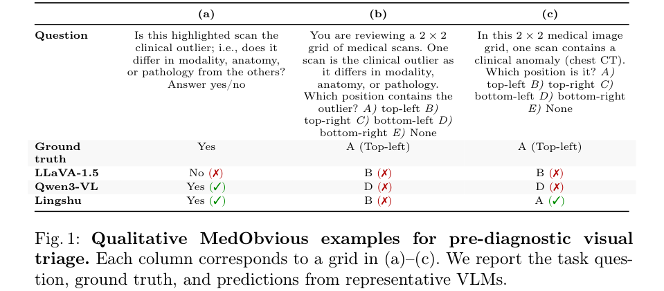
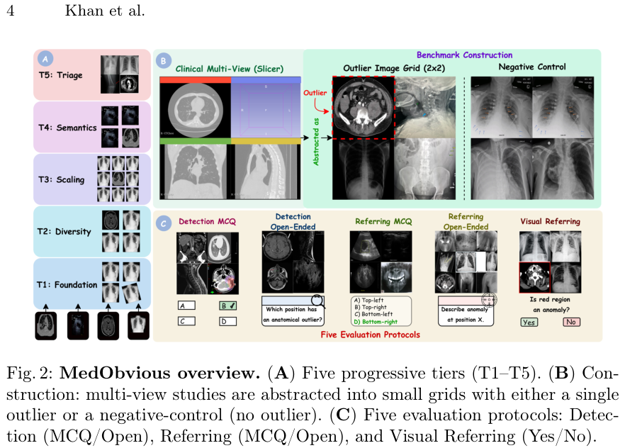
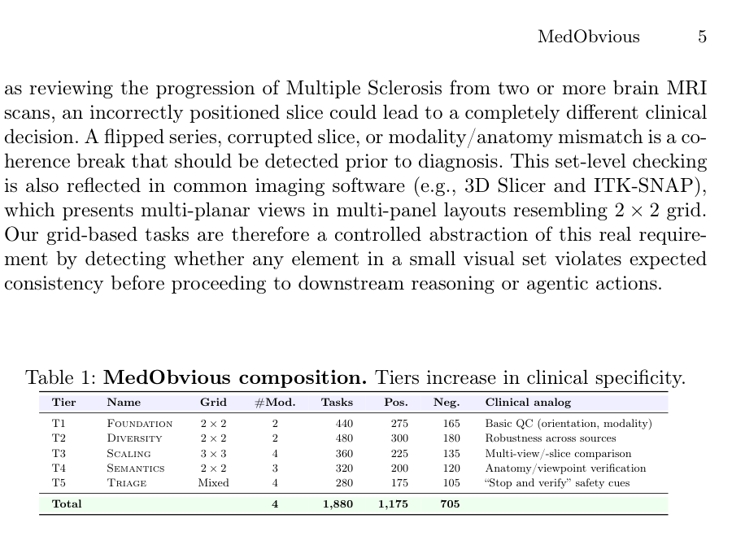
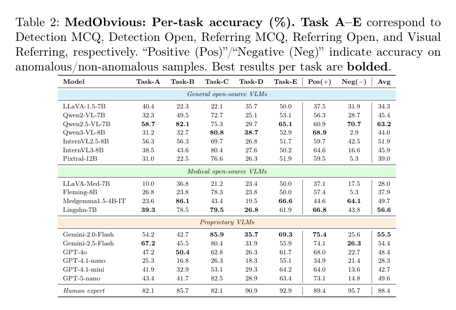
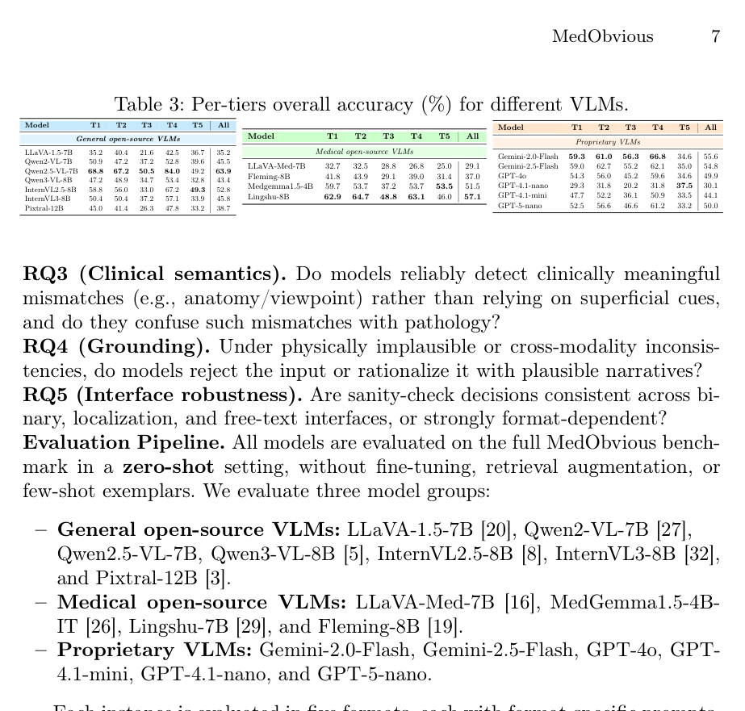

p116
<!-- document_mode: hybrid_paper -->
<!-- page 1 mode: simple_text -->
MedObvious: Exposing the Medical Moravec’s
Paradox in VLMs via Clinical Triage
Ufaq Khan⋆1, Umair Nawaz1, Lekkala Sai Teja2, Numaan Saeed1, Muhammad Bilal3, Yutong Xie1, Mohammad Yaqub1, and Muhammad Haris Khan1

## Mohamed bin Zayed University of Artificial Intelligence, UAE

## National Institute of Technology, Silchar

## Birmingham City University, UK
B ufaq.khan@mbzuai.ac.ae
arXiv:2603.23501v1 [cs.CV] 24 Mar 2026
Project Page: https://ufaqkhan.github.io/MedObvious-Website/
Abstract. Vision Language Models (VLMs) are increasingly used for tasks like medical report generation and visual question answering. However, fluent diagnostic text does not guarantee safe visual understanding. In clinical practice, interpretation begins with pre-diagnostic sanity checks: verifying that the input is valid to read (correct modality and anatomy, plausible viewpoint and orientation, and no obvious integrity violations). Existing benchmarks largely assume this step is solved, and therefore miss a critical failure mode: a model can produce plausible narratives even when the input is inconsistent or invalid. We introduce MedObvious, a 1,880-task benchmark that isolates input validation as a set-level consistency capability over small multi-panel image sets:
the model must identify whether any panel violates expected coherence.
MedObvious spans five progressive tiers, from basic orientation/modality mismatches to clinically motivated anatomy/viewpoint verification and triage-style cues, and includes five evaluation formats to test robustness across interfaces. Evaluating 17 different VLMs, we find that sanity checking remains unreliable: several models hallucinate anomalies on normal (negative-control) inputs, performance degrades when scaling to larger image sets, and measured accuracy varies substantially between multiple-choice and open-ended settings. These results show that prediagnostic verification remains unsolved for medical VLMs and should be treated as a distinct, safety-critical capability before deployment.
$$
Keywords: Medical Vision-Language Models · Pre-diagnostic Sanity Checking · Clinical Triage · Visual Grounding · AI Safety
$$
1

## Introduction
Vision-Language Models (VLMs) are increasingly being used to interpret medical images. Recent systems can generate radiology-style descriptions, answer clinical
⋆Corresponding author
---
<!-- page 2 mode: hybrid_paper -->
2 Khan et al
(a) Visual Referring
(b) Detection MCQ
(c) Detection MCQ
**Table 1 (Page 2)**
| Question | Isthishighlightedscanthe clinicaloutlier;i.e.,doesit differinmodality,anatomy, orpathologyfromtheothers? Answeryes/no | Youarereviewinga2×2 gridofmedicalscans.One scanistheclinicaloutlieras itdiffersinmodality, anatomy,orpathology. Whichpositioncontainsthe outlier?A)top-leftB) top-rightC)bottom-leftD) bottom-rightE)None | Inthis2×2medicalimage grid,onescancontainsa clinicalanomaly(chestCT). Whichpositionisit?A) top-leftB)top-rightC) bottom-leftD)bottom-right E)None |
$$
|---|---|---|---|
| Ground truth | Yes | A(Top-left) | A(Top-left) |
| LLaVA-1.5 | No(✗) | B(✗) | B(✗) |
| Qwen3-VL | Yes(✓) | D(✗) | D(✗) |
$$
| Lingshu | Yes(✓) | B(✗) | A(✓) |

questions, and perform multi-step reasoning over images and text, driven by both general-purpose models such as GPT-4o [1], Flamingo [4] and LLaVA [21] and medical adaptations such as LLaVA-Med [16], RadFM [28], and others [23,13,22].
In parallel, these models are being explored as the core perception for visual AI agents [17,10] that can also interact with imaging software (e.g., navigating viewers, selecting series, adjusting visualization, and triggering downstream tools).
This progress has motivated their potential use as assistants for clinical reporting and decision support. However, fluent language generation does not guarantee reliable visual perception. VLMs may produce coherent diagnostic narratives while failing basic sanity checks, such as detecting incorrect orientation, mismatched anatomy, unexpected modality, or physically implausible artifacts. We refer to this mismatch as the Medical Moravec’s Paradox, extending Moravec’s observation [2] that perception and spatial reasoning, trivial for humans, can be disproportionately difficult for machines even when higher-level outputs appear plausible. In medical imaging, this gap is consequential because failures occur before diagnosis: when the input is invalid or inconsistent, downstream reports become clinically uninterpretable.
Clinical interpretation begins with pre-diagnostic triage: clinicians first verify body part, view, modality, laterality, orientation, and basic image integrity, and they do not proceed to diagnosis if these checks fail. This requirement is amplified in multi-image and AI-agentic settings, where decisions depend on
---
<!-- page 3 mode: simple_text -->
MedObvious 3
consistency across a set of inputs, such as multiple fetal ultrasound views or long CT/MRI slice sequences and series. A single mis-acquired view, corrupted slice, mismatched series, or orientation error can compromise study-level reasoning, especially for models that aggregate evidence across images. Moreover, common tools such as 3D Slicer [11] and ITK-SNAP [30] support multi-panel layouts (e.g., axial, sagittal, coronal, and 3D) similar to a 2×2 display. VLM-based agents operating in these viewers must detect obvious panel-level inconsistencies to avoid acting on the wrong series, anatomy, or invalid inputs. Despite their importance, pre-diagnostic competencies are rarely evaluated explicitly. Standard medical VLM benchmarks such as VQA-RAD [15], PathVQA [12], PMCVQA [31], VQA-Med [6], and SLAKE [18] primarily assess the correctness of final answers, while hallucination-focused benchmarks such as Med-HallMark [7] emphasize factual consistency of the generated text[14]. These settings largely assume the input has been correctly perceived and can therefore miss failures on visually obvious sanity checks, allowing models to score well while remaining brittle and potentially unsafe in real multi-image or agentic workflows.
We introduce MedObvious, a benchmark for pre-diagnostic visual sanity checking in medical images. MedObvious asks a question that precedes diagnosis: Is the input coherent and appropriate to interpret? For this, we present small grids (2 × 2 or 3 × 3) and require models to either identify an outlier panel or state that no outlier exists, as shown in Fig. 1. Although it is not a clinical reading interface, this provides a controlled probe of set-level consistency, mirroring requirements in multi-view ultrasound, multi-slice CT/MRI, and multipanel viewer agentic workflows. MedObvious evaluates two axes. The Clinical Safety axis targets real failure modes that should be caught before any diagnostic verdict, including wrong body parts, flipped images, viewpoint/anatomy mismatches, and grossly apparent major pathology. The Visual Grounding axis uses synthetic inconsistencies (e.g., inserting modality-incompatible textures into an image) to test whether models check the visual input itself rather than relying on language priors for downstream tasks. MedObvious also includes explicit negative controls where all panels are consistent, so the correct response is that no outlier exists, directly measuring false alarms. Furthermore, it is organized into five progressive tiers (T1–T5) that increase in difficulty and clinical specificity as depicted in Fig. 2, ranging from basic orientation/modality mismatches to anatomy/viewpoint inconsistencies and high-saliency triage failures. In our zero-shot evaluation across 7 general, 4 medical, and 6 proprietary VLMs, performance remains uneven as the best mean accuracy reaches 63.2%, yet negative-control accuracy spans a wide range, indicating that false alarms on normal inputs remain common. We also observe strong format sensitivity, with large gaps between multiple-choice and open-ended variants of the same underlying capability. Our main contributions are:
– We formalize the Medical Moravec’s Paradox for medical VLMs, highlighting a gap between fluent diagnostic language and reliable pre-diagnostic visual sanity-checking, especially in multi-image and agentic-viewer settings.
---
<!-- page 4 mode: hybrid_paper -->
– We benchmark 7 representative open-source, 6 closed-source, and 4 medically specialized VLMs under zero-shot inference.

– We present first MedObvious, a 1,880 task benchmark spanning 5 progressive tiers, multiple grid configurations, five evaluation modes, and systematic negative controls, designed to evaluate pre-diagnostic visual triage independently of diagnosis.
2
MedObvious Construction
MedObvious is a benchmark designed to test whether medical VLMs can recognize obvious input-level inconsistencies before attempting any diagnosis, as inspired from [9]. It acts as a prerequisite for safe medical VLM deployment by pre-diagnostic visual sanity checking. Before interpreting pathology, clinicians first verify that an image is valid to read, including modality, anatomical region, viewpoint/orientation, and basic integrity. If these checks fail, the subsequent diagnosis is unreliable regardless of how fluent the generated text appears.
MedObvious isolates this input-validation step and explicitly evaluates it.
Motivation. The clinical need is inherently set-based. Many studies are interpreted across multiple views, slices, or series, where a single inconsistent element can compromise the conclusions of the study. In fetal ultrasound, assessment of the fetal heart relies on multiple standard views. One mis-acquired plane or corrupted view may change the interpretation. In CT/MRI, clinicians reason over long slice sequences and multi-series studies. In longitudinal assessment, such
---
<!-- page 5 mode: hybrid_paper -->
**Table 1: MedObvious composition. Tiers increase in clinical specificity.**

Problem Formulation. Each MedObvious instance presents a grid of n images, G = {I1, . . . , In} with n ∈{4, 9}. The model must either identify the index of the inconsistent image or state that no outlier exists (y ∈{1, . . . , n} ∪{∅}) where y = k denotes Ik as the outlier and y = ∅denotes a clean and consistent grid. This setup evaluates input validity and set-level coherence, i.e., whether images that should belong to the same study context (across views, slices/series, or timepoints) are mutually consistent, rather than evaluating diagnosis.
Datasets. We primarily use curated subsets of ROCO [24] to construct anatomically and modality-defined tasks (e.g., chest radiographs, CT, MRI, ultrasound) using metadata filtering. To reduce modality shortcuts and enforce modality awareness, we additionally include non-radiological images, including endoscopy from Kvasir [25], to increase visual diversity and discourage reliance on generic grayscale radiology priors.
Template-based generation. Each task is generated from a shared template:
we sample n −1 inlier panels from a reference category (defined by modality, and when available, anatomy/viewpoint), and then either (i) insert one outlier from a different category or via a controlled integrity violation (e.g., orientation change or physically inconsistent composite), or (ii) create a negative control by sampling all n panels from same reference category so the correct answer is ∅.
Progressive tiers. MedObvious comprises five tiers (1,880 tasks) with increasing clinical specificity (Table 1): T1 Foundation (2 × 2; orientation/modality mismatches), T2 Diversity (2 × 2; finer distinctions across sources), T3 Scaling (3 × 3; many distractors and modality diversity), T4 Semantics (2 × 2; anatomy/viewpoint mismatches and integrity violations), and T5 Triage; highsaliency failures (like gross abnormalities), and cross-modality coherence breaks.
---
<!-- page 6 mode: hybrid_paper -->
6 Khan et al
**Table 2: MedObvious: Per-task accuracy (%). Task A–E correspond to Detection MCQ, Detection Open, Referring MCQ, Referring Open, and Visual Referring, respectively. “Positive (Pos)”/“Negative (Neg)” indicate accuracy on anomalous/non-anomalous samples. Best results per task are bolded.**

Evaluation Protocols. Each grid is evaluated in 5 formats to separate visual capability from response-format effects: Detection MCQ (pick the outlier), Detection Open (state the outlier position), Referring MCQ (choose an outlier description given its position), Referring Open (describe the outlier given its position), and Visual Referring (Yes/No for highlighted region). Using both multiplechoice and open-ended settings exposes selection biases and over-generation.
Negative controls. To measure false alarms, MedObvious includes explicit negative controls where all panels are consistent and no outlier exists (37.5% of tasks; 705/1,880). The correct label is y = ∅(or “No” for binary verification).
3
Experiments and Results
MedObvious targets a pre-diagnostic requirement, i.e., before interpretation, the model must verify that the input is coherent and safe to reason over. We therefore evaluate VLMs as potential pre-diagnostic gatekeepers using the following clinically grounded research questions:
```text
RQ1 (Gatekeeping and false alarms). Can models detect gross input violations (wrong modality or anatomy) and decide whether to proceed or abstain?
```
Also, can models correctly determine that no anomaly is present when given normal, internally consistent inputs?
```text
RQ2 (Set-level consistency). How does performance change as the candidate set grows, requiring systematic comparison across images?
```
---
<!-- page 7 mode: hybrid_paper -->
**Table 3: Per-tiers overall accuracy (%) for different VLMs.**

Each instance is evaluated in five formats, each with format-specific prompts.
Outputs are constrained and parsed into a closed label space (option letter, grid position, or Yes/No) to ensure consistent scoring across models. Moreover, opensource models are evaluated with a unified inference pipeline on NVIDIA A100 (40 GB) GPU. Proprietary models are queried via public APIs using the same prompts and output normalization.
Evaluation Metrics. We report accuracy for each format, as well as Positive accuracy (outlier present), Negative accuracy (no outlier), and Overall accuracy. Reporting Positive and Negative separately is clinically important as a model can appear strong on anomaly-present cases, yet remain unsafe due to false alarms on normal inputs.
Results. We summarize results by research question. Table 2 reports performance on the 5 evaluation modes, and Table 3 reports performance on 5 tiers.
```text
RQ1 (Gatekeeping and false alarms). Table 2 shows that overall accuracy is still far from a reliable pre-diagnostic gate, with large variance between models. The most safety-relevant signal is the Pos(+) and Neg(−) split. Several models achieve high Pos(+) accuracy while collapsing on Neg(−), indicating a “always-find-something” bias that would be unacceptable for a gatekeeper. In contrast, a smaller subset achieves substantially higher Neg(−), demonstrating that abstention is learnable, but not consistently present across model families.
```
---
<!-- page 8 mode: simple_text -->
8 Khan et al
Importantly, the proprietary scale does not automatically fix this failure mode, as the negative accuracy remains modest for many such models, suggesting that normal-case calibration is a distinct problem from diagnostic fluency.
```text
RQ2 (Set-level consistency). The tier analysis in Table 3 reveals that the scaling from 2×2 to 3×3 is not a minor increase in difficulty but a qualitative failure point. The systematic drop in T3 (Scaling) suggests that many models do not reliably perform an exhaustive comparison across candidates. Instead, they appear to rely on a small number of salient cues. This matters clinically because multi-view and multi-slice studies require consistent reasoning across many related images (CT slices or multi-view fetal ultrasound), not just the detection of a single obvious frame.
RQ3 (Clinical semantics). Models often rebound on T4 (Semantics), which emphasizes anatomy/viewpoint mismatches. This indicates that clinically significant distribution shifts (e.g., chest vs. abdomen, frontal vs. lateral) can be easier to detect than distractor-heavy scaling, likely because they produce greater global changes in appearance. However, this “semantic strength” does not imply safety: a model can detect an anatomy mismatch yet still hallucinate anomalies on fully consistent grids.
RQ4 (Grounding). MedObvious includes integrity and plausibility violations to test whether models reject invalid inputs rather than rationalize them. The high false-alarm rates on negative controls, together with strong interface sensitivity (RQ6), indicate that many models do not behave as conservative verifiers and often commit to an outlier decision even when the correct response is “none”.
```
This is undesirable for gatekeeping, where abstention from normal or ambiguous input is often the safer behavior.
```text
RQ5 (Interface robustness). Performance is strongly format-dependent. Many models are high on Referring MCQ (Task-C) but low on Referring Open (Task-D) (e.g., Qwen2.5-VL-7B: 75.3% vs. 29.7%; Pixtral-12B: 76.6% vs. 26.3%; Lingshu7B: 79.5% vs. 26.8%), suggesting option selection is easier to producing grounded descriptions. The reverse asymmetry also appears as MedGemma1.5-4B-IT is strong on Detection Open (Task-B: 86.1%) but much lower on Detection MCQ (Task-A: 23.6%), indicating interaction between decoding and discrete choice.
```
Overall, sanity checking is not interface-invariant; deployment may require binary gating, localization, and short explanations, so models should be evaluated for consistency across outputs rather than a single prompt style.
Discussion. MedObvious shows that fluent report-style generation does not imply reliable pre-diagnostic verification. Across models, the main failures are false alarms on normal grids, degradation under scaling when more candidates must be compared, and strong format sensitivity where multiple-choice can overestimate grounded ability. These failures directly limit the use of VLMs as sanity-check assistants. The implications are even more prominent for agentic medical AI. VLM-based agents operating in viewers such as ITK-SNAP or 3D Slicer must make decisions from multi-panel, multi-image layouts, where basic set-level consistency (modality, anatomy, orientation, integrity) is a prerequisite for safe actions. A model that hallucinates anomalies or fails under larger candi-
---
<!-- page 9 mode: simple_text -->
MedObvious 9
date sets can propagate errors by selecting the wrong series or acting on invalid inputs while remaining confidently fluent. Overall, MedObvious complements existing benchmarks by isolating this prerequisite layer and motivates targeted methods to (i) reduce false alarms via calibrated abstention and (ii) improve systematic set-level comparison under distractor scaling.
4

## Conclusion
We present MedObvious, a benchmark for pre-diagnostic visual sanity checking in medical VLMs. Across progressive tiers, formats, and negative controls, we find that current models remain unreliable gatekeepers, with frequent false alarms, scaling degradation, and strong format sensitivity, motivating pre-diagnostic triage as a prerequisite for safe clinical and agentic deployment. A limitation is the use of simplified grids. Future work should extend to full multi-series volumes and interactive viewer-based evaluation.

## References
1. Achiam, J., Adler, S., Agarwal, S., Ahmad, L., Akkaya, I., Aleman, F.L., Almeida,
D., Altenschmidt, J., Altman, S., Anadkat, S., et al.: Gpt-4 technical report. arXiv preprint arXiv:2303.08774 (2023)
2. Agrawal, K.: To study the phenomenon of the moravec’s paradox. arXiv preprint
arXiv:1012.3148 (2010)
3. Agrawal, P., Antoniak, S., Hanna, E.B., Bout, B., Chaplot, D., Chudnovsky, J.,
Costa, D., De Monicault, B., Garg, S., Gervet, T., et al.: Pixtral 12b. arXiv preprint arXiv:2410.07073 (2024)
Alayrac, J.B., Donahue, J., Luc, P., Miech, A., Barr, I., Hasson, Y., Lenc, K., Men
sch, A., Millican, K., Reynolds, M., et al.: Flamingo: a visual language model for few-shot learning. Advances in neural information processing systems 35, 23716– 23736 (2022)
5. Bai, S., Cai, Y., Chen, R., Chen, K., Chen, X., Cheng, Z., Deng, L., Ding, W.,
Gao, C., Ge, C., et al.: Qwen3-vl technical report. arXiv preprint arXiv:2511.21631 (2025)
Ben Abacha, A., Hasan, S.A., Datla, V.V., Demner-Fushman, D., Müller, H.: Vqa
med: Overview of the medical visual question answering task at imageclef 2019.
In: Proceedings of CLEF (Conference and Labs of the Evaluation Forum) 2019 Working Notes. 9-12 September 2019 (2019)
7. Chen, J., Yang, D., Wu, T., Jiang, Y., Hou, X., Li, M., Wang, S., Xiao, D., Li, K.,
Zhang, L.: Detecting and evaluating medical hallucinations in large vision language models. arXiv preprint arXiv:2406.10185 (2024)
8. Chen, Z., Wang, W., Cao, Y., Liu, Y., Gao, Z., Cui, E., Zhu, J., Ye, S., Tian,
H., Liu, Z., et al.: Expanding performance boundaries of open-source multimodal models with model, data, and test-time scaling. arXiv preprint arXiv:2412.05271 (2024)
Dahou, Y., Huynh, N.D., Le-Khac, P.H., Para, W.R., Singh, A., Narayan, S
Vision-language models can’t see the obvious. arXiv preprint arXiv:2507.04741 (2025)
---
<!-- page 10 mode: simple_text -->
10 Khan et al
Fallahpour, A., Ma, J., Munim, A., Lyu, H., Wang, B.: Medrax: Medical reasoning
agent for chest x-ray. arXiv preprint arXiv:2502.02673 (2025)
Fedorov, A., Beichel, R., Kalpathy-Cramer, J., Finet, J., Fillion-Robin, J.C., Pu
jol, S., Bauer, C., Jennings, D., Fennessy, F., Sonka, M., et al.: 3d slicer as an image computing platform for the quantitative imaging network. Magnetic resonance imaging 30(9), 1323–1341 (2012)
He, X., Zhang, Y., Mou, L., Xing, E., Xie, P.: Pathvqa: 30000+ questions for
medical visual question answering. arXiv preprint arXiv:2003.10286 (2020)
13. Jiang, S., Wang, Y., Song, S., Zhang, Y., Meng, Z., Lei, B., Wu, J., Sun, J.,
Liu, Z.: Omniv-med: Scaling medical vision-language model for universal visual understanding. arXiv preprint arXiv:2504.14692 (2025)
Khan, U., Nawaz, U., Saddik, A.E.: Ultraweak: Enhancing breast ultrasound cancer
detection with deformable detr and weak supervision. In: MICCAI Workshop on Cancer Prevention through Early Detection. pp. 144–153. Springer (2024)
Lau, J.J., Gayen, S., Ben Abacha, A., Demner-Fushman, D.: A dataset of clinically
generated visual questions and answers about radiology images. Scientific data 5(1), 180251 (2018)
16. Li, C., Wong, C., Zhang, S., Usuyama, N., Liu, H., Yang, J., Naumann, T.,
Poon, H., Gao, J.: Llava-med: Training a large language-and-vision assistant for biomedicine in one day. Advances in Neural Information Processing Systems 36, 28541–28564 (2023)
17. Lin, K.Q., Li, L., Gao, D., Yang, Z., Wu, S., Bai, Z., Lei, S.W., Wang, L., Shou,
M.Z.: Showui: One vision-language-action model for gui visual agent. In: Proceedings of the Computer Vision and Pattern Recognition Conference. pp. 19498–19508 (2025)
Liu, B., Zhan, L.M., Xu, L., Ma, L., Yang, Y., Wu, X.M.: Slake: A semantically
labeled knowledge-enhanced dataset for medical visual question answering. In: 2021 IEEE 18th international symposium on biomedical imaging (ISBI). pp. 1650–1654.
```text
IEEE (2021)
```
19. Liu, C., Li, D., Shu, Y., Chen, R., Duan, D., Fang, T., Dai, B.: Fleming-r1: To-
ward expert-level medical reasoning via reinforcement learning. arXiv preprint arXiv:2509.15279 (2025)
Liu, H., Li, C., Li, Y., Lee, Y.J.: Improved baselines with visual instruction tun
ing. In: Proceedings of the IEEE/CVF conference on computer vision and pattern recognition. pp. 26296–26306 (2024)
Liu, H., Li, C., Wu, Q., Lee, Y.J.: Visual instruction tuning. Advances in neural
information processing systems 36, 34892–34916 (2023)
22. Nath, V., Li, W., Yang, D., Myronenko, A., Zheng, M., Lu, Y., Liu, Z., Yin,
H., Law, Y.M., Tang, Y., et al.: Vila-m3: Enhancing vision-language models with medical expert knowledge. In: Proceedings of the Computer Vision and Pattern Recognition Conference. pp. 14788–14798 (2025)
23. Pan, J., Liu, C., Wu, J., Liu, F., Zhu, J., Li, H.B., Chen, C., Ouyang, C., Rueck-
ert, D.: Medvlm-r1: Incentivizing medical reasoning capability of vision-language models (vlms) via reinforcement learning. In: International Conference on Medical Image Computing and Computer-Assisted Intervention. pp. 337–347. Springer (2025)
Pelka, O., Koitka, S., Rückert, J., Nensa, F., Friedrich, C.M.: Radiology objects
in context (roco): A multimodal image dataset. In: Intravascular Imaging and Computer Assisted Stenting and Large-Scale Annotation of Biomedical Data and Expert Label Synthesis. pp. 180–189. Springer International Publishing, Cham (2018)
---
<!-- page 11 mode: simple_text -->
MedObvious 11
25. Pogorelov, K., Randel, K.R., Griwodz, C., Eskeland, S.L., de Lange, T., Johansen,
D., Spampinato, C., Dang-Nguyen, D.T., Lux, M., Schmidt, P.T., et al.: Kvasir:
A multi-class image dataset for computer aided gastrointestinal disease detection.
In: Proceedings of the 8th ACM on Multimedia Systems Conference. pp. 164–169 (2017)
26. Sellergren, A., Kazemzadeh, S., Jaroensri, T., Kiraly, A., Traverse, M., Kohlberger,
T., Xu, S., Jamil, F., Hughes, C., Lau, C., et al.: Medgemma technical report. arXiv preprint arXiv:2507.05201 (2025)
27. Wang, P., Bai, S., Tan, S., Wang, S., Fan, Z., Bai, J., Chen, K., Liu, X., Wang,
J., Ge, W., et al.: Qwen2-vl: Enhancing vision-language model’s perception of the world at any resolution. arXiv preprint arXiv:2409.12191 (2024)
Wu, C., Zhang, X., Zhang, Y., Hui, H., Wang, Y., Xie, W.: Towards generalist foun
dation model for radiology by leveraging web-scale 2d&3d medical data. Nature Communications 16(1), 7866 (2025)
29. Xu, W., Chan, H.P., Li, L., Aljunied, M., Yuan, R., Wang, J., Xiao, C., Chen, G.,
Liu, C., Li, Z., et al.: Lingshu: A generalist foundation model for unified multimodal medical understanding and reasoning. arXiv preprint arXiv:2506.07044 (2025)
30. Yushkevich, P.A., Piven, J., Hazlett, H.C., Smith, R.G., Ho, S., Gee, J.C., Gerig,
G.: User-guided 3d active contour segmentation of anatomical structures: significantly improved efficiency and reliability. Neuroimage 31(3), 1116–1128 (2006)
Zhang, X., Wu, C., Zhao, Z., Lin, W., Zhang, Y., Wang, Y., Xie, W.: Pmc-vqa
Visual instruction tuning for medical visual question answering. arXiv preprint arXiv:2305.10415 (2023)
32. Zhu, J., Wang, W., Chen, Z., Liu, Z., Ye, S., Gu, L., Tian, H., Duan, Y., Su, W.,
Shao, J., et al.: Internvl3: Exploring advanced training and test-time recipes for open-source multimodal models. arXiv preprint arXiv:2504.10479 (2025)
---
