p118
<!-- document_mode: hybrid_paper -->
<!-- page 1 mode: hybrid_paper -->
WRITEBACK-RAG: Training the Knowledge Base through Evidence
Distillation and Write-Back Enrichment

## Abstract
The knowledge base in a retrieval-augmented generation (RAG) system is typically assembled once and never revised, even though the facts a query requires are often fragmented across documents and buried in irrelevant content. We argue that the knowledge base should be treated as a trainable component and propose WRITEBACK-RAG, a framework that uses labeled examples to identify where retrieval succeeds, isolate the relevant documents, and distill them into compact knowledge units that are indexed alongside the original corpus.
Because the method modifies only the corpus, it can be applied once as an offline preprocessing step and combined with any RAG pipeline.
Across four RAG methods, six benchmarks, and two LLM backbones, WRITEBACK-RAG improves every evaluated setting, with gains averaging +2.14%. Cross-method transfer experiments further show that the distilled knowledge benefits RAG pipelines other than the one used to produce it, confirming that the improvement resides in the corpus itself.
arXiv:2603.25737v1 [cs.AI] 26 Mar 2026
1

## Introduction
Retrieval-augmented generation (RAG) systems consist of three core components: a retriever, a generator, and a knowledge base (KB) (Hu and Lu, 2024; Fan et al., 2024). Modern RAG research has devoted substantial effort to optimizing the first two: training better retrievers (Shi et al., 2024), teaching generators when and how to use retrieved evidence (Asai et al., 2023; Jiang et al., 2023b), and designing tighter retriever-generator integration (Izacard et al., 2023). The knowledge base, by contrast, is treated as a fixed input: assembled once from raw document collections like Wikipedia dumps, textbooks, or web crawls, and never updated in response to downstream task signals.
Knowledge bases are composed of raw documents, so the granularity at which knowledge is
* Corresponding author.
Yuxing Lu♠♡, Xukai Zhao♣, Wei Wu♠, Jinzhuo Wang *♠
♠Peking University ♡Georgia Institute of Technology ♣Tsinghua University
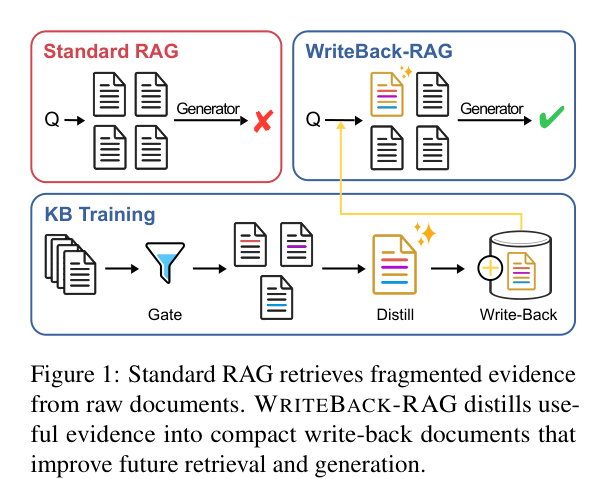
stored is dictated by document boundaries. However, the knowledge a query requires rarely aligns with these boundaries: the relevant facts are typically distributed across multiple documents (fragmentation), while each document contains substantial content irrelevant to the query (noise). As a result, the retriever surfaces partially relevant documents, but the context the generator receives is both incomplete and diluted. By observing how a RAG system interacts with the corpus on labeled data, which samples benefit from retrieval, and which documents contribute to the generation, we can identify where knowledge is fragmented and should be rewritten and fused. This provides a natural supervision signal for optimizing the KB.
This observation motivates a new concept we call knowledge base training: optimizing the KB itself using supervision from labeled examples, analogous to how model parameters are updated through training data (Appendix A). We instantiate this idea in WRITEBACK-RAG, a framework that learns from retrieval patterns on training data to improve the knowledge base. Concretely, a twostage gating mechanism analyzes retrieval behavior to identify which training samples benefit from retrieval and which retrieved documents contribute
1
---
<!-- page 2 mode: hybrid_paper -->
to better generation. An LLM-based distiller then fuses and compresses the selected evidence into compact, self-contained knowledge units that are permanently indexed alongside the original corpus. Because WRITEBACK-RAG augments only the KB, not the retriever or generator, it enhances any RAG pipeline as an orthogonal optimization step, with a one-time offline cost and no additional inference-time overhead.
Our contributions are:
1. We propose treating the knowledge base as a
trainable component of RAG systems and introduce WRITEBACK-RAG, a framework that learns from retrieval patterns on labeled data to restructure and enrich the KB through gated evidence distillation and persistent write-back.
2. We provide extensive empirical validation
across four RAG methods (Naive Retrieval, RePlug, Self-RAG, Flare), six benchmarks (NQ, BoolQ, FEVER, zsRE, HotpotQA, SQuAD), and two LLM backbones (Llama-3.1-8B, Gemma-3-12B), showing consistent improvements in all settings.
3. We present detailed analyses of write-back
knowledge properties, including compression statistics, retrieval dynamics, and generalization behavior, providing insight into when and why WRITEBACK-RAG improves performance.

## Related Works
Retrieval and Generation Strategies.
The standard RAG pipeline retrieves top-K documents and conditions generation on them (Lu et al., 2025; Guu et al., 2020; Borgeaud et al., 2022). A large body of work has improved this pipeline from both sides. On the retrieval side, REPLUG (Shi et al., 2024) ensembles generation probabilities over documents for better passage weighting, and HyDE (Gao et al., 2023) generates hypothetical documents to improve query representations. On the generation side, SELF-RAG (Asai et al., 2023) introduces reflection tokens for adaptive retrieval decisions, FLARE (Jiang et al., 2023b) triggers retrieval when generation confidence drops, and Atlas (Izacard et al., 2023) jointly trains the retriever and generator. These methods share a common assumption: the knowledge base is a fixed input.
They optimize how to search it and how to consume its outputs, but the content and organization of the KB itself is never modified. WRITEBACK-RAG addresses this independent dimension.
Improving Retrieved Context at Inference Time.
A separate line of work aims to improve the quality of the context the generator sees, rather than the retrieval or generation mechanism. RECOMP (Xu et al., 2023) trains extractive and abstractive compressors to shorten retrieved documents. FILCO (Wang et al., 2023) learns to select useful spans within documents. LLMLingua (Jiang et al., 2023a) uses perplexity-based token pruning to compress prompts. GenRead (Yu et al., 2022) bypasses retrieval entirely, prompting the LLM to generate its own context. RAGate (Wang et al., 2025) gates external retrieval according to whether the required knowledge is already available within the model. All of these operate per query at inference time: they produce ephemeral, compressed or generated context that is consumed once and discarded. This means the cost scales linearly with the number of test queries, and knowledge gained from one query never benefits another. WRITEBACKRAG inverts this paradigm: it distills and fuses evidence once during an offline phase, producing persistent knowledge units that benefit all future queries at zero inference-time cost.
Knowledge Base Optimization.
The idea of directly modifying the knowledge source to improve downstream performance has been explored in two distinct settings, neither of which addresses the RAG corpus. In traditional NLP, knowledge base construction methods extract structured triples from text (Dong et al., 2015; Martinez-Rodriguez et al., 2018), but these produce symbolic KBs rather than retrieval-ready documents. In the model editing literature, methods like ROME (Meng et al., 2022a) and MEMIT (Meng et al., 2022b) update factual associations by modifying model parameters, effectively “editing the KB” that lives inside the network weights. However, these parametric edits are brittle at scale and entangled with the model’s other capabilities. WRITEBACK-RAG pursues a non-parametric alternative: rather than editing model weights, it edits the external corpus that the model retrieves from. This is more modular (the enriched KB works with any retriever and generator), more interpretable (write-back units are readable text), and more scalable (adding documents does not risk degrading the model). To our knowledge, WRITEBACK-RAG is the first framework to treat the RAG knowledge base as a trainable component that is systematically optimized using downstream task signals.
2
---
<!-- page 3 mode: hybrid_paper -->
**Table 3 (Page 3)**
| rotar |
$$
|---|
$$
| eneG |
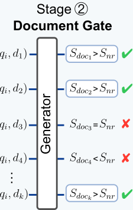
**Table 1 (Page 3)**
| esahP gniniarT |
$$
|---|
$$
| esahP tseT |
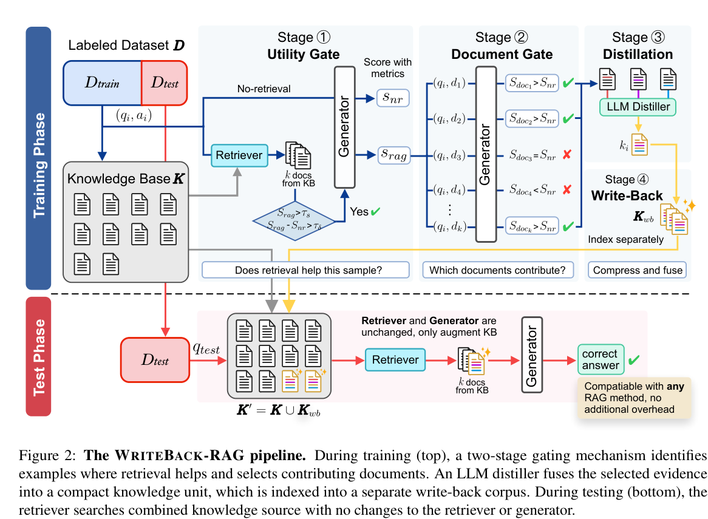

## Problem Formulation
A RAG system consists of three components: a
$$
retriever R, a generator G, and a knowledge base K = {d1, d2, . . . , d∣K∣} containing ∣K∣documents.
$$
Given a query q, the retriever returns a set of top-K documents:
$$
Dq = R(q, K) = {d(1), d(2), . . . , d(K)} (1)
$$
and the generator produces an answer conditioned on both the query and retrieved documents:
$$
ˆ a = G(q, Dq) (2)
$$
The quality of the answer is measured by a taskspecific metric M(q, a ∣G, Dq), where a is the reference answer.
Existing work optimizes R and G while treating K as fixed. We instead propose to optimize K while keeping R and G unchanged. Given a set of labeled training examples Dtrain = {(qi, ai)}N i=1, the KB training objective is to find a write-back corpus Kwb such that the augmented KB K′ = K ∪Kwb maximizes downstream performance:
Dtest M(q, a ∣G, R(q, K ∪Kwb)) (3)
$$
K ∗ wb = arg max Kwb ∑
$$
At test time, retrieval operates over the combined index:
$$
D ′ q = R(q, K ′) = Top-K(R(q, K) ∪R(q, Kwb)) (4)
$$
4

## Methods

### Overview
WRITEBACK-RAG instantiates the KB training objective (Eq. 3) by learning from how a RAG system interacts with the corpus on labeled data.
The key insight is that retrieval patterns on training examples reveal where the KB’s knowledge organization is deficient, where relevant facts are fragmented across documents or buried in noise, and this signal can be used to systematically restructure the KB.
As shown in Figure 2, WRITEBACK-RAG operates in two phases. During the training phase, a two-stage gating mechanism first selects training examples where retrieval genuinely helps (utility gate, §4.2) and then identifies which retrieved documents carry useful knowledge (document gate, §4.3). The selected evidence is fused and compressed into a single knowledge unit via LLMbased distillation (§4.4) and indexed into a separate write-back corpus (§4.5). During the test
3
---
<!-- page 4 mode: hybrid_paper -->
```text
Algorithm 1 WRITEBACK-RAG KB Training
Require: Dtrain, R, G, K, M, τδ, τs, τdoc Ensure: Trained KB K′ = K ∪Kwb
1: Kwb ←∅ 2: for each (qi, ai) ∈Dtrain do 3:
```
snr i ←M(qi, ai ∣G)
```text
4:
```
$$
Di ←R(qi, K); s rag i ←M(qi, ai ∣G, Di)
$$
```text
5:
```
$$
δi ←s rag i −snr i
$$
```text
6:
if δi > τδ and s rag i > τs then
7:
// Utility Gate passed
8:
```
D∗ i ←∅
```text
9:
for each dj ∈Di do
10:
```
si,j ←M(qi, ai ∣G, dj)
```text
11:
if si,j −snr i > τdoc then
12:
```
$$
D∗ i ←D∗ i ∪{dj} // Document Gate
$$
```text
13:
end if
14:
end for
15:
if D∗ i = ∅then
16:
```
$$
D∗ i ←Top-nmin(Di)
$$
```text
17:
end if
18:
```
$$
ki ←F(qi, D∗ i ) // Distillation
$$
```text
19:
```
$$
Kwb ←Kwb ∪{ki} // Write-Back
$$
```text
20:
end if
21: end for 22: Index Kwb; set K′ ←K ∪Kwb
```
phase, the retriever searches the combined knowledge source K′ = K ∪Kwb with no changes to the retriever or generator. The full pipeline is given in Algorithm 1.
Both gating stages rely on two reference scores computed for each training example (qi, ai). The no-retrieval score measures what the generator can answer from parametric knowledge alone:
$$
snr i = M(qi, ai ∣G) (5)
$$
The RAG score measures performance with retrieval from the original KB:
$$
srag i = M(qi, ai ∣G, R(qi, K)) (6)
$$
The gap δi = s rag i −snr i quantifies the retrieval benefit for each example and drives all gating decisions.
The backbone RAG method (e.g., Naive Retrieval, RePlug, Self-RAG, FLARE) is used consistently for computing these scores, for distillation, and for final evaluation. WRITEBACK-RAG is an orthogonal optimization step that works on top of any backbone without modifying it.

### Utility Gate
The utility gate operates at the sample level, selecting training examples where retrieved knowledge makes a genuine difference. If the generator can already answer correctly without retrieval, or if retrieval does not improve the answer, there is no useful signal for KB training.
WRITEBACK-RAG retains a training example (qi, ai) if and only if:
$$
δi > τδ and srag i > τs (7)
$$
The margin threshold τδ ensures retrieval provides non-negligible improvement, and the quality threshold τs ensures the retrieval-augmented answer is actually correct. Their conjunction guards against two failure modes: high gain but low absolute quality (retrieval improves a wrong answer to a slightly less wrong one), or high quality already achievable without retrieval. We denote the set of examples passing the utility gate as Dutil ⊆Dtrain.

### Document Gate
The document gate operates at the document level within each utility-approved example. Among the K retrieved documents, not all carry useful knowledge, some are noisy, tangential, or distracting. The document gate isolates the specific documents that contribute to the improved answer.
For each retrieved document dj, WRITEBACKRAG measures its standalone contribution:
$$
sdoc i,j = M(qi, ai ∣G, dj) (8)
$$
A document passes if it provides information beyond the generator’s parametric knowledge:
$$
D ∗ i = {dj ∈Di ∣sdoc i,j −snr i > τdoc} (9)
$$
If no documents pass (D∗ i = ∅), we retain the top-nmin by retrieval rank as a fallback. Removing weak evidence before distillation ensures the resulting knowledge units are focused and more likely to generalize beyond the original training query.

### Distillation
Given a training query qi and its gated evidence D∗ i , an LLM-based distiller F synthesizes a single knowledge unit:
$$
ki = F(qi, D ∗ i ) (10)
$$
The distiller takes multiple gated documents as input and produces a single compact passage as output. Its core operation is fusion: merging correlated knowledge that is scattered across separate documents, i.e., information that is related but separated by document boundaries in the original KB, into one coherent unit. At the same time, it compresses away redundant or tangential content within each source document, producing a denser passage. The
4
---
<!-- page 5 mode: hybrid_paper -->

### Write-Back
A retrieval index is built for Kwb using the same retriever encoder. At inference time, the retriever searches K and Kwb independently and merges the results into a single top-K set (Eq. 4). The trained knowledge base is K′ = K ∪Kwb.
We store write-back knowledge in a separate index rather than merging it into the original KB for three reasons: (1) the original corpus is kept clean and unmodified, avoiding any risk of corrupting existing retrieval quality; (2) the write-back index can be updated, replaced, or rolled back independently without rebuilding the base index; and (3) it introduces no additional storage overhead beyond the distilled documents themselves.
Because WRITEBACK-RAG augments only the KB, not the retriever or generator, it enhances any RAG pipeline as an orthogonal optimization step (see Appendix C for a detailed discussion).
**Table 1: Main evaluation datasets. Detailed descriptions and split statistics are given in Appendix Table 5.**
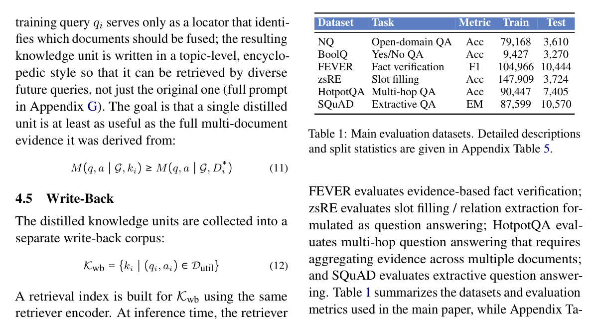
5

## Experiments

### Datasets
We evaluate on six benchmarks from the FlashRAG collection (Jin et al., 2025): Natural Questions (NQ) (Kwiatkowski et al., 2019), BoolQ (Clark et al., 2019), FEVER (Thorne et al., 2018), zsRE (Levy et al., 2017), HotpotQA (Yang et al., 2018), and SQuAD (Rajpurkar et al., 2016). We use the preprocessed benchmark releases provided by FlashRAG (Jin et al., 2025) and adopt the FlashRAG-provided Wikipedia corpus as the external knowledge source for retrieval.
These datasets cover a diverse set of knowledgeintensive tasks. NQ evaluates open-domain question answering over Wikipedia; BoolQ evaluates naturally occurring yes/no question answering;

### Implementation Details
We use E5-base-v2 (Wang et al., 2022) as the retriever with K=5 documents; the same encoder is used to index both K and Kwb.
The same LLM (Llama-3.1-8B (Grattafiori et al., 2024) and Gemma-3-12B (Team et al., 2024)) serves as both the generator G and the distiller F; the distiller operates only during the training phase with a taskspecific prompt (Appendix G).
For gating, we set τs = 0.1 and τδ = 0.01 (any strict improvement suffices, i.e., δi > 0). The document gate uses τdoc = 0.01 with nmin = 2 fallback documents. Threshold sensitivity is analyzed in Section 6.5. Notably, the distiller does not receive the gold answer, so there is no direct answer leakage into the write-back corpus (Appendix B). Kwb is stored as a separate FAISS index (Douze et al., 2025); at inference time, both indices are searched independently and results are merged into a single top-K set. Full hyperparameters are given in Appendix Table 6.
The training phase has three cost components:
baseline scoring (2N generator calls), document gating (up to ∣Dutil∣× K calls), and distillation (∣Dutil∣calls). For NQ (N=79,168, ∣Dutil∣=12,295, K=5), this totals approximately 220K generator calls, completing in 0.5 hours on two H200 GPUs.
This is a one-time offline cost; at inference time, write-back adds zero overhead beyond a marginally
5
---
<!-- page 6 mode: hybrid_paper -->

## Results
factual evidence that is often scattered across Wikipedia passages, exactly the scenario where fusing and compressing evidence should help. BoolQ (+2.15%) also sees clear gains despite its shortanswer format. Improvements on zsRE (+0.56%), HotpotQA (+1.01%), and SQuAD (+1.33%) are smaller but uniformly positive. We note that even the smallest gains are achieved at zero inferencetime cost: the only change is a slightly larger retrieval index.
Two observations deserve emphasis. First, the gains on Self-RAG and FLARE show that KB training is complementary to adaptive retrieval strategies, not redundant with them, these methods already decide when and whether to retrieve, yet still benefit from a better-organized corpus. Second, write-back helps even when retrieval itself hurts: on FEVER, Naive RAG (32.77%) underperforms the no-retrieval baseline (34.24%), yet adding writeback raises F1 to 37.89%, well above both. This suggests that distilled documents can partially compensate for noisy retrieval by placing more focused evidence within reach of the retriever.
**Table 2: Main results across six benchmarks, four RAG methods, and two LLMs. +WB denotes WRITEBACK-RAG using write-back RAG. Numbers in parentheses show absolute gains over the corresponding retrieval baseline.**
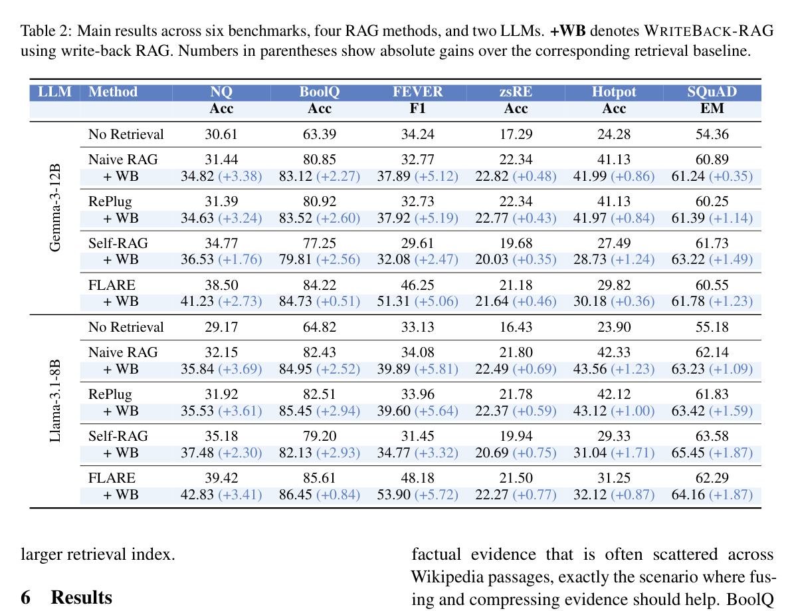
We organize the analysis around five research questions: whether KB training improves downstream accuracy (RQ1), what the write-back corpus looks like in practice (RQ2), where the retained evidence sits in the retrieval ranking (RQ3), whether writeback knowledge transfers across RAG methods (RQ4), and how sensitive the pipeline is to its main hyperparameters (RQ5).

### RQ1: Overall Performance
Table 2 reports results for all 48 settings (4 RAG methods × 6 datasets × 2 LLMs). WRITEBACKRAG shows improvement on every single setting, with an average gain of +2.14% (Prompts and Examples can be found in Appendix G and H). The effect is not driven by any particular backbone or model scale: averaged over datasets and LLMs, Naive RAG gains +2.29%, RePlug +2.40%, SelfRAG +1.90%, and FLARE +1.99%; averaged over methods and datasets, Gemma-3-12B gains +1.92% and Llama-3.1-8B gains +2.36%.
The size of the improvement varies across tasks in a way that aligns with the nature of the knowledge demand. FEVER (+4.79%) and NQ (+3.01%) benefit most, as both require locating specific

### RQ2: Selection and Compression
Table 3 shows the write-back construction process under Gemma-3-12B + Naive RAG (we use Naive RAG as the reference setting throughout the analysis to isolate the effect of write-back from retrieval
6
---
<!-- page 7 mode: hybrid_paper -->
**Table 3: Training-time write-back construction statistics. Selected Rate is the fraction of training examples written back to the KB. Retained Docs is the average number of retained documents after document filtering. Source Tokens and Distilled Tokens denote the average source and distilled token counts for selected examples. Compression is computed as source tokens divided by distilled tokens. Fallback Rate is the fraction of selected examples for which no document passed the document gate and the top-nmin fallback was used.**
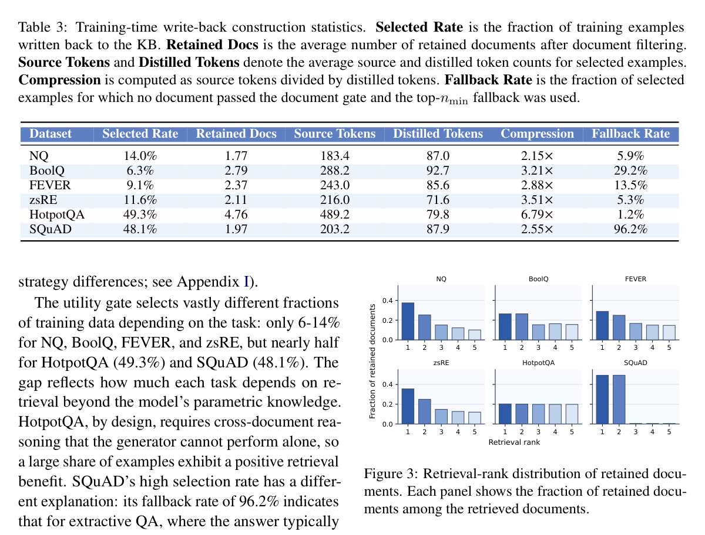
```text
for each dataset, the fraction of retained documents originating from each rank among the top-5 retrieved results. For NQ, BoolQ, FEVER, and zsRE, the distribution is clearly top-heavy: rank-1 and rank-2 documents account for the largest share, with a steady decline toward rank-5. This indicates that the retriever already places useful evidence near the top for these tasks; the document gate’s primary role is to filter out the lower-ranked noise rather than to rescue useful documents from deep in the list.
```
HotpotQA and SQuAD illustrate two different non-standard patterns. HotpotQA is nearly flat across ranks 1 to 5, indicating that useful evidence is distributed broadly across the retrieved set rather than concentrated in the top few documents, which is consistent with its multi-hop nature, answering requires combining facts from multiple passages regardless of their retrieval score. SQuAD is almost entirely concentrated on ranks 1 and 2, which directly reflects its high fallback rate (96.2%, Table 3): the fallback mechanism defaults to the topnmin documents, so the rank profile here illustrates fallback behavior rather than document-gate selectivity.

### RQ3: Evidence Rank Distribution
To further understand how the document gate selects useful evidence, we analyze the retrieval-rank distribution of retained documents. Figure 3 shows,
7
---
<!-- page 8 mode: hybrid_paper -->
The document gate has a larger effect. Light filtering performs best, τdoc=0 yields 34.89% and the default τdoc=0.01 yields 34.82%, but raising the threshold to 0.05 or 0.10 drops accuracy to 33.85 and 33.76, suggesting that aggressive standalone contribution tests discard documents that are individually weak but become useful after fusion, consistent with the evidence patterns observed in RQ2 and RQ3. The fallback size nmin has the strongest effect. A single fallback document (33.19%) is insufficient since one passage rarely provides enough material for a good rewrite. Performance peaks at the default nmin=2 (34.82%) and declines for both smaller and larger bundles, suggesting a trade-off between having enough material for distillation and avoiding the reintroduction of noise. Larger fallback sizes also increase the offline distillation cost, as the distiller must process more source tokens per example, making nmin=2 a practical choice that balances accuracy and efficiency.
**Table 4: Ablation study on the utility gate threshold τs, document gate threshold τdoc, and fallback size nmin. † marks the default configuration in the main experiments.**
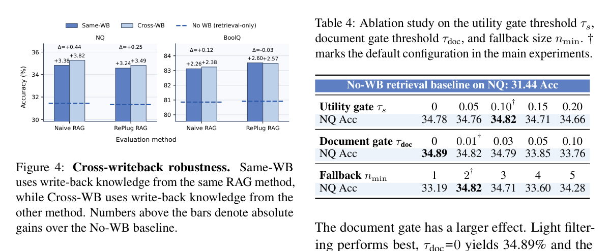

### RQ4: Transfer and Reuse
A key question is whether write-back knowledge is specific to the RAG method that produced it, or whether it behaves as a reusable improvement to the knowledge source itself. Figure 4 addresses this with a cross-writeback experiment between Naive RAG and RePlug. Same-WB evaluates a method using its own write-back corpus; CrossWB evaluates it using the corpus distilled by the other method.
Across all four evaluation settings, both SameWB and Cross-WB outperform the corresponding no-write-back baseline. Same-WB yields gains of +2.26% to +3.38%, while Cross-WB yields +2.38% to +3.82%. The gap between the two never exceeds 0.44% in either direction, and in three of four cases Cross-WB is marginally better. If the distilled documents were encoding artifacts of a specific decoding policy rather than genuine improvements to the knowledge source, performance should degrade noticeably under cross-method reuse. Instead, the write-back corpus produced by one method is essentially interchangeable with that of another, indicating that WRITEBACK-RAG improves the corpus itself rather than fitting to a particular pipeline.

### RQ5: Component Ablations
Table 4 ablates three controls of the write-back pipeline on NQ (Naive RAG baseline: 31.44% Acc). Every write-back configuration outperforms this baseline, with gains ranging from +1.75 to +3.45 points, so the method does not depend on precise hyperparameter tuning.
The utility gate is the least sensitive: varying τs from 0 to 0.20 changes accuracy by only 0.16 points (34.66%-34.82%), indicating that its role is simply to exclude clearly uninformative examples.
7

## Conclusion
We proposed WRITEBACK-RAG, a framework that treats the knowledge base as a trainable component of RAG systems. By observing which training examples benefit from retrieval and which documents contribute, WRITEBACK-RAG distills scattered evidence into compact knowledge units that are indexed alongside the original corpus. The approach modifies only the KB and is therefore compatible with any retriever and generator. Experiments across four RAG methods, six benchmarks, and two LLM backbones show that write-back consistently improves downstream performance, with an average gain of +2.14%. Cross-method transfer experiments confirm that the distilled knowledge is a property of the corpus, not of the pipeline that produced it. These results establish WRITEBACKRAG as a viable method for improving RAG, complementary to advances in retrieval and generation.
8
---
<!-- page 9 mode: hybrid_paper -->

## Limitations
WRITEBACK-RAG has several limitations. It relies on labeled training examples, so its effectiveness in low-label or unsupervised settings remains unclear (though can be replaced by LLM-as-aJudge). The quality of the auxiliary corpus also depends on the quality of the underlying LLM: unsupported abstractions or hallucinated details may be written back and later retrieved. In addition, our experiments are limited to public Wikipedia-based benchmarks, leaving domain transfer, multilingual settings, and continuously updated corpora for future work. Finally, WRITEBACK-RAG introduces a nontrivial offline cost and currently studies only additive write-back, without deletion, deduplication, or contradiction resolution.

## Ethical Consideration
Because WRITEBACK-RAG writes distilled knowledge back into a retrievable corpus, errors or biases in the distillation process may persist and affect future queries. We mitigate direct answer leakage by not exposing the gold answer during distillation, and we store write-back knowledge in a separate index to support inspection and rollback.
However, the method still inherits biases from both the source corpus and the LLM used for distillation. Our experiments use public benchmark releases and a public Wikipedia corpus, but applying the method to proprietary or user-generated data would require additional safeguards for privacy, access control, and sensitive-content filtering. The method also incurs additional offline computation, which should be weighed against its downstream benefits.

## References
Akari Asai, Zeqiu Wu, Yizhong Wang, Avirup Sil, and Hannaneh Hajishirzi. 2023. Self-rag: Learning to retrieve, generate, and critique through self-reflection.
In The Twelfth International Conference on Learning Representations.
Sebastian Borgeaud, Arthur Mensch, Jordan Hoffmann, Trevor Cai, Eliza Rutherford, Katie Millican, George Bm Van Den Driessche, Jean-Baptiste Lespiau, Bogdan Damoc, Aidan Clark, and 1 others.
2022. Improving language models by retrieving from
trillions of tokens. In International conference on machine learning, pages 2206–2240. PMLR.
Christopher Clark, Kenton Lee, Ming-Wei Chang, Tom Kwiatkowski, Michael Collins, and Kristina
Toutanova. 2019. Boolq: Exploring the surprising difficulty of natural yes/no questions. In Proceedings of the 2019 conference of the north American chapter of the association for computational linguistics:
Human language technologies, volume 1 (long and short papers), pages 2924–2936.
Xin Luna Dong, Evgeniy Gabrilovich, Kevin Murphy, Van Dang, Wilko Horn, Camillo Lugaresi, Shaohua Sun, and Wei Zhang. 2015. Knowledge-based trust:
Estimating the trustworthiness of web sources. arXiv preprint arXiv:1502.03519.
Matthijs Douze, Alexandr Guzhva, Chengqi Deng, Jeff Johnson, Gergely Szilvasy, Pierre-Emmanuel Mazaré, Maria Lomeli, Lucas Hosseini, and Hervé Jégou.
2025. The faiss library. IEEE Transactions on Big
Data.
Wenqi Fan, Yujuan Ding, Liangbo Ning, Shijie Wang, Hengyun Li, Dawei Yin, Tat-Seng Chua, and Qing Li. 2024. A survey on rag meeting llms: Towards retrieval-augmented large language models. In Proceedings of the 30th ACM SIGKDD conference on knowledge discovery and data mining, pages 6491– 6501.
Luyu Gao, Xueguang Ma, Jimmy Lin, and Jamie Callan.
2023. Precise zero-shot dense retrieval without rel-
evance labels. In Proceedings of the 61st Annual Meeting of the Association for Computational Linguistics (Volume 1: Long Papers), pages 1762–1777.
Aaron Grattafiori, Abhimanyu Dubey, Abhinav Jauhri, Abhinav Pandey, Abhishek Kadian, Ahmad AlDahle, Aiesha Letman, Akhil Mathur, Alan Schelten, Alex Vaughan, and 1 others. 2024. The llama 3 herd of models. arXiv preprint arXiv:2407.21783.
Kelvin Guu, Kenton Lee, Zora Tung, Panupong Pasupat, and Mingwei Chang. 2020. Retrieval augmented language model pre-training. In International conference on machine learning, pages 3929–3938. PMLR.
Yucheng Hu and Yuxing Lu. 2024.
Rag and rau:
A survey on retrieval-augmented language model in natural language processing.
arXiv preprint arXiv:2404.19543.
Gautier Izacard, Patrick Lewis, Maria Lomeli, Lucas Hosseini, Fabio Petroni, Timo Schick, Jane DwivediYu, Armand Joulin, Sebastian Riedel, and Edouard Grave. 2023. Atlas: Few-shot learning with retrieval augmented language models. Journal of Machine Learning Research, 24(251):1–43.
Huiqiang Jiang, Qianhui Wu, Chin-Yew Lin, Yuqing Yang, and Lili Qiu. 2023a. Llmlingua: Compressing prompts for accelerated inference of large language models. In Proceedings of the 2023 conference on empirical methods in natural language processing, pages 13358–13376.
Zhengbao Jiang, Frank F Xu, Luyu Gao, Zhiqing Sun, Qian Liu, Jane Dwivedi-Yu, Yiming Yang, Jamie Callan, and Graham Neubig. 2023b. Active retrieval
9
---
<!-- page 10 mode: hybrid_paper -->
augmented generation. In Proceedings of the 2023 conference on empirical methods in natural language processing, pages 7969–7992.
Jiajie Jin, Yutao Zhu, Zhicheng Dou, Guanting Dong, Xinyu Yang, Chenghao Zhang, Tong Zhao, Zhao Yang, and Ji-Rong Wen. 2025. Flashrag: A modular toolkit for efficient retrieval-augmented generation research. In Companion Proceedings of the ACM on Web Conference 2025, pages 737–740.
Tom Kwiatkowski, Jennimaria Palomaki, Olivia Redfield, Michael Collins, Ankur Parikh, Chris Alberti, Danielle Epstein, Illia Polosukhin, Jacob Devlin, Kenton Lee, and 1 others. 2019. Natural questions: a benchmark for question answering research. Transactions of the Association for Computational Linguistics, 7:453–466.
Omer Levy, Minjoon Seo, Eunsol Choi, and Luke Zettlemoyer. 2017. Zero-shot relation extraction via reading comprehension. In Proceedings of the 21st Conference on Computational Natural Language Learning (CoNLL 2017), pages 333–342.
Yuxing Lu, Gecheng Fu, Wei Wu, Xukai Zhao, Goi Sin Yee, and Jinzhuo Wang. 2025. Towards doctor-like reasoning: Medical rag fusing knowledge with patient analogy through textual gradients. In The Thirtyninth Annual Conference on Neural Information Processing Systems.
Jose L Martinez-Rodriguez, Ivan López-Arévalo, and Ana B Rios-Alvarado. 2018. Openie-based approach for knowledge graph construction from text. Expert Systems with Applications, 113:339–355.
Kevin Meng, David Bau, Alex Andonian, and Yonatan Belinkov. 2022a. Locating and editing factual associations in gpt. Advances in neural information processing systems, 35:17359–17372.
Kevin Meng, Arnab Sen Sharma, Alex Andonian, Yonatan Belinkov, and David Bau. 2022b. Massediting memory in a transformer.
arXiv preprint arXiv:2210.07229.
Pranav Rajpurkar, Jian Zhang, Konstantin Lopyrev, and Percy Liang. 2016. Squad: 100,000+ questions for machine comprehension of text. In Proceedings of the 2016 conference on empirical methods in natural language processing, pages 2383–2392.
Weijia Shi, Sewon Min, Michihiro Yasunaga, Minjoon Seo, Richard James, Mike Lewis, Luke Zettlemoyer, and Wen-tau Yih. 2024. Replug: Retrievalaugmented black-box language models. In Proceedings of the 2024 Conference of the North American Chapter of the Association for Computational Linguistics: Human Language Technologies (Volume 1:
Long Papers), pages 8371–8384.
Gemma Team, Thomas Mesnard, Cassidy Hardin, Robert Dadashi, Surya Bhupatiraju, Shreya Pathak, Laurent Sifre, Morgane Rivière, Mihir Sanjay Kale, Juliette Love, and 1 others. 2024. Gemma: Open
10
models based on gemini research and technology.
arXiv preprint arXiv:2403.08295.
James Thorne, Andreas Vlachos, Christos Christodoulopoulos, and Arpit Mittal.
2018.
Fever: a large-scale dataset for fact extraction and verification. In Proceedings of the 2018 Conference of the North American Chapter of the Association for Computational Linguistics: Human Language Technologies, Volume 1 (Long Papers), pages 809–819.
Liang Wang, Nan Yang, Xiaolong Huang, Binxing Jiao, Linjun Yang, Daxin Jiang, Rangan Majumder, and Furu Wei. 2022. Text embeddings by weaklysupervised contrastive pre-training. arXiv preprint arXiv:2212.03533.
Xi Wang, Procheta Sen, Ruizhe Li, and Emine Yilmaz.
2025. Adaptive retrieval-augmented generation for
conversational systems. In Findings of the Association for Computational Linguistics: NAACL 2025, pages 491–503.
Zhiruo Wang, Jun Araki, Zhengbao Jiang, Md Rizwan Parvez, and Graham Neubig. 2023. Learning to filter context for retrieval-augmented generation. arXiv preprint arXiv:2311.08377.
Fangyuan Xu, Weijia Shi, and Eunsol Choi. 2023. Recomp: Improving retrieval-augmented lms with context compression and selective augmentation. In The Twelfth International Conference on Learning Representations.
Zhilin Yang, Peng Qi, Saizheng Zhang, Yoshua Bengio, William Cohen, Ruslan Salakhutdinov, and Christopher D Manning. 2018. Hotpotqa: A dataset for diverse, explainable multi-hop question answering.
In Proceedings of the 2018 conference on empirical methods in natural language processing, pages 2369–2380.
Wenhao Yu, Dan Iter, Shuohang Wang, Yichong Xu, Mingxuan Ju, Soumya Sanyal, Chenguang Zhu, Michael Zeng, and Meng Jiang. 2022. Generate rather than retrieve:
Large language models are strong context generators.
arXiv preprint arXiv:2209.10063.
---
<!-- page 11 mode: hybrid_paper -->

## On the Use of ``KB Training''
The implementation of WRITEBACK-RAG is a corpus augmentation and distillation pipeline, not gradient-based optimization over KB parameters.
We adopt the term “training” because the process is supervised (driven by labeled examples), taskinformed (guided by downstream retrieval performance signals), and persistent (the KB is modified once and benefits all future queries). In this sense the KB undergoes a transformation analogous to how model parameters are shaped by training data, even though the mechanism is distillation rather than gradient descent.
More concretely, the analogy rests on three structural parallels. First, training data acts as supervision: just as labeled examples define a loss signal for model parameters, the labeled set Dtrain provides the signal that drives the utility gate and document gate. Second, the process is iterative over data: the pipeline loops over training examples, accumulating write-back knowledge one unit at a time, analogous to how parameter updates accumulate over mini-batches. Third, the result is a persistent artifact: the enriched KB K′ is produced once and reused for all future inference, just as trained model weights are. We acknowledge that no gradient computation is involved, and the term “training” is used in this broader, process-level sense rather than in the narrow sense of stochastic optimization.

## WriteBack-RAG Prevents Answer Leakage
Although the distiller never receives the gold answer ai, the utility gate selects examples where retrieval produces a correct answer, and the document gate retains documents that contributed to that answer. The distiller therefore receives an evidence bundle implicitly conditioned on correctness, raising the question of whether the method simply smuggles answers into the corpus. We argue that it does not. The selected documents D∗ i are passages already present in the original KB—the distiller has no access to information beyond what the retriever already surfaces, and its prompt instructs it to produce a general-purpose encyclopedic passage rather than to answer the question (Appendix G).
Any answer-relevant content in a write-back document was already retrievable from the original corpus; the distiller merely reorganizes it into a more compact and retrieval-friendly format.
More fundamentally, the improvement must gen-
11
eralize to unseen queries to affect test-time performance, because write-back documents compete with the entire original corpus and are ranked solely by embedding similarity to the test query. A document narrowly tailored to a single training question would not rank highly for semantically different test queries and would simply be ignored by the retriever. The cross-writeback experiment (RQ4, Figure 4) provides direct evidence of this generalization: write-back corpora produced by one RAG method transfer to another with negligible performance difference, ruling out pipeline-specific artifacts or memorized answer patterns. Together with the consistent gains across all 48 settings in Table 2, these results indicate that the benefit stems from improved knowledge organization rather than indirect answer leakage.

## WriteBack-RAG as a General Method for RAG
A natural question is why WRITEBACK-RAG can improve RAG methods with very different retrieval and generation strategies without any methodspecific modification.
The four RAG backbones we evaluate differ substantially in how they use retrieved documents.
Naive RAG concatenates the top-K passages into a single prompt. RePlug ensembles generation probabilities across documents, weighting each passage by its retrieval score. Self-RAG introduces reflection tokens that let the generator decide, per step, whether to retrieve and which passages to trust.
FLARE monitors generation confidence token-bytoken and triggers retrieval only when uncertainty exceeds a threshold. Despite these differences, all four methods share a common dependency: the quality of the documents present in the retrieval index. A document that is more focused, less noisy, and better aligned with the knowledge a query requires will be ranked higher by the retriever and will be more useful to the generator, regardless of how the generator consumes it.
WRITEBACK-RAG operates entirely at this shared layer. It does not modify the retrieval algorithm, the generation prompt, or the decoding strategy. It adds distilled documents to the index, and the existing retriever decides whether to surface them. If a write-back document is more relevant than the original passages it was derived from, it will naturally rise in the ranking; if not, it will be ignored (Figure 1). This means the method can-
---
<!-- page 12 mode: hybrid_paper -->
**Table 5: Detailed dataset statistics used in our experiments, following the FlashRAG benchmark release (Jin et al., 2025). All datasets use the FlashRAG-provided Wikipedia corpus (wiki18_100w) as external knowledge.**

**Table 6: Full hyperparameter settings used in the main experiments.**
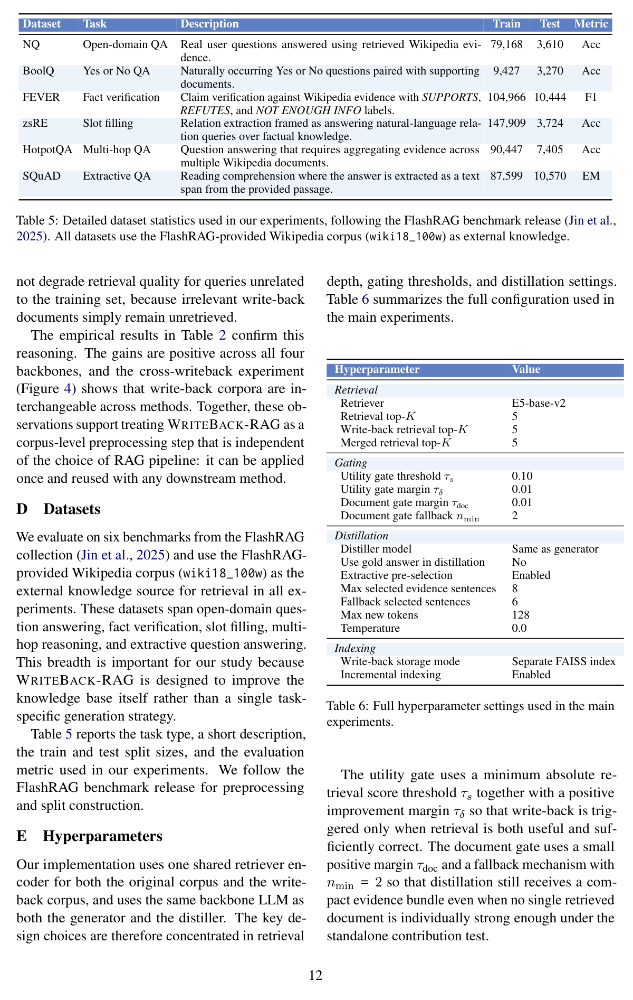

## Datasets

## Hyperparameters
---
<!-- page 13 mode: hybrid_paper -->
NQ
BoolQ
FEVER
300
200
Distilled knowledge tokens
100
0
zsRE
HotpotQA
SQuAD
300
200
100
0
0 100 200 300
0 100 200 300
0 100 200 300
Source evidence tokens
Figure 5: Source evidence length versus distilled writeback knowledge length for six benchmarks.

## Knowledge Distillation Analysis

## Prompt Templates
{reference}
HotpotQA task prompt
Answer the multi-hop question using the provided evidence. Output only the final answer. If the question is yes or no, output exactly yes or no in lowercase.
Otherwise output only the shortest answer phrase.
The following are given documents.
{reference}
Representative no-retrieval task prompt
Answer the factoid question from your own knowledge. Output only the short final answer phrase or entity name. Do not output a sentence or explanation.
The next two prompts correspond to the writeback stage. The first extracts answer-relevant evidence sentences from retrieved passages, and the second rewrites the selected evidence into a compact retrieval-oriented document that is later indexed into the auxiliary write-back corpus. Because the distilled document must remain reusable for future queries, the rewrite stage is conditioned on the question and supporting evidence only and does not expose the gold answer.
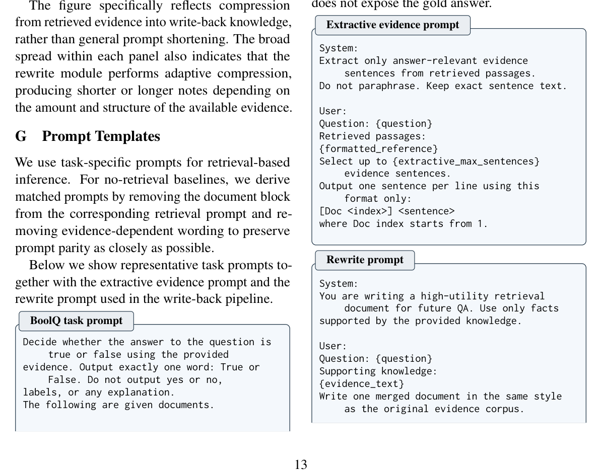
---
<!-- page 14 mode: hybrid_paper -->
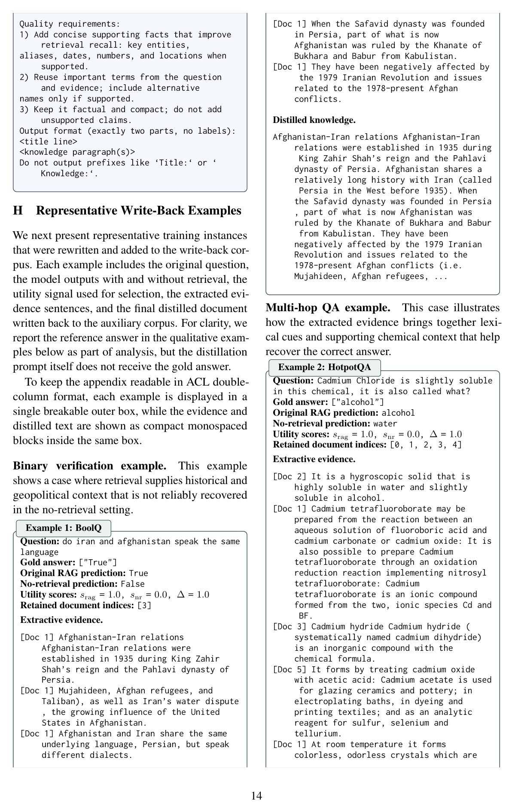

## Representative Write-Back Examples
---
<!-- page 15 mode: hybrid_paper -->
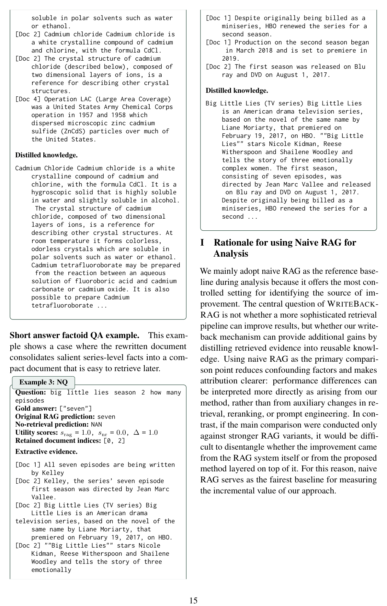

## Rationale for using Naive RAG for Analysis
---
