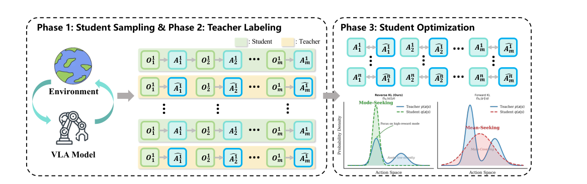
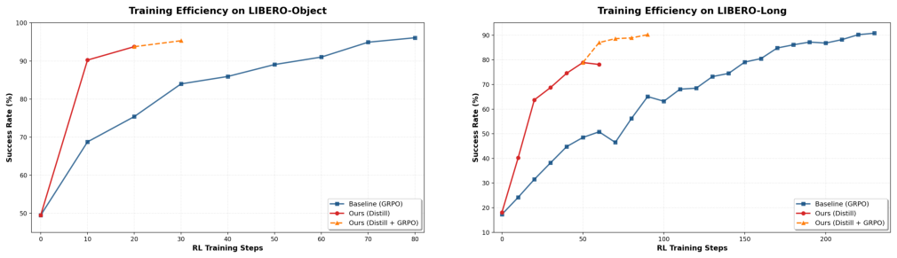
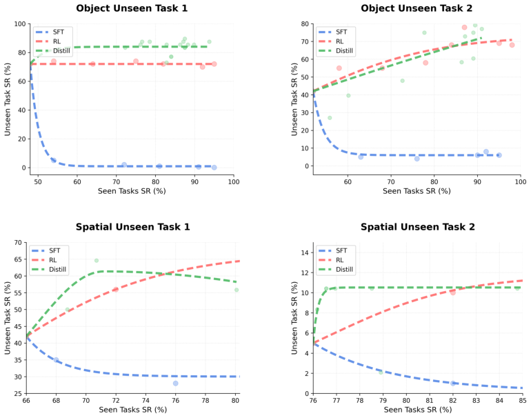
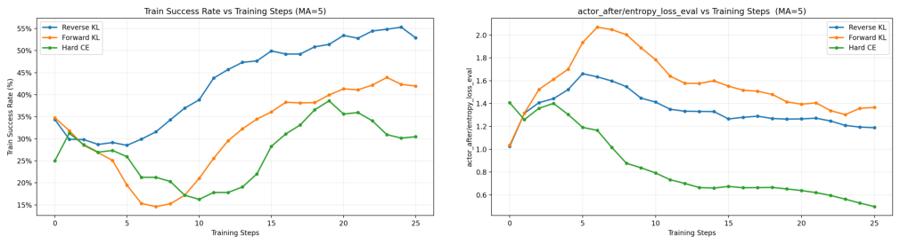
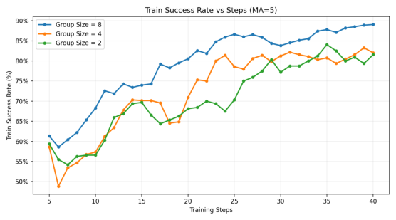

# VLA-OPD: Bridging Offline SFT and Online RL for Vision-Language-Action Models via On-Policy Distillation

<!-- document_mode: hybrid_paper -->

<!-- page 1 mode: simple_text -->

Zhide Zhong 1, Haodong Yan 1, Junfeng Li 1, Junjie He 1, Tianran Zhang 1, and Haoang Li 1

1 HKUST (GZ)

Although pre-trained Vision-Language-Action (VLA) models exhibit impressive generalization in robotic manipulation, post-training remains crucial to ensure reliable performance during deployment. However, standard offline Supervised Fine-Tuning (SFT) suffers from distribution shifts and catastrophic forgetting of pre-trained capabilities, while online Reinforcement Learning (RL) struggles with sparse rewards and poor sample efficiency. In this paper, we propose On-Policy VLA Distillation (VLA-OPD), a framework bridging the efficiency of SFT with the robustness of RL. Instead of relying on sparse environmental rewards, VLA- OPD leverages an expert teacher to provide dense, token-level supervision on the student’s self-generated trajectories. This enables active error correction on policy-induced states while preserving pre-trained general capabilities through gentle alignment. Crucially, we formulate VLA-OPD via a Reverse-KL objective. Unlike standard Forward-KL that induces mode-covering entropy explosion, or Hard-CE that causes premature entropy collapse, our bounded mode-seeking objective ensures stable policy learning by filtering out the teacher’s epistemic uncertainty while maintaining action diversity. Experiments on LIBERO and RoboTwin2.0 benchmarks demonstrate that VLA-OPD significantly improves sample efficiency over RL and robustness over SFT, while effectively mitigating catastrophic forgetting during post-training.

Project Page: https: // irpn-lab. github. io/ VLA-OPD/

## Introduction

The integration of Large Language Models (LLMs) with visual perception has catalyzed a paradigm shift in embodied intelligence, giving rise to generalist Vision-Language-Action (VLA) models Kim et al. (2024), Zitkovich et al. (2023), Bai et al. (2025), Intelligence et al. (2025a,b), NVIDIA et al. (2025). By unifying perception, planning, and control into a single transformer architecture, pre-trained VLAs exhibit remarkable generalization across diverse environments and instructions. However, despite their broad capabilities, directly deploying pre-trained foundation models often struggles with precise execution in specific downstream tasks. Consequently, to translate this generalist knowledge into reliable, deployable robotic policies, post-training has emerged as an essential step in adapting VLA models.

Currently, the landscape of VLA post-training is dominated by two primary paradigms: offline Supervised Fine-Tuning (SFT) and online Reinforcement Learning (RL). SFT, typically implemented as behavior cloning, maximizes the likelihood of expert actions given static observation histories O’Neill et al. (2024), Black et al.

(2024). With dense supervision at every token, SFT is optimization-stable and fast to converge; however, it inherently demands large-scale, high-quality expert demonstrations to cover diverse scene distributions. To reduce this reliance on static datasets, recent efforts have explored online RL for VLA post-training Li et al. (2025a), Zang et al. (2025), Lu et al. (2025), Liu et al. (2025), Xu et al. (2025), Xiao et al. (2025). By allowing the model to interact with the environment and optimizing for task success, RL exposes the policy

---

<!-- page 2 mode: simple_text -->

Table 1: Comparison of VLA training paradigms. VLA-OPD combines the best of both worlds: it inherits the
Few-Demo capability of RL (learning from limited expert trajectories) while maintaining the Fast Convergence of
SFT (via dense supervision).

to its own induced state distribution, aiming to improve closed-loop robustness through active exploration
and error correction.

Despite their respective strengths, both paradigms suffer from critical limitations. SFT is fundamentally constrained by its “off-policy” nature; it is highly vulnerable to distribution shifts and often suffers from catastrophic forgetting due to aggressive parameter updates on static, disjoint datasets Zhu et al. (2025), Lai et al. (2025), Chu et al. (2025), Shenfeld et al. (2025). Conversely, online RL addresses distribution shifts via environment interaction but relies on sparse rewards, resulting in prohibitive sample inefficiency and high-variance optimization Li et al. (2025a). Furthermore, simply adapting SFT to an on-policy setting (e.g., DAGGER Kelly et al. (2019)) typically relies on suboptimal alignment objectives. Using a Forward-KL divergence forces a mode-covering behavior that mimics the teacher’s epistemic uncertainty, leading to an entropy explosion. Conversely, employing Hard-CE (argmax matching) causes premature entropy collapse, depriving the student of the action diversity needed for effective state-space exploration.

To bridge this gap, we introduce On-Policy VLA Distillation (VLA-OPD), a unified framework that synthesizes the efficiency of SFT with the robustness of RL (summarized in Table 1). VLA-OPD leverages an expert teacher to provide dense, token-level supervision on the student’s self-generated trajectories, intrinsically enabling active error recovery without sparse rewards. Crucially, we formulate VLA-OPD using a Reverse- KL objective to overcome the aforementioned optimization flaws. By promoting bounded mode-seeking behavior, Reverse-KL allows the student to confidently capture the teacher’s primary intent while retaining sufficient stochasticity to sample diverse, valid actions. This elegantly prevents both the entropy explosion of Forward-KL and the collapse of Hard-CE, ensuring highly stable updates that preserve pre-trained generalist capabilities and gracefully mitigate catastrophic forgetting.

Furthermore, this distillation paradigm fundamentally decouples the computationally prohibitive process of RL exploration from the student’s policy optimization. While relying on an expert teacher assumes its prior availability, high-performing experts are increasingly accessible through open-source checkpoints, proprietary APIs, or easily trained single-task policies. VLA-OPD capitalizes on these existing resources by providing a highly sample-efficient distillation pipeline. This enables the seamless transfer of robust behaviors from diverse teachers into new, upgraded, or unified generalist student backbones. Consequently, our framework establishes a scalable pathway for continuous foundation model development, effectively circumventing the severe costs and instabilities associated with training VLA policies from scratch via online RL.

Our main contributions are summarized as follows:

• We propose VLA-OPD, a unified post-training framework that bridges SFT and RL. By leveraging dense, token-level supervision on self-generated trajectories, it effectively resolves the exposure bias of SFT and the sample inefficiency of sparse-reward RL.

• We formulate a Reverse-KL distillation objective for VLA models. We demonstrate that its bounded

---

<!-- page 3 mode: hybrid_paper -->

mode-seeking property effectively filters out the teacher’s epistemic uncertainty while maintaining action diversity, elegantly preventing both the entropy explosion of Forward-KL and the premature entropy collapse of Hard-CE.

• We provide a principled approach to mitigate catastrophic forgetting. By ensuring gradient updates remain grounded in the student’s active policy manifold, VLA-OPD achieves a “gentle” alignment that preserves pre-trained generalist capabilities.

• Extensive evaluations across LIBERO and RoboTwin2.0 benchmarks demonstrate that VLA-OPD achieves superior robustness and success rates compared to SFT, while requiring substantially fewer training steps than on-policy RL baselines.

## Preliminaries

In this section, we formalize the VLA training problem and briefly review the two dominant paradigms: Supervised Fine-Tuning (SFT) and Online Reinforcement Learning (RL).

### Problem Formulation

We formulate the robotic manipulation task as a Markov Decision Process (MDP) defined by the tuple (S, A, T , r, γ). At each timestep t, the VLA agent observes a state s t ∈S (comprising visual observations and language instructions) and predicts an action a t ∈A. The goal is to learn a policy π θ(a t|s t) that maximizes the success rate of the task.

### Supervised Fine-Tuning (SFT)

> Equation 1 JSON: `p119_assets/equations/equation_0001.json`
> Equation 1 image: `p119_assets/equations/equation_0001.png`

While SFT provides dense supervision, it is off-policy: the policy is trained on expert states but evaluated on student-induced states. This discrepancy leads to the distribution shift problem discussed in Sec. 1.

### Online RL with Sparse Outcome Rewards

To address the limitations of SFT, researchers have increasingly turned to Online Reinforcement Learning. Drawing inspiration from its immense success in enhancing the reasoning capabilities of Large Language Models (LLMs) Guo et al. (2025), Group Relative Policy Optimization (GRPO) has recently emerged as the promising approach for VLA post-training Li et al. (2025a), Zang et al. (2025).

The widespread adoption of GRPO in the VLA domain stems from its architectural efficiency. By computing advantages via group-based relative normalization, GRPO eliminates the need for a separate value network (Critic). This significantly reduces memory overhead, making it uniquely suitable for fine-tuning large-scale vision-language backbones where maintaining a Critic is prohibitively expensive.

π θ old(τ i), 1 − ϵ, 1 + ϵ
)︂
ˆ
A i

---

<!-- page 4 mode: hybrid_paper -->

_Figure 1: Overview of VLA-OPD. Our framework unifies offline SFT and online RL through three phases. Phase 1 (Student Sampling): The student VLA policy interacts with the environment to collect on-policy trajectory rollouts (O →A →O). Phase 2 (Teacher Labeling): For each state visited by the student, a frozen expert teacher provides dense, token-level action labels ( ̂︀ A) without executing them in the environment. Phase 3 (Student Optimization): The student is opti_

However, despite its provenance from LLMs and architectural efficiency, applying GRPO to robotics introduces a unique challenge: feedback sparsity. Unlike reasoning tasks where intermediate steps might have clearer structure, robotics tasks often provide a binary signal only upon completion. This lack of granular supervision leads to high variance in optimization and severe sample inefficiency, necessitating prohibitively large amounts of interaction data to learn effective manipulation policies.

## Methodology

In this section, we present VLA-OPD, a unified post-training framework designed to align Vision-Language- Action models efficiently and robustly. Our approach is motivated by the observation that standard SFT lacks the ability to recover from self-induced compounding errors, while on-policy RL suffers from feedback sparsity. To address these limitations simultaneously, VLA-OPD reformulates the alignment process as dense supervision on self-generated trajectories.

We begin with a high-level overview of the framework (Sec. 3.1). We then detail the on-policy sampling mechanism that addresses distribution shift (Sec. 3.2) and the teacher-guided dense supervision strategy that ensures sample efficiency (Sec. 3.3). Finally, we analyze our Reverse-KL optimization objective and its inherent mode-seeking properties (Sec. 3.4).

### Framework Overview

As illustrated in Figure 1 and detailed in Algorithm 1, VLA-OPD operates as an iterative, closed-loop process involving two distinct policy roles. The Teacher Policy (π tea) is a robust expert model (e.g., trained via RL)

---

<!-- page 5 mode: simple_text -->

that remains frozen during distillation. It acts as a reference oracle, providing dense supervision signals that enable the student to learn optimal recovery behaviors even in states not covered by the original expert demonstrations. The Student Policy (π θ) is the target VLA model being trained, typically initialized from a base checkpoint (e.g., via offline SFT). By interacting with the environment on-policy, the student collects trajectories and is continuously updated to align with the teacher’s robust distribution.

The goal of VLA-OPD is to efficiently transfer the robustness of π tea to the brittle π θ. As depicted in Figure 1, the training cycle consists of three phases:

• Phase 1: On-Policy Sampling (Exploration). The student π θ generates trajectories T student in the environment. Since the student is trained on limited data, it frequently encounters out-of-distribution states. This explicitly triggers the distribution shift, exposing the model to the boundaries of its capabilities.

• Phase 2: Dense Teacher Labeling (Correction). Instead of waiting for sparse outcome rewards, we query the frozen teacher π tea. For every state s t visited by the student, the teacher provides its action logits. This acts as a dense guiding signal, effectively injecting an optimal recovery prior to correct the student’s deviations in unfamiliar states.

• Phase 3: Mode-Seeking Optimization (Update). The student is updated via on-policy policy-gradient using the token-level Reverse-KL reward, which is equivalent to minimizing the divergence from the teacher on student-visited states.

---

<!-- page 6 mode: hybrid_paper -->

### On-Policy Trajectory Sampling

A fundamental limitation of the SFT initialization is the distribution shift problem. Since the student model is trained on a highly restricted set of expert states D expert, it lacks knowledge of how to behave in states outside this narrow manifold. During evaluation, minor execution errors accumulate, driving the agent into unfamiliar states where its policy is undefined, leading to catastrophic failure.

To address this, VLA-OPD discards the static offline dataset after initialization and switches to dynamic on-policy sampling. At each training iteration k, we collect a batch of trajectories D k by executing the current student policy π θ k in the environment:

Crucially, the states s t in D k are drawn from the student’s induced distribution d π θ k, rather than the expert distribution. For a brittle 1-traj student, this sampling process is primarily driven by the need for active correction. Because the student frequently deviates from the expert’s path, VLA-OPD explicitly captures these “failure states” (s err) in D k. By subsequently training on these samples (as detailed in Sec. 3.3), we effectively convert the “unknown” out-of-distribution regions into “known” training data, transforming the alignment problem from passive imitation to active correction.

Beyond robust correction, this on-policy formulation provides a principled mechanism for mitigating catastrophic forgetting. Standard SFT is inherently off-policy, forcing the model to fit a fixed, disjoint target distribution, which necessitates aggressive parameter shifts that overwrite pre-trained generalist knowledge. In contrast, VLA-OPD ensures that gradient updates remain anchored to the student’s current behavioral manifold. By distilling knowledge strictly on trajectories the student naturally visits, our approach achieves a “gentle” alignment that effectively preserves the backbone’s pre-trained capabilities.

### Dense Teacher Supervision

Instead of relying on sparse outcome rewards that suffer from severe credit assignment issues, VLA-OPD leverages the robust teacher π tea to provide dense, token-level supervision. For every timestep t in a student-generated trajectory τ ∈D k, we query the teacher to obtain the target action distribution:

> Equation 4 JSON: `p119_assets/equations/equation_0006.json`
> Equation 4 image: `p119_assets/equations/equation_0006.png`

This dense signal offers two critical advantages. First, it converts the delayed RL problem into an immediate supervised signal, drastically accelerating convergence. Second, by labeling the student’s on-policy states, including out-of-distribution deviations, the teacher imparts structural knowledge Hinton et al. (2014) on optimal recovery behaviors. However, standard distillation across the entire distribution can be detrimental when the teacher is uncertain. To selectively leverage this knowledge while filtering out high-entropy noise, we introduce a mode-seeking objective, which we discuss in detail in Section 3.4.

### Optimization Objective and Analysis

To align the student policy π θ with the robust teacher π tea, VLA-OPD employs an optimization strategy grounded in minimizing the Reverse Kullback-Leibler (KL) divergence.

Reverse-KL as Dense Reward. Our goal is to minimize the divergence between the student and teacher distributions on student-generated trajectories. To formulate this as a reinforcement learning problem, we

---

<!-- page 7 mode: hybrid_paper -->

define the objective as maximizing the negative Reverse-KL divergence:

> Equation 5 JSON: `p119_assets/equations/equation_0007.json`
> Equation 5 image: `p119_assets/equations/equation_0007.png`

At the token level, this translates to an intrinsic reward r OPD t defined as the negative log-ratio of the probabilities:

> Equation 6 JSON: `p119_assets/equations/equation_0008.json`
> Equation 6 image: `p119_assets/equations/equation_0008.png`

π tea(a t|s t). (6)

Intuitively, this reward acts as a penalty: the student receives a higher reward (closer to 0) when its action distribution matches the teacher’s, and a large negative penalty when it deviates significantly. Crucially, when computing the policy gradient update, we apply a stop_gradient operation to the student’s log-probability term log π θ(a t|s t) within the reward calculation.

Theoretical Analysis: Mode-Seeking vs. Mode-Covering. The choice of divergence direction fundamentally alters the optimization dynamics, particularly in OOD states where the teacher may exhibit high epistemic uncertainty (i.e., flat, high-entropy distributions).

• Forward KL (Teacher-Forced): Standard SFT minimizes D KL(π tea ∥ π θ). Its gradient is estimated over teacher samples (E a∼π tea), effectively forcing the student to cover the teacher’s entire support (mode-covering). In OOD states, this compels the student to mimic the teacher’s hesitation and high entropy, leading to the entropy explosion phenomenon.

• Hard-CE (Argmax Matching): A common alternative in on-policy settings (e.g., standard DAgger) is minimizing Cross-Entropy against the teacher’s top-1 action. Mathematically, this discards the teacher’s soft probabilities ("dark knowledge"). When the teacher’s argmax oscillates at multi-modal decision boundaries, Hard-CE forces the student to violently track these rigid targets, causing premature entropy collapse and depriving the student of the action diversity necessary for robust exploration.

• Reverse-KL (Bounded Mode-Seeking): In contrast, VLA-OPD minimizes D KL(π θ ∥ π tea). Due to the zero-forcing property of Reverse-KL, as long as the student’s chosen action falls within the teacher’s acceptable probability mass, it is not penalized for ignoring other potential actions. This induces a mode-seeking behavior that elegantly avoids both extremes: it filters out the teacher’s tail uncertainty (preventing entropy explosion) while retaining sufficient stochasticity within the valid modes (preventing premature entropy collapse).

We validate these distinct optimization dynamics in our ablation studies (Section 4.4). As vividly demonstrated in Figure 4, Forward-KL indeed suffers from severe entropy explosion, Hard-CE experiences premature entropy collapse leading to sub-optimal plateaus, whereas our Reverse-KL maintains a healthy, bounded entropy that translates to the highest and most stable task success rate.

Unlike standard GRPO which computes advantages via outcome reward normalization, our method uses the raw Reverse-KL reward directly as the advantage signal, ensuring consistent convergence toward the teacher’s optimal mode.

---

<!-- page 8 mode: simple_text -->

## Experiments

Our experimental design addresses several fundamental research questions regarding the efficiency, efficacy, and stability of On-Policy Distillation (OPD) for robotic manipulation:

1. Training Efficiency: Does dense teacher supervision enable significantly faster convergence compared
to standard online reinforcement learning (e.g., GRPO), which relies on sparse reward exploration?

2. Policy Efficacy: To what extent can VLA-OPD recover robust performance from a sub-optimal base
policy, whether constrained by extreme data scarcity (e.g., 1-traj SFT) or morphological complexity
(e.g., dual-arm coordination), and bridge the gap to an expert teacher?

3. Catastrophic Forgetting: Does on-policy distillation better preserve pre-trained generalist capabilities
than offline SFT, while improving performance on the target tasks?

4. Ablation and Design Choices: How do the core algorithmic components of VLA-OPD—such as the
alignment objective—contribute to the overall stability and success rate of the policy?

### Experimental Setup

Benchmarks and Protocols. We evaluate across two distinct domains to test data-scarce generalization and complex coordination. (1) LIBERO Liu et al. (2023): We utilize four suites (Spatial, Object, Goal, Long) for single-arm manipulation. To evaluate under extreme data scarcity, student models are initialized via 1-traj SFT (one demo per task). (2) RoboTwin2.0 Chen et al. (2025a): We select four representative tasks requiring complex dual-arm coordination. Given its inherent difficulty, students are initialized via 1,000-traj SFT per task; the sub-optimal base policy provides an ideal testbed for our distillation framework.

Teacher and Baselines. We employ SimpleVLA-RL Li et al. (2025a) as our teacher π tea (Performance Oracle). We compare against: (1) Student Init. (Lower Bound): The base OpenVLA-OFT Kim et al. (2025) models before distillation (1-traj and 1,000-traj SFT for LIBERO and RoboTwin2.0, respectively). (2) Online RL: GRPO with sparse rewards. (3) Offline SFT: Models fine-tuned on full expert datasets.

### Main Results: Efficiency and Efficacy

> Equation 2 JSON: `p119_assets/equations/equation_0011.json`
> Equation 2 image: `p119_assets/equations/equation_0011.png`

We compare our method against the baseline GRPO. To ensure a fair comparison, following SimpleVLA-RL Li et al. (2025a), we set the batch size to 64 and the group size to G = 8 across main experiments. Our approach is evaluated in two settings: (1) Ours (Distill), which uses only the distillation process, and (2) Ours (Distill + GRPO), which further fine-tunes the distilled model using GRPO.

As shown in Figure 2, our method demonstrates significant advantages in both data efficiency and stability:

• Rapid Convergence: On LIBERO-Object (Figure 2a), our distillation method achieves over 90% success rate within just 10 steps, exhibiting a “vertical” takeoff compared to the gradual climb of the baseline. Similarly, on LIBERO-Long (Figure 2b), we reach comparable performance to the baseline’s 150-step result in only 50 steps.

• Breaking Performance Ceilings: While distillation alone provides a strong “warm start”, the combination with GRPO (dashed orange line) further pushes the performance boundaries, achieving state-of-the-art results (over 95% on Object and 90% on Long).

• Stability: Unlike the baseline GRPO, which suffers from severe fluctuations (zig-zag patterns) particularly visible in the LIBERO-Long task, our training curves are remarkably smooth, indicating a more robust and stable optimization process.

---

<!-- page 9 mode: hybrid_paper -->

_Figure 2: Training Efficiency Comparison. We compare our method with the baseline GRPO across two benchmarks. The red line (Ours (Distill)) demonstrates superior sample efficiency in the early stages, achieving high success rates with significantly fewer steps. The dashed orange line (Ours (Distill + GRPO)) shows that further RL fine-tuning breaks the performance bottleneck, surpassing the baseline’s final convergence. Notably, on LIBERO-Long (b), our method achieve_

Full-Dataset Methods (50-traj) Octo Team et al. (2024) 78.9 85.7 84.6 51.1 75.1 OpenVLA Kim et al. (2024) 84.7 88.4 79.2 53.7 76.5 Nora Hung et al. (2025) 92.2 95.4 89.4 74.6 87.9 π 0 + FAST Pertsch et al. (2025) 96.4 96.8 88.6 60.2 85.5

Data-Scarce Methods (1-traj) OpenVLA-OFT Kim et al. (2025) (Student Init.) 63.6 54.9 59.6 17.3 48.9

> Table JSON: `p119_assets/tables/table_0001.json`
> Table 2: Main Results: Policy Efficacy on LIBERO. We report the success rate (%). We compare VLA-OPD (trained on 1-traj) against two groups of baselines: (1) Full-Dataset Methods: Models trained on the complete expert dataset (50 demos/task), representing the data-abundant upper bound. (2) Data-Scarce Methods: Models trained on the same 1-traj split. VLA-OPD achieves performance comparable to Full-Dataset methods, significantly outperforming other data-scarce approaches.

Beyond training efficiency, we evaluate the final policy efficacy across four LIBERO task suites. As shown in Table 2, VLA-OPD achieves striking performance improvements under the data-scarce (1-traj) setting. While the student initialization (OpenVLA-OFT) struggles with an average success rate of only 48.9%, our pure distillation variant (Ours (Distill)) boosts the performance to 87.4%, effectively matching or surpassing several full-dataset (50-traj) baselines like Octo Team et al. (2024) and OpenVLA Kim et al.

(2024). Furthermore, by seamlessly integrating the distillation warm-start with subsequent RL fine-tuning (Ours (Distill + GRPO)), the student policy reaches an impressive 93.4% average success rate. This nearly recovers the performance of the expert teacher (93.9%) while bypassing the prohibitive exploration costs of training a VLA from scratch.

Extension to Dual-Arm Manipulation (RoboTwin2.0). To verify that VLA-OPD is not limited to single-arm

---

<!-- page 10 mode: hybrid_paper -->

> Table JSON: `p119_assets/tables/table_0002.json`
> Table 3: Evaluation on Selected RoboTwin2.0 Tasks. Following the setting in Li et al. (2025a), models are initialized with full-dataset SFT (1000 demos/task). We report success rates (%) on four representative tasks with varying horizon lengths. VLA-OPD consistently improves over the SFT initialization, especially in long-horizon tasks.

### Mitigating Catastrophic Forgetting via On-Policy Alignment

We analyze catastrophic forgetting via a seen–unseen trade-off (Figure 3), fine-tuning on target (seen) tasks and evaluating on four held-out unseen tasks (two Object, two Spatial). The ideal upper-right region indicates strong target mastery alongside preserved general capabilities.

Consistently, offline SFT exhibits severe forgetting: as seen-task success improves, unseen performance collapses—approaching zero for Object tasks and dropping substantially for Spatial tasks—confirming that optimizing solely on offline trajectories quickly erodes pre-trained skills due to distribution shifts. Conversely, methods leveraging on-policy data (RL and VLA-OPD) largely avoid this collapse. VLA-OPD matches or exceeds RL across multiple axes, achieving strong preservation on Object Task 1, remaining competitive on Object Task 2, and providing comparable retention on Spatial tasks.

This simultaneous mastery without degradation demonstrates VLA-OPD’s suitability for continual learning. By safeguarding pre-trained knowledge via on-policy supervision, it offers a sustainable paradigm for lifelong robot learning without requiring the heavy replay buffers typically needed in offline adaptation. Ultimately, on-policy data keeps the model within a safer distributional neighborhood, effectively mitigating the catastrophic forgetting inherent to offline SFT.

### Ablation Studies

To validate the architectural design of VLA-OPD, we conduct ablation studies focusing on two critical components: the choice of alignment objective (Reverse-KL vs. Forward-KL vs. Hard-CE) and the impact of group sampling size. All ablation experiments are conducted with a fixed batch size of 32.

1. Alignment Objective: Reverse KL vs. Forward KL vs. Hard CE. To verify the optimal alignment objective
for our framework, we conduct a comparative experiment against standard Forward KL and Hard CE (e.g.,

---

<!-- page 11 mode: hybrid_paper -->

_Figure 3: Seen–Unseen Trade-off for Forgetting Analysis. Each point corresponds to a checkpoint during fine-tuning. The x-axis is the success rate on seen (target) tasks, and the y-axis is the success rate on a held-out unseen task. Offline SFT exhibits a strong collapse on unseen tasks as seen-task performance increases, while on-policy methods (RL and our distillation) better preserve unseen-task capability._

standard DAgger). As shown in Figure 4a, while Reverse KL leads to a steady and robust improvement in task success rate, the alternatives struggle significantly. Forward KL suffers from a severe “performance valley” where the success rate drops by more than 50% during early stages. Meanwhile, Hard CE fails to recover effectively, ultimately plateauing at the lowest success rate.

These performance disparities are intrinsically linked to the optimization dynamics in Out-Of-Distribution (OOD) states, which are vividly reflected in the actor’s entropy (Figure 4b). During early training, the on-policy student frequently visits OOD states where the teacher exhibits high epistemic uncertainty. The mode-covering nature of Forward KL forces the student to mimic this uncertainty, resulting in an entropy explosion (orange curve) where the policy becomes overly diffused and loses precision. Conversely, Hard CE discards the teacher’s soft probabilities entirely, forcing the student to rigidly track argmax targets. This causes a premature entropy collapse (green curve), depriving the student of the action diversity necessary for effective state-space exploration and trapping it in local optima. In contrast, the bounded mode-seeking property of Reverse KL elegantly avoids both extremes. By filtering out the teacher’s uncertain long tails while retaining sufficient stochasticity within the primary modes, Reverse KL maintains a healthy, stable entropy (blue curve). This ensures the agent remains decisive yet capable of exploration, translating to the highest and most stable task success rate.

2. Impact of Group Sampling Size (G). We investigate the impact of the group-based sampling mechanism

---

<!-- page 12 mode: hybrid_paper -->

_Figure 4: Ablation study comparing Reverse KL, Forward KL, and Hard CE in an on-policy distillation setting, evaluated on the RoboTwin2.0 Beat Block Hammer task. (a) Forward KL suffers a severe early performance drop, and Hard CE plateaus at a suboptimal level, whereas Reverse KL shows steady and superior improvement. (b) These performance differences correlate directly with entropy extremes: Forward KL induces entropy explosion (mode-covering), while Hard CE causes_

_Figure 5: Ablation on Group Sampling Size (G). Training success rates demonstrate that while a larger group size (G = 8) yields the smoothest optimization and highest final performance, smaller group sizes (G = 2, 4) also achieve competitive success rates (over 80%) without performance collapse. This highlights a highly favorable trade-off between task performance and computational efficiency._

---

<!-- page 13 mode: simple_text -->

## Related Work

### Offline SFT for Vision-Language-Action Models

Recent advancements in robotic manipulation have been largely driven by VLA models Zitkovich et al. (2023), Kim et al. (2024), Black et al. (2024), Liu et al. (2024), O’Neill et al. (2024), Song et al. (2025), which are typically fine-tuned via offline SFT. While SFT benefits from dense supervision and fast convergence, it inherently suffers from covariate shift and compounding errors during online deployment. To mitigate this, interactive imitation learning algorithms like DAgger Kelly et al. (2019) collect expert annotations on student-induced out-of-distribution (OOD) states. However, adapting SFT to such on-policy settings typically relies on suboptimal alignment objectives. Standard DAgger uses hard expert labels (Hard-CE), which forces the student to rigidly track argmax targets, often leading to premature entropy collapse and poor exploration. Conversely, utilizing soft expert distributions implicitly optimizes the Forward-KL divergence. When the teacher exhibits high epistemic uncertainty in OOD states, Forward-KL forces the student to average across all modes, inevitably leading to entropy explosion and hesitant behaviors.

### Online RL for Vision-Language-Action Models

To address the distribution shift inherent in offline SFT, Online RL has been introduced to align models with policy-induced state distributions Li et al. (2025a), Zang et al. (2025), Lu et al. (2025), Tan et al. (2025), Chen et al. (2025b), Li et al. (2025b), Xu et al. (2025). By continuously interacting with the environment, online RL exposes the policy to its own execution trajectories, naturally allowing the model to learn recovery behaviors when deviating from ideal paths, thereby enhancing closed-loop robustness. However, applying standard RL to billion-parameter VLAs is notoriously challenging due to the sparse nature of environment rewards, leading to prohibitively low sample efficiency and high-variance optimization.

Our work bridges this gap by framing VLA post-training as an on-policy RL problem augmented by dense teacher guidance. Unlike standard GRPO Li et al. (2025a) that relies on sparse environmental signals, VLA-OPD utilizes a teacher model to provide token-level dense rewards. Crucially, inspired by recent insights in large language models Gu et al. (2023), Tan et al. (2023), we optimize a Reverse-KL objective for action prediction. This formulation naturally exhibits a mode-seeking property, encouraging the student policy to decisively commit to the teacher’s most confident action mode in uncertain OOD states. Consequently, VLA-OPD achieves the robust exploration of RL without its extreme sample inefficiency, while gracefully avoiding the entropy extremes associated with the aforementioned imitation learning baselines.

## Conclusion

In this paper, we propose On-Policy VLA Distillation (VLA-OPD), a novel framework bridging the sample efficiency of offline SFT with the closed-loop robustness of online RL. By actively exploring the environment and leveraging token-level dense guidance from a teacher, VLA-OPD mitigates compounding errors and bypasses the extreme sample inefficiency of sparse-reward RL. A critical insight is identifying Reverse-KL as the optimal alignment objective. By avoiding the entropy extremes inherent to Forward-KL and Hard-CE in out-of-distribution states, Reverse-KL ensures stable and robust policy updates. This leads to superior success rates in complex robotic manipulation tasks without catastrophic forgetting. Future work will focus on reducing the framework’s reliance on specific teacher models.

---

<!-- page 14 mode: simple_text -->

## References

Kevin Black, Noah Brown, Danny Driess, Adnan Esmail, Michael Equi, Chelsea Finn, Niccolo Fusai, Lachy Groom, Karol Hausman, Brian Ichter, Szymon Jakubczak, Tim Jones, Liyiming Ke, Sergey Levine, Adrian Li-Bell, Mohith Mothukuri, Suraj Nair, Karl Pertsch, Lucy Xiaoyang Shi, James Tanner, Quan Vuong, Anna Walling, Haohuan Wang, and Ury Zhilinsky. π 0: A vision-language-action flow model for general robot control, 2024. URL https://arxiv.org/abs/2410.24164.

Geoffrey Hinton, Oriol Vinyals, and Jeff Dean. Dark knowledge. Presented as the keynote in BayLearn, 2(2):4, 2014.

Physical Intelligence, Ali Amin, Raichelle Aniceto, Ashwin Balakrishna, Kevin Black, Ken Conley, Grace Connors, James Darpinian, Karan Dhabalia, Jared DiCarlo, Danny Driess, Michael Equi, Adnan Esmail, Yunhao Fang, Chelsea Finn, Catherine Glossop, Thomas Godden, Ivan Goryachev, Lachy Groom, Hunter Hancock, Karol Hausman, Gashon Hussein, Brian Ichter, Szymon Jakubczak, Rowan Jen, Tim Jones, Ben Katz, Liyiming Ke, Chandra Kuchi, Marinda Lamb, Devin LeBlanc, Sergey Levine, Adrian Li-Bell, Yao Lu, Vishnu Mano, Mohith Mothukuri, Suraj Nair, Karl Pertsch, Allen Z. Ren, Charvi Sharma, Lucy Xiaoyang Shi, Laura Smith, Jost Tobias Springenberg, Kyle Stachowicz, Will Stoeckle, Alex Swerdlow, James Tanner, Marcel Torne, Quan Vuong, Anna Walling, Haohuan Wang, Blake Williams, Sukwon Yoo, Lili Yu, Ury Zhilinsky, and Zhiyuan Zhou. π∗ 0.6: a vla that learns from experience, 2025a. URL https: //arxiv.org/abs/2511.14759.

Physical Intelligence, Kevin Black, Noah Brown, James Darpinian, Karan Dhabalia, Danny Driess, Adnan Esmail, Michael Equi, Chelsea Finn, Niccolo Fusai, Manuel Y. Galliker, Dibya Ghosh, Lachy Groom, Karol Hausman, Brian Ichter, Szymon Jakubczak, Tim Jones, Liyiming Ke, Devin LeBlanc, Sergey Levine,

---

<!-- page 15 mode: simple_text -->

Adrian Li-Bell, Mohith Mothukuri, Suraj Nair, Karl Pertsch, Allen Z. Ren, Lucy Xiaoyang Shi, Laura Smith, Jost Tobias Springenberg, Kyle Stachowicz, James Tanner, Quan Vuong, Homer Walke, Anna Walling, Haohuan Wang, Lili Yu, and Ury Zhilinsky. π 0.5: a vision-language-action model with open-world generalization, 2025b. URL https://arxiv.org/abs/2504.16054.

Michael Kelly, Chelsea Sidrane, Katherine Driggs-Campbell, and Mykel J Kochenderfer. Hg-dagger: Interactive imitation learning with human experts. In 2019 International Conference on Robotics and Automation (ICRA), pages 8077–8083. IEEE, 2019.

Moo Jin Kim, Chelsea Finn, and Percy Liang. Fine-tuning vision-language-action models: Optimizing speed and success, 2025. URL https://arxiv.org/abs/2502.19645.

Bo Liu, Yifeng Zhu, Chongkai Gao, Yihao Feng, Qiang Liu, Yuke Zhu, and Peter Stone. Libero: Benchmarking knowledge transfer for lifelong robot learning. Advances in Neural Information Processing Systems, 36: 44776–44791, 2023.

NVIDIA, Johan Bjorck, Nikita Cherniadev Fernando Castañeda, Xingye Da, Runyu Ding, Linxi "Jim" Fan, Yu Fang, Dieter Fox, Fengyuan Hu, Spencer Huang, Joel Jang, Zhenyu Jiang, Jan Kautz, Kaushil Kundalia, Lawrence Lao, Zhiqi Li, Zongyu Lin, Kevin Lin, Guilin Liu, Edith Llontop, Loic Magne, Ajay Mandlekar, Avnish Narayan, Soroush Nasiriany, Scott Reed, You Liang Tan, Guanzhi Wang, Zu Wang, Jing Wang, Qi Wang, Jiannan Xiang, Yuqi Xie, Yinzhen Xu, Zhenjia Xu, Seonghyeon Ye, Zhiding Yu, Ao Zhang, Hao Zhang, Yizhou Zhao, Ruijie Zheng, and Yuke Zhu. GR00T N1: An open foundation model for generalist humanoid robots. In ArXiv Preprint, March 2025.

---

<!-- page 16 mode: simple_text -->

Abby O’Neill, Abdul Rehman, Abhiram Maddukuri, Abhishek Gupta, Abhishek Padalkar, Abraham Lee, Acorn Pooley, Agrim Gupta, Ajay Mandlekar, Ajinkya Jain, et al. Open x-embodiment: Robotic learning datasets and rt-x models: Open x-embodiment collaboration 0. In 2024 IEEE International Conference on Robotics and Automation (ICRA), pages 6892–6903. IEEE, 2024.

Shicheng Tan, Weng Lam Tam, Yuanchun Wang, Wenwen Gong, Shu Zhao, Peng Zhang, and Jie Tang. Gkd: A general knowledge distillation framework for large-scale pre-trained language model. In Proceedings of the 61st Annual Meeting of the Association for Computational Linguistics (Volume 5: Industry Track), pages 134–148, 2023.

Brianna Zitkovich, Tianhe Yu, Sichun Xu, Peng Xu, Ted Xiao, Fei Xia, Jialin Wu, Paul Wohlhart, Stefan Welker, Ayzaan Wahid, et al. Rt-2: Vision-language-action models transfer web knowledge to robotic control. In Conference on Robot Learning, pages 2165–2183. PMLR, 2023.

---
