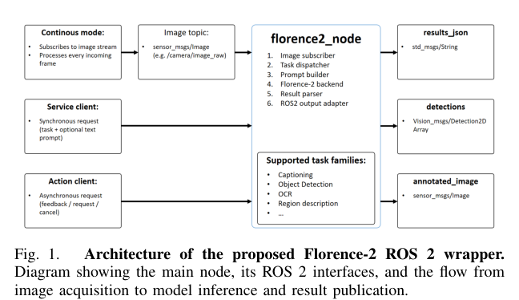
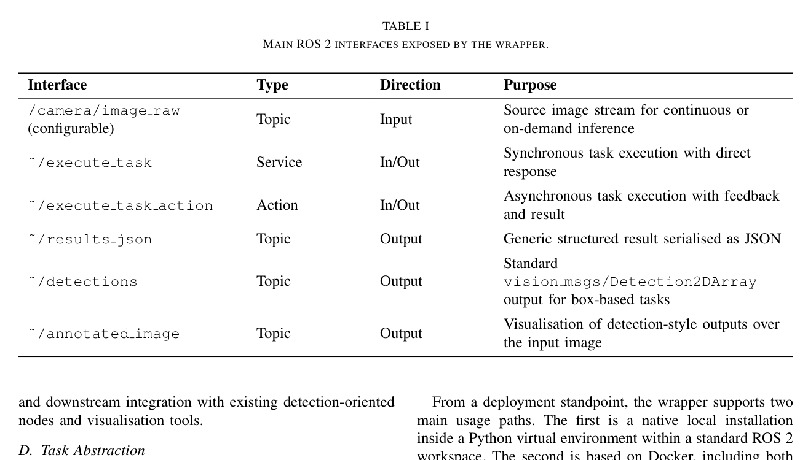
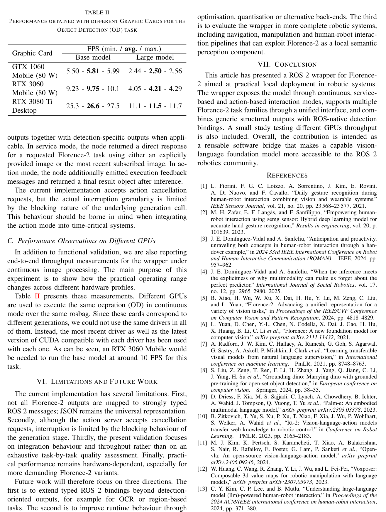

p179
<!-- document_mode: hybrid_paper -->
<!-- page 1 mode: hybrid_paper -->
A ROS 2 Wrapper for Florence-2: Multi-Mode Local Vision-Language
Inference for Robotic Systems
J. E. Dom´
ınguez-Vidal

## Abstract
Foundation vision-language models are becoming increasingly relevant to robotics because they can provide richer semantic perception than narrow task-specific pipelines.
However, their practical adoption in robot software stacks still depends on reproducible middleware integrations rather than on model quality alone. Florence-2 is especially attractive in this regard because it unifies captioning, optical character recognition, open-vocabulary detection, grounding and related vision-language tasks within a comparatively manageable model size. This article presents a ROS 2 wrapper for Florence-2 that exposes the model through three complementary interaction modes: continuous topic-driven processing, synchronous service calls and asynchronous actions. The wrapper is designed for local execution and supports both native installation and Docker container deployment. It also combines generic JSON outputs with standard ROS 2 message bindings for detectionoriented tasks. A functional validation is reported together with a throughput study on several GPUs, showing that local deployment is feasible with consumer grade hardware. The repository is publicly available here: https://github.com/
JEDominguezVidal/florence2_ros2_wrapper.
Index Terms— ROS 2, Foundation Models, Vision-Language Models, Florence-2, Robotic Perception
arXiv:2604.01179v1 [cs.RO] 1 Apr 2026

## Introduction
Recent progress in foundation models has broadened the range of perception and reasoning capabilities that can be brought into robotic systems, replacing solutions based on Deep Learning architectures specifically designed for each individual task [1]–[4]. In particular, vision-language models have made it possible to move beyond fixed-category perception towards more flexible semantic descriptions, openvocabulary detection and language-conditioned scene understanding [5]–[8]. In robotics, this trend is reflected both in embodied multimodal systems such as PaLM-E and RT-2 and in open frameworks such as OpenVLA and VoxPoser, which demonstrate the value of connecting rich perceptual representations with robot behaviour [9]–[12]. This need is particularly relevant in collaborative robotics, where perception modules may support not only object-level recognition but also higher-level reasoning about task context, human activity, and their intention [13]–[15].
Despite this progress, the practical adoption of such models in robot software stacks still depends on integration effort. A model that is straightforward to evaluate in Python notebooks is not automatically usable in a ROS 2 graph with camera topics, services, actions, launch files, standard message types and reproducible deployment. This gap between model availability and system usability has been repeatedly observed in ROS and ROS 2 wrapper articles, where the contribution lies less in proposing a new model and more
in making an existing capability reusable within robotic software infrastructures [16]–[20].
Florence-2 is a particularly interesting case. It provides a unified prompt-based interface for a broad set of computer vision and vision-language tasks while remaining substantially easier to deploy than many very large multimodal systems [5]. This makes it an appealing candidate for local robotic perception, especially in settings where internet dependence is undesirable and hardware resources are limited but not negligible. At the same time, unlike speech or segmentation models for which ROS and ROS 2 [21]–[24] wrappers are already relatively easy to find, there is still a lack of focused ROS 2 integrations for Florence-2.
This article addresses that gap by presenting a ROS 2 wrapper for Florence-2 intended as a practical software component for robotic systems. The wrapper subscribes to image topics, supports on-demand inference through both services and actions, and can optionally process incoming frames continuously. It is packaged for local execution and Docker-based deployment, and it publishes both general structured outputs and ROS-native detection messages.
The main contributions of this work are as follows:
1) an open ROS 2 wrapper for Florence-2 oriented towards local robotic deployment;
2) a multi-mode interaction design combining continuous processing, synchronous services and asynchronous actions;
3) a unified interface for several Florence-2 task families within a single ROS 2 node; and
4) an initial functional and performance validation, including a cross-GPU throughput comparison.
The remainder of the article is organised as follows. Section II summarises the most relevant related work. Section III describes the wrapper architecture and ROS 2 interfaces.
Section IV outlines the implementation and deployment choices. Section V reports the experimental validation. Section VI presents limitations and future work, and Section VII concludes the article.

## Related Work
The most relevant literature for this article lies at the intersection of three lines of work. The first is the progression of foundation perception models themselves, including Florence and Florence-2 for unified visual representations [5], [6], Whisper for robust speech recognition [25], Segment Anything for promptable image segmentation [26], and openvocabulary or language-grounded perception models such as CLIP [7], [27] and Grounding DINO [8]. The second line
---
<!-- page 2 mode: hybrid_paper -->
concerns robotics applications of large multimodal models, including embodied language and vision systems such as PaLM-E, RT-2, OpenVLA and VoxPoser [9]–[12]. These works highlight the relevance of rich perceptual back-ends for robot decision making, manipulation and scene understanding.
The third line is the growing ecosystem of ROS and ROS 2 wrappers, bridges and middleware-oriented software components. Earlier examples such as gym-gazebo and gymgazebo2 framed ROS and ROS 2 integration as a reusable software contribution in its own right [16], [17]. More recent work has extended this pattern to cloud robotics platforms, middleware wrappers and embodied AI frameworks, including FogROS2, Wrapyfi, ROS-LLM, ROSA and NerfBridge [18], [20]–[23]. In parallel, model-specific wrappers have appeared in repositories and technical reports for capabilities such as Whisper and SAM, for example ros2 whisper1, ros sam2 and ros2 sam3. However, to the best of our knowledge, there is not yet a dedicated ROS 2 wrapper article or widely adopted ROS 2 package focused on Florence-2.
The present work therefore occupies a narrow but useful position: it does not propose a new foundation model or a full embodied AI framework, but rather a reusable ROS 2 integration for a compact and capable vision-language model that is well suited to local robotic deployment.

### Overall Node Architecture
The wrapper is centred on a single ROS 2 inference node that encapsulates model loading, image reception, prompt construction, inference, post-processing and publication of outputs (see Fig. 1). Internally, the node subscribes to a configurable image topic of type sensor msgs/Image, converts incoming frames into a format suitable for Florence-2, runs the model through the Hugging Face transformers interface, and publishes the resulting outputs back into the ROS 2 graph.
This design keeps the runtime path short and makes the wrapper easy to integrate into existing camera-based pipelines. At the same time, it leaves room for future extension through additional pre-processing, batching or task-specific output adapters. The current article focuses on the reusable ROS 2 component rather than on embedding Florence-2 inside a larger autonomous pipeline.

### Interaction Modes
A key design choice in the wrapper is the exposure of three complementary interaction modes. First, the node can operate in a continuous mode, in which a configured Florence-2 task is executed automatically on every incoming image. This mode is useful when the wrapper is part of an ongoing
1https://github.com/ros-ai/ros2_whisper 2https://github.com/robot-learning-freiburg/ros_ sam
3https://github.com/ros-ai/ros2_sam

perception stream and a robot requires a regular semantic interpretation of the camera feed.
Secondly, the wrapper offers a service mode for synchronous on-demand inference. This is appropriate when a client node only needs a result occasionally, for example after a waypoint is reached or when a higher-level planner requests a specific perceptual query. Thirdly, the wrapper exposes an action mode for asynchronous execution with intermediate feedback. This mode is better aligned with potentially longer inference requests, because it allows clients to monitor progress and integrate Florence-2 into larger tasklevel execution flows.
From a robotics perspective, this multi-mode design avoids imposing a single interaction pattern on all applications.
Continuous operation suits streaming perception, services suit short event-triggered queries, and actions suit longer or better-instrumented requests. The result is a more idiomatic ROS 2 interface than a wrapper limited to a single topic or a single remote procedure style.

### ROS 2 Interfaces and Message Design
The wrapper exposes a small but expressive ROS 2 interface surface. The node accepts a configurable image topic, a model selection parameter and an optional continuous task parameter. For on-demand use, it provides the ExecuteTask service and the ExecuteTask action. In both cases the request includes the target Florence-2 task, optional task-specific text input and, when desired, an image payload; otherwise the node can fall back to the most recent subscribed image.
Table I summarises the main interfaces. A noteworthy aspect of the design is the combination of generic and typed outputs. Since Florence-2 supports heterogeneous tasks whose outputs range from plain text to structured detections, a purely typed ROS representation would either be too narrow or would require a large number of bespoke message definitions. The present implementation therefore publishes a generic JSON representation for all tasks, while additionally providing a standard vision msgs/Detection2DArray binding and an annotated image for tasks that yield bounding boxes and labels.
This hybrid approach favours broad task coverage without abandoning ROS-native interoperability where it is most useful. In practice, it supports both rapid experimentation
---
<!-- page 3 mode: hybrid_paper -->

### Task Abstraction
From a deployment standpoint, the wrapper supports two main usage paths. The first is a native local installation inside a Python virtual environment within a standard ROS 2 workspace. The second is based on Docker, including both a lighter configuration and a CUDA-oriented configuration for self-contained GPU deployment. This is an important practical aspect of the contribution: for model wrappers, dependency management and deployment reproducibility are often part of the core value rather than an afterthought [18], [22], [23].
The repository also includes example clients that demonstrate both service and action usage. Although simple, these examples are useful because they make the communication contract explicit and reduce the amount of reverse engineering required by new users.
**TABLE I MAIN ROS 2 INTERFACES EXPOSED BY THE WRAPPER.**

Florence-2 unifies multiple perception capabilities through prompt-based task tokens [5]. The wrapper preserves this abstraction rather than hard-coding a separate node for each individual capability. As a result, a single ROS 2 component can be used for object detection, captioning, OCR, detailed captioning and related tasks by changing the requested prompt.
This decision is especially relevant for robotics. Instead of maintaining several partially overlapping model servers, developers can expose one model-centric component whose behaviour is selected by the calling node according to context. Such a design is more compact, easier to deploy, and better aligned with the increasingly general nature of foundation perception models.

## Implementation and Deployment
The software is organised into two packages. The first package contains the custom ROS 2 interfaces, namely the ExecuteTask.srv and ExecuteTask.action definitions. The second package contains the Florence-2 node itself, launch files and example clients for service-based and action-based use. This separation keeps the communication contracts explicit and makes it easier to reuse the interfaces independently of future implementation changes.
The runtime back-end is implemented in Python on top of rclpy, torch and the Hugging Face transformers stack. Model loading selects CPU or GPU execution depending on hardware availability, using reduced precision on CUDA-capable devices where appropriate. Images are converted through cv bridge, and object-detection style outputs are converted into vision msgs messages when the parsed Florence-2 output contains bounding boxes and labels.
V. EXPERIMENTAL VALIDATION

### Experimental Setup
The purpose of the evaluation is not to benchmark Florence-2 as a vision model against unrelated perception articles, but to validate the wrapper as a ROS 2 software component. All experiments should therefore be interpreted as end-to-end measurements of the proposed integration. The software stack used in this work is based on Ubuntu 24.04, ROS 2 Jazzy, Python 3.12 and the Florence-2 implementation provided through the Hugging Face transformers ecosystem.
Image inputs were provided through standard ROS 2 image topics. For performance measurements, the recommended protocol is to use a repeatable image stream or rosbag replay so that all tested devices process the same input sequence under the same ROS 2 configuration.

### Functional Validation Across ROS 2 Modes
The wrapper was functionally validated in its three supported modes. In continuous mode, the node processed incoming images automatically and published generic JSON
---
<!-- page 4 mode: hybrid_paper -->

## Conclusion

## References
**TABLE II PERFORMANCE OBTAINED WITH DIFFERENT GRAPHIC CARDS FOR THE**

---
<!-- page 5 mode: hybrid_paper -->
[14] Z. Li, S. Deldari, L. Chen, H. Xue, and F. D. Salim, “Sensorllm:
Aligning large language models with motion sensors for human activity recognition,” in Proceedings of the 2025 Conference on Empirical Methods in Natural Language Processing, 2025, pp. 354–379.
[15] J. E. Dom´ ınguez-Vidal and A. Sanfeliu, “The human intention: a taxonomy attempt and its applications to robotics,” International Journal of Social Robotics, vol. 17, no. 11, pp. 2479–2499, 2025.
[16] I. Zamora, N. G. Lopez, V. M. Vilches, and A. H. Cordero, “Extending the openai gym for robotics: a toolkit for reinforcement learning using ros and gazebo,” arXiv preprint arXiv:1608.05742, 2016.
[17] N. G. Lopez, Y. L. E. Nuin, E. B. Moral, L. U. S. Juan, A. S.
Rueda, V. M. Vilches, and R. Kojcev, “gym-gazebo2, a toolkit for reinforcement learning using ros 2 and gazebo,” arXiv preprint arXiv:1903.06278, 2019.
[18] K. Chen, R. Hoque, K. Dharmarajan, E. LLontopl, S. Adebola,
J. Ichnowski, J. Kubiatowicz, and K. Goldberg, “Fogros2-sgc: A
ros2 cloud robotics platform for secure global connectivity,” in 2023 IEEE/RSJ International Conference on Intelligent Robots and Systems (IROS).
IEEE, 2023, pp. 1–8.
[19] J. E. Dom´ ınguez-Vidal and A. Sanfeliu, “Force and velocity prediction in human-robot collaborative transportation tasks through video retentive networks,” in 2024 IEEE/RSJ International Conference on Intelligent Robots and Systems (IROS).
IEEE, 2024, pp. 9307–9313.
[20] J. Yu, J. E. Low, K. Nagami, and M. Schwager, “Nerfbridge: Bringing real-time, online neural radiance field training to robotics,” arXiv preprint arXiv:2305.09761, 2023.
[21] F. Abawi, P. Allgeuer, D. Fu, and S. Wermter, “Wrapyfi: A python wrapper for integrating robots, sensors, and applications across multi-
ple middleware,” in Proceedings of the 2024 ACM/IEEE International Conference on Human-Robot Interaction, 2024, pp. 860–864.
[22] C. E. Mower, Y. Wan, H. Yu, A. Grosnit, J. Gonzalez-Billandon,
M. Zimmer, J. Wang, X. Zhang, Y. Zhao, A. Zhai et al., “Ros-llm:
A ros framework for embodied ai with task feedback and structured reasoning,” arXiv preprint arXiv:2406.19741, 2024.
[23] R. Royce, M. Kaufmann, J. Becktor, S. Moon, K. Carpenter, K. Pak,
A. Towler, R. Thakker, and S. Khattak, “Enabling novel mission
operations and interactions with rosa: The robot operating system agent,” in 2025 IEEE Aerospace Conference.
IEEE, 2025, pp. 1– 16.
[24] A. A. Ram´ ırez-Duque and M. E. Foster, “A whisper ros wrapper to enable automatic speech recognition in embedded systems,” in HRI
2023 Workshop on Human-Robot Conversational Interaction (HRCI
2023).
ACM Stockholm, Sweden, 2023, p. 3.
[25] A. Radford, J. W. Kim, T. Xu, G. Brockman, C. McLeavey, and
I. Sutskever, “Robust speech recognition via large-scale weak super-
vision,” in International conference on machine learning.
PMLR, 2023, pp. 28 492–28 518.
[26] A. Kirillov, E. Mintun, N. Ravi, H. Mao, C. Rolland, L. Gustafson,
T. Xiao, S. Whitehead, A. C. Berg, W.-Y. Lo et al., “Segment
anything,” in Proceedings of the IEEE/CVF international conference on computer vision, 2023, pp. 4015–4026.
[27] P. K. A. Vasu, H. Pouransari, F. Faghri, R. Vemulapalli, and O. Tuzel, “Mobileclip: Fast image-text models through multi-modal reinforced training,” in Proceedings of the IEEE/CVF Conference on Computer Vision and Pattern Recognition, 2024, pp. 15 963–15 974.
---
