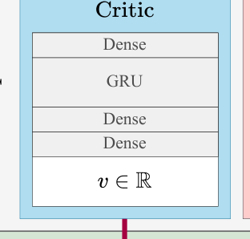
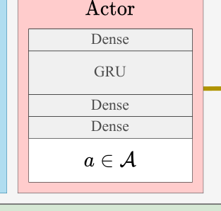
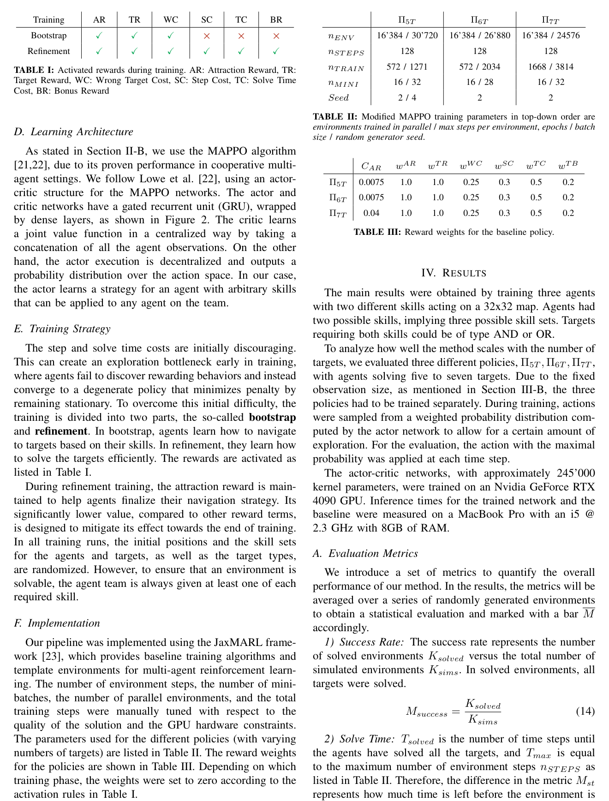
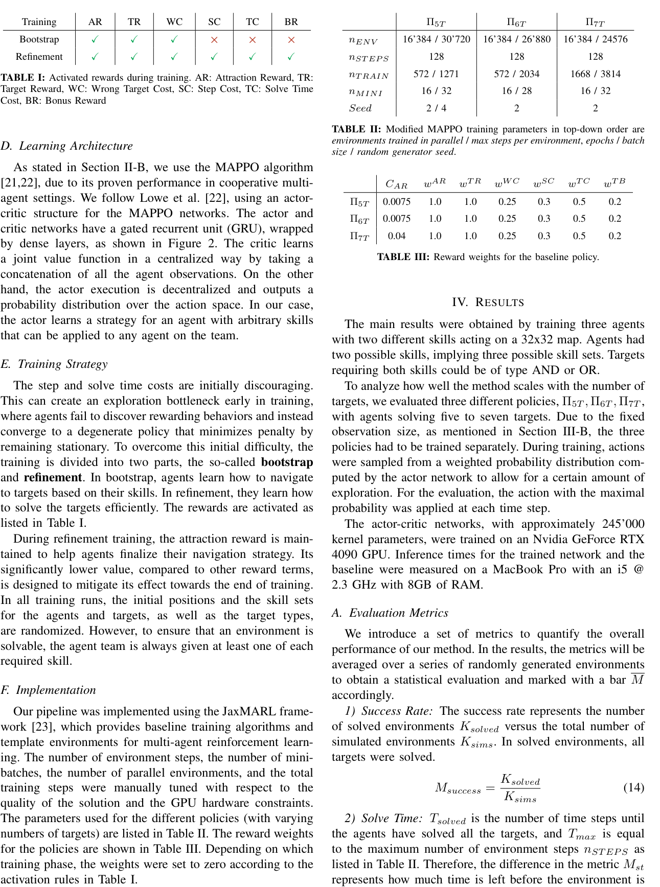
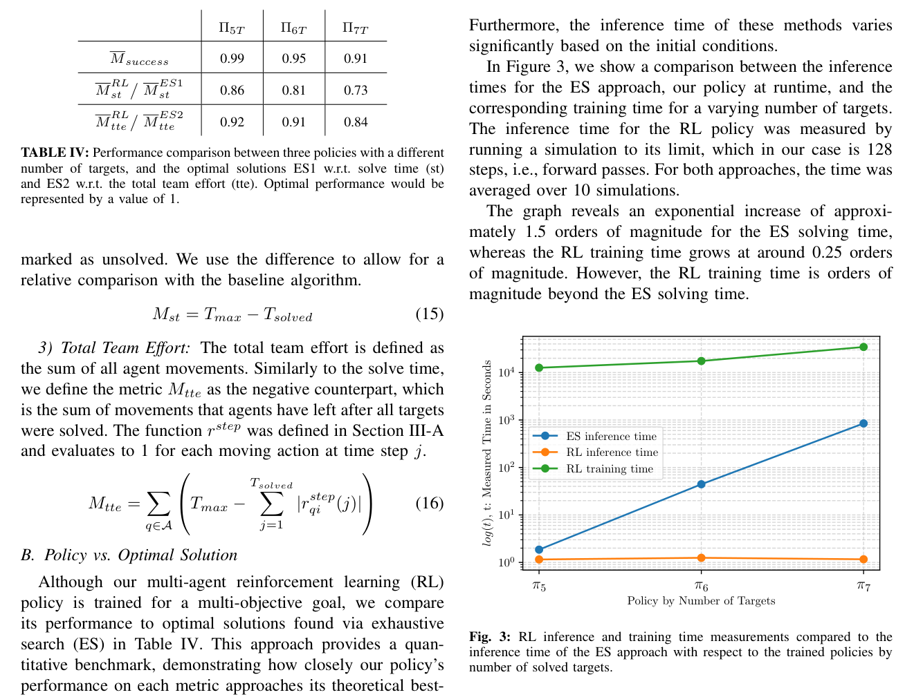
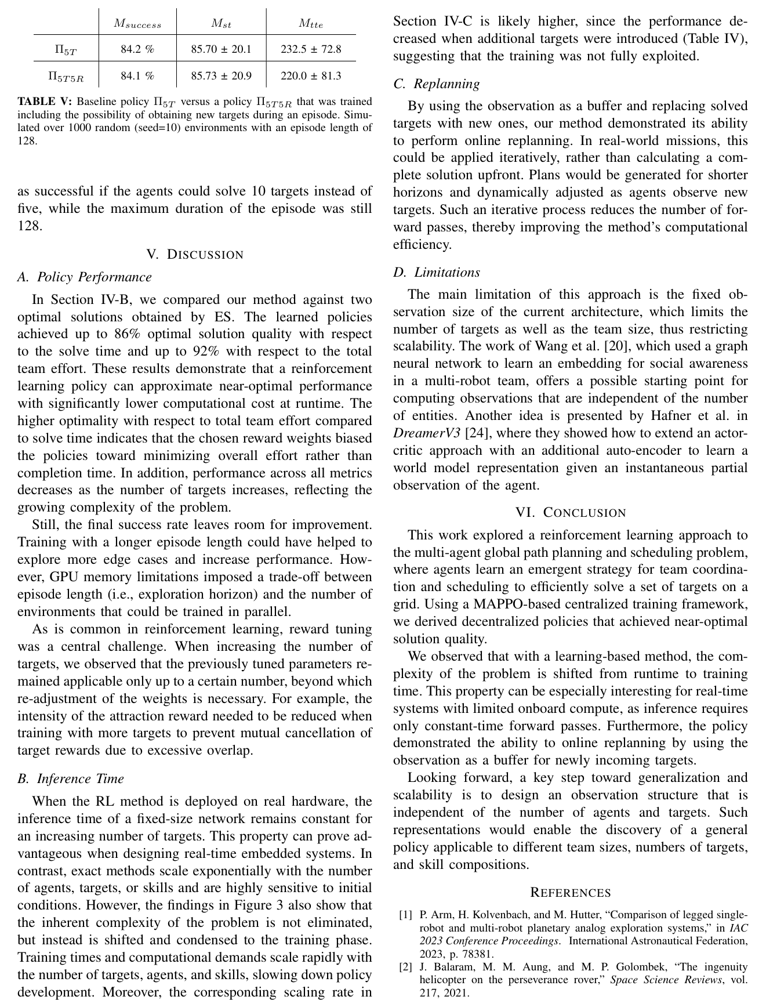

p213
<!-- document_mode: hybrid_paper -->
<!-- page 1 mode: ocr -->
<!-- OCR page 1 -->
Collaborative Task and Path Planning for Heterogeneous Robotic Teams using Multi-Agent PPO
Matthias Rubio¹, Julia Richter¹, Hendrik Kolvenbach¹, and Marco Hutter¹

## Abstract
Efficient robotic extraterrestrial exploration requires robots with diverse capabilities, ranging from scientific measurement tools to advanced locomotion. A robotic team enables the distribution of tasks over multiple specialized subsystems, each providing specific expertise to complete the mission. The central challenge lies in efficiently coordinating the team to maximize utilization and the extraction of scientific value. Classical planning algorithms scale poorly with problem size, leading to long planning cycles and high inference costs due to the combinatorial growth of possible robot-target allocations and possible trajectories. Learning-based methods are a viable alternative that move the scaling concern from runtime to training time, setting a critical step towards achieving real-time planning. In this work, we present a collaborative planning strategy based on Multi-Agent Proximal Policy Optimization (MAPPO) to coordinate a team of heterogeneous robots to solve a complex target allocation and scheduling problem. We benchmark our approach against single-objective optimal solutions obtained through exhaustive search and evaluate its ability to perform online replanning in the context of a planetary exploration scenario.
Index Terms—Path Planning for Multiple Mobile Robots or Agents; Space Robotics and Automation; Reinforcement Learning

## Introduction
Unmanned surface exploration may require not only different locomotion techniques to overcome harsh terrain but also a variety of scientific equipment and specific devices for physical interaction with the environment. However, a single robot has only a limited capacity. Therefore, distributing task-specific components across a team of specialized robots allows multiple tasks to be performed in parallel, reducing overall mission time [1].
In 2021, the Perseverance rover deployed the helicopter Ingenuity on Mars, achieving the first powered flight on another planet [2]. This groundbreaking mission proved that the use of multiple agents with alternative locomotion techniques has the potential to enhance future planetary exploration missions. Similarly, Arm et al. used a team of legged robots with complementary skills to perform an Earth-based resource prospecting study [3]. The team was able of performing different tasks in a short time frame, showing that collaboration increases efficiency compared to single-robot exploration [1].
However, in the latter example, the task allocation and task sequence were determined manually by five human operators. As this becomes more complicated for more robots and tasks, especially under the communication delays and constraints of planetary missions, manual planning needs to be replaced by an algorithm that coordinates the team on a global scale.

### Challenges of Multi-Robot Planning
For single-robot path planning, there are many possible algorithmic approaches which Sánchez-Ibáñez et al. systematically categorize [4]. Graph search algorithms, such as A*, make up a well-known subgroup in addition to sampling-based methods. Richter et al. show how to use a multi-objective A* global path planning algorithm for an exploration mission on the moon [5].
However, single-robot path planning algorithms fail to address the additional complexities in multi-agent scenarios. Besides finding an efficient path, the algorithm also needs to
Fig. 1: An illustrative plan for a collaborative robot fleet with different specializations, such as flying, walking, or driving. During the mission the drone and the legged robot find new tasks and replan to minimize mission time.
---
<!-- page 2 mode: hybrid_paper -->
allocate a subset of tasks and determine a specific execution order for each robot. Since multiple robots can interact and collaborate, the algorithm additionally needs to schedule the robots appropriately to avoid potential conflicts or exploit synergies between them.
In a space exploration mission, not all the information is known a priori, and new regions of interest, terrain changes, or robot failures lead to unexpected situations. Hence, a fully autonomous robot team should be able to replan and adapt on site according to the available and incoming information.
Especially for exploration on another planet, this prevents unnecessary communication delays and idle times while extending the available time for scientific investigation. Due to limited computational resources, such an algorithm also has to adhere to the tight real-time constraints posed by space systems.
Prior work has framed the problem in different ways, e.g., as a multi-traveling salesman problem (MTSP), and taken first steps towards learning-based solutions. Nevertheless, existing methods are limited to assigning agents to targets based on individual path costs and then scheduling them in a separate step, making it difficult to handle both aspects within a single solver. In contrast, our work introduces a fully learning-based method that unifies path planning, task allocation, and scheduling for heterogeneous multi-robot teams. The main contributions can be summarized as follows.
• A MAPPO-based reinforcement learning framework for cooperative multi-agent path planning, task allocation, and scheduling.
• Benchmark against an optimal exhaustive search baseline, demonstrating competitive performance with improved scalability.
• Validation of fast replanning in dynamic environments, highlighting applicability to space exploration missions.
• Open-source release of the learning framework.1
The remainder of this paper is structured as follows. In Section III, our method is thoroughly explained, including a formal description of the problem and the training strategy.
The implementation and results on performance and replanning capabilities are presented in Section IV, and finally the limitations of the method and recommendations for future work are discussed in Section V.

## Related Work

### MTSP and Algorithmic Approaches
A well-known formulation of path planning problems that includes target allocation is the MTSP, where its numerous variations are listed in [6]. Exact methods to solve the MTSP include constraint programming [7] and integer programming algorithms [8]. The problem can also be extended to require collision-free paths, such as in [9], where Ma et al. present a conflict-based min-cost-flow algorithm on a time-expanded graph, or in [10], where Turpin et al. show how to decouple the target assignment and scheduling problem to solve those
1https://github.com/leggedrobotics/multi_ robot_global_planner
parts sequentially. In general, exact methods are able to find a globally optimal solution. However, they tend to scale poorly with the number of agents and targets and therefore result in long computation times, which can go up to hours, as stated in [6]. This issue makes it hard to perform continuous replanning on constrained computational resources, such as on a space exploration rover.
The state-of-the-art methods in the literature to solve MTSP problems are metaheuristic algorithms, such as NSGA-II [11] or particle-swarm optimization techniques, e.g., ant colony optimization [12] or the artificial bee colony algorithm [13,14]. Metaheuristic algorithms are popular because they can be implemented in a computationally efficient way. However, they do not guarantee finding an optimal solution in finite time or even a valid solution at all. Since the problem still scales with the number of agents and targets, a trade-off between computation time and solution quality is inevitable. Jiang et al. address this using their multiagent planning framework, which consists of two different algorithms that exhibit the trade-offs between plan quality and computational efficiency [15].
Recent work tries to investigate the capabilities of learning-based approaches, where the scaling problem shifts from runtime to training time, enabling the efficient use of computational resources in advance and having almost constant inference times. This can be particularly interesting for space applications that require real-time computation.
The standard MTSP is solved using a reinforcement learning approach in [16] and [17], where the problem is separated into two stages. The first stage is a graph neural network that learns how to allocate targets to agents, and the second stage consists of a standard single-traveling salesman problem solver that is also used to supervise the network learning process. This method has been shown to outperform metaheuristic methods in solution quality from small-scale problems up to tens of agents and hundreds of cities. However, to the best of our knowledge, there are no full learningbased approaches trying to extend the MTSP to a case with collaborative tasks, which would include appropriate scheduling of the robots.

### Learning Collaborative Strategies
To include the full range of subproblems (target allocation, scheduling, and replanning), the problem can be framed within the context of a collaborative game-theoretic approach. In this context, rather than seeking the optimal solution in a large search space, the focus shifts to identifying a general strategy that can be learned empirically and followed consistently by the agents. This motivates the question of whether learning-based methods can be employed to learn such strategies and to what extent they approach optimality.
An unsupervised approach to multi-agent path planning is presented in [18] (PRIMAL) and extended in [19] (PRIMALc). The proposed algorithms learn a decentralized strategy to navigate towards targets while avoiding collisions.
This concept was also explored in the context of socially aware navigation for multi-robot teams [20].
---
<!-- page 3 mode: hybrid_paper -->
They demonstrated how robots can be trained to navigate efficiently in a crowded environment while ensuring safety and comfort for humans around the robots. The learning architecture consists of a spatial-temporal graph neural network that can compute an embedding expressing the human-robot and robot-robot interactions, and an underlying multi-agent proximal policy optimization (MAPPO) algorithm ( [21,22]) that learns how to compute the actions for each robot. According to [21], MAPPO has been demonstrated in different baseline environments such as the multi-agent particle-world environments (MPE), the StarCraft multi-agent challenge, Google Research Football and the Hanabi challenge. It is therefore a competitive baseline in cooperative multi-agent learning and provides a promising foundation for applying to the target allocation and scheduling problem in an exploration task.

## Method
To learn a strategy that solves the planning problem, we construct a virtual environment containing agents and targets.
Agents have the freedom to choose their actions at each step with the goal of solving all targets.

### Training Environment
The training environment is modeled as a discrete 2D grid (Figure 2) on which the agents q ∈Q, |Q| = N can move using one of the actions A = {up, down, left, right, stay}.
Each target t ∈T , |T | = M requires a set of skills S ∈ P(S), where P(S) is the power set of all the skills sets.
The targets must be solved by either one of the required skills (OR type) or by all of them (AND type). Each agent provides a set of skills that can be used to solve a target. A target t ∈TS(j) is solved if, for a time step j, all the required skills of the target are in the same position as the target itself.
Agents complete an environment if the number of unsolved targets is zero, that is, |TU(j)| = 0. Furthermore, the action space stays the same throughout the map, even at the border.
If an agent attempts to move beyond the boundaries of the map, it will be reverted to the last valid cell it occupied, and the invalid action will be ignored.

### Observations
First, the positions of the targets and all agents are included in the observation of an agent as shown in Equation (2). The symbol p ∈N2 0 denotes an absolute position on the grid and rt q ∈Z2 is the relative position between an agent q and a target t. The subscripts i and k are the indices of the agents and targets, and N = |Q| and M = |T | are the number of agents or targets, respectively.
$$
( rt q if t ∈TU(j) [0, 0] if t ∈TS(j) (1)
$$
```text
g(rt q) =
```
$$
opos qi = [pqi, ..., pqN, g(rt1 qi), ..., g(rtM qi )] (2)
$$
To indicate that a target is solved, its relative position is automatically set to zero by the function g(rt) in Equation (1) for all agents. The observation structure is kept agent-specific, denoted by the subscript qi, always having the position of
the current agent in the first entry of the array. Enforcing this structure allows the actor network to associate the observing agent with its position.
In order to solve the targets efficiently, agents need information about the skill sets of the other agents and the skill demands of each target. Since multiple skills can be associated with an agent or a target, the observations in Equation (3) are encoded as skill sets written as Sqi or Stk.
In practice, skill sets are enumerated and assigned to integer values by a predetermined function f(S) : P(S) →N0.
$$
oskill qi = [f(Sqi), ..., f(SqN), f(St1), ..., f(StM)] (3)
$$
Finally, targets must be distinguished by their type (AND or OR type) to indicate whether collaboration is necessary.
In Equation (4), the types h are encoded as 1 (AND type) or 0 (OR type).
$$
ogoalT ype = [ht1, ..., htM] (4)
$$
The complete observation for an agent qi is a concatenation of the previously mentioned observations and can be written as:
$$
oqi = [opos qi , oskill qi , ogoalT ype] (5)
$$
Note that the observation of an agent depends on the number of agents and targets that exist in the environment.
Although this design choice prevents variation in numbers during training, it eliminates the need for a separate encoding algorithm or network to handle dynamically sized observations.

### Rewards
In the following, the different reward terms used in the training are discussed. To help the agents navigate towards the sparsely distributed targets, an attraction reward (AR) is introduced, which is spread around a target with an increasing value towards the center. The agent receives this reward at each time step, if the target is unsolved and the agent has at least one matching skill with the target, which can be expressed as the condition P = (t ∈TU(j))∧(|Sqi∩St|) > 0.
The reward function for one target is shown in Equation (6), where rt is the relative distance from agent qi to target t and CAR is a constant parameter that determines the spread of the attraction reward. The attraction reward in Equation (7) is averaged over all the targets to be solved in the environment and normalized with respect to the maximum number of steps Tmax.
( exp(−CAR · ∥rt∥2) if P 0 otherwise (6)
```text
hqi(t) =
```
X
rAR qi = 1
t∈T hqi(t) (7)
M · Tmax
Once a target is reached and solved, there is a fixed payout for all agents, regardless of whether they contributed to solving the target. This prevents competition among agents.
---
<!-- page 4 mode: hybrid_paper -->
**Add new targets to
observation buffers**
| Dense |
$$
|---|
$$
| GRU |
| Dense |
| Dense |
|  |

**Table 2 (Page 4)**
| Dense |
$$
|---|
$$
| GRU |
| Dense |
| Dense |
|  |

Minibatches
Collect
MAPPO
Trajectories
Collect
Single agent Training update Agent team
Fig. 2: This figure illustrates the complete workflow, highlighting both the execution (green) and training (yellow) phases. The execution block details the network architectures and the placement of the replanning step. The training block shows the MAPPO update sequence. The colored arrows differentiate data flow, specifying whether it applies to all agents, a single agent, or represents aggregated data for training. Furthermore, the environment is visualized as a grid, including the agents and targets with their provided or required skills (colored dots). The targets are marked with a green square, which can have a black border indicating a collaborative target (AND type).
The target reward (TR) function is shown in Equation (8) where j refers to the current time step. If all the targets are solved, the collected rewards sum up to 1.
( 1
$$
M if t ∈TU(j −1) ∧t ∈TS(j) 0 otherwise (8)
$$
rT R qi =
To give more importance to skills, a fixed penalty (WC) is added if agents step on a target that does not have a common skill, as shown in Equation (9).
( −1 if (∥rt∥2 = 0) ∧(|Sqi ∩St| = 0) 0 otherwise (9) To ensure efficient completion of targets, specifically minimizing the number of required steps, agents are subjected to a nominal cost per movement (SC), which can be formalized as shown in Equation (10). The action that leads to the current state is written as u(j −1).
rW C qi = X
t∈TU
$$
( 0 if u(j −1) = stay −1 otherwise (10)
$$
rSC qi =
In addition to a minimal number of steps, agents are expected to complete the targets in a minimum time frame,
which is introduced as shown in Equation (11). The solvetime cost (TC) decreases with the number of solved goals and is normalized by the number of total targets M and the maximum number of steps Tmax in the episode. It follows that if the agents solve all the targets during an episode, the cost vanishes.
$$
rT C qi = |TU(j)|
$$
M · Tmax (11)
Finally, the terminal bonus incentivizes agents to complete an environment further by rewarding them for solving all targets, as shown in Equation (12).
$$
( 1 if (TS(j −1) ⊂T ) ∧(T ⊆TS(j)) 0 otherwise (12)
$$
rT B qi =
The complete reward for an agent computed at each time step is shown in Equation (13) where each reward term is weighted by a constant parameter w ∈R, which allows the relative influence of the rewards to be adjusted in training.
$$
rqi = [rAR qi , rT R qi , rW C qi , rSC qi , rT C qi , rT B qi ]⊤
w = [wAR, wT R, wW C, wSC, wT C, wT B]
rfull qi = w · rqi (13)
$$
---
<!-- page 5 mode: hybrid_paper -->

## Results

#### Solve Time
**TABLE I: Activated rewards during training. AR: Attraction Reward, TR: Target Reward, WC: Wrong Target Cost, SC: Step Cost, TC: Solve Time Cost, BR: Bonus Reward**

**TABLE II: Modified MAPPO training parameters in top-down order are environments trained in parallel / max steps per environment, epochs / batch size / random generator seed.**

**TABLE III: Reward weights for the baseline policy.**

---
<!-- page 6 mode: hybrid_paper -->

### Policy vs. Optimal Solution
**TABLE IV: Performance comparison between three policies with a different number of targets, and the optimal solutions ES1 w.r.t. solve time (st) and ES2 w.r.t. the total team effort (tte). Optimal performance would be represented by a value of 1.**


### Comparison of Inference Time
A notable advantage of a learning-based method is that the inference time remains constant and is independent of the problem’s initial conditions. This is because a single forward pass through the network has a time complexity of O(1).
This property enables real-time operation in a resourceconstrained environment. In contrast, exact methods, such as the ES approach, exhibit an inference time that scales exponentially with the number of agents, targets, or skills.

### Replanning Capability
Having a short and constant inference time for the network opens the possibility of performing online replanning on newly discovered targets. As described in Section III-B, the observation size is fixed and the number of targets cannot be changed for a pretrained network. Thus, we use the observation as a buffer, where new incoming targets replace those that have already been solved.
For this experiment, we used Π5T as a baseline and an additional policy Π5T 5R that was trained such that the agents had to solve the five initial targets and an additional five replanned targets in an episode. The new targets were randomly generated with different positions, skill sets and goal types and were added to the observation as soon as one of the initial targets had been solved. All training parameters and reward weights were kept the same, as was the training strategy.
Both policies were simulated over 1000 environments to solve five initial and five additional targets.
As listed in Table V, the results for both policies are very similar, showing that explicitly training with newly incoming targets does not improve performance. Note that the success rate Msuccess in Table V is lower compared to the results shown in Section IV-B, because an episode was only marked
---
<!-- page 7 mode: hybrid_paper -->

## Discussion

### Limitations

## Conclusion

## References
**TABLE V: Baseline policy Π5T versus a policy Π5T 5R that was trained including the possibility of obtaining new targets during an episode. Simu- lated over 1000 random (seed=10) environments with an episode length of 128.**

---
<!-- page 8 mode: hybrid_paper -->
[3] P. Arm, G. Waibel, J. Preisig, T. Tuna, R. Zhou, V. Bickel, G. Ligeza,
T. Miki, F. Kehl, H. Kolvenbach, and M. Hutter, “Scientific exploration
of challenging planetary analog environments with a team of legged robots,” Science Robotics, vol. 8, 2023.
[4] J. R. S´ anchez-Ib´ a˜ nez, C. J. P´ erez-Del-pulgar, and A. Garc´ ıa-Cerezo, “Path planning for autonomous mobile robots: A review,” Sensors, vol. 21, 2021.
[5] J. Richter, H. Kolvenbach, G. Valsecchi, and M. Hutter, “Multiobjective global path planning for lunar exploration with a quadruped robot,” 2023.
[6] O. Cheikhrouhou and I. Khoufi, “A comprehensive survey on the multiple traveling salesman problem: Applications, approaches and taxonomy,” 2021.
[7] M. Vali and K. Salimifard, “A constraint programming approach for solving multiple traveling salesman problem,” 2017.
[8] K. Sundar and S. Rathinam, “Algorithms for heterogeneous, multiple depot, multiple unmanned vehicle path planning problems,” J. Intell.
Robotics Syst., vol. 88, no. 2–4, p. 513–526, 2017.
[9] H. Ma and S. Koenig, “Optimal target assignment and path finding for teams of agents,” 2016.
[10] M. Turpin, N. Michael, and V. Kumar, “Concurrent assignment and planning of trajectories for large teams of interchangeable robots,” in 2013 IEEE International Conference on Robotics and Automation.
IEEE, 2013, pp. 842–848.
[11] Y. Shuai, S. Yunfeng, and Z. Kai, “An effective method for solving multiple travelling salesman problem based on nsga-ii,” Systems Science and Control Engineering, vol. 7, pp. 121–129, 2019.
[12] A. K. Pamosoaji and D. B. Setyohadi, “Novel graph model for solving collision-free multiple-vehicle traveling salesman problem using ant colony optimization,” Algorithms, vol. 13, 2020.
[13] X. Dong, Q. Lin, M. Xu, and Y. Cai, “Artificial bee colony algorithm with generating neighbourhood solution for large scale coloured traveling salesman problem,” IET Intelligent Transport Systems, vol. 13, pp. 1483–1491, 2019.
[14] V. Pandiri and A. Singh, “A swarm intelligence approach for the colored traveling salesman problem,” Applied Intelligence, vol. 48, pp. 4412–4428, 2018.
[15] Y. Jiang, H. Yedidsion, S. Zhang, G. Sharon, and P. Stone, “Multi-robot planning with conflicts and synergies,” Autonomous Robots, vol. 43, 2019.
[16] Y. Hu, Y. Yao, and W. S. Lee, “A reinforcement learning approach for optimizing multiple traveling salesman problems over graphs,” Knowledge-Based Systems, vol. 204, 2020.
[17] Y. Guo, Z. Ren, and C. Wang, “imtsp: Solving min-max multiple traveling salesman problem with imperative learning,” 2024.
[18] G. Sartoretti, J. Kerr, Y. Shi, G. Wagner, T. K. S. Kumar,
S. Koenig, and H. Choset, “Primal: Pathfinding via reinforcement
and imitation multi-agent learning,” IEEE Robotics and Automation Letters, vol. 4, no. 3, p. 2378–2385, Jul. 2019. [Online]. Available:
http://dx.doi.org/10.1109/LRA.2019.2903261
[19] Zhiyaoa and Sartoretti, “Deep reinforcement learning based multiagent pathfinding,” 2020.
[20] W. Wang, L. Mao, R. Wang, and B.-C. Min, “Multi-robot cooperative socially-aware navigation using multi-agent reinforcement learning,” 2023.
[21] C. Yu, A. Velu, E. Vinitsky, J. Gao, Y. Wang, A. Bayen, and
Y. Wu, “The surprising effectiveness of ppo in cooperative, multi-
agent games,” 2021.
[22] R. Lowe, Y. Wu, A. Tamar, J. Harb, P. Abbeel, and I. Mordatch, “Multi-agent actor-critic for mixed cooperative-competitive environments,” 2017.
[23] A. Rutherford, B. Ellis, M. Gallici, J. Cook, A. Lupu, G. Ingvarsson,
T. Willi, A. Khan, C. S. de Witt, A. Souly, S. Bandyopadhyay,
M. Samvelyan, M. Jiang, R. T. Lange, S. Whiteson, B. Lacerda,
N. Hawes, T. Rocktaschel, C. Lu, and J. N. Foerster, “Jaxmarl: Multi-
agent rl environments in jax,” arXiv preprint arXiv:2311.10090, 2023.
[24] D. Hafner, J. Pasukonis, J. Ba, and T. Lillicrap, “Mastering diverse domains through world models,” arXiv preprint arXiv:2301.04104, 2023.
---
