Scaling DoRA: High-Rank Adaptation via Factored Norms and Fused Kernels
Alexandra Zelenin<sup>∗</sup> Alexandra Zhuravlyova
March 24, 2026
**Abstract**
Weight-Decomposed Low-Rank Adaptation (DoRA; [Liu et al.](#page-19-0) [\[2024\]](#page-19-0)) extends LoRA by decoupling weight magnitude from direction, but its forward pass requires the row-wise norm ∥**W** + *s***BA**∥row, a computation that every major framework we surveyed implements by materializing the dense [*d*out*, d*in] product **BA**. At *d*in = 8192 and rank *r* = 384, a single module's norm requires ∼512 MB of transient working memory in bf16, making high-rank DoRA costly and often infeasible on common single-GPU setups once hundreds of adapted modules and checkpointing are involved.
We present two systems contributions: a *factored norm* that decomposes the squared norm into base, cross, and Gram terms computable through O(*d*out*r* + *r* 2 ) intermediates, eliminating the dense product. *Fused Triton kernels* collapse the four-kernel DoRA composition into a single pass, reducing memory traffic by ∼4× and using a numerically stable form that avoids catastrophic cancellation in the near-unity rescaling regime where magnitude scales concentrate in practice.
Across six 8–32B vision-language models (VLMs) on three NVIDIA GPUs (RTX 6000 PRO, H200, B200) at *r*= 384 in bf16, the fused implementation is 1*.*5–2*.*0× faster than HF PEFT's DoRA implementation for inference, and 1*.*5–1*.*9× faster for gradient computation (optimizer step excluded), with up to 7 GB lower peak VRAM. Microbenchmarks on six GPUs spanning four architecture generations (L40S, A100, RTX 6000 PRO, H200, B200, B300) confirm 1*.*5–2*.*7× compose-kernel speedup. Final-logit cosine similarity exceeds 0*.*9999 across all model/GPU pairs, and multi-seed training curves match within 7*.*1 × 10−<sup>4</sup> mean per-step loss delta over 2000 steps.
**1 Introduction**
Low-Rank Adaptation (LoRA; [Hu et al.](#page-19-1) [2022\)](#page-19-1) is the dominant method for parameter-efficient finetuning. DoRA [\[Liu et al.,](#page-19-0) [2024\]](#page-19-0) extends LoRA by decomposing the adapted weight into magnitude and direction:
$$\mathbf{W}' = \mathbf{m} \odot \frac{\mathbf{W} + s\mathbf{B}\mathbf{A}}{\|\mathbf{W} + s\mathbf{B}\mathbf{A}\|_{\text{row}}}$$
(1)
where **W** ∈ R *<sup>d</sup>*out×*d*in is the frozen base weight, **B** ∈ R *<sup>d</sup>*out×*<sup>r</sup>* and **A** ∈ R *<sup>r</sup>*×*d*in are low-rank factors, *s* is a scaling coefficient (e.g., rsLoRA; [Kalajdzievski](#page-19-2) [2023\)](#page-19-2), and **m** ∈ R *<sup>d</sup>*out is a learnable magnitude vector. High-rank configurations narrow the gap to full fine-tuning on complex downstream tasks [\[Hu](#page-19-1) [et al.,](#page-19-1) [2022,](#page-19-1) [Liu et al.,](#page-19-0) [2024\]](#page-19-0). We treat weights as [*d*out*, d*in] and compute per-output-row norms (dim=1), consistent with PEFT and torchtune.
<sup>∗</sup>Correspondence: alexa@eyes.ml
The bottleneck is the row-wise *L*<sup>2</sup> norm of the composed weight **W** + *s***BA**. Hugging Face PEFT [\[Mangrulkar et al.,](#page-20-0) [2022\]](#page-20-0) (and five other major frameworks we surveyed: torchtune, Unsloth, SWIFT, LLaMA-Factory, Axolotl; see Appendix [G\)](#page-26-0) computes this by constructing a *d*in × *d*in identity matrix, thereby materializing the dense product **BA**:
x_eye = torch . eye ( lora_A . weight . shape [1] , ...) # [d_in , d_in ]
lora_weight = lora_B ( lora_A ( x_eye ) ) . T # [d_out , d_in ]
weight_norm = torch . linalg . norm ( weight + scaling * lora_weight , dim =1)
This incurs O(*d* 2 in) memory for the identity matrix alone: 32 MB at *d*in = 4096, 128 MB at *d*in = 8192 in bf16. Including the dense **BA** product and composed-weight copy, a single module allocates 3–4 dense [*d*out*, d*in] temporaries: ∼512 MB at *d*in = 8192. With gradient checkpointing [\[Chen et al.,](#page-19-3) [2016\]](#page-19-3), these temporaries are allocated *twice* per step. Across hundreds of adapted modules in an 8–32B model, this cumulative pressure is a major contributor to both speed degradation and OOM failures at high rank.
The most obvious fix (computing lora\_B.weight @ lora\_A.weight directly) eliminates the identity matrix but still materializes the full [*d*out*, d*in] product, which is the dominant cost. We show in [§5.3](#page-10-0) that this "dense (B@A)" path provides inconsistent speedups that depend on GPU bandwidth class and sometimes runs *slower* than the PEFT baseline.
This paper does not propose a new adapter architecture, optimizer, or training recipe. Our contribution is systems-oriented: we execute the same DoRA computation with a smaller working set and lower memory traffic. Specifically:
- 1. A **factored norm computation** ([§2\)](#page-1-0) decomposes ∥**W** + *s***BA**∥ 2 row into three terms, each evaluable through O(*d*out*r*+*r* 2 ) intermediates without materializing **BA**. At *d* = 8192, *r* = 512 in fp32, the theoretical persistent-memory reduction is 15× (Table [1\)](#page-3-0).
- 2. **Fused Triton kernels** ([§3\)](#page-4-0) collapse the DoRA composition (*g*−1)⊙base+*g*⊙*s*⊙lora from four CUDA kernel launches to one pass. A numerically stable form avoids catastrophic cancellation when *g* ≈ 1. Forward speedup: 1*.*5–2*.*7× (geometric mean); backward speedup: 1*.*06–1*.*23×. A three-tier runtime dispatch ([§4\)](#page-6-0) selects the optimal path (fused backward for training, fused forward for inference, eager fallback for CPU or sub-crossover shapes), compatible with torch.compile [\[Ansel et al.,](#page-19-4) [2024\]](#page-19-4), gradient checkpointing, DeepSpeed ZeRO [\[Rajbhandari](#page-20-1) [et al.,](#page-20-1) [2020\]](#page-20-1), and FSDP1.
Both contributions are validated on six NVIDIA GPUs spanning four architecture generations (L40S, A100, RTX 6000 PRO, H200, B200, B300; 48–268 GB) with model-level benchmarks on three GPUs across six 8–32B VLMs ([§5\)](#page-7-0). Throughout this paper, four configurations are compared: *PEFT* (unmodified HF PEFT identity-matrix path), *Dense (B@A)* (direct product, still materializes the full matrix), *Eager* (our factored norm with PyTorch composition), and *Fused* (our factored norm with Triton kernels).
## <span id="page-1-0"></span>**2 Factored Norm Computation**
**2.1 Algebraic Decomposition**
The row-wise squared norm of the composed weight expands into three terms:
<span id="page-1-1"></span>
$$\|\mathbf{W} + s\mathbf{B}\mathbf{A}\|_{\text{row}}^{2} = \underbrace{\|\mathbf{W}\|_{\text{row}}^{2}}_{\text{base}} + \underbrace{2s\langle\mathbf{W}, \mathbf{B}\mathbf{A}\rangle_{\text{row}}}_{\text{cross}} + \underbrace{s^{2}\|\mathbf{B}\mathbf{A}\|_{\text{row}}^{2}}_{\text{BA norm}}$$
(2)
where  $\langle \cdot, \cdot \rangle_{\text{row}}$  denotes the row-wise inner product. Each term is computable through low-rank intermediates:
**Base norm.**  $\|\mathbf{W}\|_{\text{row}}^2$  accumulates via chunks along  $d_{\text{in}}$ , producing a vector of size  $d_{\text{out}}$ . Chunking limits working memory to a configurable budget (default: 256 MB).
**Cross term.** The row-wise inner product rewrites as:
$$\langle \mathbf{W}, \mathbf{B} \mathbf{A} \rangle_j = \sum_{\ell} B_{j\ell} \cdot U_{j\ell} = (\mathbf{B} \odot \mathbf{U})_j \cdot \mathbf{1}$$
 (3)
where  $\mathbf{U} = \mathbf{W} \mathbf{A}^{\top} \in \mathbb{R}^{d_{\text{out}} \times r}$  accumulates chunk-wise:  $\mathbf{U} \leftarrow \mathbf{U} + \mathbf{W}_c \mathbf{A}_c^{\top}$ .
**BA norm.** The row-wise squared norm factors through the Gram matrix:
$$\|\mathbf{B}\mathbf{A}\|_{j}^{2} = (\mathbf{B}\mathbf{G}\odot\mathbf{B})_{j} \cdot \mathbf{1} \tag{4}$$
where  $\mathbf{G} = \mathbf{A}\mathbf{A}^{\top} \in \mathbb{R}^{r \times r}$  also accumulates chunk-wise. At r = 512 in fp32,  $\mathbf{G}$  occupies 1 MB.

## Assembly and Precision
The three per-row scalars assemble into the weight norm:
$$
<span id="page-2-1"></span>
$$w_{\text{norm}} = \sqrt{\max(\|\mathbf{W}\|_{\text{row}}^2 + 2s \cdot \text{cross} + s^2 \cdot \text{ba\_norm}, 0)}$$
 (5)
$$
The magnitude division is always computed in PyTorch after the kernel returns:
$$
<span id="page-2-2"></span>
$$g \triangleq \mathbf{m} / \max(w_{\text{norm}}, \epsilon) \tag{6}$$
$$
This ensures identical precision regardless of whether the Triton or PyTorch norm path produced  $w_{\text{norm}}$ , eliminating a source of fidelity divergence we observed at large activation scales (see §5.8).
All accumulation is performed in fp32 under torch.no\_grad() with autocast disabled. Disabling autocast alone does not force fp32 when inputs are bf16, so each chunk of W, A, B, and the intermediate  $U_c$  is explicitly cast to fp32 before accumulation. This is consistent with the DoRA paper's instruction (Section 4.3) to treat the norm as a detached constant [Liu et al., 2024]. We use g consistently throughout to denote the post-division scale, distinct from the learnable magnitude m.

## Complexity
Table 1 compares asymptotic and concrete memory costs.
<span id="page-2-0"></span>Why the measured reduction is smaller. The dominant transient is the base-norm computation (Term 1 of Equation 2): the chunked  $\|\mathbf{W}\|_{\text{row}}^2$  accumulation creates a  $[d_{\text{out}}, \text{chunk\_size}]$  fp32 buffer that, at the default budget and d = 8192, approaches 256 MB, accounting for most of the 241 MB measured delta. This cost is rank-independent: identical at r = 16 and r = 768. The theoretical reduction, which counts only rank-dependent tensors (U and G), correctly predicts the asymptotic benefit as rank grows.
Since **W** is frozen,  $\|\mathbf{W}\|_{\text{row}}^2$  could be precomputed into a  $[d_{\text{out}}]$  buffer (16 KB at  $d_{\text{out}} = 4096$ ), eliminating this transient entirely. We leave this caching for future work.
<span id="page-3-0"></span>Table 1: The factored norm reduces rank-dependent persistent memory by 15× at *d*= 8192, *r*= 512 in fp32. Measured reductions are smaller (3*.*2×) because allocator deltas include the rank-independent base-norm transient ([§2.3\)](#page-2-0).
|                                                | PEFT                      | Factored (ours)       |  |  |  |  |  |  |
$$
|------------------------------------------------|---------------------------|-----------------------|--|--|--|--|--|--|
| Rank-dependent persistent                      | 2<br>O(d<br>in + doutdin) | 2<br>O(doutr + r<br>) |  |  |  |  |  |  |
$$
| Chunk buffer (transient)                       | Included above            | [dout, cs] per chunk† |  |  |  |  |  |  |
| Per-module temps                               | 3–4 dense [dout, din]     | U[dout, r] + G[r, r]  |  |  |  |  |  |  |
| Identity matrix                                | Every forward call        | Never created         |  |  |  |  |  |  |
$$
| Concrete: dout<br>=din<br>= 8192, r= 512, fp32 |                           |                       |  |  |  |  |  |  |
$$
| Theory: dense (B@A)                            | 256 MB                    | N/A                   |  |  |  |  |  |  |
| Theory: U + G                                  | N/A                       | 17.0 MB               |  |  |  |  |  |  |
| Theoretical reduction                          |                           | 15.1×                 |  |  |  |  |  |  |
| Measured: allocator delta                      | 768 MB                    | 241 MB                |  |  |  |  |  |  |
| Measured reduction                             |                           | 3.2×                  |  |  |  |  |  |  |
|                                                |                           |                       |  |  |  |  |  |  |
$$
† cs = min(*d*in*,* ⌊budget*/*(*d*out · 4)⌋); at 256 MB and *d*=8192, cs spans full *d*in.
$$
**bf16 caveat.** The factored norm accumulates in fp32 regardless of weight dtype. Against halfprecision PEFT baselines, this fp32 overhead inverts the isolated-norm memory ratio (PEFT/ factored) to 0*.*8× (i.e., factored uses *more* for the norm micro-operation in bf16). This does not negate model-level VRAM savings (Table [8\)](#page-14-1), which include the fused compose kernel's elimination of forward-pass intermediates.
**Compute tradeoff.** The factored norm is ∼4.8× slower than the dense reference when measured isolation (H200, fp32) because the reference performs a single contiguous torch.linalg.norm call, while the factored path uses multiple chunked matmuls. The system is faster end-to-end because the reference *first* materializes the full [*d*out*, d*in] product; it is this materialization, not the norm itself, that dominates time and memory. On lower-bandwidth hardware (RTX 6000 PRO, GDDR7), the factored norm matches or outperforms the reference at production ranks (*r* ≤ 384) for large weight matrices, so the 4*.*8× figure is a conservative bound.
```text
Input: W ∈ R
           dout×din (frozen); A ∈ R
                             r×din , B ∈ R
                                       dout×r
                                           ; s ∈ R; ε (dtype-dependent); chunk_budget
(bytes, default 256 MB)
cs ← min(din, ⌊budget/(dout · 4)⌋), aligned to 64 elements.
All accumulation in fp32 under torch.no_grad(), autocast disabled. Cast W chunks, A, B to fp32 on
the fly.
Initialize: base_sq ← 0dout , cross ← 0dout , G ← 0r×r (all fp32)
for each chunk c of size cs:
W_c = W[:, c:c+cs].float() [dout, cs]
A_c = A[:, c:c+cs].float() [r, cs]
base_sq += (W_c**2).sum(dim=1)
G ← G + AcA⊤
           c
Uc ← WcA⊤
         c
                                                            [dout, r] (not retained)
cross += (B.float() * U_c).sum(dim=1)
ba_sq = (B.float() @ G * B.float()).sum(dim=1) [dout]
wnorm ←
       p
        max(base_sq + 2s · cross + s
                              2 · ba_sq, 0) [dout]
```
**Notes:** Chunk size aligns to 64 for Tensor Core MMA. **U***<sup>c</sup>* is never stored for multiple chunks simultaneously. When *s*= 0, cross and ba\_sq are skipped; **U***<sup>c</sup>* and **G** are not allocated. **G** is ≤ 2*.*4 MB at *r* = 768 in fp32.
$$
### <span id="page-4-0"></span>**3 Fused Triton Kernels**
**return** w\_norm.to(input\_dtype)
$$

## Compose Kernel
The DoRA composition (*g*−1) ⊙ base + *g* ⊙ *s* ⊙ lora decomposes into four sequential element-wise operations in standard PyTorch, each launching a separate CUDA kernel: 3 reads + 1 write per op yields ∼12 memory passes total. The fused Triton [\[Tillet et al.,](#page-20-2) [2019\]](#page-20-2) kernel collapses these into a single pass: 3 reads (base, lora, *g*) + 1 write, a ∼4× reduction in memory traffic. The realized speedup of 2*.*0–2*.*7× (rather than 4×) reflects the fact that the eager path is partially latency-bound by kernel-launch gaps; the fused kernel achieves ∼50% of peak HBM bandwidth (Figure [7\)](#page-11-0), vs. ∼20% for the eager path.
**Numerical stability.** The algebraically equivalent form *g* ⊙ (*s* · lora + base) − base suffers from catastrophic cancellation when *g* ≈ 1. This regime is not hypothetical. The stored magnitude parameters reflect the heterogeneous row norms of pretrained weights and naturally vary across layers and models, but DoRA initializes **m** = ∥**W**∥row and magnitudes track weight norms throughout training, so the composed scale *g* = **m***/w*norm concentrates tightly around unity (mean ≈ 1*.*0, std ≈ 0*.*0015). Measurement on a Qwen2-VL-7B adapter (*r*= 128, 326 modules, 1.77M elements) shows that 100% of *g* values fall in the bf16 collapse zone (|*g* − 1| *< ε*bf16*/*2) and 20% in the fp16 zone: if (*g*−1) ⊙ base were evaluated in bf16, the base correction would vanish for every element; in fp16, for one in five.
The stable form (*g*−1) ⊙ base + *g* ⊙ *s* ⊙ lora keeps the small correction (*g*−1) explicit, but its precision advantage depends on fp32 intermediate computation to prevent (*g*−1) from rounding to zero. Both the Triton kernel and PyTorch fallback use this form with fp32 compute. Figure [1](#page-5-0) shows 3*.*0× lower peak error near *g* ≈ 1 compared to the naive alternative. Beyond the algebraic form,
Numerical Stability: DoRA Compose at Near-Unity g (shape 2048×8192, bf16)
$$
<span id="page-5-0"></span>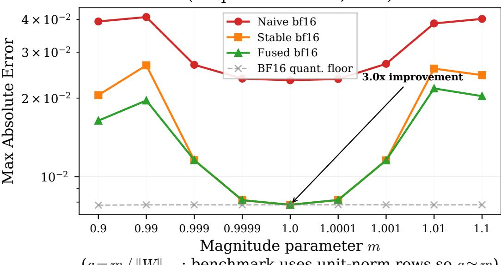
$$
(g = m= kWkrow; benchmark uses unit-norm rows so g ¼ m)
Figure 1: The stable compose form achieves 3*.*0× lower peak error near *g* ≈ 1 (bf16, *d*out = 8192, *d*in = 2048). The naive form *g* ⊙ (*s* · lora + base) − base exhibits catastrophic cancellation; the stable form and fused kernel both remain near the bf16 quantization floor. Reference: fp64.
bf16 multiplication is non-associative: all code paths enforce a single canonical evaluation order (*s* · lora first, then *g* · (·)), ensuring bitwise parity across all PyTorch composition paths.
**Autotuning.** Optimal kernel configurations vary substantially across GPUs (∼9% pairwise agreement across six GPUs), requiring per-device autotuning rather than a static table. First-run autotuning takes 10–30 s per kernel, and caches persist in Triton's default directory. Details in Appendix [B.](#page-21-0)

## Backward Kernel
The fused backward computes *d*lora = *g* · *s* · *d*out and *d*base = (*g*−1)· *d*out in a single Triton pass. Two design decisions merit note:
- **Reduced ROWS\_PER\_PROGRAM**: Writing two output tensors doubles per-element traffic; reducing rows per program lowers register pressure and improves SM utilization.
- *d***mag via PyTorch reduction**: The magnitude gradient uses a separate .sum() rather than tl.atomic\_add, avoiding contention at large num\_rows and the non-deterministic ordering of floating-point atomics.

## Norm Assembly Kernel
A second Triton kernel fuses Equation [5,](#page-2-1) computing *w*norm from the three factored terms. Storereload barriers prevent FMA fusion, and an inline PTX sqrt.rn.f32 instruction replaces Triton's default approximate sqrt, exactly reproducing PyTorch's evaluation order. The kernel stops at
$$
<span id="page-6-1"></span>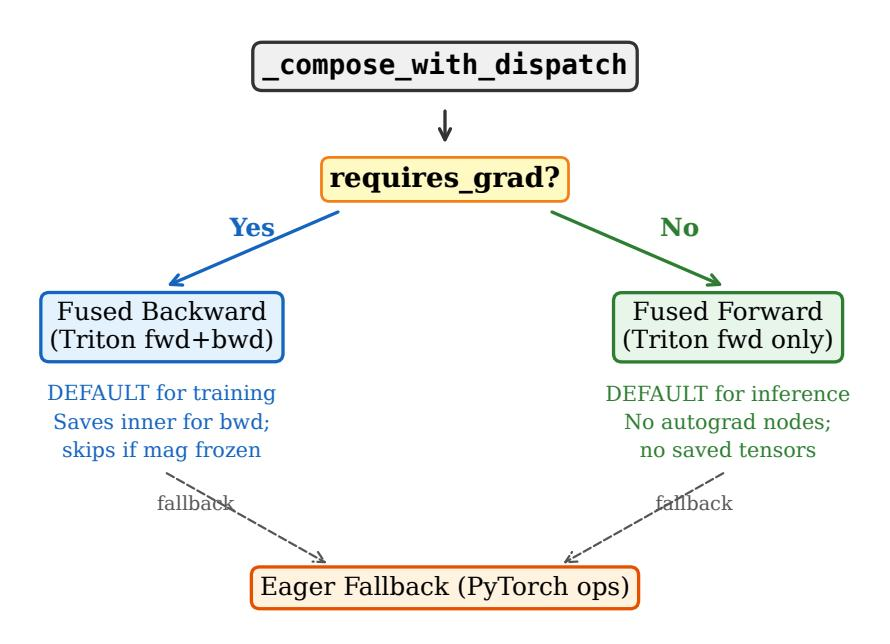
$$
*CPU / non-contiguous / Triton unavailable / env disabled*
Figure 2: Three-tier dispatch: fused backward for training (Tier 1), fused forward for inference (Tier 2), eager fallback for CPU, no-Triton, or sub-crossover shapes (Tier 3).
Table 2: Dispatch tiers and their selection criteria.
$$
<span id="page-6-2"></span>
$$
| Tier | Path           | When                                             | Tradeoff                                        |
$$
|------|----------------|--------------------------------------------------|-------------------------------------------------|
| 1    | Fused Backward | Training + CUDA + Triton +<br>auto-gate/force-on | Fastest above crossover; saves inner<br>for bwd |
$$
| 2    | Fused Forward  | Inference + CUDA + Triton                        | Speed without bwd memory                        |
$$
| 3    | Eager Fallback | CPU / no Triton / force-off /<br>sub-crossover   | Universal compatibility                         |
$$
*w*norm; the magnitude division (Equation [6\)](#page-2-2) remains in PyTorch so both norm paths share the same precision context. Appendix [C](#page-22-0) provides exact specifications for all three kernels.
$$
### <span id="page-6-0"></span>**4 Runtime Dispatch**
$$
The composition path is selected at runtime by \_compose\_with\_dispatch (Figure [2,](#page-6-1) Table [2\)](#page-6-2). Four environment variables control kernel availability and working-set budgets; defaults require no configuration.
**Tier 1 (Fused Backward).** A dual-output Triton kernel computes both the output and the saved tensor inner = *s*·lora+base in a single pass, eliminating the forward-pass VRAM spike from sequential PyTorch ops. When the magnitude is frozen (requires\_grad=False), the inner allocation is skipped entirely. The default auto-mode crossover requires *d*out ≥ 2048 and (batch × seq) × *d*out ≥ 2048 × 6144; smaller activations use Tier 3 because launch latency dominates. In the six evaluated VLMs, KV projections (*d*out as low as 512) fall below the crossover, so ∼71% of adapted modules per layer dispatch to Tier 1 during training and ∼29% fall back to Tier 3.
**Tier 2 (Fused Forward).** A forward-only Triton kernel with no autograd graph nodes, dispatched when requires\_grad is false.
**Tier 3 (Eager Fallback).** Pure PyTorch; handles CPU, no-Triton, and sub-crossover training. Uses out-of-place composition when autograd is active to avoid aliasing.
**Precision.** All PyTorch compose paths produce bitwise-identical forward outputs by enforcing a single evaluation order. The Triton kernels preserve the same algebra but not bitwise equality (FMA contraction and reduction trees can perturb last bits); we treat Triton–PyTorch agreement as an empirical envelope: fp32 outputs stay within 10−<sup>4</sup> max-abs error, bf16/fp16 remain within dtype-appropriate tolerances ([§5.8\)](#page-14-0).
**Compatibility.** The fused compose is registered as a custom op (peft::fused\_dora\_compose) via torch.library, making the dispatch graph-break-free under torch.compile when dropout is inactive (*p* = 0). DeepSpeed ZeRO-2/3 and FSDP1 are supported; FSDP2/DTensor is not ([§6\)](#page-16-0). The forward contract, torch.compile details, and the chunked-dropout path are specified in Appendices [A](#page-21-1) and [B.](#page-21-2)
**Magnitude division.** Across all tiers, *g* = **m***/* max(*w*norm*, ϵ*) is computed in PyTorch outside the no\_grad norm context, ensuring identical precision regardless of execution tier.
$$
### <span id="page-7-0"></span>**5 Experiments**
$$

## Setup
Microbenchmarks use six GPUs spanning four architecture generations (Table [3\)](#page-8-0); model-level benchmarks use three GPUs (RTX 6000 PRO, H200, B200) with sufficient VRAM for the tested models. All GPUs run identical software: PyTorch 2.10.0+cu130, Triton 3.6.0, Transformers 5.2.0, CUDA 13.1, driver 580.126.09. The PEFT baseline is upstream commit 20a9829 (v0.18.0.rc0).<sup>1</sup> Model-level benchmarks exclude the optimizer step to isolate DoRA overhead and use a partialsequence loss (1024 loss tokens) to match production RLHF/GRPO memory profiles; full-sequence loss creates a 6–12 GB logit spike that masks adapter working-set differences. A sensitivity check at 4096 loss tokens confirms speedups are unchanged. Each microbenchmark reports the median of 200 CUDA-event-timed trials (10 warmup); model-level benchmarks use 20 repeats (3 warmup, CV *<* 1.7%). Memory measurement methodology and full reproducibility instructions are provided in Appendix [D.](#page-22-1)

## Model-Level Performance
Table [4](#page-8-1) summarizes the headline result: gradient-computation speedup across six 8–32B VLMs on three GPUs. The fused implementation is 1*.*46–1*.*87× faster than HF PEFT's DoRA implementation and 1*.*18–1*.*24× faster than our own eager baseline, with 1*.*3–6*.*7 GB lower peak VRAM (Table [8\)](#page-14-1). These timings cover forward+backward only (excluding optimizer updates), so the end-to-end
$$
<sup>1</sup>Later HEAD 9cf86c7 (2026-02-24) is algorithmically identical for training; see [§7.](#page-17-0)
<span id="page-8-0"></span>Table 3: Benchmark hardware. "Micro": microbenchmark coverage. "Model": full model-level gradient-computation and inference benchmarks.
$$
| GPU          | Arch            | Memory       | BW (TB/s) | Scope       |
$$
|--------------|-----------------|--------------|-----------|-------------|
$$
| L40S         | SM89 Ada        | 48 GB GDDR6  | 0.86      | Micro       |
| A100-SXM4    | SM80 Ampere     | 80 GB HBM2e  | 2.04      | Micro       |
| RTX 6000 PRO | SM120 Blackwell | 96 GB GDDR7  | 1.60      | Micro+Model |
| H200         | SM90 Hopper     | 141 GB HBM3e | 4.80      | Micro+Model |
| B200         | SM100 Blackwell | 192 GB HBM3e | 7.70      | Micro+Model |
| B300         | SM103 Blackwell | 268 GB HBM3e | 7.70      | Micro       |
<span id="page-8-1"></span>Table 4: Gradient-computation speedup on 8–32B VLMs (*r* = 384, bf16, seq=4096, bs=1, ga=8, loss\_tokens=1024, 20 repeats). The HF PEFT DoRA baseline takes 46–87% longer per iteration than fused. 32B models OOM on RTX 6000 PRO (96 GB) under all configurations. See Table [5](#page-8-2) for absolute times.
|                |       |       | Speedup vs. PEFT DoRA | Speedup vs. Eager |       |       |  |
$$
|----------------|-------|-------|-----------------------|-------------------|-------|-------|--|
$$
| Model          | RTX   | H200  | B200                  | RTX               | H200  | B200  |  |
$$
| Qwen2.5-VL-32B | OOM   | 1.73× | 1.74×                 | OOM               | 1.20× | 1.22× |  |
| Qwen3-VL-32B   | OOM   | 1.66× | 1.67×                 | OOM               | 1.18× | 1.21× |  |
| Qwen3.5-27B    | 1.51× | 1.57× | 1.57×                 | 1.22×             | 1.21× | 1.23× |  |
| Gemma3-27B     | 1.53× | 1.61× | 1.56×                 | 1.20×             | 1.19× | 1.21× |  |
| Mistral-Sm-24B | 1.66× | 1.87× | 1.87×                 | 1.22×             | 1.21× | 1.23× |  |
| Qwen3-VL-8B    | 1.46× | 1.50× | 1.47×                 | 1.23×             | 1.21× | 1.24× |  |
$$
<span id="page-8-2"></span>Table 5: Absolute gradient-computation time (seconds). Each iteration covers 8 gradientaccumulation micro-steps; 32 768 tokens total. Standard deviations ≤ 0*.*13 s (CV *<* 1.7%).
|                | Fused (s) |      | Eager (s) |      |      | PEFT (s) |      |      |      |
$$
|----------------|-----------|------|-----------|------|------|----------|------|------|------|
$$
| Model          | RTX       | H200 | B200      | RTX  | H200 | B200     | RTX  | H200 | B200 |
| Qwen2.5-VL-32B | OOM       | 30.9 | 23.3      | OOM  | 37.1 | 28.5     | OOM  | 53.6 | 40.4 |
| Qwen3-VL-32B   | OOM       | 33.4 | 25.4      | OOM  | 39.5 | 30.6     | OOM  | 55.4 | 42.3 |
$$
| Qwen3.5-27B    | 39.5      | 25.4 | 19.4      | 48.1 | 30.6 | 23.9     | 59.5 | 39.8 | 30.5 |
| Gemma3-27B     | 41.6      | 27.5 | 21.4      | 50.0 | 32.7 | 25.8     | 63.6 | 44.1 | 33.4 |
$$
| Mistral-Sm-24B | 32.5      | 20.9 | 15.9      | 39.7 | 25.2 | 19.6     | 53.9 | 39.1 | 29.8 |
| Qwen3-VL-8B    | 12.9      | 9.1  | 7.1       | 15.9 | 11.0 | 8.8      | 18.8 | 13.7 | 10.5 |
wall-clock gain is smaller: in the 2000-step convergence run, the same optimization reduced total training time by 8.3% once optimizer, data loading, and framework overhead were included ([§5.9\)](#page-15-0). The 32B models exceed the 96 GB RTX 6000 PRO under *all* configurations; this is a capacity limit, not a method-specific regression.
**Inference.** Inference speedup is higher than gradient computation: 1*.*5–2*.*0× over PEFT, 1*.*14– 1*.*20× over eager (Figure [4\)](#page-9-0), because the forward pass concentrates the compose savings without dilution from backward-pass work. RTX 6000 PRO runs inference on all six models including 32B (84–88 GB peak), which OOM during gradient computation.
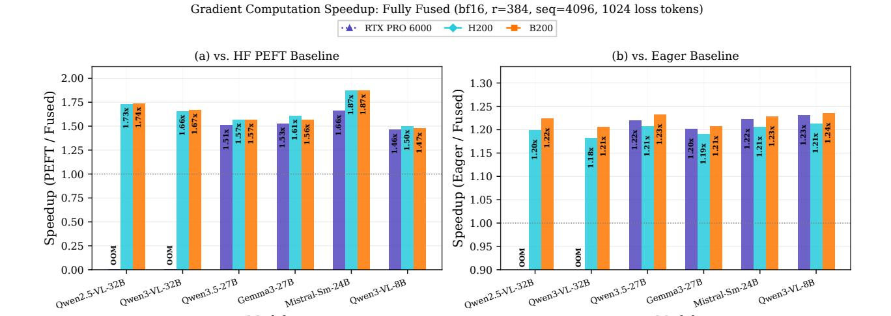
Figure 3: Gradient-computation speedup across six VLMs on three GPUs (bf16, r = 384, seq=4096). (a) Fused vs. the HF PEFT DoRA baseline: 1.46–1.87×. (b) Fused vs. eager: 1.18–1.24×. 32B models OOM on RTX 6000 PRO under all configurations.
Model
Gemm Model
$$
<span id="page-9-0"></span>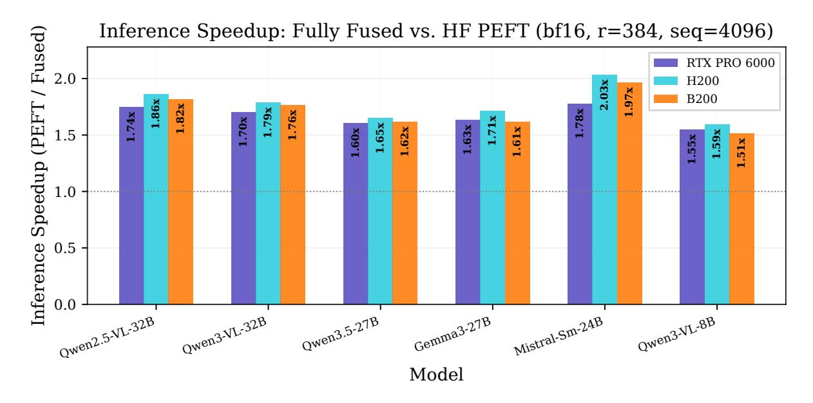
$$
Figure 4: Inference speedup: 1.5–2.0× over the HF PEFT DoRA baseline. All six models run on all three GPUs, including 32B on RTX 6000 PRO (96 GB) that OOM during gradient computation.
**High-rank scaling.** Table 6 validates the high-rank framing at r = 384, 512, and 768. Speedup vs. PEFT DoRA increases with rank for the 32B model  $(1.66 \times \rightarrow 1.74 \times)$  because PEFT's materialization cost grows with r, while the factored norm's rank-dependent overhead (**U** and **G**) remains small. Speedup vs. eager decreases modestly  $(1.18 \times \rightarrow 1.14 \times)$  as larger LoRA matmuls dilute the compose kernel's contribution.
<span id="page-10-1"></span>Table 6: Speedup vs. the HF PEFT DoRA baseline grows with rank; speedup vs. eager decreases modestly (H200, bf16, seq=4096, 20 repeats).
|              |      |       | vs. PEFT DoRA | vs. Eager |        |  |
$$
|--------------|------|-------|---------------|-----------|--------|--|
$$
| Model        | Rank | Grad. | Infer.        | Grad.     | Infer. |  |
$$
|              | 384  | 1.57× | 1.65×         | 1.21×     | 1.16×  |  |
| Qwen3.5-27B  | 512  | 1.61× | 1.68×         | 1.18×     | 1.14×  |  |
|              | 768  | 1.53× | 1.59×         | 1.15×     | 1.11×  |  |
|              | 384  | 1.66× | 1.78×         | 1.18×     | 1.14×  |  |
| Qwen3-VL-32B | 512  | 1.70× | 1.82×         | 1.16×     | 1.12×  |  |
|              | 768  | 1.74× | 1.87×         | 1.14×     | 1.10×  |  |
$$
Dense-BA Position: 0% = Eager, 100% = Fully Fused (Grad Compute)
$$
<span id="page-10-2"></span>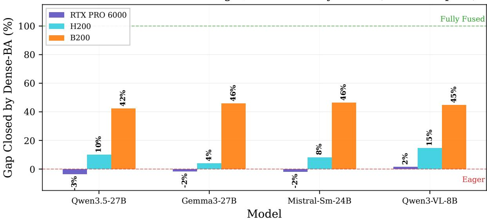
$$
Figure 5: Dense (B@A) position in the eager-to-fused gap (0% = eager, 100% = fused). Negative values: dense (B@A) is *slower* than eager. The benefit is GPU-bandwidth-sensitive; the factored approach is robust.
$$
#### <span id="page-10-0"></span>**5.3 Why Dense (B@A) Is Not Enough**
$$
Computing lora\_B.weight @ lora\_A.weight directly (the most obvious fix) eliminates the identity matrix but still materializes the full [*d*out*, d*in] product. Figure [5](#page-10-2) shows that dense (B@A) captures 0% of the eager-to-fused gap on some model/GPU combinations and is sometimes *slower* than the eager baseline. Dense (B@A) also uses 1–2 GB more peak VRAM than fused on all tested models. The full factored norm is necessary for consistent gains across GPU architectures.

## Compose Kernel Performance
Figure [6](#page-11-1) shows compose speedup across activation sizes on six GPUs. Geometric mean forward speedup (bf16, all 20 shapes): 2*.*70× B200, 2*.*62× B300, 2*.*00× H200, 1*.*92× RTX 6000 PRO, 1*.*73× A100, 1*.*47× L40S. The consistency from GDDR6 (0.86 TB/s) to HBM3e (7.7 TB/s) confirms the gains derive from reduced memory traffic rather than architecture-specific effects.
$$
<span id="page-11-1"></span>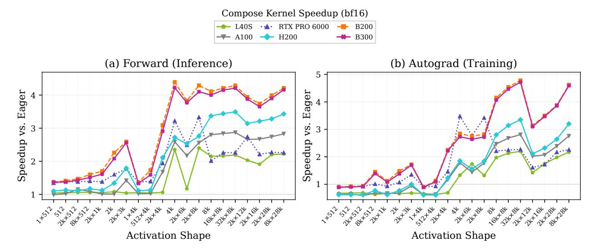
$$
Figure 6: Compose kernel speedup vs. eager (bf16) across six GPUs. (a) Forward:  $1.5-4.5\times$ . (b) Autograd: gains compound with activation size.
$$
<span id="page-11-0"></span>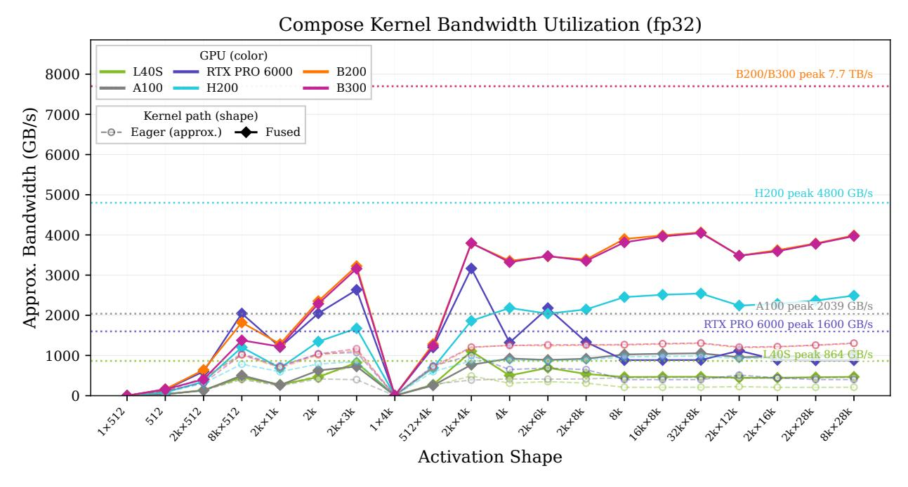
$$
Figure 7: Bandwidth utilization (fp32, six GPUs). Fused approaches  $\sim 50\%$  of peak on all architectures; eager values are approximate lower bounds.
Bandwidth utilization. The fused kernel achieves  $3950-4070\,\mathrm{GB/s}$  on  $B200/B300~(\sim53\%)$  of peak),  $2490-2540\,\mathrm{GB/s}$  on  $H200~(\sim53\%)$ ,  $1040-1050\,\mathrm{GB/s}$  on  $A100~(\sim52\%)$ ,  $880-890\,\mathrm{GB/s}$  on RTX 6000 PRO  $(\sim55\%)$ , and  $460-470\,\mathrm{GB/s}$  on L40S  $(\sim54\%)$  at the largest shapes (Figure 7). On B200, the eager path reaches only 17% of peak, yielding the largest absolute bandwidth gap. Throughput scales nearly linearly with peak bandwidth across the full  $0.86-7.7\,\mathrm{TB/s}$  range, confirming these kernels are memory-bandwidth-bound.
$$
<span id="page-12-0"></span>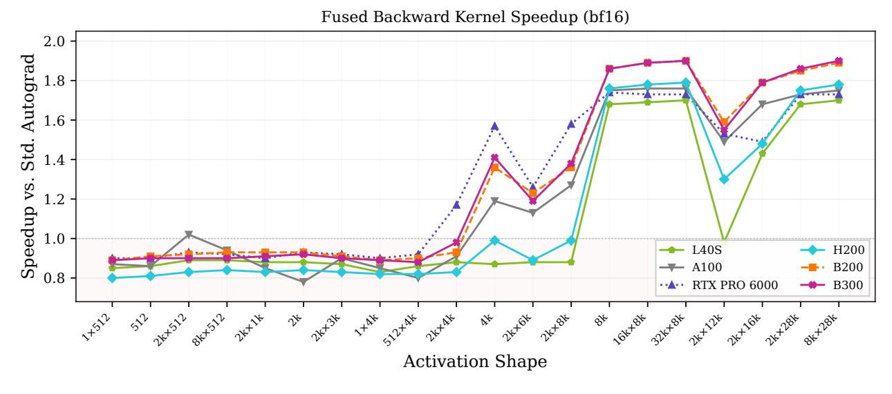
$$
Figure 8: Backward speedup (bf16). Below  $\sim 4096 \times 4096$ , launch overhead dominates; above  $\sim 8192 \times 8192$ , fused wins on all GPUs.
<span id="page-12-1"></span>Table 7: Norm memory: measured allocation delta and theoretical reduction (fp32, H200). Measured reductions are smaller than theoretical because they include the rank-independent base-norm transient (§2.3).
| Shape              | Rank | PEFT              | Factored         | Meas. $\times$ | Theory ×      |
$$
|--------------------|------|-------------------|------------------|----------------|---------------|
$$
| $4096\times4096$   | 64   | $192\mathrm{MB}$  | $65\mathrm{MB}$  | $3.0 \times$   | $63 \times$   |
| $4096\times4096$   | 384  | $192\mathrm{MB}$  | $71\mathrm{MB}$  | $2.7 \times$   | $9.8 \times$  |
| $4096\times4096$   | 512  | $192\mathrm{MB}$  | $73\mathrm{MB}$  | $2.6 \times$   | $7.1 \times$  |
| $8192 \times 8192$ | 384  | $768\mathrm{MB}$  | $245\mathrm{MB}$ | $3.1 \times$   | $20.4 \times$ |
| $8192 \times 8192$ | 512  | $768\mathrm{MB}$  | $241\mathrm{MB}$ | $3.2 \times$   | $15.1 \times$ |
| $8192 \times 8192$ | 768  | $768\mathrm{MB}$  | $236\mathrm{MB}$ | $3.2 \times$   | $9.8 \times$  |
| $4096\times11008$  | 384  | $516\mathrm{MB}$  | $179\mathrm{MB}$ | $2.9 \times$   | $26.2 \times$ |
| $8192\times28672$  | 384  | $2688\mathrm{MB}$ | $245\mathrm{MB}$ | $11.0 \times$  | $71.3 \times$ |

## Backward Kernel Performance
The backward kernel shows a clear crossover: below  $\sim 2048 \times 6144$  (rows  $\times$   $d_{\rm out}$ ), launch overhead dominates and fused can trail eager (0.88–0.99×); above  $\sim 8192 \times 8192$ , fused wins on all six GPUs (Figure 8). Geometric mean speedup (bf16, all shapes): 1.23× B200, 1.22× B300/RTX 6000 PRO, 1.16× A100, 1.08× H200, 1.06× L40S. Gradient correctness: fp32  $d_{\rm lora}$  and  $d_{\rm base}$  match the eager baseline at tolerance floor;  $d_{\rm mag}$  shows  $\leq 2.14 \times 10^{-4}$  difference due to the separate reduction path.

## Norm Memory Reduction
Figure 9 and Table 7 show both theoretical and measured memory reductions. The  $8192 \times 28672$  MoE shape achieves  $11 \times$  measured reduction. The factored norm's latency tradeoff (Figure 10) is hardware-dependent: on RTX 6000 PRO, factored matches or outperforms the reference at  $r \leq 384$  for  $8192 \times 8192$  matrices.
$$
<span id="page-13-0"></span>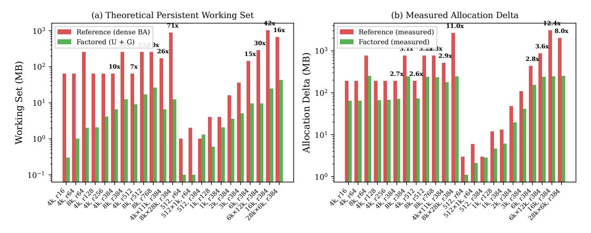
$$
<span id="page-13-1"></span>Figure 9: Norm memory reduction. (a) Theoretical persistent working set. (b) Measured allocator delta. The MoE shape  $8192 \times 28672$  achieves  $11 \times$  measured reduction.
RTX PRO 6000: Norm Computation Latency vs. Rank
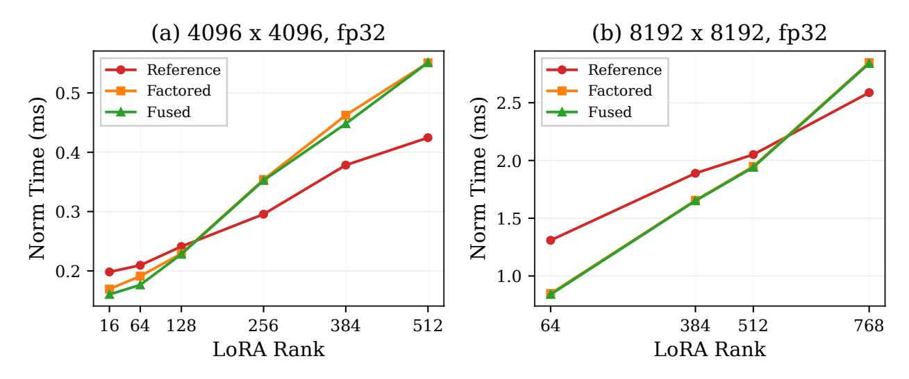
Figure 10: Norm latency vs. rank (RTX 6000 PRO, fp32). The PEFT time is constant in r; factored scales linearly. At  $r \le 128$ , factored matches the reference due to reduced memory traffic.

## Memory Profile
The fused backward path reduces forward peak VRAM by eliminating intermediate materialization while maintaining identical backward peak (Figure 11). At the model level (Table 8), fused uses 0.1–1.0 GB less peak VRAM than eager and 1.2–6.7 GB less than PEFT. Dense (B@A) uses more peak VRAM than fused on all models.
$$
<span id="page-14-2"></span>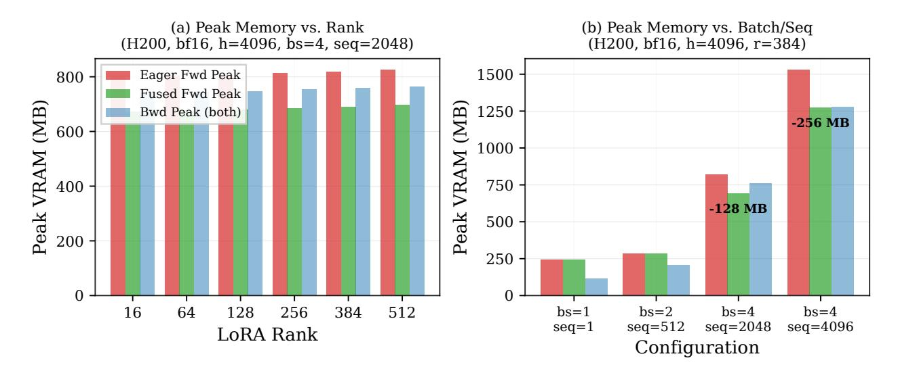
$$
Figure 11: Memory profile (H200, bf16, *d*= 4096, bs=4, seq=2048). (a) Fused reduces forward peak by 64 MB. (b) Savings grow with batch×seq; backward peak is unchanged.
<span id="page-14-1"></span>Table 8: Model-level peak VRAM (GB). Fused uses less than all baselines on every model. 32B models OOM on RTX 6000 PRO.
| Model                                    | Method      | RTX  | H200  | B200  |  |
$$
|------------------------------------------|-------------|------|-------|-------|--|
$$
|                                          | Eager       | OOM  | 99.2  | 99.2  |  |
|                                          | Fused       | OOM  | 98.4  | 98.4  |  |
| Qwen2.5-VL-32B                           | Dense (B@A) | OOM  | 100.6 | 100.6 |  |
|                                          | PEFT        | OOM  | 103.5 | 103.5 |  |
|                                          | Eager       | 71.6 | 71.7  | 71.6  |  |
|                                          | Fused       | 70.6 | 70.7  | 70.6  |  |
| Mistral-Sm-24B                           | Dense (B@A) | 73.3 | 73.4  | 73.3  |  |
|                                          | PEFT        | 77.3 | 77.4  | 77.3  |  |
|                                          | Eager       | 29.8 | 29.9  | 29.8  |  |
|                                          | Fused       | 29.5 | 29.5  | 29.5  |  |
| Qwen3-VL-8B                              | Dense (B@A) | 30.1 | 30.2  | 30.1  |  |
|                                          | PEFT        | 30.7 | 30.8  | 30.7  |  |
| Full table (all 6 models) in Appendix E. |             |      |       |       |  |
$$
#### <span id="page-14-0"></span>**5.8 Cross-Architecture Consistency**
$$
Table [9](#page-15-1) summarizes microbenchmark speedups across all six GPUs. Model-level eager/fused speedups range from 1*.*18× to 1*.*24× with cross-GPU CV *<* 2%, providing stronger statistical evidence than additional repeats on a single GPU.
**Fidelity.** Cosine similarity between fused and eager final logits exceeds 0*.*9999 for all six models on all three GPUs (cos ≥ 0*.*999996 on HBM-class GPUs). An earlier code version showed reduced fidelity on Gemma-3-12B (cos = 0*.*991–0*.*999); the root cause was fusing the magnitude division into Triton, which allowed FMA contraction and approximate sqrt to perturb rounding at large
<span id="page-15-1"></span>Table 9: Geometric mean microbenchmark speedups (all shapes, 200 repeats). Norm memory 0*.*8× in bf16 means factored uses *more* memory for the isolated norm due to fp32 accumulation transients ([§2.3\)](#page-2-0).
|                          | Compose fwd | Backward | E2E   | Norm mem |  |
$$
|--------------------------|-------------|----------|-------|----------|--|
| L40S bf16                | 1.47×       | 1.06×    | 1.05× | 0.8×     |  |
| A100 bf16                | 1.73×       | 1.16×    | 1.07× | 0.8×     |  |
| RTX 6000 PRO bf16        | 1.92×       | 1.22×    | 1.08× | 0.8×     |  |
| H200 bf16                | 2.00×       | 1.08×    | 1.06× | 0.8×     |  |
| B200 bf16                | 2.70×       | 1.23×    | 1.08× | 0.8×     |  |
| B300 bf16                | 2.62×       | 1.22×    | 1.08× | 0.8×     |  |
$$
| fp32 rows in Appendix F. |             |          |       |          |  |
<span id="page-15-2"></span>Table 10: Multi-seed convergence: eager vs. fused training loss (Qwen3.5-9B-Base, *r* = 384, 2000 steps). Grand mean per-step delta 7*.*1 × 10−<sup>4</sup> ; final eval losses agree to *<* 1*.*5 × 10−<sup>4</sup> .
| Seed | Steps      | Mean  ∆  | Max  ∆   | Eval  ∆  | Wall (fused/eager) |
$$
|------|------------|----------|----------|----------|--------------------|
| 1    | 2000       | 7.2×10−4 | 1.1×10−2 | 9.2×10−5 | 330/362 min        |
| 2    | 2000       | 6.9×10−4 | 3.3×10−3 | 1.4×10−4 | 330/359 min        |
| 3    | 2000       | 7.1×10−4 | 4.1×10−3 | 3.3×10−5 | 330/359 min        |
|      | Grand mean | 7.1×10−4 | —        | 8.9×10−5 | 330/360 min        |
$$
activation scales. De-fusing the division ([§4\)](#page-6-0), adding store-reload barriers, and replacing the sqrt with inline PTX resolved the discrepancy, improving fidelity to cos *>* 0*.*9999 across all GPUs.
$$
#### <span id="page-15-0"></span>**5.9 Convergence Equivalence**
$$
To verify that fused kernels do not affect training dynamics, we trained controlled SFT experiments on a length-filtered derivative of MMFineReason-SFT-123K [\[Lin et al.,](#page-19-5) [2026\]](#page-19-5) using Qwen3.5-9B-Base, DoRA *r* = 384, *α* = 192, rsLoRA, bf16, AdamW, ZeRO-2, gradient checkpointing, bs = 3, ga = 2, seq= 5120, 2000 steps on a single RTX 6000 PRO, using the SWIFT framework [\[Zhao et al.,](#page-20-3) [2024\]](#page-20-3), with three seeds (× eager/fused = 6 runs). Table [10](#page-15-2) and Figure [12](#page-16-1) summarize the results.
The worst-case single-step delta (1*.*1 × 10−<sup>2</sup> , seed 1, step 398) is a transient early-training divergence that does not propagate: by step 1000, all deltas fall below 3*.*3 × 10−<sup>3</sup> . Gradient norms track identically, confirming that the *d*mag reduction-ordering difference does not accumulate over 2000 steps.
**Wall-clock.** The fused path completed 2000 steps in 330 min compared with 360 min for the eager baseline (8.3% reduction), consistent with the 21% gradient-computation speedup diluted by optimizer steps, data loading, and framework overhead.
**Cross-model and cross-optimizer check.** An additional pair on Qwen3-VL-8B-Instruct with Muon+AdamW (*r*= 256, single seed) showed consistent results: mean |∆loss| = 7*.*7 × 10−<sup>4</sup> , final eval |∆| = 3*.*9 × 10−<sup>5</sup> , 8.2% wall-clock reduction.
$$
<span id="page-16-1"></span>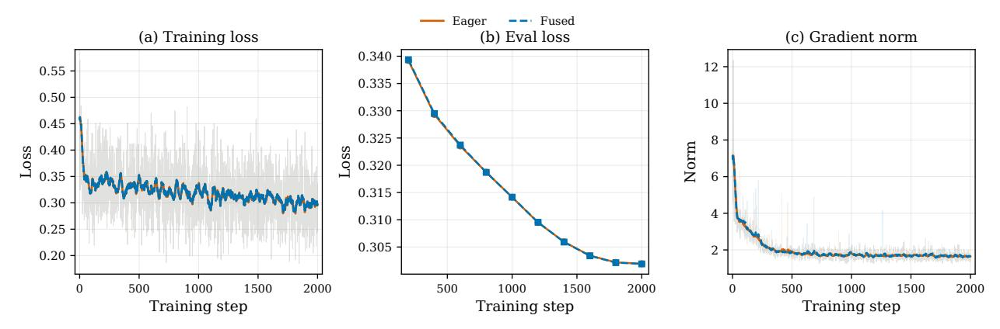
$$
Figure 12: Convergence: eager vs. fused are visually indistinguishable (Qwen3.5-9B-Base, r=384, seed 3 of 3). (a) Training loss (25-step smoothing). (b) Eval loss (200-step intervals). (c) Gradient norms.
$$
#### <span id="page-16-0"></span>6 Discussion
$$

## Deployment Context
The factored norm is particularly valuable when training and inference compete for GPU memory. Our GRPO [Shao et al., 2024] pipeline co-locates vLLM [Kwon et al., 2023] (tensor-parallel inference) alongside DoRA fine-tuning ( $r\!=\!384$ ) of a 38B VLM on 4×B200 (192 GB each), with large global batches under ZeRO-2 and gradient checkpointing. After vLLM reserves its KV-cache allocation, training headroom per GPU is tight; the memory challenge is cumulative rather than catastrophic. Each of the 500+ adapted modules re-materializes its norm temporaries during gradient checkpointing recomputation, and the resulting transient allocations fragment the caching allocator. Cross-device bandwidth, already under pressure from gradient all-reduce and tensor-parallel inference communication, leaves little margin for the additional memory traffic of dense per-module materialization. The factored norm eliminates these transients, and we observed no numerical drift attributable to fusion. (This is an illustrative anecdote and was not benchmarked under the methodology of §5.)

## Tradeoffs and Limitations
Table 11 consolidates practitioner recommendations.
Where fusion offers no advantage. Below  $\sim 2048 \times 6144$  activations, launch latency dominates; the dispatch encodes this crossover conservatively. On non-CUDA platforms, Triton kernels are unavailable.
**Fused backward VRAM.** The fused backward saves one activation-sized tensor (inner) per module, but the dual-output kernel also eliminates the forward-pass spike from sequential ops. Net effect: fused uses 0.1–1.0 GB *less* peak VRAM than eager at the model level. With frozen magnitude, inner is skipped entirely.
**Numerical precision.** All PyTorch compose paths are bitwise identical. Triton preserves the same algebra but not bitwise equality (§4). Residual drift concentrates in  $d_{\text{mag}}$  reductions rather
Table 11: Recommended configuration by scenario.
$$
<span id="page-17-1"></span>
$$
| Scenario                           | Config              | Rationale                                       |
$$
|------------------------------------|---------------------|-------------------------------------------------|
$$
| Training, CUDA,<br>above crossover | Tier 1 (fused bwd)  | Full speedup; 0.1–1.0 GB less VRAM than eager   |
| Training,<br>memory-constrained    | Tier 1 + frozen mag | inner skipped; lower peak VRAM                  |
| Inference, CUDA                    | Tier 2 (fused fwd)  | Compose speedup, no backward memory             |
| CPU / no Triton                    | Tier 3 (eager)      | Automatic fallback                              |
| r ≥ 384, any single<br>GPU         | Factored norm       | PEFT path 46–87% slower                         |
$$
| r ≤ 64, d ≤ 4096                   | Either norm         | Factored overhead minimal                       |
$$
| Colocated train +<br>infer         | Factored norm       | Dense temporaries compete with inference budget |
$$
than pointwise compose. Convergence studies ([§5.9\)](#page-15-0) confirm these differences do not accumulate.
$$
**Distributed training.** DeepSpeed ZeRO-2/3 and FSDP1 are supported. FSDP2/DTensor is not: the factored norm assumes access to the full base weight **W**. Extending to FSDP2 would require distributed accumulation of the chunk-wise partial sums followed by an all-reduce over the shard dimension; the per-row output ([*d*out]) is small enough to replicate. We leave this for future work.
**Embedding formula correction.** PEFT's embedding path computes only *g* ⊙ lora · *s*, omitting (*g*−1) ⊙ base. Our implementation applies the full DoRA formula consistently across all layer types. No headline benchmarks include adapted embeddings; checkpoints fine-tuned with PEFT's embedding path may require re-fine-tuning or a legacy composition fallback.
**Ablation.** Model-level speedups reflect both contributions (factored norm + fused kernels) jointly. Microbenchmarks (Tables [9](#page-15-1) and [7\)](#page-12-1) provide component-level measurements, and the model-level eager-vs.-fused comparison provides a partial ablation of the kernel-fusion contribution. A fuller factorial ablation across additional model families would strengthen the evidence.
$$
### <span id="page-17-0"></span>**7 Related Work**
$$
**Parameter-efficient fine-tuning.** LoRA [\[Hu et al.,](#page-19-1) [2022\]](#page-19-1) introduced low-rank adapter decomposition; DoRA [\[Liu et al.,](#page-19-0) [2024\]](#page-19-0) adds magnitude-direction separation. rsLoRA [\[Kalajdzievski,](#page-19-2) [2023\]](#page-19-2) provides rank-stabilized scaling that interacts with our factored norm (*s* appears in all three terms of Equation [2\)](#page-1-1).
**DoRA variants.** EDoRA [\[Nasiri and Garraghan,](#page-20-5) [2025\]](#page-20-5) reduces static parameter count via SVD; DoRAN [\[Diep et al.,](#page-19-7) [2025\]](#page-19-7) injects noise into the normalization denominator. Both address statistical efficiency rather than transient memory; our optimization is complementary. Chronicals [\[Nair,](#page-20-6) [2026\]](#page-20-6) and LoRAFusion [\[Zhu et al.,](#page-20-7) [2026\]](#page-20-7) fuse LoRA-related operations but do not target the DoRA-specific norm or composition.
**Framework implementations.** Every major framework we checked (HF PEFT, torchtune, Unsloth, SWIFT, LLaMA-Factory, Axolotl) uses the same torch.eye materialization pattern. Unsloth explicitly disables its custom kernels when DoRA is active; orchestration frameworks delegate entirely to PEFT. As of February 2026, no existing framework avoids materializing the dense **BA** product (Appendix [G\)](#page-26-0).
**Kernel fusion.** FlashAttention [\[Dao et al.,](#page-19-8) [2022,](#page-19-8) [Dao,](#page-19-9) [2024\]](#page-19-9) demonstrated that tiled, fused kernels improve both speed and memory for attention. Liger Kernel [\[Hsu et al.,](#page-19-10) [2024\]](#page-19-10) applies similar principles to cross-entropy, SwiGLU, and RMSNorm. Our work targets the DoRA composition, a simpler (element-wise with broadcasting) but equally memory-bound pattern. The algebraic identity underlying the factored norm (expanding a sum-of-squares into base, cross, and Gram terms) is standard in numerical linear algebra; our contribution is its application to the DoRA-specific computation with dtype discipline, chunking, and integration into the fused pipeline.
**LLM-guided optimization.** Meta's KernelAgent [\[PyTorch,](#page-20-8) [2025\]](#page-20-8) confirmed our compose kernel is near-roofline (89% memory bandwidth SOL, 1.5% improvement). For the backward, KernelAgent discovered a two-stage partial-reduction strategy that fuses the *d*mag reduction, achieving 3*.*58× over eager (88.5% SOL) vs. our 1*.*06–1*.*23×. Our release prioritizes drop-in compatibility and end-to-end wins across real models; integrating that pattern is a direct avenue for future work. KernelAgent's generated listings are included in code/kernelagent\_sols.

## Conclusion
We presented a systems implementation of DoRA: a factored norm that reduces working memory from O(*d*out × *d*in) to O(*d*out × *r* + *r* 2 ), and fused Triton kernels that collapse multi-step composition into single-pass GPU operations.
On six 8–32B VLMs, the fused implementation is 1*.*5–2*.*0× faster than HF PEFT's DoRA implementation for inference, and 1*.*5–1*.*9× faster for gradient computation (optimizer step excluded), with up to 7 GB lower peak VRAM. Microbenchmarks on six GPUs spanning four architecture generations confirm 1*.*5–2*.*7× compose-kernel speedup. Fidelity holds at three levels: operator tests within quantization-aware bounds, final-logit cos *>* 0*.*9999, and matched training curves across seeds.
**Known limitations.** FSDP2 is unsupported. Convergence validation covers two model families, two optimizers, and one dataset in the SFT regime; generalization to RL pipelines remains to be confirmed. Model-level benchmarks cover three of six GPUs; L40S, A100, and B300 have microbenchmark coverage only. The dispatch crossover is an empirical heuristic that may need retuning for future hardware.

## Data Availability
All source code, benchmark scripts, raw JSON results, Triton autotune caches, and figure generation scripts are available at <https://github.com/sockeye44/dorafactors> (tag v1.0). The convergence validation uses a public dataset (MMFineReason-SFT-123K; [Lin et al.](#page-19-5) [2026\)](#page-19-5) for fully reproducible confirmation. The authors declare no competing interests.

## Acknowledgements
This work was developed through extensive collaborative programming with Claude Opus 4.6 (Anthropic), which contributed to kernel implementation, test design, numerical analysis, and iterative debugging. The authors take full responsibility for the accuracy and integrity of the work.

## References
- <span id="page-19-4"></span>Jason Ansel, Edward Yang, Horace He, Natalia Gimelshein, Animesh Jain, Michael Voznesensky, Bin Bao, Peter Bell, David Berard, Evgeni Burovski, et al. PyTorch 2: Faster machine learning through dynamic Python bytecode transformation and graph compilation. In *Proceedings of the 29th ACM International Conference on Architectural Support for Programming Languages and Operating Systems*, volume 2 of *ASPLOS '24*. ACM, 2024. doi: 10.1145/3620665.3640366.
- <span id="page-19-3"></span>Tianqi Chen, Bing Xu, Chiyuan Zhang, and Carlos Guestrin. Training deep nets with sublinear memory cost. *arXiv preprint arXiv:1604.06174*, 2016.
- <span id="page-19-9"></span>Tri Dao. FlashAttention-2: Faster attention with better parallelism and work partitioning. In *International Conference on Learning Representations*, 2024. arXiv:2307.08691.
- <span id="page-19-8"></span>Tri Dao, Daniel Y. Fu, Stefano Ermon, Atri Rudra, and Christopher Ré. FlashAttention: Fast and memory-efficient exact attention with IO-awareness. In *Advances in Neural Information Processing Systems*, volume 35, pages 16344–16359, 2022. arXiv:2205.14135.
- <span id="page-19-7"></span>Nghiem T. Diep, Hien Dang, Tuan Truong, Tan Dinh, Huy Nguyen, and Nhat Ho. DoRAN: Stabilizing weight-decomposed low-rank adaptation via noise injection and auxiliary networks. *arXiv preprint arXiv:2510.04331*, 2025.
- <span id="page-19-10"></span>Pin-Lun Hsu, Yun Dai, Vignesh Kothapalli, Qingquan Song, Shao Tang, Siyu Zhu, Steven Shimizu, Shivam Sahni, Haowen Ning, and Yanning Chen. Liger kernel: Efficient triton kernels for LLM training. *arXiv preprint arXiv:2410.10989*, 2024.
- <span id="page-19-1"></span>Edward J. Hu, Yelong Shen, Phillip Wallis, Zeyuan Allen-Zhu, Yuanzhi Li, Shean Wang, Lu Wang, and Weizhu Chen. LoRA: Low-rank adaptation of large language models. In *International Conference on Learning Representations*, 2022. arXiv:2106.09685.
- <span id="page-19-2"></span>Damjan Kalajdzievski. A rank stabilization scaling factor for fine-tuning with LoRA. *arXiv preprint arXiv:2312.03732*, 2023.
- <span id="page-19-6"></span>Woosuk Kwon, Zhuohan Li, Siyuan Zhuang, Ying Sheng, Lianmin Zheng, Cody Hao Yu, Joseph E. Gonzalez, Hao Zhang, and Ion Stoica. Efficient memory management for large language model serving with PagedAttention. In *Proceedings of the 29th Symposium on Operating Systems Principles*, SOSP '23, pages 611–626. ACM, 2023. doi: 10.1145/3600006.3613165. arXiv:2309.06180.
- <span id="page-19-5"></span>Honglin Lin, Zheng Liu, Yun Zhu, Chonghan Qin, Juekai Lin, Xiaoran Shang, Conghui He, Wentao Zhang, and Lijun Wu. MMFineReason: Closing the multimodal reasoning gap via open datacentric methods. *arXiv preprint arXiv:2601.21821*, 2026. <https://mmfinereason.github.io/>.
- <span id="page-19-0"></span>Shih-Yang Liu, Chien-Yi Wang, Hongxu Yin, Pavlo Molchanov, Yu-Chiang Frank Wang, Kwang-Ting Cheng, and Min-Hung Chen. DoRA: Weight-decomposed low-rank adaptation. In *Proceedings of the 41st International Conference on Machine Learning*, volume 235 of *Proceedings of Machine Learning Research*, pages 32100–32121. PMLR, 2024. arXiv:2402.09353.
- <span id="page-20-0"></span>Sourab Mangrulkar, Sylvain Gugger, Lysandre Debut, Younes Belkada, Sayak Paul, Benjamin Bossan, and Marian Tietz. PEFT: State-of-the-art parameter-efficient fine-tuning methods. <https://github.com/huggingface/peft>, 2022.
- <span id="page-20-6"></span>Arjun S. Nair. Chronicals: A high-performance framework for LLM fine-tuning with 3.51x speedup over unsloth. *arXiv preprint arXiv:2601.02609*, 2026.
- <span id="page-20-5"></span>Hamid Nasiri and Peter Garraghan. EDoRA: Efficient weight-decomposed low-rank adaptation via singular value decomposition. *arXiv preprint arXiv:2501.12067*, 2025.
- <span id="page-20-8"></span>PyTorch. KernelAgent — multi-agent GPU kernel synthesis, 2025. URL [https://github.com/](https://github.com/meta-pytorch/KernelAgent) [meta-pytorch/KernelAgent](https://github.com/meta-pytorch/KernelAgent).
- <span id="page-20-1"></span>Samyam Rajbhandari, Jeff Rasley, Olatunji Ruwase, and Yuxiong He. ZeRO: Memory optimizations toward training trillion parameter models. In *Proceedings of the International Conference for High Performance Computing, Networking, Storage and Analysis*, SC '20. IEEE Press, 2020. doi: 10.5555/3433701.3433727. arXiv:1910.02054.
- <span id="page-20-4"></span>Zhihong Shao, Peiyi Wang, Qihao Zhu, Runxin Xu, Junxiao Song, Xiao Bi, Haowei Zhang, Mingchuan Zhang, Y. K. Li, Y. Wu, and Daya Guo. DeepSeekMath: Pushing the limits of mathematical reasoning in open language models. *arXiv preprint arXiv:2402.03300*, 2024.
- <span id="page-20-2"></span>Philippe Tillet, H. T. Kung, and David Cox. Triton: An intermediate language and compiler for tiled neural network computations. In *Proceedings of the 3rd ACM SIGPLAN International Workshop on Machine Learning and Programming Languages*, MAPL 2019, pages 10–19. ACM, 2019. doi: 10.1145/3315508.3329973.
- <span id="page-20-3"></span>Yuze Zhao, Jintao Huang, Jinghan Hu, Xingjun Wang, Yunlin Mao, Daoze Zhang, Zeyinzi Jiang, Zhikai Wu, Baole Ai, Ang Wang, Wenmeng Zhou, and Yingda Chen. SWIFT: A scalable lightweight infrastructure for fine-tuning, 2024. URL <https://arxiv.org/abs/2408.05517>.
- <span id="page-20-7"></span>Zhanda Zhu, Qidong Su, Yaoyao Ding, Kevin Song, Shang Wang, and Gennady Pekhimenko. LoRAFusion: Efficient LoRA fine-tuning for LLMs. In *Proceedings of the Nineteenth European Conference on Computer Systems*, EuroSys '26, 2026. arXiv:2510.00206.
<span id="page-21-1"></span>**A Forward Contract and Execution Semantics**

## Module Interface & Compose Semantics
$$
- **Output:** The module computes a delta ∆**Y**; the caller applies **Y** = **Y**base + ∆**Y**.
- **Compose Equation:** ∆**Y** = *g* ⊙ (*s***XA**<sup>⊤</sup>**B**<sup>⊤</sup>) + (*g* − 1) ⊙ **Y**base.
$$

## Norm Policy
- Recomputed every forward pass; never cached across steps.
$$
- Detached (no gradient flow), per [Liu et al.](#page-19-0) [\[2024\]](#page-19-0) §4.3.
$$
- Accumulated in FP32 with autocast disabled.
$$
- *ϵ* = 10−<sup>12</sup> (fp32/fp64) or 10−<sup>6</sup> (bf16/fp16).
$$
- Bias subtracted before compose, re-added after.
*Formal contract for clean-room replication.*
$$
### <span id="page-21-2"></span>**B Implementation Details**
$$
**Chunk alignment.** The chunk size aligns to 64 elements on CUDA/XPU devices for Tensor Core MMA alignment on all NVIDIA architectures since Volta.
**Environment variables.** PEFT\_DORA\_FUSED (0 = force eager), PEFT\_DORA\_FUSED\_BACKWARD (1 = force fused bwd, 0 = disable, unset = auto), PEFT\_DORA\_NORM\_CHUNK\_MB and PEFT\_DORA\_FWD\_ CHUNK\_MB (override 256 MB defaults).
$$
**Scale-is-zero fast path.** When *s* = 0, cross and ba\_sq are skipped; **U** and **G** are not allocated.
$$
**Dtype-aware epsilon.** 10−<sup>12</sup> for fp32/fp64; 10−<sup>6</sup> for bf16/fp16. For fp16 (max ≈ 65504), *ε* = 10−<sup>6</sup> limits the quotient to ∼10<sup>6</sup> , reducing saturation risk.
<span id="page-21-0"></span>**Compose kernel autotuning.** RPP=1 is selected in 95% of autotuned entries (1149/1206). Exact config agreement between GPUs is ∼9%, confirming per-device autotuning is essential.
**Chunked dropout path.** When dropout is active, \_compose\_with\_base\_chunks iterates over output-dimension slices with adaptive sizing, decorated with @dynamo\_disable to avoid runaway recompilations.
**Magnitude broadcast shape guard.** A shape guard gates Triton kernel dispatch on whether the magnitude vector broadcasts exclusively along the last dimension of the activation tensor. The Triton compose kernel treats magnitude as a 1-D vector along the last dimension; Conv-style shapes like [1*, C,* 1*,* 1] applied to [*N, C, H, W*] activations would violate this assumption. The guard checks both element count and last-dimension alignment; failing shapes route to the PyTorch fallback.
**Custom op for torch.compile.** The registered backward uses PyTorch (not Triton) because AOTAutograd traces with FakeTensors. Eager training uses Triton for both forward and backward; compiled training uses Inductor to fuse the PyTorch backward graph.
$$
### <span id="page-22-0"></span>**C Kernel Specifications**
$$
This appendix provides exact specifications for the three Triton kernels and the PyTorch magnitude division stage, including casting points, fused operations, shape constraints, and reduction ordering, to support a clean-room reimplementation.
- **1. Compose Forward kernel.** Fuses (*g* − 1) ⊙ base + *g* ⊙ *s* ⊙ lora in one pass. Inputs: base [bs*,*seq*, d*out], lora [bs*,*seq*, d*out], *g* [*d*out], *s* (scalar). Output: delta [bs*,*seq*, d*out]. All tensors in input dtype (fp16/bf16/fp32); no intermediate dtype cast. *g* is broadcast along all but the last dimension.
- **2. Compose Backward kernel.** Fuses *d*lora = *g* ·*s*·*d*out and *d*base = (*g*−1)·*d*out in a single Triton pass. *d*mag is computed separately via a .sum() reduction over the batch/sequence dimensions on the inner activation; this avoids non-deterministic tl.atomic\_add ordering.
- **3. Norm Assembly kernel (norm-only).** Inputs: base\_sq [*d*out], cross [*d*out], ba\_sq [*d*out] (all fp32), two\_s (scalar, = 2*s*, precomputed in fp64), s2 (scalar, = *s* 2 , precomputed in fp64). Computes *w*norm = p max(base\_sq + two\_s · cross + s2 · ba\_sq*,* 0) in fp32 with store-reload barriers after each multiply-add to prevent FMA fusion, exactly reproducing PyTorch's separate-kernel evaluation order. The clamp preserves NaN semantics (matching torch.clamp\_min, which propagates NaNs per IEEE 754) rather than collapsing NaNs to zero. The square root uses inline PTX sqrt.rn.f32 for IEEE 754 correctly-rounded results (Triton's tl.sqrt compiles to sqrt.approx.ftz.f32 on SM90). The kernel returns the result in the input dtype. In default mode, it uses a fixed block size of 256 (norm kernels are launch-latency bound; see Appendix [B\)](#page-21-0); comprehensive autotuning over 36 configurations (block sizes 32–2048) is available for new GPU architectures. If future Triton versions change the lowering of tl.sqrt to IEEE-compliant rounding, the inline PTX can be removed; the Tier-3 eager fallback provides a portable alternative on any platform.
- **4. Magnitude division (PyTorch).** The division *g* = **m***/* max(*w*norm*, ε*) is always computed in PyTorch after the norm assembly kernel returns. This ensures identical precision regardless of whether the Triton or PyTorch norm path was used, at the cost of one additional element-wise kernel launch (negligible relative to surrounding matmuls).
**Shape constraints.** *d*out must be divisible by BLOCK\_SIZE (128). The magnitude vector must broadcast only along the last dimension of the activation; other broadcast shapes (e.g., [1*, C,* 1*,* 1] applied to [*N, C, H, W*]) route to the Tier-3 eager fallback. Non-contiguous input tensors also fall back to Tier 3.
**Tested compatibility matrix.** Table [12](#page-23-0) summarizes the integration points explicitly tested, with notes on scope and caveats. "Tested" indicates the feature was exercised in benchmarks or convergence runs reported in this paper; "CI only" indicates coverage via the test suite (1041 tests) but not in model-level experiments.
$$
### <span id="page-22-1"></span>**D Reproducibility**
$$
**Code and data.** All source code, benchmark scripts, raw JSON results, Triton autotune caches, and figure generation scripts are available at <https://github.com/sockeye44/dorafactors> (tag v1.0). The patched PEFT module is included as a git submodule (vendor/dorafactors-peft,
$$
<span id="page-23-0"></span>Table 12: Compatibility matrix. Scope: *Bench* = model-level benchmarks, *Conv* = convergence runs, *CI* = operator-level test suite.
$$
| Feature                  | Status | Scope      | Notes                                              |
$$
|--------------------------|--------|------------|----------------------------------------------------|
$$
| Mixed-precision bf16     | ✓      | Bench+Conv | All model benchmarks and<br>convergence runs       |
| Mixed-precision fp16     | ✓      | CI         | Operator tests only; no<br>model-level fp16 runs   |
| Gradient checkpointing   | ✓      | Bench+Conv | All model benchmarks use<br>gradient checkpointing |
| ZeRO-2                   | ✓      | Conv       | All convergence runs use ZeRO-2                    |
| ZeRO-3                   | ✓      | CI         | Parameter gathering tested; no<br>model-level runs |
| FSDP1                    | ✓      | CI         | summon_full_params path tested                     |
| FSDP2 / DTensor          | ✗      | —          | Not supported; see §6                              |
$$
| torch.compile            | ✓      | CI         | Graph-break-free when p= 0; see<br>§6              |
$$
| Linear layers            | ✓      | Bench+Conv | Primary target; all benchmarks                     |
| Conv1d / Conv2d / Conv3d | ✓      | CI         | Correctness tests; no perf<br>benchmarks           |
| Embedding layers         | ✓      | CI         | Formula correction (§6); no perf<br>benchmarks     |
branch v1); cloning with --recurse-submodules fetches it automatically. Alternatively, the patch can be reconstructed via git apply hf.patch against upstream PEFT commit 20a9829<sup>2</sup> . All commands below assume the repository root as working directory.
**Software environment.** All benchmarks were run under a single, pinned software stack: PyTorch 2.10.0+cu130 (built against CUDA 13.0 for compatibility), Triton 3.6.0, Transformers 5.2.0, CUDA toolkit 13.1 (ptxas V13.1.115), driver 580.126.09, Python 3.12.12 on Linux 6.8.0 (Ubuntu 22.04, glibc 2.35). The exact environment is published as a Docker image<sup>3</sup> for full-stack reproducibility; a code/requirements.txt is also included.
**Memory measurement methodology.** We report three complementary memory metrics, each appropriate to a different level of analysis:
- **Allocator peak** (torch.cuda.max\_memory\_allocated()): the maximum bytes actually allocated by PyTorch's caching allocator. Used for microbenchmark memory deltas (Tables [1](#page-3-0) and [7\)](#page-12-1), measured after reset\_peak\_memory\_stats() and empty\_cache() to isolate a single operation's footprint.
- **Working-set delta** (max\_memory\_allocated − baseline\_allocated): the peak minus the model's quiescent allocation, capturing the true transient overhead of DoRA's forward/backward pass. Used for model-level gradient-computation analysis ([§5.3,](#page-10-0) Table [4\)](#page-8-1).
- **Reserved VRAM** (memory\_reserved): the amount of memory the GPU physically withholds from other processes, including caching allocator fragmentation overhead. Used for peak VRAM comparison (Table [8\)](#page-14-1) because it determines whether colocated workloads can share the device.
<sup>2</sup>PEFT commit: [20a9829](https://github.com/huggingface/peft/commit/20a9829) (v0.18.0.rc0, 2025-09-16).
<sup>3</sup>Docker image: <https://hub.docker.com/r/alexazel/dorafactors-env>. Tag: cu131-pt210-vllm-t52-base.
Every memory claim in this paper specifies both the metric and the dtype (fp32 vs. bf16) to avoid conflation.

## Microbenchmark reproduction
```text
# 200 repeats , extended shapes , bf16
python code / bench_dora_comprehensive . py \
  -- shapes extended -- repeats 200 -- warmup 10 \
  -- dtype bf16 -- json - out results . json
```
Each run produces a self-contained JSON file with per-test timing distributions (200 samples), memory measurements, and pre-computed summary statistics. The –shapes extended flag generates the 20 unique activation shapes (60 entries across 3 ranks) used throughout this paper.
**Model identifiers.** All model-level benchmarks use the following Hugging Face model IDs (weights downloaded March 2026; exact file hashes in the JSON artifacts):
- Qwen/Qwen2.5-VL-32B-Instruct
- Qwen/Qwen3-VL-32B-Instruct
$$
- Qwen/Qwen3.5-27B
- google/gemma-3-27b-it
- unsloth/Mistral-Small-3.2-24B-Instruct-2506
$$
- Qwen/Qwen3-VL-8B-Instruct

## Convergence validation dataset
The convergence validation ([§5.9\)](#page-15-0) uses a token-length-filtered subset of OpenDataArena/ MMFineReason-SFT-123K-Qwen3-VL-235B-Thinking [\[Lin et al.,](#page-19-5) [2026\]](#page-19-5), repacked with mechanical field renames (question→query, qwen3vl\_235b\_thinking\_response→response) and filtered to tok\_len ≤ 4096. The repacked dataset is published at eyes-ml/\protect\penalty\z@ {}MMFineReason-SFT-123K-\protect\penalty\z@{}Qwen3-VL-235B-Thinking-QR-max4096 on Hugging Face Hub; the filtering script is included in the repository (code/scripts/ repack\_mmfinereason\_qr.py).
**Convergence validation environment.** Training uses [SWIFT](https://github.com/modelscope/ms-swift) [\[Zhao et al.,](#page-20-3) [2024\]](#page-20-3) (commit a807cb9) with PyTorch 2.10.0+cu130, Transformers 5.2.0, Triton 3.6.0, DeepSpeed 0.18.6, Flash-Attention 2.8.3. The full environment (including qwen-vl-utils, mamba\_ssm, flash-linearattention) uses the same Docker image as the benchmarks (see Software environment above) with the additional training dependencies installed.

## Model benchmark reproduction
```text
# 6 models , r=384 , loss_tokens =1024
python code / bench_dora_comprehensive . py \
  -- suite models -- rank 384 -- batch 1 -- seqlen 4096 \
  -- grad - accum 8 -- loss - tokens 1024 -- repeats 20 \
  -- json - out models . json
```
**Figure regeneration.** All figures can be regenerated from the included JSON artifacts:
```text
python paper / generate_figures . py
```
This produces 13 PDF figures in paper/figures/ sourced from the code/bench\_it6/ data directory (6 GPUs × 3 dtypes for microbenchmarks, 3 GPUs for model-level). The convergence figure (Figure [12\)](#page-16-1) is generated separately from TensorBoard logs via python paper/generate\_training\_ figure.py.
**Test suite.** The full test suite (1041 tests) has been validated on SM 80 through SM 120 (Ampere– Blackwell); Triton kernel tests require SM ≥ 80:
```text
cp code / scripts / dora . reference_hf_peft . py \
   vendor / dorafactors - peft / docs /
cd vendor / dorafactors - peft
pytest tests / test_lora_variants . py \
        tests / tuners / lora / test_dora_fused . py \
        tests / tuners / lora / test_dora_math . py -v
```
$$
### <span id="page-25-0"></span>**E Full Model-Level Memory Table**
Table [13](#page-25-1) extends the main-body memory comparison (Table [8\)](#page-14-1) to all six models.
$$
<span id="page-25-1"></span>Table 13: Model-level gradient-computation peak VRAM (GB) across three GPUs, all six models. Same setup as Table [8.](#page-14-1) Values from peak\_vram\_mb.
| Model          | Method                                                        | RTX 6000 PRO                                                                                                                                                                         | H200  | B200  |
|----------------|---------------------------------------------------------------|--------------------------------------------------------------------------------------------------------------------------------------------------------------------------------------|-------|-------|
|                | Eager                                                         |                                                                                                                                                                                      | 99.2  | 99.2  |
|                | Fused                                                         | OOM<br>OOM<br>OOM<br>OOM<br>OOM<br>OOM<br>OOM<br>OOM<br>83.4<br>83.3<br>84.3<br>85.4<br>83.2<br>82.9<br>84.3<br>86.1<br>71.6<br>70.6<br>73.3<br>77.3<br>29.8<br>29.5<br>30.1<br>30.7 | 98.4  | 98.4  |
| Qwen2.5-VL-32B | Dense (B@A)                                                   |                                                                                                                                                                                      | 100.6 | 100.6 |
|                | PEFT                                                          |                                                                                                                                                                                      | 103.5 | 103.5 |
|                | Eager                                                         |                                                                                                                                                                                      | 99.2  | 99.1  |
| Qwen3-VL-32B   | Fused                                                         |                                                                                                                                                                                      | 98.4  | 98.4  |
|                | Dense (B@A)                                                   |                                                                                                                                                                                      | 100.5 | 100.4 |
|                | PEFT                                                          |                                                                                                                                                                                      | 103.0 | 102.9 |
|                | Eager                                                         |                                                                                                                                                                                      | 83.5  | 83.4  |
|                | Fused<br>Dense (B@A)<br>PEFT<br>Eager<br>Fused<br>Dense (B@A) |                                                                                                                                                                                      | 83.4  | 83.3  |
$$
| Qwen3.5-27B    |                                                               |                                                                                                                                                                                      | 84.4  | 84.3  |
$$
|                |                                                               |                                                                                                                                                                                      | 85.5  | 85.4  |
|                |                                                               |                                                                                                                                                                                      | 83.2  | 83.1  |
|                |                                                               |                                                                                                                                                                                      | 83.0  | 82.9  |
$$
| Gemma3-27B     |                                                               |                                                                                                                                                                                      | 84.4  | 84.3  |
$$
|                | PEFT                                                          |                                                                                                                                                                                      | 86.1  | 86.1  |
|                | Eager                                                         |                                                                                                                                                                                      | 71.7  | 71.6  |
|                | Fused                                                         |                                                                                                                                                                                      | 70.7  | 70.6  |
| Mistral-Sm-24B | Dense (B@A)                                                   |                                                                                                                                                                                      | 73.4  | 73.3  |
|                | PEFT                                                          |                                                                                                                                                                                      | 77.4  | 77.3  |
|                | Eager                                                         |                                                                                                                                                                                      | 29.9  | 29.8  |
|                | Fused                                                         |                                                                                                                                                                                      | 29.5  | 29.5  |
| Qwen3-VL-8B    | Dense (B@A)                                                   |                                                                                                                                                                                      | 30.2  | 30.1  |
|                | PEFT                                                          |                                                                                                                                                                                      | 30.8  | 30.7  |
$$
### <span id="page-26-1"></span>**F Single-Layer E2E Decomposition**
$$
The following figures show single-layer end-to-end (E2E) speedup, which isolates the per-layer overhead but does *not* predict model-level speedup. Compose gains compound across ∼500 DoRA modules in a real model, while per-layer backward overhead is amortized, so single-layer E2E can understate the model-level benefit.
**fp32 microbenchmark summary.** Table [14](#page-26-2) provides the fp32 rows omitted from the main-body summary (Table [9\)](#page-15-1). Norm memory 3*.*2× in fp32 reflects the full theoretical benefit, since both paths accumulate in fp32 and the PEFT baseline also allocates fp32 temporaries.
$$
<span id="page-26-2"></span>Table 14: Geometric mean microbenchmark speedups, fp32 (all shapes, 200 repeats). Complement to Table [9.](#page-15-1)
$$
|                   | Compose fwd | Backward | E2E   | Norm mem |
$$
|-------------------|-------------|----------|-------|----------|
| L40S fp32         | 1.53×       | 1.21×    | 1.04× | 3.2×     |
| A100 fp32         | 1.64×       | 1.20×    | 1.02× | 3.2×     |
| RTX 6000 PRO fp32 | 1.97×       | 1.27×    | 1.06× | 3.2×     |
| H200 fp32         | 1.84×       | 1.13×    | 1.03× | 3.2×     |
| B200 fp32         | 2.35×       | 1.26×    | 1.03× | 3.2×     |
| B300 fp32         | 2.23×       | 1.21×    | 1.03× | 3.2×     |
## <span id="page-26-0"></span>**G Framework Survey**
$$
Table [15](#page-26-3) summarizes the DoRA norm implementation across five major fine-tuning frameworks as of February 2026. We manually inspected the DoRA-related source code in each framework's main branch at the specified commits/versions, searching for norm computation implementations. Paths are shown relative to each framework's source root for readability. All use the same densematerialization algorithm; none offer a memory-efficient alternative.
$$
<span id="page-26-3"></span>Table 15: DoRA norm implementation in major fine-tuning frameworks (February 2026).
$$
| Framework        | Version  | File Path                | Pattern            |
$$
|------------------|----------|--------------------------|--------------------|
$$
| HF PEFT          | 20a9829  | peft/tuners/lora/dora.py | torch.eye          |
| torchtune        | v0.5.0   | modules/peft/dora.py     | Same algorithm     |
| Unsloth          | 2026.3.7 | Disables custom kernels  | Falls back to PEFT |
| SWIFT (ms-swift) | a807cb9  | Defers to PEFT/Unsloth   | No custom code     |
| LLaMA-Factory    | v0.9.3   | Delegates to PEFT        | No custom code     |
| Axolotl          | v0.6.0   | Delegates to PEFT        | No custom code     |
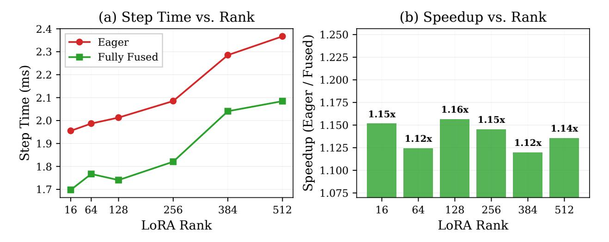
Figure 13: Single-layer E2E overhead decomposition (B200, bf16, *d* = 4096, bs=4, seq=2048). Single-layer E2E does not predict model-level speedup: compose gains compound across ∼500 DoRA modules while per-layer backward overhead is amortized.
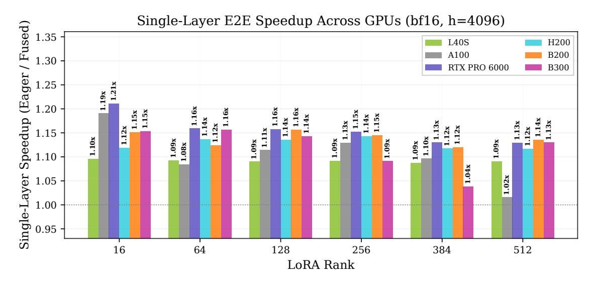
Figure 14: Single-layer E2E speedup (eager/fused) across six GPUs and ranks (bf16, *d* = 4096, bs=4, seq=2048). All GPUs show consistent improvement.
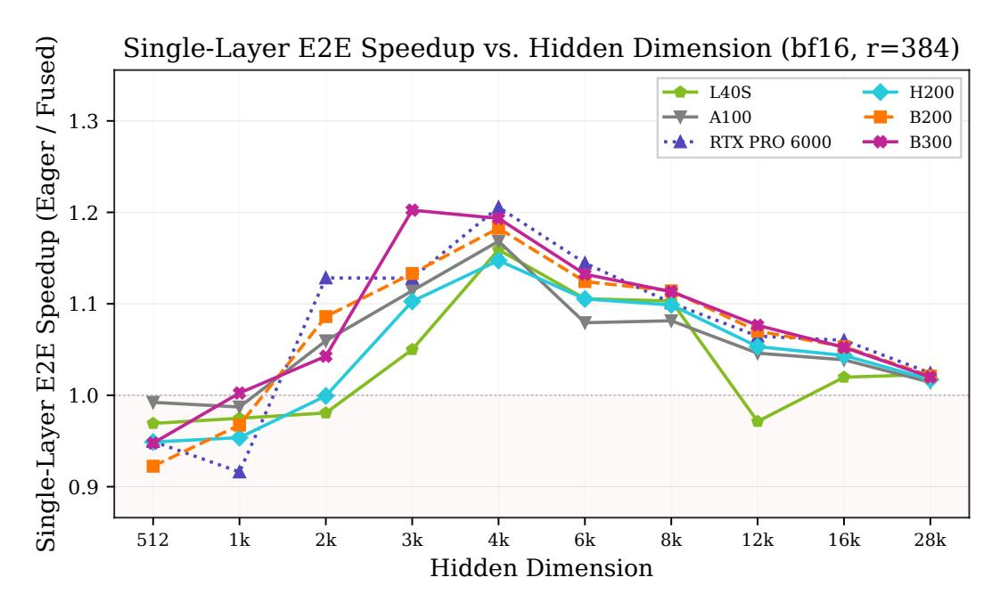
Figure 15: Single-layer E2E speedup vs. hidden dimension (bf16, *r* = 384, six GPUs). The benefit peaks at *h* = 3072–4096, corresponding to common LLM sizes.