# p110

<!-- document_mode: hybrid_paper -->

<!-- page 1 mode: simple_text -->

Scaling DoRA: High-Rank Adaptation via Factored Norms and

Fused Kernels

Alexandra Zelenin∗ Alexandra Zhuravlyova

March 24, 2026

## arXiv:2603.22276v1 [cs.LG] 23 Mar 2026

### Abstract

Weight-Decomposed Low-Rank Adaptation (DoRA; Liu et al. [2024]) extends LoRA by decoupling weight magnitude from direction, but its forward pass requires the row-wise norm ∥W + sBA∥row, a computation that every major framework we surveyed implements by materializing the dense [dout, din] product BA. At din = 8192 and rank r = 384, a single module’s norm requires ∼512 MB of transient working memory in bf16, making high-rank DoRA costly and often infeasible on common single-GPU setups once hundreds of adapted modules and checkpointing are involved.

We present two systems contributions: a factored norm that decomposes the squared norm into base, cross, and Gram terms computable through O(doutr + r2) intermediates, eliminating the dense product. Fused Triton kernels collapse the four-kernel DoRA composition into a single pass, reducing memory traffic by ∼4× and using a numerically stable form that avoids catastrophic cancellation in the near-unity rescaling regime where magnitude scales concentrate in practice.

Across six 8–32B vision-language models (VLMs) on three NVIDIA GPUs (RTX 6000 PRO, H200, B200) at r=384 in bf16, the fused implementation is 1.5–2.0× faster than HF PEFT’s DoRA implementation for inference, and 1.5–1.9× faster for gradient computation (optimizer step excluded), with up to 7 GB lower peak VRAM. Microbenchmarks on six GPUs spanning four architecture generations (L40S, A100, RTX 6000 PRO, H200, B200, B300) confirm 1.5–2.7× compose-kernel speedup. Final-logit cosine similarity exceeds 0.9999 across all model/GPU pairs, and multi-seed training curves match within 7.1 × 10−4 mean per-step loss delta over 2000 steps.

1

Introduction

Low-Rank Adaptation (LoRA; Hu et al. 2022) is the dominant method for parameter-efficient finetuning. DoRA [Liu et al., 2024] extends LoRA by decomposing the adapted weight into magnitude and direction:

W′ = m ⊙ W + sBA

∥W + sBA∥row (1)

where W ∈Rdout×din is the frozen base weight, B ∈Rdout×r and A ∈Rr×din are low-rank factors, s is a scaling coefficient (e.g., rsLoRA; Kalajdzievski 2023), and m ∈Rdout is a learnable magnitude vector. High-rank configurations narrow the gap to full fine-tuning on complex downstream tasks [Hu et al., 2022, Liu et al., 2024]. We treat weights as [dout, din] and compute per-output-row norms (dim=1), consistent with PEFT and torchtune.

∗Correspondence: alexa@eyes.ml

1

---

<!-- page 2 mode: hybrid_paper -->

**Table 1 (Page 2)**

|  |
|---|
| x_eye = torch.eye(lora_A.weight.shape[1], ...) # [d_in, d_in] |
| lora_weight = lora_B(lora_A(x_eye)).T # [d_out, d_in] |
| weight_norm = torch.linalg.norm(weight + scaling * lora_weight, dim=1) |
|  |

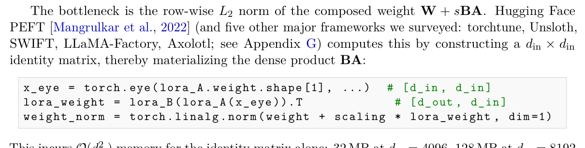

2

Factored Norm Computation

2.1

Algebraic Decomposition

The row-wise squared norm of the composed weight expands into three terms:

∥W + sBA∥2 row = ∥W∥2 row | {z } base

The bottleneck is the row-wise L2 norm of the composed weight W + sBA. Hugging Face PEFT [Mangrulkar et al., 2022] (and five other major frameworks we surveyed: torchtune, Unsloth, SWIFT, LLaMA-Factory, Axolotl; see Appendix G) computes this by constructing a din × din identity matrix, thereby materializing the dense product BA:

This incurs O(d2 in) memory for the identity matrix alone: 32 MB at din = 4096, 128 MB at din = 8192 in bf16. Including the dense BA product and composed-weight copy, a single module allocates 3–4 dense [dout, din] temporaries: ∼512 MB at din = 8192. With gradient checkpointing [Chen et al., 2016], these temporaries are allocated twice per step. Across hundreds of adapted modules in an 8–32B model, this cumulative pressure is a major contributor to both speed degradation and OOM failures at high rank.

The most obvious fix (computing lora_B.weight @ lora_A.weight directly) eliminates the identity matrix but still materializes the full [dout, din] product, which is the dominant cost. We show in §5.3 that this “dense (B@A)” path provides inconsistent speedups that depend on GPU bandwidth class and sometimes runs slower than the PEFT baseline.

This paper does not propose a new adapter architecture, optimizer, or training recipe. Our contribution is systems-oriented: we execute the same DoRA computation with a smaller working set and lower memory traffic. Specifically:

1. A factored norm computation (§2) decomposes ∥W + sBA∥2

row into three terms, each evaluable through O(doutr+r2) intermediates without materializing BA. At d = 8192, r = 512 in fp32, the theoretical persistent-memory reduction is 15× (Table 1).

2. Fused Triton kernels (§3) collapse the DoRA composition (g−1)⊙base+g⊙s⊙lora from four

CUDA kernel launches to one pass. A numerically stable form avoids catastrophic cancellation when g ≈1. Forward speedup: 1.5–2.7× (geometric mean); backward speedup: 1.06–1.23×.

A three-tier runtime dispatch (§4) selects the optimal path (fused backward for training, fused forward for inference, eager fallback for CPU or sub-crossover shapes), compatible with torch.compile [Ansel et al., 2024], gradient checkpointing, DeepSpeed ZeRO [Rajbhandari et al., 2020], and FSDP1.

Both contributions are validated on six NVIDIA GPUs spanning four architecture generations (L40S, A100, RTX 6000 PRO, H200, B200, B300; 48–268 GB) with model-level benchmarks on three GPUs across six 8–32B VLMs (§5). Throughout this paper, four configurations are compared: PEFT (unmodified HF PEFT identity-matrix path), Dense (B@A) (direct product, still materializes the full matrix), Eager (our factored norm with PyTorch composition), and Fused (our factored norm with Triton kernels).

+ 2s⟨W, BA⟩row | {z } cross + s2 ∥BA∥2 row | {z } BA norm

(2)

2

---

<!-- page 3 mode: hybrid_paper -->

Cross term.

The row-wise inner product rewrites as:

⟨W, BA⟩j = X

where U = WA⊤∈Rdout×r accumulates chunk-wise: U ←U + WcA⊤ c .

BA norm.

The row-wise squared norm factors through the Gram matrix:

where G = AA⊤∈Rr×r also accumulates chunk-wise. At r = 512 in fp32, G occupies 1 MB.

2.2

Assembly and Precision

The three per-row scalars assemble into the weight norm:

r

wnorm =

The magnitude division is always computed in PyTorch after the kernel returns:

**Table 1 compares asymptotic and concrete memory costs.**

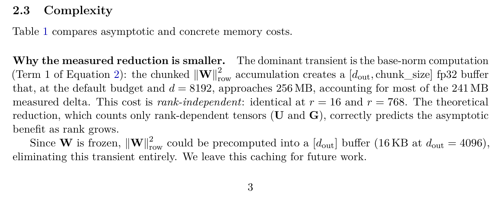

2.3

Complexity

where ⟨·, ·⟩row denotes the row-wise inner product. Each term is computable through low-rank intermediates:

Base norm.

∥W∥2 row accumulates via chunks along din, producing a vector of size dout. Chunking limits working memory to a configurable budget (default: 256 MB).

ℓ Bjℓ· Ujℓ= (B ⊙U)j · 1 (3)

∥BA∥2 j = (BG ⊙B)j · 1 (4)

max  ∥W∥2 row + 2s · cross + s2 · ba_norm, 0  (5)

g ≜m / max(wnorm, ϵ) (6)

This ensures identical precision regardless of whether the Triton or PyTorch norm path produced wnorm, eliminating a source of fidelity divergence we observed at large activation scales (see §5.8).

All accumulation is performed in fp32 under torch.no_grad() with autocast disabled. Disabling autocast alone does not force fp32 when inputs are bf16, so each chunk of W, A, B, and the intermediate Uc is explicitly cast to fp32 before accumulation. This is consistent with the DoRA paper’s instruction (Section 4.3) to treat the norm as a detached constant [Liu et al., 2024]. We use g consistently throughout to denote the post-division scale, distinct from the learnable magnitude m.

---

<!-- page 4 mode: hybrid_paper -->

**Table 1: The factored norm reduces rank-dependent persistent memory by 15× at d=8192, r=512 in fp32. Measured reductions are smaller (3.2×) because allocator deltas include the rank-independent base-norm transient (§2.3).**

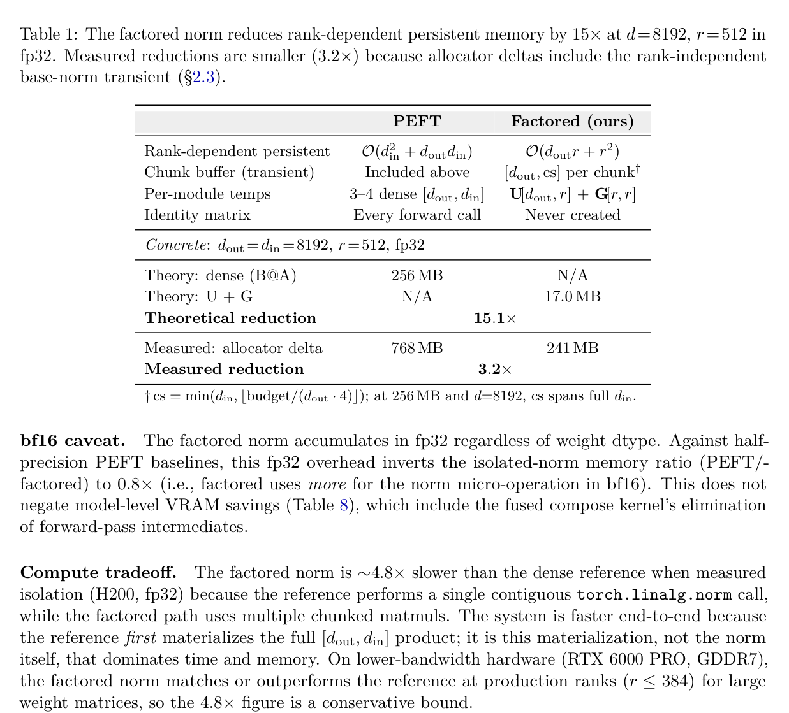

Compute tradeoff.

The factored norm is ∼4.8× slower than the dense reference when measured isolation (H200, fp32) because the reference performs a single contiguous torch.linalg.norm call, while the factored path uses multiple chunked matmuls. The system is faster end-to-end because the reference first materializes the full [dout, din] product; it is this materialization, not the norm itself, that dominates time and memory. On lower-bandwidth hardware (RTX 6000 PRO, GDDR7), the factored norm matches or outperforms the reference at production ranks (r ≤384) for large weight matrices, so the 4.8× figure is a conservative bound.

4

---

<!-- page 5 mode: simple_text -->

### Algorithm 1: Factored Row-wise Norm

Input: W ∈Rdout×din (frozen); A ∈Rr×din, B ∈Rdout×r; s ∈R; ε (dtype-dependent); chunk_budget (bytes, default 256 MB)

cs ←min(din, ⌊budget/(dout · 4)⌋), aligned to 64 elements.

All accumulation in fp32 under torch.no_grad(), autocast disabled. Cast W chunks, A, B to fp32 on the fly.

Initialize: base_sq ←0dout, cross ←0dout, G ←0r×r (all fp32)

for each chunk c of size cs:

W_c = W[:, c:c+cs].float() [dout, cs] A_c = A[:, c:c+cs].float() [r, cs] base_sq += (W_c**2).sum(dim=1) G ←G + AcA⊤ c Uc ←WcA⊤ c [dout, r] (not retained) cross += (B.float() * U_c).sum(dim=1)

ba_sq = (B.float() @ G * B.float()).sum(dim=1) [dout] wnorm ← p

max(base_sq + 2s · cross + s2 · ba_sq, 0) [dout] return w_norm.to(input_dtype)

Notes: Chunk size aligns to 64 for Tensor Core MMA. Uc is never stored for multiple chunks simultaneously. When s=0, cross and ba_sq are skipped; Uc and G are not allocated. G is ≤2.4 MB at r = 768 in fp32.

3

Fused Triton Kernels

3.1

Compose Kernel

The DoRA composition (g−1) ⊙base + g ⊙s ⊙lora decomposes into four sequential element-wise operations in standard PyTorch, each launching a separate CUDA kernel: 3 reads + 1 write per op yields ∼12 memory passes total. The fused Triton [Tillet et al., 2019] kernel collapses these into a single pass: 3 reads (base, lora, g) + 1 write, a ∼4× reduction in memory traffic. The realized speedup of 2.0–2.7× (rather than 4×) reflects the fact that the eager path is partially latency-bound by kernel-launch gaps; the fused kernel achieves ∼50% of peak HBM bandwidth (Figure 7), vs.

∼20% for the eager path.

Numerical stability.

The algebraically equivalent form g ⊙(s · lora + base) −base suffers from catastrophic cancellation when g ≈1. This regime is not hypothetical. The stored magnitude parameters reflect the heterogeneous row norms of pretrained weights and naturally vary across layers and models, but DoRA initializes m = ∥W∥row and magnitudes track weight norms throughout training, so the composed scale g = m/wnorm concentrates tightly around unity (mean ≈1.0, std ≈0.0015). Measurement on a Qwen2-VL-7B adapter (r=128, 326 modules, 1.77M elements) shows that 100% of g values fall in the bf16 collapse zone (|g −1| < εbf16/2) and 20% in the fp16 zone: if (g−1) ⊙base were evaluated in bf16, the base correction would vanish for every element; in fp16, for one in five.

The stable form (g−1) ⊙base + g ⊙s ⊙lora keeps the small correction (g−1) explicit, but its precision advantage depends on fp32 intermediate computation to prevent (g−1) from rounding to zero. Both the Triton kernel and PyTorch fallback use this form with fp32 compute. Figure 1 shows 3.0× lower peak error near g ≈1 compared to the naive alternative. Beyond the algebraic form,

5

---

<!-- page 6 mode: hybrid_paper -->

4 × 10−2

Max Absolute Error

3 × 10−2

2 × 10−2

10−2

bf16 multiplication is non-associative: all code paths enforce a single canonical evaluation order (s · lora first, then g · (·)), ensuring bitwise parity across all PyTorch composition paths.

Autotuning.

Optimal kernel configurations vary substantially across GPUs (∼9% pairwise agreement across six GPUs), requiring per-device autotuning rather than a static table. First-run autotuning takes 10–30 s per kernel, and caches persist in Triton’s default directory. Details in Appendix B.

3.2

Backward Kernel

The fused backward computes dlora = g · s · dout and dbase = (g−1) · dout in a single Triton pass. Two design decisions merit note:

3.3

Norm Assembly Kernel

### Numerical Stability: DoRA Compose at Near-Unity g

### (shape 2048×8192, bf16)

0.9 0.99 0.999 0.9999 1.0 1.0001 1.001 1.01 1.1

Magnitude parameter m

(g = m=kWkrow; benchmark uses unit-norm rows so g ¼ m)

Figure 1: The stable compose form achieves 3.0× lower peak error near g ≈1 (bf16, dout = 8192, din = 2048). The naive form g ⊙(s · lora + base) −base exhibits catastrophic cancellation; the stable form and fused kernel both remain near the bf16 quantization floor. Reference: fp64.

• Reduced ROWS_PER_PROGRAM: Writing two output tensors doubles per-element traffic; reducing rows per program lowers register pressure and improves SM utilization.

• dmag via PyTorch reduction: The magnitude gradient uses a separate .sum() rather than tl.atomic_add, avoiding contention at large num_rows and the non-deterministic ordering of floating-point atomics.

A second Triton kernel fuses Equation 5, computing wnorm from the three factored terms. Storereload barriers prevent FMA fusion, and an inline PTX sqrt.rn.f32 instruction replaces Triton’s default approximate sqrt, exactly reproducing PyTorch’s evaluation order. The kernel stops at

6

---

<!-- page 7 mode: hybrid_paper -->

Tier Path When Tradeoff

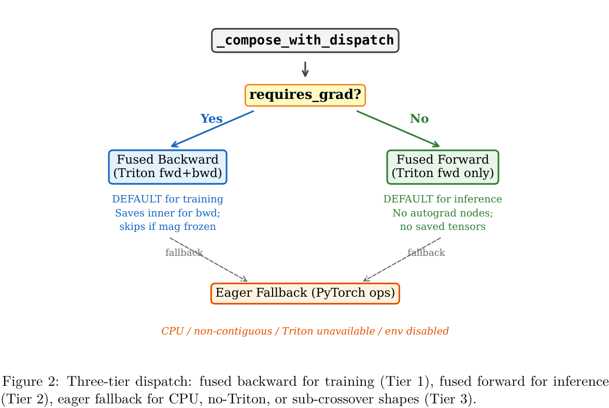

**Table 2: Dispatch tiers and their selection criteria.**

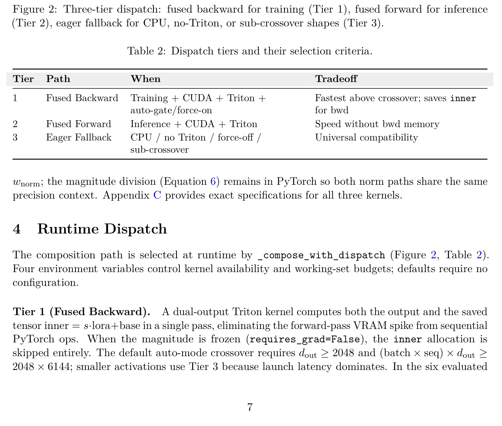

---

<!-- page 8 mode: simple_text -->

VLMs, KV projections (dout as low as 512) fall below the crossover, so ∼71% of adapted modules per layer dispatch to Tier 1 during training and ∼29% fall back to Tier 3.

Tier 2 (Fused Forward).

A forward-only Triton kernel with no autograd graph nodes, dispatched when requires_grad is false.

Tier 3 (Eager Fallback).

Pure PyTorch; handles CPU, no-Triton, and sub-crossover training.

Uses out-of-place composition when autograd is active to avoid aliasing.

Precision.

All PyTorch compose paths produce bitwise-identical forward outputs by enforcing a single evaluation order. The Triton kernels preserve the same algebra but not bitwise equality (FMA contraction and reduction trees can perturb last bits); we treat Triton–PyTorch agreement as an empirical envelope: fp32 outputs stay within 10−4 max-abs error, bf16/fp16 remain within dtype-appropriate tolerances (§5.8).

Compatibility.

The fused compose is registered as a custom op (peft::fused_dora_compose) via torch.library, making the dispatch graph-break-free under torch.compile when dropout is inactive (p = 0). DeepSpeed ZeRO-2/3 and FSDP1 are supported; FSDP2/DTensor is not (§6). The forward contract, torch.compile details, and the chunked-dropout path are specified in Appendices A and B.

Magnitude division.

Across all tiers, g = m/ max(wnorm, ϵ) is computed in PyTorch outside the no_grad norm context, ensuring identical precision regardless of execution tier.

5

Experiments

5.1

Setup

Microbenchmarks use six GPUs spanning four architecture generations (Table 3); model-level benchmarks use three GPUs (RTX 6000 PRO, H200, B200) with sufficient VRAM for the tested models. All GPUs run identical software: PyTorch 2.10.0+cu130, Triton 3.6.0, Transformers 5.2.0, CUDA 13.1, driver 580.126.09. The PEFT baseline is upstream commit 20a9829 (v0.18.0.rc0).1

Model-level benchmarks exclude the optimizer step to isolate DoRA overhead and use a partialsequence loss (1024 loss tokens) to match production RLHF/GRPO memory profiles; full-sequence loss creates a 6–12 GB logit spike that masks adapter working-set differences. A sensitivity check at 4096 loss tokens confirms speedups are unchanged. Each microbenchmark reports the median of 200 CUDA-event-timed trials (10 warmup); model-level benchmarks use 20 repeats (3 warmup, CV < 1.7%). Memory measurement methodology and full reproducibility instructions are provided in Appendix D.

5.2

Model-Level Performance

Table 4 summarizes the headline result: gradient-computation speedup across six 8–32B VLMs on three GPUs. The fused implementation is 1.46–1.87× faster than HF PEFT’s DoRA implementation and 1.18–1.24× faster than our own eager baseline, with 1.3–6.7 GB lower peak VRAM (Table 8).

These timings cover forward+backward only (excluding optimizer updates), so the end-to-end

1Later HEAD 9cf86c7 (2026-02-24) is algorithmically identical for training; see §7.

8

---

<!-- page 9 mode: hybrid_paper -->

**Table 3: Benchmark hardware. “Micro”: microbenchmark coverage. “Model”: full model-level gradient-computation and inference benchmarks.**

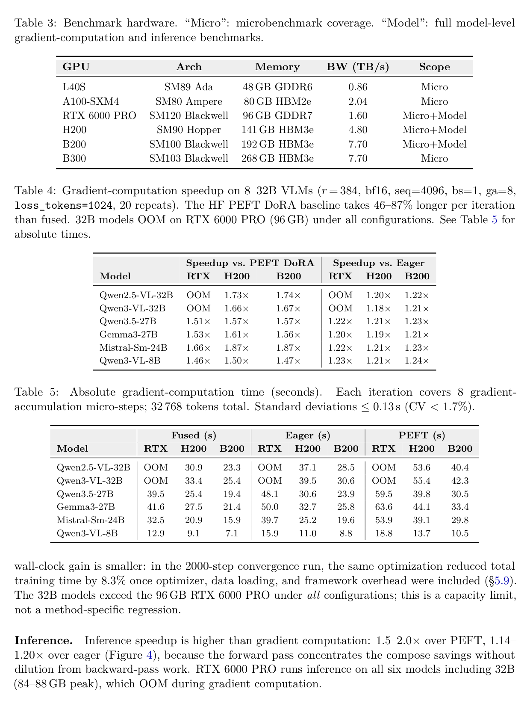

**Table 4: Gradient-computation speedup on 8–32B VLMs (r = 384, bf16, seq=4096, bs=1, ga=8, loss_tokens=1024, 20 repeats). The HF PEFT DoRA baseline takes 46–87% longer per iteration than fused. 32B models OOM on RTX 6000 PRO (96 GB) under all configurations. See Table 5 for absolute times.**

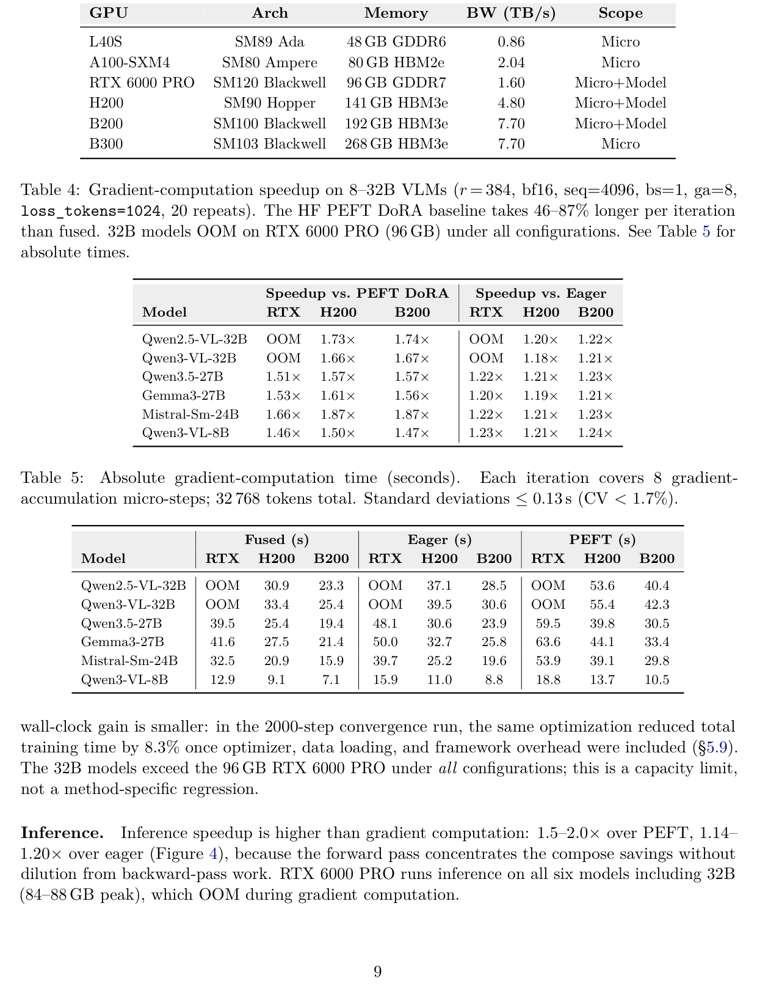

**Table 5: Absolute gradient-computation time (seconds). Each iteration covers 8 gradient- accumulation micro-steps; 32 768 tokens total. Standard deviations ≤0.13 s (CV < 1.7%).**

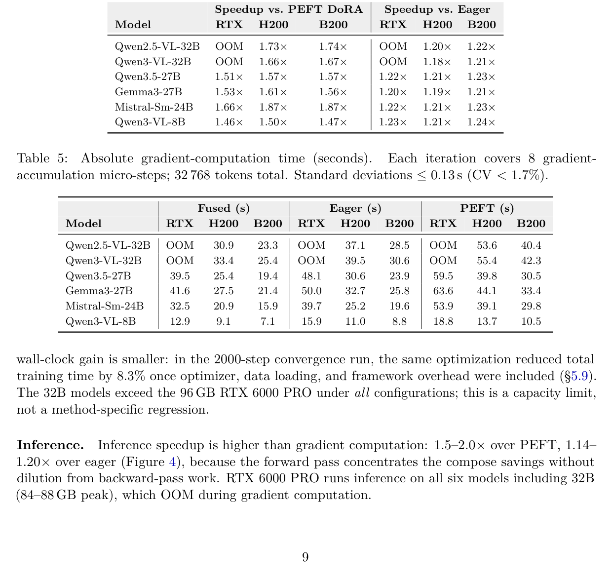

---

<!-- page 10 mode: hybrid_paper -->

10

Figure 4: Inference speedup: 1.5–2.0× over the HF PEFT DoRA baseline. All six models run on all three GPUs, including 32B on RTX 6000 PRO (96 GB) that OOM during gradient computation.

High-rank scaling.

Table 6 validates the high-rank framing at r=384, 512, and 768. Speedup vs.

PEFT DoRA increases with rank for the 32B model (1.66× →1.74×) because PEFT’s materialization cost grows with r, while the factored norm’s rank-dependent overhead (U and G) remains small.

Speedup vs. eager decreases modestly (1.18× →1.14×) as larger LoRA matmuls dilute the compose kernel’s contribution.

---

<!-- page 11 mode: hybrid_paper -->

11

**Table 6: Speedup vs. the HF PEFT DoRA baseline grows with rank; speedup vs. eager decreases modestly (H200, bf16, seq=4096, 20 repeats).**

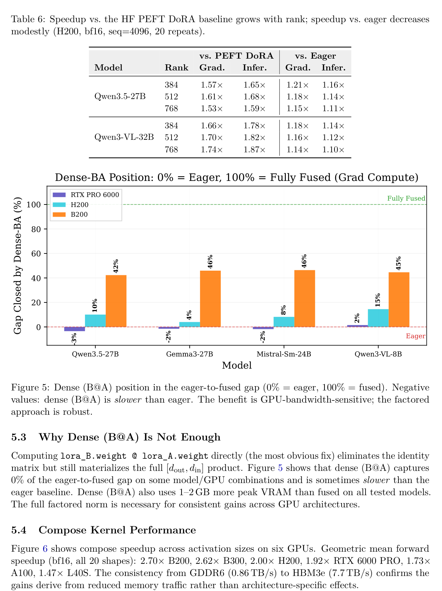

Figure 6 shows compose speedup across activation sizes on six GPUs. Geometric mean forward speedup (bf16, all 20 shapes): 2.70× B200, 2.62× B300, 2.00× H200, 1.92× RTX 6000 PRO, 1.73× A100, 1.47× L40S. The consistency from GDDR6 (0.86 TB/s) to HBM3e (7.7 TB/s) confirms the gains derive from reduced memory traffic rather than architecture-specific effects.

---

<!-- page 12 mode: hybrid_paper -->

Compose Kernel Speedup (bf16)

L40S

A100

H200

(a) Forward (Inference)

Speedup vs. Eager

4

3

2

1

2k×512

8k×512

512×4k

16k×8k

32k×8k

2k×12k

2k×16k

2k×28k

8k×28k

1×512

2k×1k

2k×3k

2k×4k

2k×6k

2k×8k

1×4k

512

2k

4k

8k

Activation Shape

8000

Approx. Bandwidth (GB/s)

7000

6000

5000

4000

3000

2000

1000

0

2k×512

8k×512

512×4k

1×512

2k×1k

2k×3k

2k×4k

1×4k

512

2k

12

RTX PRO 6000

B200

B300

(b) Autograd (Training)

5

Speedup vs. Eager

4

3

2

1

2k×512

8k×512

512×4k

16k×8k

32k×8k

2k×12k

2k×16k

2k×28k

8k×28k

1×512

2k×1k

2k×3k

2k×4k

2k×6k

2k×8k

1×4k

512

2k

4k

8k

Activation Shape

Figure 6: Compose kernel speedup vs. eager (bf16) across six GPUs. (a) Forward: 1.5–4.5×.

(b) Autograd: gains compound with activation size.

Compose Kernel Bandwidth Utilization (fp32)

16k×8k

32k×8k

2k×12k

2k×16k

2k×28k

8k×28k

2k×6k

2k×8k

4k

8k

Activation Shape

Figure 7: Bandwidth utilization (fp32, six GPUs). Fused approaches ∼50% of peak on all architectures; eager values are approximate lower bounds.

Bandwidth utilization.

The fused kernel achieves 3950–4070 GB/s on B200/B300 (∼53% of peak), 2490–2540 GB/s on H200 (∼53%), 1040–1050 GB/s on A100 (∼52%), 880–890 GB/s on RTX 6000 PRO (∼55%), and 460–470 GB/s on L40S (∼54%) at the largest shapes (Figure 7).

On B200, the eager path reaches only 17% of peak, yielding the largest absolute bandwidth gap. Throughput scales nearly linearly with peak bandwidth across the full 0.86–7.7 TB/s range, confirming these kernels are memory-bandwidth-bound.

---

<!-- page 13 mode: hybrid_paper -->

**Table 7: Norm memory: measured allocation delta and theoretical reduction (fp32, H200). Measured reductions are smaller than theoretical because they include the rank-independent base-norm transient (§2.3).**

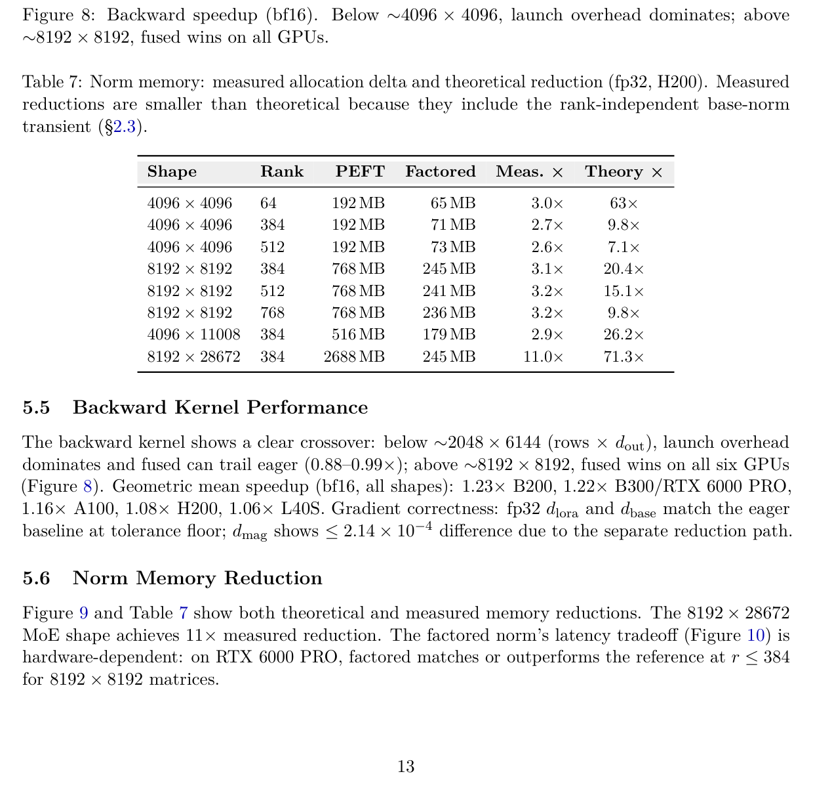

---

<!-- page 14 mode: hybrid_paper -->

5.7

Memory Profile

The fused backward path reduces forward peak VRAM by eliminating intermediate materialization while maintaining identical backward peak (Figure 11). At the model level (Table 8), fused uses 0.1–1.0 GB less peak VRAM than eager and 1.2–6.7 GB less than PEFT. Dense (B@A) uses more peak VRAM than fused on all models.

14

Figure 10: Norm latency vs. rank (RTX 6000 PRO, fp32). The PEFT time is constant in r; factored scales linearly. At r ≤128, factored matches the reference due to reduced memory traffic.

---

<!-- page 15 mode: hybrid_paper -->

(a) Peak Memory vs. Rank

(H200, bf16, h=4096, bs=4, seq=2048)

800

Peak VRAM (MB)

600

400

200

0

16 64 128 256 384 512

LoRA Rank

**Table 8: Model-level peak VRAM (GB). Fused uses less than all baselines on every model. 32B models OOM on RTX 6000 PRO.**

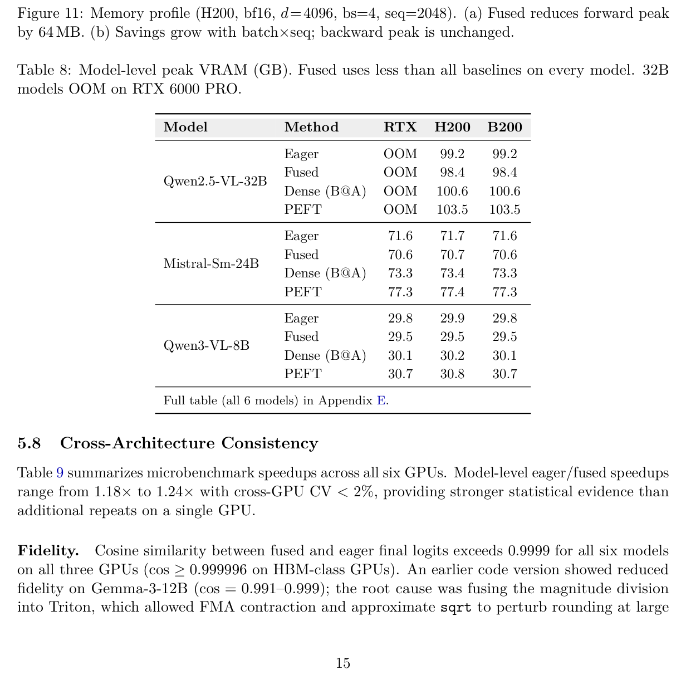

**Table 9 summarizes microbenchmark speedups across all six GPUs. Model-level eager/fused speedups range from 1.18× to 1.24× with cross-GPU CV < 2%, providing stronger statistical evidence than additional repeats on a single GPU.**

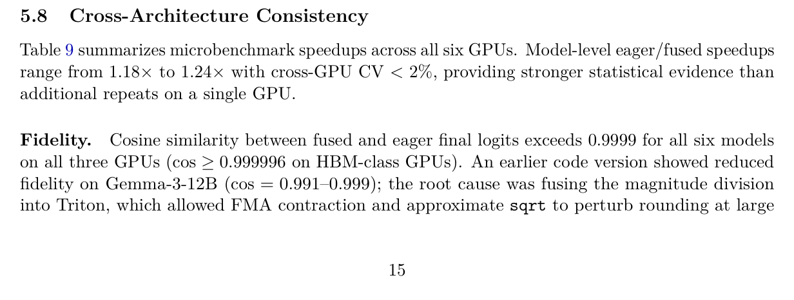

(b) Peak Memory vs. Batch/Seq

(H200, bf16, h=4096, r=384)

1500

Peak VRAM (MB)

1250

1000

750

500

250

0

bs=1

bs=2

bs=4

bs=4

seq=1

seq=512

seq=2048

seq=4096

Configuration

Figure 11: Memory profile (H200, bf16, d=4096, bs=4, seq=2048). (a) Fused reduces forward peak by 64 MB. (b) Savings grow with batch×seq; backward peak is unchanged.

---

<!-- page 16 mode: hybrid_paper -->

**Table 9: Geometric mean microbenchmark speedups (all shapes, 200 repeats). Norm memory 0.8× in bf16 means factored uses more memory for the isolated norm due to fp32 accumulation transients (§2.3).**

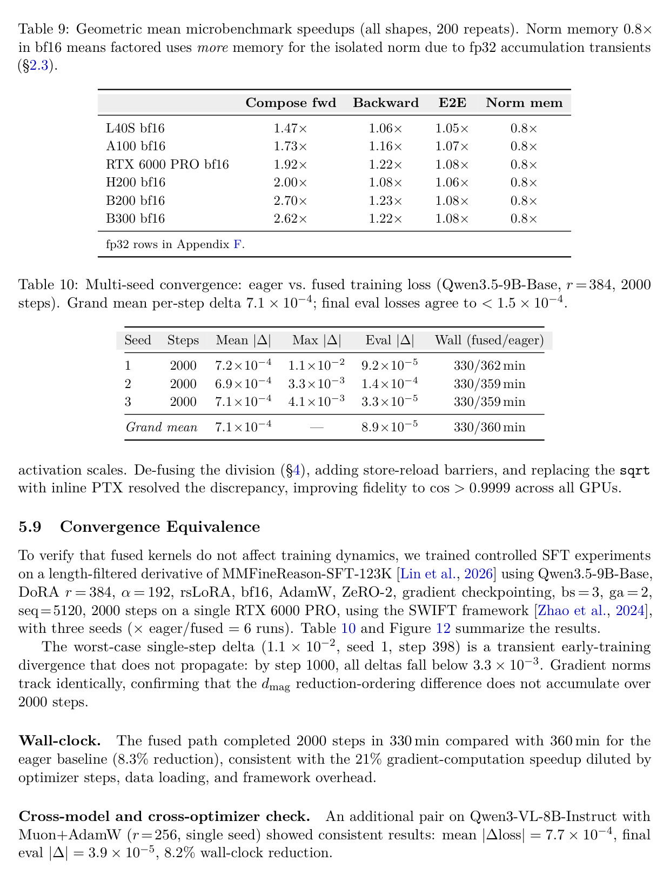

**Table 10: Multi-seed convergence: eager vs. fused training loss (Qwen3.5-9B-Base, r =384, 2000 steps). Grand mean per-step delta 7.1 × 10−4; final eval losses agree to < 1.5 × 10−4.**

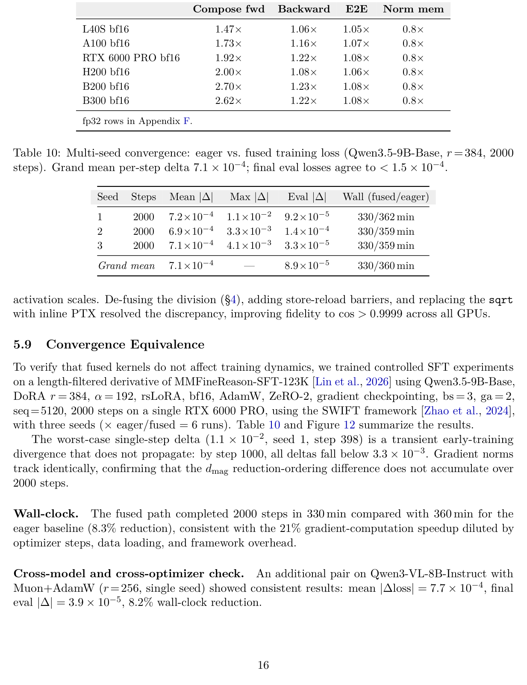

---

<!-- page 17 mode: hybrid_paper -->

Qwen3.5-9B · DoRA r=384 · bf16 · 1×RTX 6000 PRO · seed 3 max |Δloss|=0.0041 · mean |Δloss|=0.0007113 · wall-clock −8.1%

(a) Training loss

0.340

0.55

0.335

0.50

0.330

0.45

0.325

0.40

Loss

Loss

0.320

0.35

0.315

0.30

0.310

0.25

0.305

0.20

0 500 1000 1500 2000

Training step

6

Discussion

6.1

Deployment Context

6.2

Tradeoffs and Limitations

Eager Fused

(b) Eval loss

(c) Gradient norm

12

10

8

Norm

6

4

2

500 1000 1500 2000

0 500 1000 1500 2000

Training step

Training step

Figure 12: Convergence: eager vs. fused are visually indistinguishable (Qwen3.5-9B-Base, r=384, seed 3 of 3). (a) Training loss (25-step smoothing). (b) Eval loss (200-step intervals). (c) Gradient norms.

The factored norm is particularly valuable when training and inference compete for GPU memory.

Our GRPO [Shao et al., 2024] pipeline co-locates vLLM [Kwon et al., 2023] (tensor-parallel inference) alongside DoRA fine-tuning (r = 384) of a 38B VLM on 4×B200 (192 GB each), with large global batches under ZeRO-2 and gradient checkpointing. After vLLM reserves its KV-cache allocation, training headroom per GPU is tight; the memory challenge is cumulative rather than catastrophic. Each of the 500+ adapted modules re-materializes its norm temporaries during gradient checkpointing recomputation, and the resulting transient allocations fragment the caching allocator. Cross-device bandwidth, already under pressure from gradient all-reduce and tensorparallel inference communication, leaves little margin for the additional memory traffic of dense per-module materialization. The factored norm eliminates these transients, and we observed no numerical drift attributable to fusion. (This is an illustrative anecdote and was not benchmarked under the methodology of §5.)

**Table 11 consolidates practitioner recommendations.**

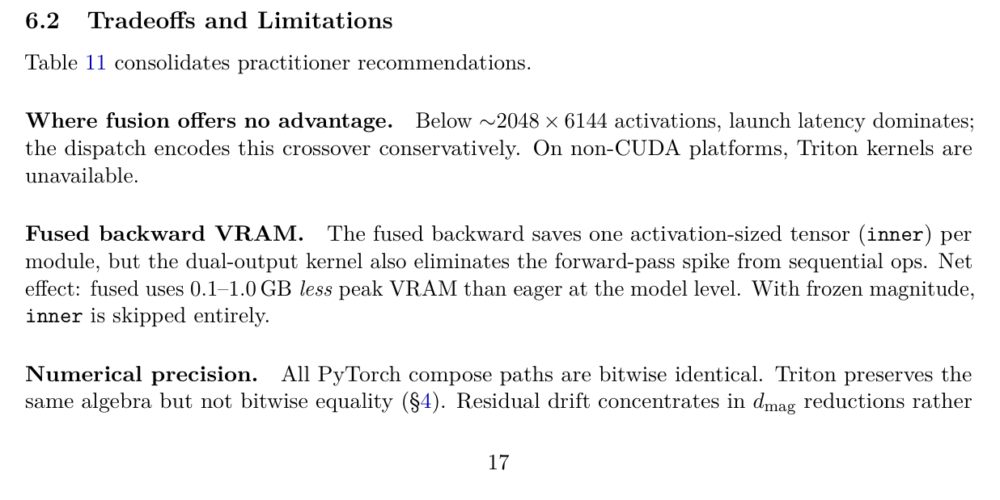

---

<!-- page 18 mode: hybrid_paper -->

18

**Table 11: Recommended configuration by scenario.**

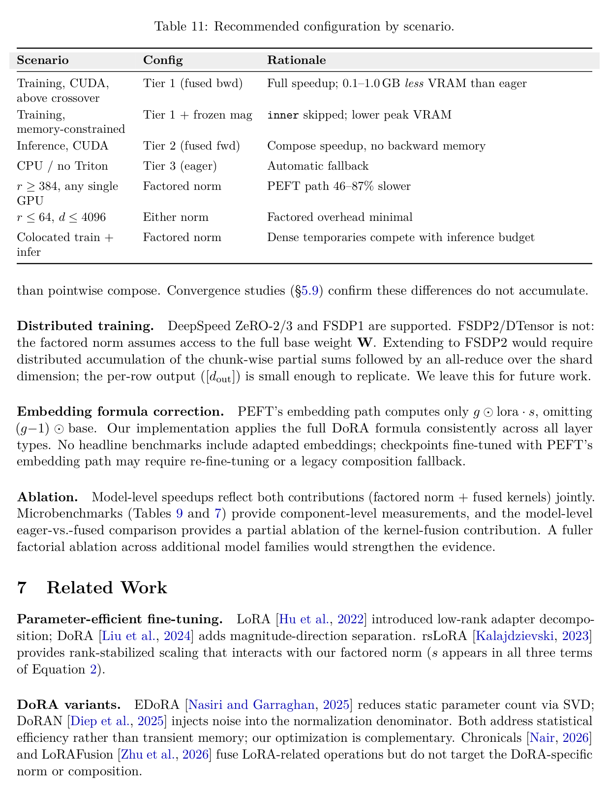

---

<!-- page 19 mode: simple_text -->

Framework implementations.

Every major framework we checked (HF PEFT, torchtune, Unsloth, SWIFT, LLaMA-Factory, Axolotl) uses the same torch.eye materialization pattern.

Unsloth explicitly disables its custom kernels when DoRA is active; orchestration frameworks delegate entirely to PEFT. As of February 2026, no existing framework avoids materializing the dense BA product (Appendix G).

Kernel fusion.

FlashAttention [Dao et al., 2022, Dao, 2024] demonstrated that tiled, fused kernels improve both speed and memory for attention. Liger Kernel [Hsu et al., 2024] applies similar principles to cross-entropy, SwiGLU, and RMSNorm. Our work targets the DoRA composition, a simpler (element-wise with broadcasting) but equally memory-bound pattern. The algebraic identity underlying the factored norm (expanding a sum-of-squares into base, cross, and Gram terms) is standard in numerical linear algebra; our contribution is its application to the DoRA-specific computation with dtype discipline, chunking, and integration into the fused pipeline.

LLM-guided optimization.

Meta’s KernelAgent [PyTorch, 2025] confirmed our compose kernel is near-roofline (89% memory bandwidth SOL, 1.5% improvement). For the backward, KernelAgent discovered a two-stage partial-reduction strategy that fuses the dmag reduction, achieving 3.58× over eager (88.5% SOL) vs. our 1.06–1.23×. Our release prioritizes drop-in compatibility and end-to-end wins across real models; integrating that pattern is a direct avenue for future work. KernelAgent’s generated listings are included in code/kernelagent_sols.

8

Conclusion

We presented a systems implementation of DoRA: a factored norm that reduces working memory from O(dout × din) to O(dout × r + r2), and fused Triton kernels that collapse multi-step composition into single-pass GPU operations.

On six 8–32B VLMs, the fused implementation is 1.5–2.0× faster than HF PEFT’s DoRA implementation for inference, and 1.5–1.9× faster for gradient computation (optimizer step excluded), with up to 7 GB lower peak VRAM. Microbenchmarks on six GPUs spanning four architecture generations confirm 1.5–2.7× compose-kernel speedup. Fidelity holds at three levels: operator tests within quantization-aware bounds, final-logit cos > 0.9999, and matched training curves across seeds.

Known limitations.

FSDP2 is unsupported. Convergence validation covers two model families, two optimizers, and one dataset in the SFT regime; generalization to RL pipelines remains to be confirmed. Model-level benchmarks cover three of six GPUs; L40S, A100, and B300 have microbenchmark coverage only. The dispatch crossover is an empirical heuristic that may need retuning for future hardware.

## Data Availability

All source code, benchmark scripts, raw JSON results, Triton autotune caches, and figure generation scripts are available at https://github.com/sockeye44/dorafactors (tag v1.0). The convergence validation uses a public dataset (MMFineReason-SFT-123K; Lin et al. 2026) for fully reproducible confirmation. The authors declare no competing interests.

19

---

<!-- page 20 mode: simple_text -->

## Acknowledgements

This work was developed through extensive collaborative programming with Claude Opus 4.6 (Anthropic), which contributed to kernel implementation, test design, numerical analysis, and iterative debugging. The authors take full responsibility for the accuracy and integrity of the work.

## References

Jason Ansel, Edward Yang, Horace He, Natalia Gimelshein, Animesh Jain, Michael Voznesensky, Bin Bao, Peter Bell, David Berard, Evgeni Burovski, et al. PyTorch 2: Faster machine learning through dynamic Python bytecode transformation and graph compilation. In Proceedings of the 29th ACM International Conference on Architectural Support for Programming Languages and Operating Systems, volume 2 of ASPLOS ’24. ACM, 2024. doi: 10.1145/3620665.3640366.

Tianqi Chen, Bing Xu, Chiyuan Zhang, and Carlos Guestrin. Training deep nets with sublinear memory cost. arXiv preprint arXiv:1604.06174, 2016.

Tri Dao. FlashAttention-2: Faster attention with better parallelism and work partitioning. In International Conference on Learning Representations, 2024. arXiv:2307.08691.

Tri Dao, Daniel Y. Fu, Stefano Ermon, Atri Rudra, and Christopher Ré. FlashAttention: Fast and memory-efficient exact attention with IO-awareness. In Advances in Neural Information Processing Systems, volume 35, pages 16344–16359, 2022. arXiv:2205.14135.

Nghiem T. Diep, Hien Dang, Tuan Truong, Tan Dinh, Huy Nguyen, and Nhat Ho. DoRAN:

Stabilizing weight-decomposed low-rank adaptation via noise injection and auxiliary networks.

arXiv preprint arXiv:2510.04331, 2025.

Pin-Lun Hsu, Yun Dai, Vignesh Kothapalli, Qingquan Song, Shao Tang, Siyu Zhu, Steven Shimizu, Shivam Sahni, Haowen Ning, and Yanning Chen. Liger kernel: Efficient triton kernels for LLM training. arXiv preprint arXiv:2410.10989, 2024.

Edward J. Hu, Yelong Shen, Phillip Wallis, Zeyuan Allen-Zhu, Yuanzhi Li, Shean Wang, Lu Wang, and Weizhu Chen. LoRA: Low-rank adaptation of large language models. In International Conference on Learning Representations, 2022. arXiv:2106.09685.

Damjan Kalajdzievski. A rank stabilization scaling factor for fine-tuning with LoRA. arXiv preprint arXiv:2312.03732, 2023.

Woosuk Kwon, Zhuohan Li, Siyuan Zhuang, Ying Sheng, Lianmin Zheng, Cody Hao Yu, Joseph E.

Gonzalez, Hao Zhang, and Ion Stoica. Efficient memory management for large language model serving with PagedAttention. In Proceedings of the 29th Symposium on Operating Systems Principles, SOSP ’23, pages 611–626. ACM, 2023. doi: 10.1145/3600006.3613165. arXiv:2309.06180.

Honglin Lin, Zheng Liu, Yun Zhu, Chonghan Qin, Juekai Lin, Xiaoran Shang, Conghui He, Wentao Zhang, and Lijun Wu. MMFineReason: Closing the multimodal reasoning gap via open datacentric methods. arXiv preprint arXiv:2601.21821, 2026. https://mmfinereason.github.io/.

Shih-Yang Liu, Chien-Yi Wang, Hongxu Yin, Pavlo Molchanov, Yu-Chiang Frank Wang, Kwang-Ting Cheng, and Min-Hung Chen. DoRA: Weight-decomposed low-rank adaptation. In Proceedings of the 41st International Conference on Machine Learning, volume 235 of Proceedings of Machine Learning Research, pages 32100–32121. PMLR, 2024. arXiv:2402.09353.

20

---

<!-- page 21 mode: simple_text -->

Sourab Mangrulkar, Sylvain Gugger, Lysandre Debut, Younes Belkada, Sayak Paul, Benjamin Bossan, and Marian Tietz.

PEFT: State-of-the-art parameter-efficient fine-tuning methods.

https://github.com/huggingface/peft, 2022.

Arjun S. Nair. Chronicals: A high-performance framework for LLM fine-tuning with 3.51x speedup over unsloth. arXiv preprint arXiv:2601.02609, 2026.

Hamid Nasiri and Peter Garraghan. EDoRA: Efficient weight-decomposed low-rank adaptation via singular value decomposition. arXiv preprint arXiv:2501.12067, 2025.

PyTorch. KernelAgent — multi-agent GPU kernel synthesis, 2025. URL https://github.com/ meta-pytorch/KernelAgent.

Samyam Rajbhandari, Jeff Rasley, Olatunji Ruwase, and Yuxiong He. ZeRO: Memory optimizations toward training trillion parameter models. In Proceedings of the International Conference for High Performance Computing, Networking, Storage and Analysis, SC ’20. IEEE Press, 2020. doi:

10.5555/3433701.3433727. arXiv:1910.02054.

Zhihong Shao, Peiyi Wang, Qihao Zhu, Runxin Xu, Junxiao Song, Xiao Bi, Haowei Zhang, Mingchuan Zhang, Y. K. Li, Y. Wu, and Daya Guo. DeepSeekMath: Pushing the limits of mathematical reasoning in open language models. arXiv preprint arXiv:2402.03300, 2024.

Philippe Tillet, H. T. Kung, and David Cox. Triton: An intermediate language and compiler for tiled neural network computations. In Proceedings of the 3rd ACM SIGPLAN International Workshop on Machine Learning and Programming Languages, MAPL 2019, pages 10–19. ACM, 2019. doi: 10.1145/3315508.3329973.

Yuze Zhao, Jintao Huang, Jinghan Hu, Xingjun Wang, Yunlin Mao, Daoze Zhang, Zeyinzi Jiang, Zhikai Wu, Baole Ai, Ang Wang, Wenmeng Zhou, and Yingda Chen.

SWIFT: A scalable lightweight infrastructure for fine-tuning, 2024. URL https://arxiv.org/abs/2408.05517.

Zhanda Zhu, Qidong Su, Yaoyao Ding, Kevin Song, Shang Wang, and Gennady Pekhimenko.

LoRAFusion: Efficient LoRA fine-tuning for LLMs. In Proceedings of the Nineteenth European Conference on Computer Systems, EuroSys ’26, 2026. arXiv:2510.00206.

21

---

<!-- page 22 mode: simple_text -->

A

Forward Contract and Execution Semantics

### Forward Contract and Execution Semantics

### 1. Module Interface & Compose Semantics

• Output: The module computes a delta ∆Y; the caller applies Y = Ybase + ∆Y.

• Compose Equation: ∆Y = g ⊙(sXA⊤B⊤) + (g −1) ⊙Ybase.

### 2. Norm Policy

• Recomputed every forward pass; never cached across steps.

• Detached (no gradient flow), per Liu et al. [2024] §4.3.

• Accumulated in FP32 with autocast disabled.

• ϵ = 10−12 (fp32/fp64) or 10−6 (bf16/fp16).

• Bias subtracted before compose, re-added after.

Formal contract for clean-room replication.

B

Implementation Details

Chunk alignment.

The chunk size aligns to 64 elements on CUDA/XPU devices for Tensor Core MMA alignment on all NVIDIA architectures since Volta.

Environment variables.

PEFT_DORA_FUSED (0 = force eager), PEFT_DORA_FUSED_BACKWARD (1 = force fused bwd, 0 = disable, unset = auto), PEFT_DORA_NORM_CHUNK_MB and PEFT_DORA_FWD_ CHUNK_MB (override 256 MB defaults).

Scale-is-zero fast path.

When s = 0, cross and ba_sq are skipped; U and G are not allocated.

Dtype-aware epsilon.

10−12 for fp32/fp64; 10−6 for bf16/fp16. For fp16 (max ≈65504), ε = 10−6

limits the quotient to ∼106, reducing saturation risk.

Compose kernel autotuning.

RPP=1 is selected in 95% of autotuned entries (1149/1206).

Exact config agreement between GPUs is ∼9%, confirming per-device autotuning is essential.

Chunked dropout path.

When dropout is active, _compose_with_base_chunks iterates over output-dimension slices with adaptive sizing, decorated with @dynamo_disable to avoid runaway recompilations.

Magnitude broadcast shape guard.

A shape guard gates Triton kernel dispatch on whether the magnitude vector broadcasts exclusively along the last dimension of the activation tensor. The Triton compose kernel treats magnitude as a 1-D vector along the last dimension; Conv-style shapes like [1, C, 1, 1] applied to [N, C, H, W] activations would violate this assumption. The guard checks both element count and last-dimension alignment; failing shapes route to the PyTorch fallback.

Custom op for torch.compile.

The registered backward uses PyTorch (not Triton) because AOTAutograd traces with FakeTensors. Eager training uses Triton for both forward and backward; compiled training uses Inductor to fuse the PyTorch backward graph.

22

---

<!-- page 23 mode: simple_text -->

C

Kernel Specifications

This appendix provides exact specifications for the three Triton kernels and the PyTorch magnitude division stage, including casting points, fused operations, shape constraints, and reduction ordering, to support a clean-room reimplementation.

1. Compose Forward kernel.

Fuses (g −1) ⊙base + g ⊙s ⊙lora in one pass. Inputs: base [bs, seq, dout], lora [bs, seq, dout], g [dout], s (scalar). Output: delta [bs, seq, dout]. All tensors in input dtype (fp16/bf16/fp32); no intermediate dtype cast. g is broadcast along all but the last dimension.

2. Compose Backward kernel.

Fuses dlora = g·s·dout and dbase = (g−1)·dout in a single Triton pass. dmag is computed separately via a .sum() reduction over the batch/sequence dimensions on the inner activation; this avoids non-deterministic tl.atomic_add ordering.

3. Norm Assembly kernel (norm-only).

Inputs: base_sq [dout], cross [dout], ba_sq [dout] (all fp32), two_s (scalar, = 2s, precomputed in fp64), s2 (scalar, = s2, precomputed in fp64). Computes wnorm = p

max(base_sq + two_s · cross + s2 · ba_sq, 0) in fp32 with store-reload barriers after each multiply-add to prevent FMA fusion, exactly reproducing PyTorch’s separate-kernel evaluation order. The clamp preserves NaN semantics (matching torch.clamp_min, which propagates NaNs per IEEE 754) rather than collapsing NaNs to zero. The square root uses inline PTX sqrt.rn.f32 for IEEE 754 correctly-rounded results (Triton’s tl.sqrt compiles to sqrt.approx.ftz.f32 on SM90). The kernel returns the result in the input dtype. In default mode, it uses a fixed block size of 256 (norm kernels are launch-latency bound; see Appendix B); comprehensive autotuning over 36 configurations (block sizes 32–2048) is available for new GPU architectures. If future Triton versions change the lowering of tl.sqrt to IEEE-compliant rounding, the inline PTX can be removed; the Tier-3 eager fallback provides a portable alternative on any platform.

4. Magnitude division (PyTorch).

The division g = m/ max(wnorm, ε) is always computed in PyTorch after the norm assembly kernel returns. This ensures identical precision regardless of whether the Triton or PyTorch norm path was used, at the cost of one additional element-wise kernel launch (negligible relative to surrounding matmuls).

Shape constraints.

dout must be divisible by BLOCK_SIZE (128). The magnitude vector must broadcast only along the last dimension of the activation; other broadcast shapes (e.g., [1, C, 1, 1] applied to [N, C, H, W]) route to the Tier-3 eager fallback. Non-contiguous input tensors also fall back to Tier 3.

Tested compatibility matrix.

Table 12 summarizes the integration points explicitly tested, with notes on scope and caveats. “Tested” indicates the feature was exercised in benchmarks or convergence runs reported in this paper; “CI only” indicates coverage via the test suite (1041 tests) but not in model-level experiments.

D

Reproducibility

Code and data.

All source code, benchmark scripts, raw JSON results, Triton autotune caches, and figure generation scripts are available at https://github.com/sockeye44/dorafactors (tag v1.0). The patched PEFT module is included as a git submodule (vendor/dorafactors-peft,

23

---

<!-- page 24 mode: hybrid_paper -->

24

**Table 12: Compatibility matrix. Scope: Bench = model-level benchmarks, Conv = convergence runs, CI = operator-level test suite.**

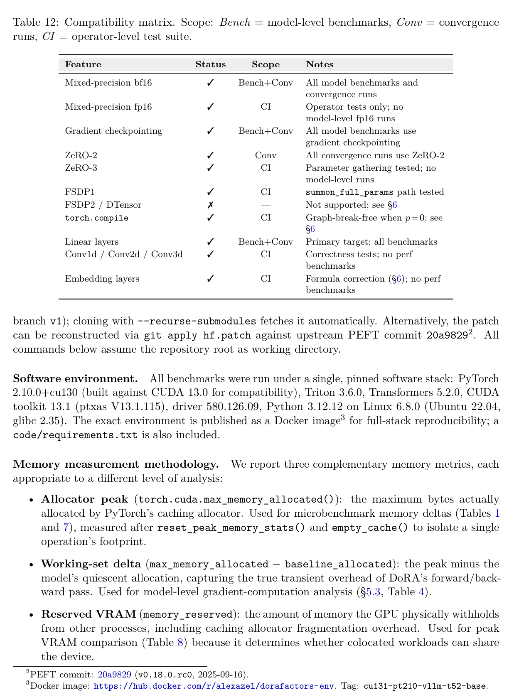

2PEFT commit: 20a9829 (v0.18.0.rc0, 2025-09-16).

3Docker image: https://hub.docker.com/r/alexazel/dorafactors-env. Tag: cu131-pt210-vllm-t52-base.

---

<!-- page 25 mode: hybrid_paper -->

**Table 1 (Page 25)**

|  |
|---|
| # 200 repeats, extended shapes, bf16 |
| python code/bench_dora_comprehensive.py \ |
| --shapes extended --repeats 200 --warmup 10 \ |
| --dtype bf16 --json-out results.json |
|  |

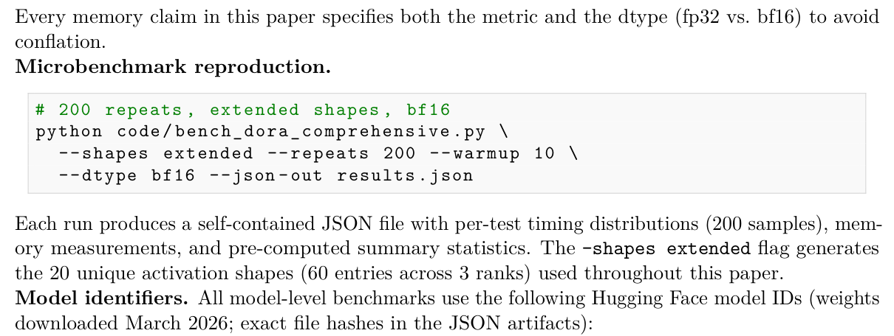

**Table 2 (Page 25)**

|  |
|---|
| # 6 models, r=384, loss_tokens=1024 |
| python code/bench_dora_comprehensive.py \ |
| --suite models --rank 384 --batch 1 --seqlen 4096 \ |
| --grad-accum 8 --loss-tokens 1024 --repeats 20 \ |
| --json-out models.json |
|  |

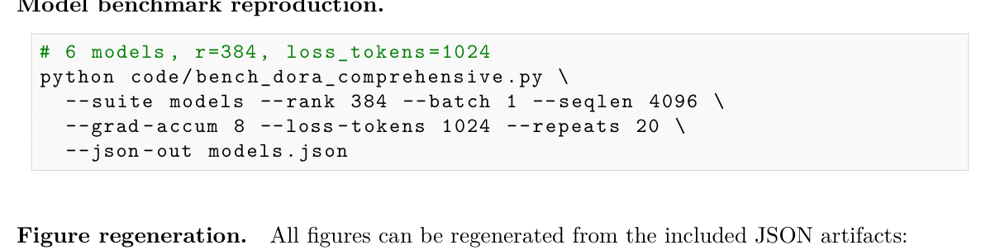

Figure regeneration.

All figures can be regenerated from the included JSON artifacts:

This produces 13 PDF figures in paper/figures/ sourced from the code/bench_it6/ data directory (6 GPUs × 3 dtypes for microbenchmarks, 3 GPUs for model-level). The convergence figure (Figure 12) is generated separately from TensorBoard logs via python paper/generate_training_

25

Every memory claim in this paper specifies both the metric and the dtype (fp32 vs. bf16) to avoid conflation.

Microbenchmark reproduction.

Each run produces a self-contained JSON file with per-test timing distributions (200 samples), memory measurements, and pre-computed summary statistics. The –shapes extended flag generates the 20 unique activation shapes (60 entries across 3 ranks) used throughout this paper.

Model identifiers. All model-level benchmarks use the following Hugging Face model IDs (weights downloaded March 2026; exact file hashes in the JSON artifacts):

• Qwen/Qwen2.5-VL-32B-Instruct • Qwen/Qwen3-VL-32B-Instruct • Qwen/Qwen3.5-27B • google/gemma-3-27b-it • unsloth/Mistral-Small-3.2-24B-Instruct-2506 • Qwen/Qwen3-VL-8B-Instruct

Convergence validation dataset.

The convergence validation (§5.9) uses a token-length-filtered subset of OpenDataArena/ MMFineReason-SFT-123K-Qwen3-VL-235B-Thinking [Lin et al., 2026], repacked with mechanical field renames (question→query, qwen3vl_235b_thinking_response→response) and filtered to tok_len ≤4096. The repacked dataset is published at eyes-ml/\protect\penalty\z@ {}MMFineReason-SFT-123K-\protect\penalty\z@{}Qwen3-VL-235B-Thinking-QR-max4096 on Hugging Face Hub; the filtering script is included in the repository (code/scripts/ repack_mmfinereason_qr.py).

Convergence validation environment. Training uses SWIFT [Zhao et al., 2024] (commit a807cb9) with PyTorch 2.10.0+cu130, Transformers 5.2.0, Triton 3.6.0, DeepSpeed 0.18.6, FlashAttention 2.8.3.

The full environment (including qwen-vl-utils, mamba_ssm, flash-linearattention) uses the same Docker image as the benchmarks (see Software environment above) with the additional training dependencies installed.

Model benchmark reproduction.

---

<!-- page 26 mode: hybrid_paper -->

**figure.py.**

|  |
|---|
| cp code/scripts/dora.reference_hf_peft.py \ |
| vendor/dorafactors-peft/docs/ |
| cd vendor/dorafactors-peft |
| pytest tests/test_lora_variants.py \ |
| tests/tuners/lora/test_dora_fused.py \ |
| tests/tuners/lora/test_dora_math.py -v |
|  |

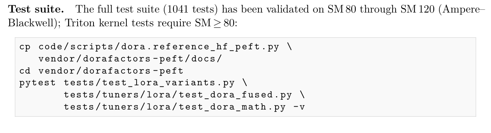

E

Full Model-Level Memory Table

Test suite.

The full test suite (1041 tests) has been validated on SM 80 through SM 120 (Ampere– Blackwell); Triton kernel tests require SM ≥80:

**Table 13 extends the main-body memory comparison (Table 8) to all six models.**

**Table 13: Model-level gradient-computation peak VRAM (GB) across three GPUs, all six models. Same setup as Table 8. Values from peak_vram_mb.**

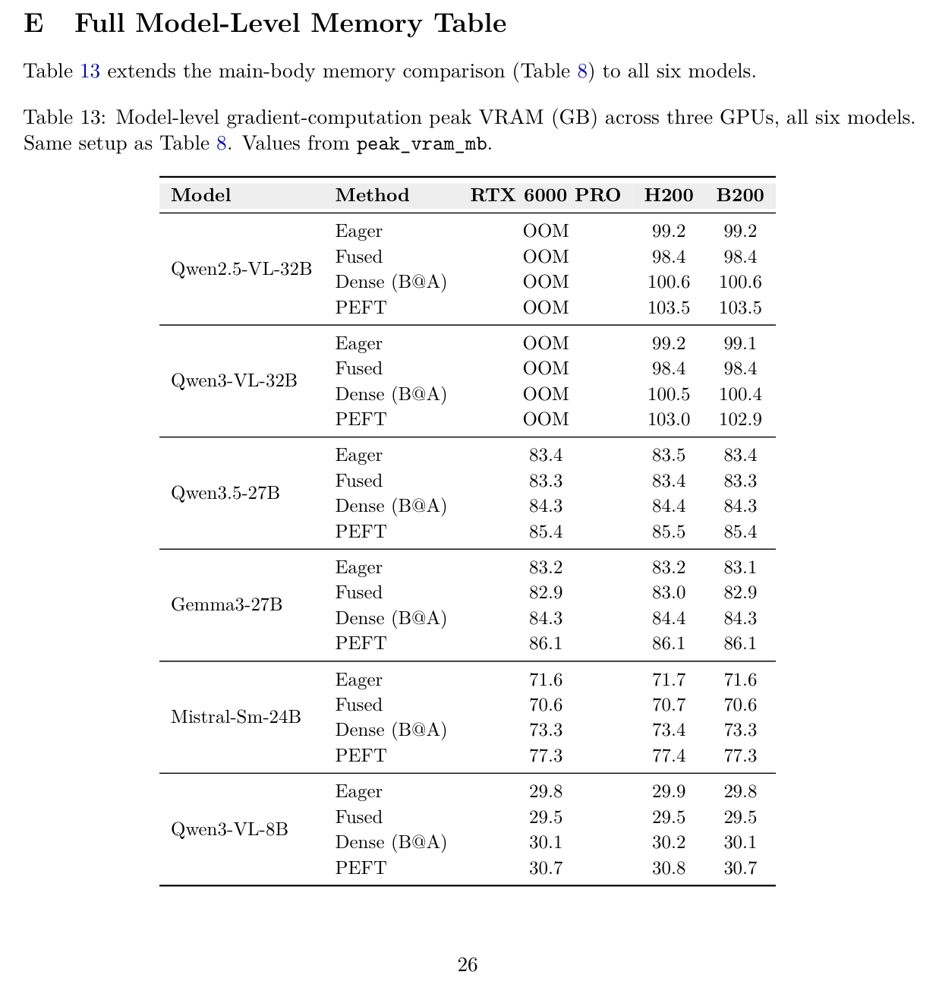

---

<!-- page 27 mode: hybrid_paper -->

F

Single-Layer E2E Decomposition

The following figures show single-layer end-to-end (E2E) speedup, which isolates the per-layer overhead but does not predict model-level speedup. Compose gains compound across ∼500 DoRA modules in a real model, while per-layer backward overhead is amortized, so single-layer E2E can understate the model-level benefit.

**Table 14: Geometric mean microbenchmark speedups, fp32 (all shapes, 200 repeats). Complement to Table 9.**

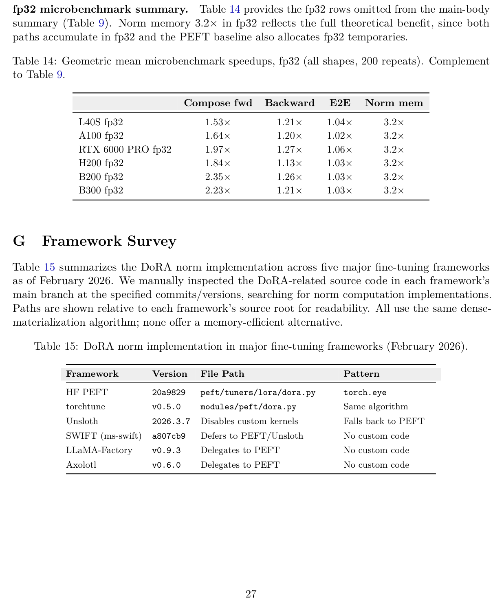

fp32 microbenchmark summary.

Table 14 provides the fp32 rows omitted from the main-body summary (Table 9). Norm memory 3.2× in fp32 reflects the full theoretical benefit, since both paths accumulate in fp32 and the PEFT baseline also allocates fp32 temporaries.

**Table 15 summarizes the DoRA norm implementation across five major fine-tuning frameworks as of February 2026. We manually inspected the DoRA-related source code in each framework’s main branch at the specified commits/versions, searching for norm computation implementations. Paths are shown relative to each framework’s source root for readability. All use the same dense- materialization algorithm; none offer a memory-efficient alternative.**

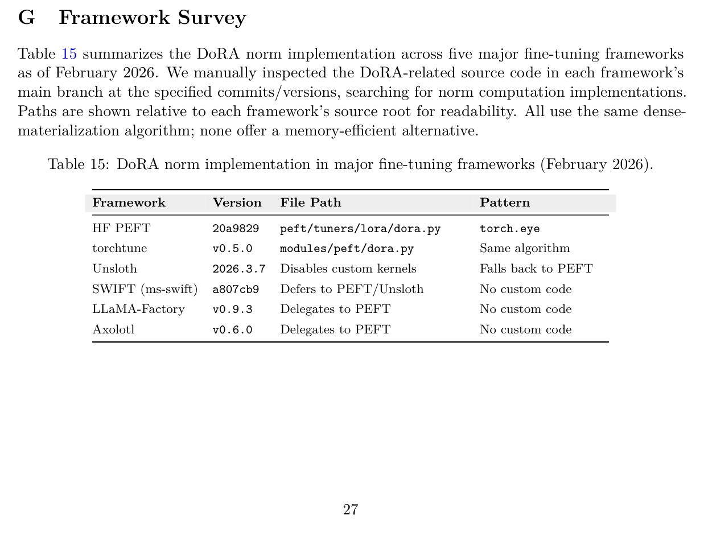

**Table 15: DoRA norm implementation in major fine-tuning frameworks (February 2026).**

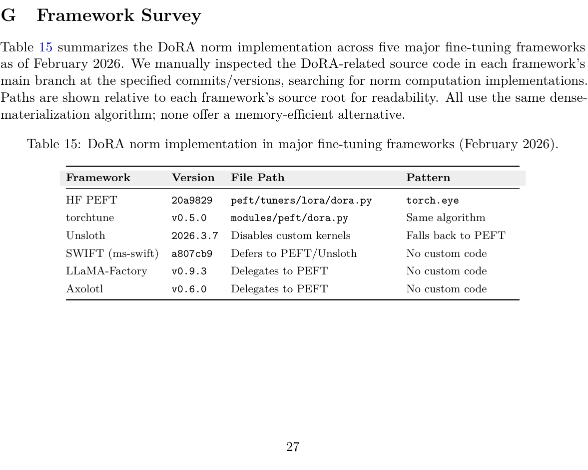

---

<!-- page 28 mode: hybrid_paper -->

Single-Layer E2E: B200, bf16, h=4096, bs=4, seq=2048

(a) Step Time vs. Rank

2.4

2.3

Step Time (ms)

2.2

2.1

2.0

1.9

1.8

1.7

16 64 128 256 384 512

LoRA Rank

Single-Layer Speedup (Eager / Fused)

1.35

1.30

1.25

1.20

1.15

1.10

1.05

1.00

0.95

28

(b) Speedup vs. Rank

1.250

Speedup (Eager / Fused)

1.225

1.200

1.175

1.150

1.125

1.100

1.075

16 64 128 256 384 512

LoRA Rank

Figure 13: Single-layer E2E overhead decomposition (B200, bf16, d = 4096, bs=4, seq=2048).

Single-layer E2E does not predict model-level speedup: compose gains compound across ∼500 DoRA modules while per-layer backward overhead is amortized.

Single-Layer E2E Speedup Across GPUs (bf16, h=4096)

16 64 128 256 384 512

LoRA Rank

Figure 14: Single-layer E2E speedup (eager/fused) across six GPUs and ranks (bf16, d = 4096, bs=4, seq=2048). All GPUs show consistent improvement.

---

<!-- page 29 mode: hybrid_paper -->

29

---
