# p114

<!-- document_mode: hybrid_paper -->

<!-- page 1 mode: hybrid_paper -->

## End-to-End Training for Unified Tokenization and Latent Denoising

## arXiv:2603.22283v1 [cs.CV] 23 Mar 2026

Code:

https://github.com/Shi vamDuggal4/UNITE-tokenization-g eneration Project Page: https://xingjianbai.co m/unite-tokenization-generation/

*Equal contribution 1Massachusetts Institute of Technology 2Adobe.

1

1. Introduction

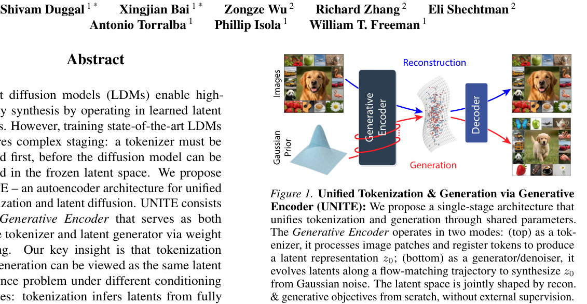

Modern foundation models (Brown et al., 2020; Koroteev, 2021; Radford et al., 2021; Chen et al., 2023; Esser et al., 2024; Polyak et al., 2024; Wan et al., 2025)—from language models to video generators, vision–language systems, and scientific generative models—are built around two core operations: tokenization and generation. Tokenization maps high-dimensional observations into a compact latent space that enables both faithful reconstruction and efficient discrimination; generation learns a distribution over this space to synthesize plausible new samples. This division naturally suggests a sequential recipe: first learn a representation space that is easy to reconstruct from and useful for downstream computation; then learn a generative process that samples from that space. As a result, most systems treat tokenization and generation as separate design problems & train them in stages—learning a tokenizer, freezing it & only then fitting a generator on the induced latent distribution.

This separation is convenient, but it departs from the principle of end-to-end learning and leaves a basic question unresolved: should tokenization and generation be trained jointly so that each objective can shape the learned latent space? In a joint setting, generative pressure could sculpt the latent space toward regions that are easier to model, while reconstruction and inference pressure could preserve instance-specific information and semantic structure. Un-

---

<!-- page 2 mode: hybrid_paper -->

Prior works have explored fully end-to-end training of latent diffusion models by backpropagating the denoising objective through the tokenized latents and into the encoder.

However, when the tokenizer and diffusion model are optimized primarily through the denoising objective, this can lead to degenerate solutions and poor performance, as observed in REPA-style methods (Yu et al., 2025a; Leng et al., 2025). To address this, these works propose anchoring the tokenizer with an additional objective that aligns diffusion features to pretrained visual encoders. Although effective, this strategy introduces a third component—a pretrained teacher—to stabilize joint optimization. In contrast, our setting relies only on reconstruction and denoising objectives to jointly train the tokenizer and latent generative model, without any external supervision.

We propose an alternative perspective on end-to-end training. Our key insight is that tokenization and generation can be viewed as the same latent inference problem under different conditioning regimes (see Fig. 2). Tokenization can be viewed as a generative process under strong observability: given a data point x, the model induces a highly concentrated (near-single-point) distribution over latents, yielding a latent z that is consistent with and informative about x. Generation corresponds to a weak-observability regime, where z must be synthesized from noise (and optional conditions) using the learned prior. Under this view, these two operations differ mainly in how much information is available—from the full observation x in tokenization to only a prior in generation. Motivated by this view, we propose UNITE, which jointly trains tokenization and generation end-to-end without external supervision. UNITE ties tokenization & generation through a shared-parameter module we call the Generative Encoder (GE), so that gradi-

2

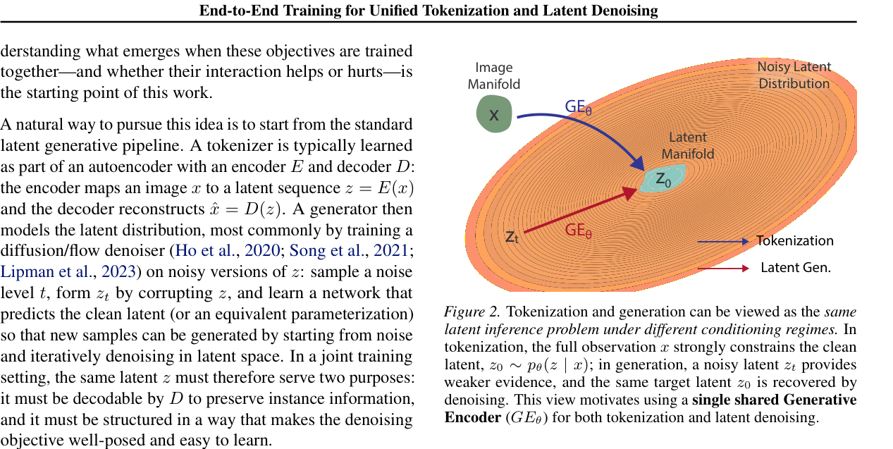

ents from both objectives directly shape the same weights, pushing the model toward a representation that is jointly optimal for the two tasks. Hence the name, UNITE: Unifying Tokenization & Latent Generation via shared Generative Encoder. See Fig. 1 for an overview.

Concretely, our system consists of only two modules: a Generative Encoder GEθ and a decoder Dϕ. The GE operates in two modes: (i) tokenization, mapping an input x to latent tokens z = GEθ(x), and (ii) generation, denoising corrupted latents to produce ˆ z = GEθ(zt, t) at noise level t. Thus, the same network serves both as the tokenizer and as the multi-step latent denoiser, with parameters θ shared across the two objectives. Training proceeds with two forward passes through GEθ. First, we tokenize an input image to obtain clean latents z. We then corrupt z using a rectifiedflow (flow-matching) process to obtain zt, and pass zt back through GEθ to predict the corresponding denoising target.

The full pipeline is trained end-to-end in a single stage by jointly optimizing a pixel-space reconstruction objective and a latent-space flow-matching objective.

We find that this end-to-end formulation yields a strong latent generative model, with near state-of-the-art generation and reconstruction fidelity, while training all modules from scratch rather than relying on large pretrained networks . To understand what drives this behavior, we study other alternatives to end-to-end training in Sec. 4. This includes an ablation that keeps the full training pipeline fixed but removes parameter tying between the encoder and denoiser. Interestingly, even without explicit weight sharing, the encoder and denoiser exhibit strong per-layer representational alignment, as measured by centered kernel alignment (CKA) (Kornblith et al., 2019) (See Fig. 6), suggesting that tokenization and denoising are intrinsically compatible tasks in our setting.

---

<!-- page 3 mode: hybrid_paper -->

End-to-End Training for Unified Tokenization and Latent Denoising

Further analysis (see Sec. 4) indicates that the model differentiates the two modes primarily through normalization: the tokenization and denoising pathways occupy different norm/scale regimes, while attention and MLP sublayers remain highly reusable across both. In fact, recent concurrent work on Unified Latent (Heek et al., 2026) investigates a closely related two-module formulation. It can be interpreted as a special case of our end-to-end setting, aligning closely with our separate-weights ablation. While this separate-weights variant performs almost as competitively, we find that parameter tying yields the best overall rFID/gFID trade-off in our experiments (Fig. 5). Overall, these results provide a concrete single-stage recipe in which reconstruction and denoising objectives can jointly shape the latent space, rather than being optimized in disjoint stages. Practically, this means one training job and one model to store and update, while retaining a near-SOTA tokenizer and generator.

### 2. Related Work

Tokenization & Generation via Auto-Encoding:

Variational autoencoders (VAEs) (Kingma & Welling, 2014) introduced a principled framework for learning probabilistic latent representations while enabling generation through a simple Gaussian prior. This foundational work established that reconstruction and generation can be learned within a single model, though the Gaussian prior and likelihood assumptions often limit sample quality. Extensions such as VQ-VAE (Van Den Oord et al., 2017) and VQ-GAN (Esser et al., 2021) improved representation learning by introducing discrete latent spaces and adversarial training, respectively; in practice, many widely used autoencoderbased tokenizers for diffusion are trained with GAN-style (Goodfellow et al., 2020) losses. However, in modern latent diffusion pipelines (Peebles & Xie, 2023; Ma et al., 2024), these VAE/VQGAN-style models primarily serve as tokenizers for a downstream diffusion model trained in the resulting frozen latent space; their standalone generative capability is typically weaker and is therefore rarely used in practice. In standard downstream diffusion training, the denoising/generative gradients never flow back into the tokenization process, preventing the representation from being shaped by the needs of generation. To address this, we couple tokenization with a latent denoising objective and train a single model end-to-end, allowing the encoder to be directly shaped by generative learning. For simplicity, we eliminate adversarial losses in all experiments unless otherwise stated.

Self-supervised Visual Encoders for Generation:

Recent advances in self-supervised learning have produced powerful visual encoders that go beyond naive reconstruction objectives. Masked autoencoders (MAE) (He et al., 2022) show that reconstructing masked patches can learn strong visual representations at scale. DINO-style mod-

3

els (Caron et al., 2021; Oquab et al., 2023) learn semantic features via self-distillation without labels, yielding representations that capture both local and global image structure.

Building on these encoders, recent methods such as REPA (Yu et al., 2025a), REPA-E (Leng et al., 2025), and RAE (Zheng et al., 2025) leverage pretrained SSL models as extra supervision for diffusion model training. REPA improves training efficiency and sample quality by aligning intermediate diffusion features with SSL representations. REPA-E extends this idea by jointly tuning the VAE and diffusion model to better match the SSL space, while RAE replaces the VAE encoder with an SSL encoder and trains a separate decoder in a subsequent stage for reconstruction. While these approaches achieve strong generation quality, they further increase pipeline staging and do not study how reconstruction and generation can jointly shape shared model parameters. In contrast, we focus on a single-stage training approach that learns tokenization and generation jointly, without access to pretrained SSL encoders.

Pixel-Space Diffusion Models:

Pixel-space diffusion models denoise directly in the RGB domain, avoiding a learned latent space but facing sharper scaling issues at high resolution. As resolution increases, stronger local redundancy lets fixed noise be averaged out, raising effective SNR and making denoising too easy; thus prior work scales noise (or reweights the loss) to keep difficulty/SNR consistent across resolutions (Hoogeboom et al., 2023; Chen, 2023; Kingma & Gao, 2023). This motivates architectural adaptations tailored to high-resolution pixel modeling: SiD2 (Hoogeboom et al., 2024) trims U-Net skip connections and reduces high-resolution feature capacity; PixelFlow (Chen et al., 2025a) alternates denoising with progressive upsampling; and methods such as PixNerd (Wang et al., 2025), PixelDiT (Yu et al., 2025b), and DiP (Chen et al., 2025b) introduce specialized heads to better handle fine-grained inputs. JiT (Li & He, 2025) takes a complementary minimalist stance, training a plain ViT generator directly on raw patches without tokenizers, pretraining, or auxiliary losses. Unlike these pixel-space approaches that focus on learning a generator, we study both latent-space inference (via tokenization) and generation.

Concurrent works:

Several concurrent papers have explored closely related directions toward unifying tokenization and latent generative modeling. The closest to our setting is Google’s Unified Latents (Heek et al., 2026), which studies end-to-end training of a tokenizer together with a latent generator and is closely aligned with our separateweights ablation (i.e., an encoder and denoiser trained jointly without parameter sharing). In contrast to our single-stage results, their strongest numbers rely on an additional secondstage diffusion fine-tuning step (see Appendix B of Heek et al. 2026). Latent Forcing (Baade et al., 2026) extends pixel-space diffusion (JiT) by denoising pretrained DINO

---

<!-- page 4 mode: hybrid_paper -->

End-to-End Training for Unified Tokenization and Latent Denoising

latents alongside image patches through a shared bottleneck, but does not learn the latent space from scratch. Another concurrent effort (Chefer et al., 2026) adds an auxiliary selfsupervised objective alongside the diffusion/flow objective, but similarly operates in a latent space defined by a pretrained encoder rather than jointly learning the tokenizer and generator end-to-end. In contrast to these works, our primary emphasis is on understanding the capabilities of a single-stage, end-to-end trained latent diffusion model.

To this end, we study a perspective in which encoding & denoising are performed by the same network parameters.

### 3. Unifying Tokenization & Latent Denoising

Can we jointly train a tokenizer and a generator end-to-end in a single stage, such that gradients from one objective meaningfully shape the other? The answer is yes: we show that single-stage end-to-end training can learn a latent space that supports both high-fidelity reconstruction and iterative generation. While recent work has begun to explore endto-end training, most approaches still rely on multi-stage pipelines (e.g., pretraining or freezing parts of the system) or introduce external supervision from pretrained representation models. These design choices can be effective, but they make it harder to isolate and study the intrinsic interaction between tokenization and generation. In this work, we take a step toward single-stage joint tokenization and generation without external supervision, using a single unified network trained simultaneously with reconstruction and latent denoising objectives.

In many ways, an early and elegant solution to this already exists: variational autoencoders (VAEs) jointly learn an encoder–decoder for reconstruction while also imposing a simple latent prior, typically N(0, I), that enables sampling and generation. This classical design suggests that tokenization & generation need not be separated into distinct stages.

### 3.1. From VAE to UNITE

In a VAE, the “tokenizer” is the encoder, Eθ: it maps a data point x to a conditional latent distribution q(z | x) rather than a single code. The decoder, Dψ, reconstructs by sampling z ∼q(z | x) and mapping back to data space via p(x | z). For any generative model, a central requirement is to map an easy-to-sample distribution into an expressive latent space that supports high-quality decoding. VAEs meet this requirement by regularizing the encoder so that its latent distribution remains close to a simple prior p(z) = N(0, I) (through the KL loss term), making generation as simple as sampling z ∼p(z) and decoding.

VAE: z = Eθ(x); ˆ x = Dψ(z);

Notably, VAE-family encoder–decoder tokenizers have become a standard building block in modern vision and video

4

Recon. Pathway

Gen. Pathway

Gradients

### K Registers

~ N(0,1)

Figure 3. UNITE Training Pipeline uses two forward passes through the Generative Encoder: first, mapping (distilling) image patches into latent registers, and second, denoising a noised version of those latents, with weights shared across both passes. Training combines reconstruction losses with a denoising loss |˜ ˆ z0−sg(˜ z0)|.

foundation-model pipelines: high-dimensional visual inputs are first compressed into latents via a VAE/VQ-style encoder, but generation is performed in latent space by a separate model. In this regime, these autoencoders function primarily as tokenizers rather than as the final generative model, since a simple Gaussian prior typically does not reach the sample fidelity of modern diffusion generators.

Modern high-fidelity generative models therefore replace VAE-style Gaussian prior sampling with a learned iterative generative process, while retaining the VAE’s role as the tokenizer. In latent diffusion and flow models, a VAE-style encoder first maps data into a compact latent space, and a separate denoising model, Gϕ, is trained to transform Gaussian noise into samples from the latent data distribution via iterative denoising. In practice, this is often implemented as a staged pipeline: the tokenizer is trained and frozen; the denoiser is trained on top of the fixed latent space.

LDM: z = Eθ(x); ˆ x = Dψ(z); ˆ z = Gϕ(zt, t);

UNITE replaces the separate tokenizer and latent denoiser with a shared set of parameters, the Generative Encoder, as demonstrated in Fig. 2. This shared module retains the simplicity of the autoencoder interface—an encoder and a decoder—while enabling single-stage learning of both tokenization and generation. Paired with a decoder Dψ that maps latents back to image space, the Generative Encoder GEθ operates in two modes. In tokenization mode, GEθ maps an image x to latent tokens z = GEθ(x) optimized for reconstruction, without enforcing an explicit KL-to-Gaussian bottleneck. In generation mode, the same GEθ is used as a latent denoiser: given a noisy latent zt and noise level t, it predicts the corresponding denoising target, enabling iterative sampling from Gaussian noise at inference time. Sharing parameters across these two modes lets gradients from both objectives jointly shape the same weights in a single training job. This yields a minimal end-to-end pipeline with performance approaching modern latent generative models, with the resulting formulation as:

UNITE: z = GEθ(x); ˆ x = Dψ(z); ˆ z = GEθ(zt, t);

---

<!-- page 5 mode: hybrid_paper -->

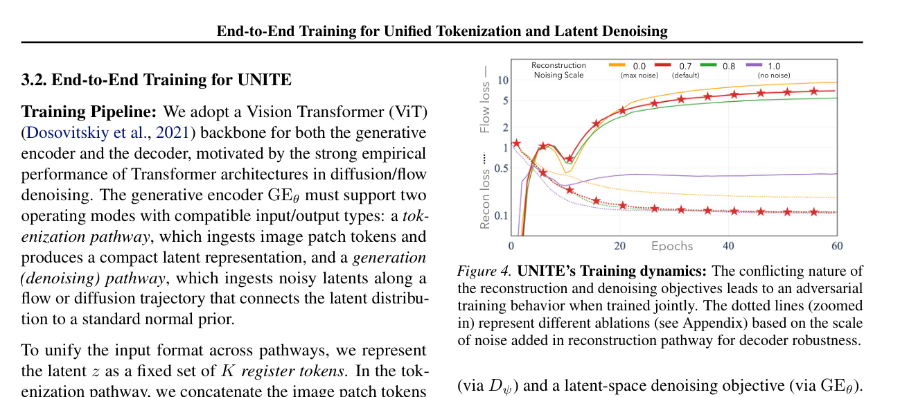

To unify the input format across pathways, we represent the latent z as a fixed set of K register tokens. In the tokenization pathway, we concatenate the image patch tokens with K registers, initializing the registers as i.i.d. Gaussian noise, N(0, I), to match the input distribution at the maximum noise level. The concatenated sequence is processed with self-attention in a first forward pass through GEθ. We then discard the patch tokens and retain only the updated registers. These updated registers serve as the image latents z0, having absorbed the relevant information from patches through attention. The decoder Dψ consumes z0 and reconstructs the image using a ViT-style stack followed by a lightweight unpatchification head to produce pixels.

In the generation (denoising) pathway, we first corrupt the clean latents z0 to obtain a noisy latent zt at noise level t (using our rectified-flow / flow-matching corruption process) and then use zt to initialize the same K registers. No image patches are concatenated in this pathway. A second forward pass through GEθ (now in generation mode, conditioned on t and optional class information) predicts the denoising target; in our implementation we use x-start prediction, i.e., ˆ z0 = GEθ(zt, t), so that the denoiser output lies in the same space as the tokenization output. To avoid degenerate solutions where the denoiser objective collapses the latent space, we stop gradients through the clean latents used to form zt (i.e., we detach z0 before noising).

The final layer of GEθ is a normalization module. Empirically, we find that LayerNorm (Ba et al., 2016) with learnable scale and shift parameters performs best. As a result, the clean latents z0 (from the tokenization pathway), the denoised predictions ˆ z0 (from the generation pathway), and the model outputs at each denoising step during inference are all normalized.

Overall, each training iteration performs two forward passes through the shared GEθ: an image-conditioned pass to produce clean latents for reconstruction, followed by a latentonly pass to denoise a corrupted version of those latents.

The full system is trained end-to-end in a single stage by jointly optimizing a pixel-space reconstruction objective

5

Training Objectives: We optimize two losses computed from the two forward passes described above. For reconstruction, we encode the image into clean latents z0 = GEθ(x), inject small Gaussian noise ˜ z0 = z0 + σϵ with reconstruction noise scale σ = 0.7 following Leng et al.

(2025); Yu et al. (2025a), and decode ˆ x = Dψ(˜ z0). The reconstruction loss combines pixel-level and perceptual terms:

Lrecon = ∥ˆ x −x∥1 + LPIPS(ˆ x, x). For generation, we apply rectified flow matching (Liu et al., 2023) on the latents. Given clean latents z0, we construct noisy latents zt = tz0+(1−t)ϵ with ϵ ∼N(0, I) and t ∼U[0, 1] (where t=1 corresponds to clean data and t=0 to pure noise), then train the generative encoder to predict clean latents via ˆ z0 = GEθ(zt, t). We minimize Lflow = Et,ϵ[∥ˆ z0 −sg(z0)∥2 2], where sg(·) denotes stop-gradient to prevent degenerate solutions. The total objective is the sum of reconstruction and generation losses.

Inference: At inference, the Generative Encoder can serve as the tokenizer by mapping an input image to its latent representation in a single forward pass. For generation, we start from a class label and noisy latent registers, and iteratively refine them through multiple passes of the GE into clean, decodable latents (shown as red loops in Fig. 1).

### 3.3. Understanding UNITE’s Training Dynamics

The adversarial nature of joint training.

Jointly training tokenization and generation under weight sharing induces non-trivial dynamics. In a standard LDM, the latent space is produced by a pretrained (and typically frozen) tokenizer, so the generative objective does not shape the latent interface.

In UNITE, reconstruction and generative objectives are optimized jointly over the same parameters, so each objective can influence the representations used by the other.

This dynamic is best understood as the search for a latent space that satisfies two distinct pressures shaping its structure. The reconstruction objective drives the encoder to

---

<!-- page 6 mode: hybrid_paper -->

maximize information content, preventing the latent representation from becoming too coarse to capture instancespecific detail. Simultaneously, the generative objective constrains how this information is encoded: it penalizes learning fragile representations whose semantic content can be easily destroyed by noise, since such instability makes denoising harder. Consequently, joint optimization balances these pressures, finding a latent space that is rich enough for reconstruction yet robust enough against perturbations. By forcing the encoder to adopt this robust geometry, the generative loss effectively molds the latent space into one that is intrinsically easier to denoise—facilitating high-fidelity generation.

Empirically, this interaction can resemble an “adversarial” game: the two losses do not necessarily decrease monotonically together. Improvements in generative fidelity can even coincide with an increase in denoising loss, as shown in Fig. 4 (see red curves with star markers). Crucially, a rising denoising loss does not imply worse generation. Instead, it often signals that the latent space is becoming richer and more informative to satisfy the reconstruction objective, making the denoising task harder but the resulting samples more realistic. During training, we often observe generation metrics (e.g., FID/IS) improving even as the denoising loss increases, until the system reaches a stable equilibrium.

Similar to GAN-style training, the goal is therefore not to drive all losses to zero, but to reach stable training dynamics where the latent space balances information density with generative robustness. This perspective is also consistent with modern diffusion/flow models, where the denoising loss typically stabilizes at a non-zero value.

### 4. Analyzing UNITE’s Generative Encoder

In UNITE, we pursue end-to-end training by sharing parameters between the encoder and denoiser roles of a single network. This choice suggests a natural hypothesis: parameter tying encourages the model to develop a common latent “language”—shared internal features and transformations that simultaneously support reconstruction and iterative denoising-based sampling.

To better understand this design choice, we study two alternative routes to end-to-end latent diffusion training that each relax a component of our Generative Encoder mechanism.

First, we remove parameter tying, maintaining separate encoder and denoiser networks while still training both objectives jointly. Second, we remove the stop-gradient through clean latents, allowing denoising gradients to backpropagate into the tokenization pathway. Together, these alternatives help isolate the role of weight sharing and gradient flow in our end-to-end formulation. Finally, we also study these end-to-end training approaches through the lenses of representation alignment and compression.

6

**End-to-End Training for Unified Tokenization and Latent Denoising**

| Gen. FID (gFID) |
|---|
| Recon. FID (rFID) |

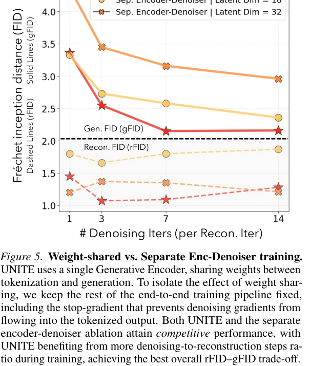

Fréchet inception distance (FID)

Solid Lines (gFID) Dashed Lines (rFID)

# Denoising Iters (per Recon. Iter)

Figure 5. Weight-shared vs. Separate Enc-Denoiser training.

UNITE uses a single Generative Encoder, sharing weights between tokenization and generation. To isolate the effect of weight sharing, we keep the rest of the end-to-end training pipeline fixed, including the stop-gradient that prevents denoising gradients from flowing into the tokenized output. Both UNITE and the separate encoder-denoiser ablation attain competitive performance, with UNITE benefiting from more denoising-to-reconstruction steps ratio during training, achieving the best overall rFID–gFID trade-off.

Weight-Shared vs. Separate Encoder–Denoiser Training:

Our Generative Encoder ties the encoding and denoising roles by sharing parameters. As an ablation, we keep the entire end-to-end pipeline fixed—including the stop-gradient that prevents denoising gradients from flowing through the tokenization output into the encoder–but instantiate separate networks for the encoder and the denoiser. In this separatenetworks ablation, the encoder & denoiser are optimized for their own objectives, with no gradient interaction involved.

If the weight-shared Generative Encoder matches or improves upon this separate-weights variant, it already offers a practical advantage: fewer parameters to store and update, and a shorter description length (MDL) for the learned model. Fig. 5 shows that, while the separate-weights ablation is competitive, parameter tying yields the best overall reconstruction–generation trade-off. Specifically, we report rFID and gFID as a function of the number of denoising (flow) steps performed per reconstruction step during training. Under weight sharing, increasing the number of flow steps consistently improves generation fidelity, reducing gFID from 3.33 to 2.12 as the number of flow iterations is increased by 14×. This indicates that the latent space becomes more sampleable–while maintaining, or slightly improving, reconstruction fidelity, suggesting that the representation also remains information-preserving at the chosen compression dimension. Next, we study the role of the stop gradients operator between the denoiser and the tokenizer.

---

<!-- page 7 mode: hybrid_paper -->

End-to-End Training for Unified Tokenization and Latent Denoising

Weight Sharing Impact on

Tokenization-Generation Alignment

Centred Kernel Alignment (CKA)

Centred Kernel Alignment (CKA)

Layer ID

Figure 6. Representation alignment between tokenization and generation pathways. We measure alignment between tokenization and denoising activations using CKA and cosine similarity. Given an input image, we first record intermediate activations along the tokenization pathway, then corrupt the encoded latent and record the corresponding denoising-pathway activations. Left: both the weight-shared UNITE model and the separate encoder–denoiser ablation exhibit strong alignment, especially in later layers, indicating that tokenization and denoising are intrinsically aligned tasks. Middle: removing the stop-gradient and backpropagating denoising gradients through the latent weakens late-layer alignment, even though the denoising objective still matches the final latent target. Right:

cosine similarity on the final latents decreases at lower denoising timesteps in the no-stop-gradient setting, suggesting that direct gradient backpropagation from denoising into tokenization leads to a less cleanly shared representation (see Fig. 7 for visual interpretation).

Backpropagating Denoising Gradients through the Encoder:

Throughout this work, we stop denoising gradients from flowing through the clean latent into the tokenization pathway. Concretely, after the tokenization pass produces z0 = GEθ(x), we apply sg(·) before constructing the noised latent zt used in the denoising pass. As a result, the flow-matching objective updates GEθ only through the second (denoising) forward pass, rather than also directly shaping tokenization through gradients flowing into z0.

Importantly, this does not decouple tokenization and generation: in the weight-shared Generative Encoder, reconstruction and denoising still act on the same set of network parameters, so both objectives jointly shape the learned representation. The stop-gradient only removes the more direct route in which denoising gradients also flow through the clean latent itself. In the separate encoder–denoiser setting, removing this stop-gradient yields a two-network end-to-end regime closely analogous to concurrent work on Unified Latents (UL) (Heek et al., 2026), which jointly trains separate encoder and denoiser modules without parameter sharing. We therefore study what happens when denoising gradients are allowed to backpropagate through the clean latent (termed the no-stop-grad setting in the following paragraphs), both in our weight-shared GE setting and in the separate encoder–denoiser ablation.

Looking at rFID/gFID, removing the stop-gradient improves the separate encoder–denoiser ablation from 2.60/1.30 to 2.24/0.85 (gFID/rFID), indicating that end-to-end joint training of tokenization and generation is promising. As noted in the concurrent Unified Latents (Heek et al., 2026) (their Appendix B), obtaining the best performance in the no-stop-gradient setting requires tuning the denoising-to-

7

(Denoiser à latent à Encoder) Gradient Backprop Impact on

Tokenization-Generation Alignment

(between final outputs)

Cosine Similarity

Denoising timestamp Layer ID

reconstruction loss ratio. By contrast, for UNITE, we obtain the best performance (gFID = 2.12, rFID = 1.1) with stopgradient in place. One possible hypothesis is that, under weight sharing, the two objectives already interact through a common parameter set, so allowing denoising gradients to additionally flow through the clean latent introduces extra (asymmetric) gradient interference. In this sense, weight sharing itself acts as a natural coupling mechanism between the two tasks: simply increasing the number of flow iterations improves performance, without requiring as much loss-weight tuning. We now showcase representation alignment and compression-based analysis.

Tokenization-Generation Representation Alignment Analysis:

As shown in Fig. 2, tokenization can be viewed as a generative process under strong observability, pθ(z | x), whereas generation corresponds to unconditional sampling from the induced prior, z ∼pθ(z). This viewpoint suggests that the two tasks may be aligned, and motivates measuring representational alignment between the two modes. We test this by measuring alignment between tokenization-pathway & denoising-pathway activations using Centered Kernel Alignment (CKA / CKNNA) and Cosine Similarity (Fig. 6).

Several aspects of our design encourage alignment. First, both modes are trained to operate in the same latent space:

the denoiser is supervised to predict the corresponding clean latent for a corrupted version of the encoded latent. Second, the GE receives the same latent register parameterization in both modes; during tokenization these registers are initialized from N(0, 1), reducing input-domain mismatch between tokenization and generation. Finally, we adopt architectural and optimization choices that limit drift between modes: (i) consistent normalization throughout the network

---

<!-- page 8 mode: hybrid_paper -->

gradients through clean latent may help preserve a more cleanly shared representation between tok. & generation.

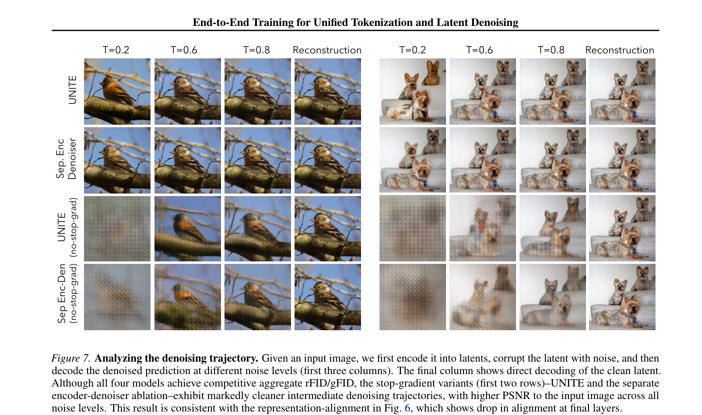

(within blocks and at the encoder output), (ii) matched conditioning interfaces across modes (e.g., time and class signals injected in analogous ways) to avoid mode-specific shortcuts, (iii) conservative optimization (learning-rate warmup and schedules) to prevent one objective from dominating shared parameters early in training.

With these choices in place, we find that both the weightshared Generative Encoder and the separate encoderdenoiser variant exhibit high CKA/CKNNA alignment (Fig. 6, left), indicating that tokenization and denoising are intrinsically aligned tasks in our setting. This also clarifies the role of weight sharing: when the two tasks already align, parameter tying becomes a principled way to remove redundancy—especially in the reusable functional sublayers (attention and MLPs)—while retaining strong reconstruction and generation fidelity.

When analyzing the no-stop-gradient alternative (Fig. 6, middle and right), we observe that, for both the weightshared and separate encoder–denoiser settings, CKA and cosine-similarity alignment between the outputs of the tokenization and denoising pathways is reduced, relative to the stop-gradient variants, despite the denoising objective encouraging agreement at the final latent target. Further, Fig. 7 shows that the no-stop-gradient models produce noticeably noisier intermediate denoised reconstructions. Taken together, these observations suggest that stopping denoising

8

Entropy / Compression Analysis.

We next study the encoder–denoiser relationship through the lens of compressibility, motivated by a Minimum Description Length (MDL) perspective: if tokenization and denoising implement closely related computations, then a unified latentgeneration program might admit a shorter description than two independently parameterized modules. Concretely, we estimate an empirical description-length proxy for model weights using per-tensor histogram entropy.

We begin with the separate encoder–denoiser setting. Compared to random weights, the total entropy of the encoder drops from 179.2MB at random initialization to 121.9MB after training, with both normalization parameters (60.0 →30.7MB) and functional attention/MLP parameters (119.2 →91.2MB) becoming substantially more structured as a result of training.

In the weight-shared Generative Encoder setting, the entropy of the functional attention/MLP parameters remains nearly unchanged relative to the separate encoder (91.2MB →90.8MB), while the main increase is concentrated in normalization-related parameters, whose entropy rises modestly from 30.7MB to 42.0MB and closely matches that of the separate denoiser (42.0MB). Thus, unifying tokenization and denoising does not require a more complex functional

---

<!-- page 9 mode: hybrid_paper -->

**Table 1. ImageNet 256×256 generation. Our approach out- performs both recent single-stage pixel baselines and standard two-stage latent diffusion frameworks by a large margin.**

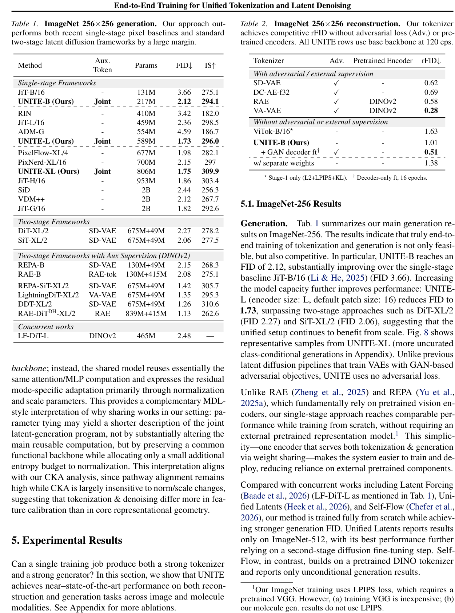

**Table 2. ImageNet 256×256 reconstruction. Our tokenizer achieves competitive rFID without adversarial loss (Adv.) or pre- trained encoders. All UNITE rows use base backbone at 120 eps.**

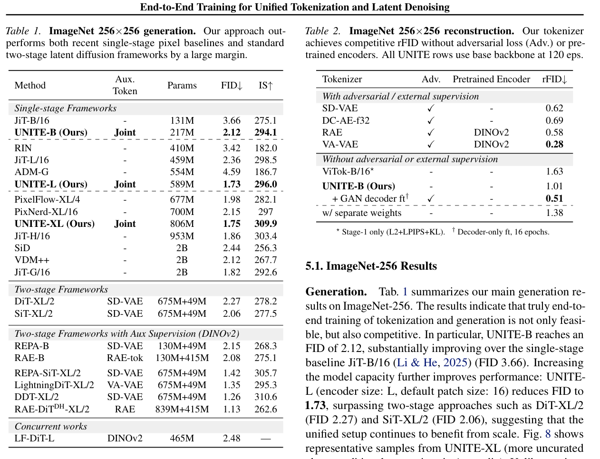

End-to-End Training for Unified Tokenization and Latent Denoising

Can a single training job produce both a strong tokenizer and a strong generator? In this section, we show that UNITE achieves near–state-of-the-art performance on both reconstruction and generation tasks across image and molecule modalities. See Appendix for more ablations.

9

1Our ImageNet training uses LPIPS loss, which requires a pretrained VGG. However, (a) training VGG is inexpensive; (b) our molecule gen. results do not use LPIPS.

---

<!-- page 10 mode: hybrid_paper -->

**Table 3. QM9 molecule generation. UNITE-S achieves the best reconstruction accuracy (99.37% match) and uniqueness (99.71%) under single-stage training. Crystal generation results on MP20 are provided in Appendix C.2.**

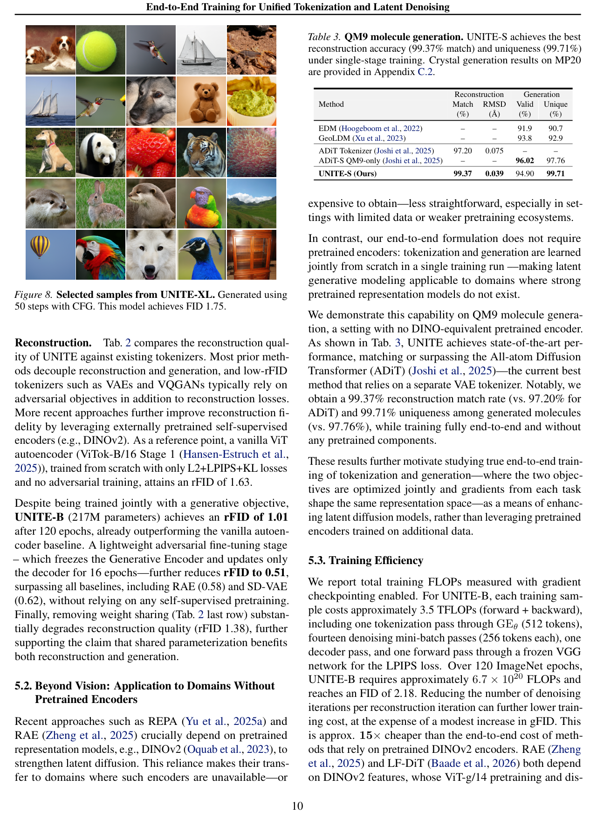

End-to-End Training for Unified Tokenization and Latent Denoising

10

---

<!-- page 11 mode: hybrid_paper -->

End-to-End Training for Unified Tokenization and Latent Denoising

tillation together require approx. 27,000 A100-GPU-hours, corresponding to ∼1.0 × 1022 model FLOPs 2. This constitutes a fixed upfront cost inherited by any downstream method built on top of these features. In contrast, UNITE eliminates this overhead entirely by training from scratch.

Compared with standard two-stage latent diffusion models, our total compute is comparable: UNITE-B surpasses DiTXL/2 (Peebles & Xie, 2023) (FID 2.27) at nearly matched total FLOPs (6.7 × 1020 vs. 6.4 × 1020), while using 3× fewer parameters (217M vs. 724M). In addition, UNITE jointly learns a tokenizer whose latent space is shaped by both reconstruction and generation objectives (Tab. 2).

Among single-stage methods, UNITE-B (6.7×1020 FLOPs, 217M parameters) achieves an FID of 2.18 at total compute comparable to JiT-G/16 (Li & He, 2025) (∼8.8 × 1020

FLOPs, 2B parameters, FID 1.82), while using approximately 10× fewer parameters. Moreover, UNITE produces a reusable latent tokenizer alongside the generator, a capability that pixel-space methods such as JiT do not offer.

### 6. Conclusion

We present UNITE, a unified approach to joint tokenization and generation. Our encoder, termed the Generative Encoder, serves as both tokenizer and latent denoiser, with weights shared across the two objectives. This shared parameterization allows reconstruction and generation gradients to jointly shape the representation space, encouraging a common latent “language” that supports both tasks. UNITE is trained end-to-end in a single stage, with each iteration performing two forward passes through the same Generative Encoder: one for tokenization/reconstruction and one for latent denoising. Across ImageNet and molecule generation, UNITE achieves near-state-of-the-art fidelity: the base model reaches 2.12 gFID on ImageNet 256×256, and scaling to XL improves this to 1.75 gFID. We further analyze the Generative Encoder through the lenses of representation alignment and compression.

More broadly, our results suggest two practical implications.

First, it removes the reliance on pretrained encoders such as DINO for generative modeling, opening the door to latent generative modeling in domains where such encoders are unavailable. Second, our unified architecture is simpler and more efficient than conventional two-stage pipelines, reducing both implementation complexity and overall computational requirements.

### 7. Discussions

The core contribution of UNITE is to align tokenization and generation by training both over a shared latent space. The

227,316 A100-GPU-hours × 312 TFLOP/s (A100 BF16 peak) × 0.4 model-FLOP utilization ≈1.0 × 1022 (Oquab et al., 2023).

11

two objectives we consider are denoising and reconstruction. While reconstruction is a natural objective for learning compressed representations that preserve input information, exploring alternative objectives for tokenization beyond reconstruction is an interesting direction for research—for example, jointly training the Generative Encoder with DINOor JEPA-style objectives. This is especially appealing for robotics, where generative modeling can provide a useful world model of the environment. However, naively training such a world model on standard VAE latents may not yield actionable latents that matter most for decision-making.

Another point worth discussing is the vision-language modeling capability of the Generative Encoder. The Generative Encoder idea is loosely reminiscent of the classical wakesleep algorithm, whose broader goal was to bridge discriminative and generative modeling. While UNITE achieves strong reconstruction and generation fidelity, the linear probing accuracy of the Generative Encoder remains comparable to that of other generative tokenizers, such as VAEs and VQGANs, at around 30%. We believe that linear probing (LP) alone may not be fully predictive of the discriminative strengths of highly compressed latent representations. In particular, stronger compression may require greater downstream decoding capacity before the representation becomes predictive for a given task. For this reason, evaluating the tokenizer in a VLM setting may provide a more informative picture of its discriminative capabilities than LP alone.

Furthermore, the results in Fig. 7 suggest that weight sharing and end-to-end joint training of tokenization and generation may support further progress toward faster generative models, potentially enabling high-quality one- to few-step generation. This also raises another interesting related question: can the process of mapping images to latents itself benefit from multiple iterative refinement loops? Prior work, such as ALIT (Duggal et al., 2025), has explored this direction and reported improvements in linear probing and token-level object binding with additional iterations.

Acknowledgements

We are grateful to Jyo Pari, Shamit Lal, Tianyuan Zhang, Suwan Kim, Peter Holderrieth & Qianwei Jia for fruitful discussions and constructive suggestions. We also thank Prof.

Kaiming He for inspiring discussions on earlier iterations of this project. This work is in part supported by MIT-IBM Watson AI Lab; ONR MURI grant #033697-00007; the National Science Foundation under Cooperative Agreement PHY-2019786 (The NSF AI Institute for Artificial Intelligence and Fundamental Interactions, http://iaifi.org/). S.D.

is further supported by Amazon AI Research Innovation Fellowship; X.B. is supported by MongoDB PhD fellowship.

---

<!-- page 12 mode: hybrid_paper -->

End-to-End Training for Unified Tokenization and Latent Denoising

### References

Ba, J. L., Kiros, J. R., and Hinton, G. E. Layer normalization.

arXiv preprint arXiv:1607.06450, 2016.

Baade, A., Chan, E. R., Sargent, K., Chen, C., Johnson, J., Adeli, E., and Fei-Fei, L. Latent forcing: Reordering the diffusion trajectory for pixel-space image generation,

2026. URL https://arxiv.org/abs/2602.1

1401.

Brown, T., Mann, B., Ryder, N., Subbiah, M., Kaplan, J. D., Dhariwal, P., Neelakantan, A., Shyam, P., Sastry, G., Askell, A., Agarwal, S., Herbert-Voss, A., Krueger, G., Henighan, T., Child, R., Ramesh, A., Ziegler, D., Wu, J., Winter, C., Hesse, C., Chen, M., Sigler, E., Litwin, M., Gray, S., Chess, B., Clark, J., Berner, C., McCandlish, S., Radford, A., Sutskever, I., and Amodei, D. Language models are few-shot learners. Advances in Neural Information Processing Systems, 33:1877–1901, 2020. URL https://papers.nips.cc/paper/2020/ha sh/1457c0d6bfcb4967418bfb8ac142f64a-A bstract.html.

Caron, M., Touvron, H., Misra, I., J´ egou, H., Mairal, J., Bojanowski, P., and Joulin, A. Emerging properties in self-supervised vision transformers. Proceedings of the IEEE/CVF International Conference on Computer Vision, pp. 9650–9660, 2021.

Chefer, H., Esser, P., Lorenz, D., Podell, D., Raja, V., Tong, V., Torralba, A., and Rombach, R. Self-supervised flow matching for scalable multi-modal synthesis. arXiv preprint arXiv:2603.06507, 2026.

Chen, J., Yu, J., Ge, C., Yao, L., Xie, E., Wu, Y., Wang, Z., Kwok, J., Luo, P., Lu, H., and Li, Z. Pixart-α: Fast training of diffusion transformer for photorealistic text-toimage synthesis. arXiv preprint arXiv:2310.00426, 2023.

URL https://arxiv.org/abs/2310.00426.

Chen, R. T. Q., Rubanova, Y., Bettencourt, J., and Duvenaud,

D. Neural ordinary differential equations. In Advances

in Neural Information Processing Systems, volume 31,

2018. URL https://papers.nips.cc/paper

/2018/hash/69386f6bb1dfed68692a24c86 86939b9-Abstract.html.

Chen, S., Ge, C., Zhang, S., Sun, P., and Luo, P. Pixelflow:

Pixel-space generative models with flow. arXiv preprint arXiv:2504.07963, 2025a.

Chen, T. On the importance of noise scheduling for diffusion models. arXiv preprint arXiv:2301.10972, 2023.

Chen, Z., Zhu, J., Chen, X., Zhang, J., Hu, X., Zhao, H., Wang, C., Yang, J., and Tai, Y. Dip: Taming diffusion models in pixel space. arXiv preprint arXiv:2511.18822, 2025b.

12

Dosovitskiy, A., Beyer, L., Kolesnikov, A., Weissenborn, D., Zhai, X., Unterthiner, T., Dehghani, M., Minderer, M., Heigold, G., Gelly, S., Uszkoreit, J., and Houlsby,

N. An image is worth 16x16 words: Transformers for

image recognition at scale. In International Conference on Learning Representations, 2021. URL https://op enreview.net/forum?id=YicbFdNTTy.

Duggal, S., Isola, P., Torralba, A., and Freeman, W. T. Adaptive length image tokenization via recurrent allocation.

In The Thirteenth International Conference on Learning Representations, 2025. URL https://openreview .net/forum?id=mb2ryuZ3wz.

Esser, P., Rombach, R., and Ommer, B. Taming transformers for high-resolution image synthesis. In Proceedings of the IEEE/CVF Conference on Computer Vision and Pattern Recognition, pp. 12873–12883, 2021.

Esser, P., Kulal, S., Blattmann, A., Entezari, R., M¨ uller, J., Saini, H., Levi, Y., Lorenz, D., Sauer, A., Boesel, F., Podell, D., Dockhorn, T., English, Z., and Rombach, R.

Scaling rectified flow transformers for high-resolution image synthesis.

In Proceedings of the 41st International Conference on Machine Learning, volume 235 of Proceedings of Machine Learning Research, pp. 12606–

12633. PMLR, 2024. URL https://proceedings.

mlr.press/v235/esser24a.html.

Goodfellow, I., Pouget-Abadie, J., Mirza, M., Xu, B., Warde-Farley, D., Ozair, S., Courville, A., and Bengio, Y.

Generative adversarial networks. Communications of the ACM, 63(11):139–144, 2020.

Hansen-Estruch, P., Yan, D., Chung, C.-Y., Zohar, O., Wang, J., Vishwanath, S., Vajda, P., and Chen, X. Learnings from scaling visual tokenizers for reconstruction and generation. arXiv preprint arXiv:2501.09755, 2025.

He, K., Chen, X., Xie, S., Li, Y., Doll´ ar, P., and Girshick,

R. Masked autoencoders are scalable vision learners.

Proceedings of the IEEE/CVF Conference on Computer Vision and Pattern Recognition, pp. 16000–16009, 2022.

Heek, J., Hoogeboom, E., Mensink, T., and Salimans, T.

Unified latents (ul): How to train your latents, 2026. URL https://arxiv.org/abs/2602.17270.

Ho, J., Jain, A., and Abbeel, P. Denoising diffusion probabilistic models.

In Advances in Neural Information Processing Systems, volume 33, pp. 6840–6851. Curran Associates, Inc., 2020.

Hoogeboom, E., Satorras, V. G., Vignac, C., and Welling,

M. Equivariant diffusion for molecule generation in 3d.

In International Conference on Machine Learning, pp.

8867–8887. PMLR, 2022.

---

<!-- page 13 mode: hybrid_paper -->

End-to-End Training for Unified Tokenization and Latent Denoising

Hoogeboom, E., Heek, J., and Salimans, T. simple diffusion: End-to-end diffusion for high resolution images.

In International Conference on Machine Learning, pp.

13213–13232. PMLR, 2023.

Hoogeboom, E., Mensink, T., Heek, J., Lamerigts, K., Gao, R., and Salimans, T. Simpler diffusion (sid2): 1.5 fid on imagenet512 with pixel-space diffusion. arXiv preprint arXiv:2410.19324, 2024.

Jain, A., Ong, S. P., Hautier, G., Chen, W., Richards, W. D., Dacek, S., Cholia, S., Gunter, D., Skinner, D., Ceder, G., and Persson, K. A. Commentary: The materials project:

A materials genome approach to accelerating materials innovation. APL Materials, 1(1):011002, 2013.

Joshi, C. K., Fu, X., Liao, Y.-L., Gharakhanyan, V., Miller,

B. K., Sriram, A., and Ulissi, Z. W. All-atom diffusion

transformers: Unified generative modelling of molecules and materials. arXiv preprint arXiv:2503.03965, 2025.

Kingma, D. and Gao, R. Understanding diffusion objectives as the elbo with simple data augmentation. Advances in Neural Information Processing Systems, 36:65484– 65516, 2023.

Kingma, D. P. and Welling, M. Auto-encoding variational bayes. arXiv preprint arXiv:1312.6114, 2014.

Kornblith, S., Norouzi, M., Lee, H., and Hinton, G. Similarity of neural network representations revisited. In Proceedings of the 36th International Conference on Machine Learning, volume 97 of Proceedings of Machine Learning Research, pp. 3519–3529. PMLR, 2019. URL https://proceedings.mlr.press/v97/ko rnblith19a.html.

Koroteev, M. V. Bert: a review of applications in natural language processing and understanding. arXiv preprint arXiv:2103.11943, 2021.

Leng, X., Singh, J., Hou, Y., Xing, Z., Xie, S., and Zheng, L.

Repa-e: Unlocking vae for end-to-end tuning with latent diffusion transformers. arXiv preprint arXiv:2504.10483, 2025.

Li, T. and He, K. Back to basics: Let denoising generative models denoise. arXiv preprint arXiv:2511.13720, 2025.

Li, T., Li, H., and Deng, M. Autoregressive image generation without vector quantization. Advances in Neural Information Processing Systems, 37, 2024.

Lipman, Y., Chen, R. T. Q., Ben-Hamu, H., Nickel, M., and Le, M. Flow matching for generative modeling. In International Conference on Learning Representations,

2023. URL https://arxiv.org/abs/2210.0

2747.

13

Liu, X., Gong, C., and Liu, Q.

Flow straight and fast:

Learning to generate and transfer data with rectified flow.

arXiv preprint arXiv:2209.03003, 2023.

Ma, N., Goldstein, M., Albergo, M. S., Boffi, N. M., VandenEijnden, E., and Xie, S. Sit: Exploring flow and diffusionbased generative models with scalable interpolant transformers. arXiv preprint arXiv:2401.08740, 2024. URL https://arxiv.org/abs/2401.08740. ECCV 2024.

Ong, S. P., Richards, W. D., Jain, A., Hautier, G., Kocher, M., Cholia, S., Gunter, D., Chevrier, V. L., Persson, K. A., and Ceder, G. Python materials genomics (pymatgen): A robust, open-source python library for materials analysis.

Computational Materials Science, 68:314–319, 2013.

Oquab, M., Darcet, T., Moutakanni, T., Vo, H., Szafraniec, M., Khalidov, V., Fernandez, P., Haziza, D., Massa, F., El-Nouby, A., Assran, M., Ballas, N., Galuba, W., Howes, R., Huang, P.-Y., Li, S.-W., Misra, I., Rabbat, M., Sharma, V., Synnaeve, G., Xu, H., J´ egou, H., Mairal, J., Labatut, P., Joulin, A., and Bojanowski, P. Dinov2: Learning robust visual features without supervision. arXiv preprint arXiv:2304.07193, 2023. URL https://arxiv.or g/abs/2304.07193.

Peebles, W. and Xie, S. Scalable diffusion models with transformers. In Proceedings of the IEEE/CVF International Conference on Computer Vision (ICCV), pp. 4195–4205,

2023. URL https://openaccess.thecvf.co

m/content/ICCV2023/html/Peebles_Scal able_Diffusion_Models_with_Transform ers_ICCV_2023_paper.html.

Polyak, A., Zohar, A., Brown, A., Tjandra, A., Sinha, A., Lee, A., Vyas, A., Shi, B., Ma, C.-Y., Chuang, C.-Y., et al.

Movie gen: A cast of media foundation models. arXiv preprint arXiv:2410.13720, 2024.

Radford, A., Kim, J. W., Hallacy, C., Ramesh, A., Goh, G., Agarwal, S., Sastry, G., Askell, A., Mishkin, P., Clark, J., Krueger, G., and Sutskever, I. Learning transferable visual models from natural language supervision.

In Proceedings of the 38th International Conference on Machine Learning, volume 139 of Proceedings of Machine Learning Research, pp. 8748–8763. PMLR, 2021. URL https://proceedings.mlr.press/v139/r adford21a.html.

Ramakrishnan, R., Dral, P. O., Rupp, M., and von Lilienfeld,

O. A. Quantum chemistry structures and properties of

134 kilo molecules. Scientific Data, 1(1):140022, 2014.

Song, Y., Sohl-Dickstein, J., Kingma, D. P., Kumar, A., Ermon, S., and Poole, B. Score-based generative modeling through stochastic differential equations. In International

---

<!-- page 14 mode: simple_text -->

End-to-End Training for Unified Tokenization and Latent Denoising

Conference on Learning Representations, 2021. URL https://openreview.net/forum?id=PxTI G12RRHS.

Tian, K., Jiang, Y., Yuan, Z., Peng, B., and Wang, L. Visual autoregressive modeling: Scalable image generation via next-scale prediction. In Advances in Neural Information Processing Systems, volume 37, 2024. URL https:

//arxiv.org/abs/2404.02905.

Van Den Oord, A., Vinyals, O., and Kavukcuoglu, K. Neural discrete representation learning.

Advances in Neural Information Processing Systems, 30, 2017.

Wan, T., Wang, A., Ai, B., Wen, B., Mao, C., Xie, C.-W., Chen, D., Yu, F., Zhao, H., Yang, J., et al. Wan: Open and advanced large-scale video generative models. arXiv preprint arXiv:2503.20314, 2025.

Wang, S., Gao, Z., Zhu, C., Huang, W., and Wang, L.

Pixnerd: Pixel neural field diffusion.

arXiv preprint arXiv:2507.23268, 2025.

Xu, M., Powers, A. S., Dror, R. O., Ermon, S., and Leskovec,

J. Geometric latent diffusion models for 3d molecule gen-

eration. In International Conference on Machine Learning, pp. 38592–38610. PMLR, 2023.

Yu, S., Kwak, S., Jang, H., Jeong, J., Huang, J., Shin, J., and Xie, S. Representation alignment for generation: Training diffusion transformers is easier than you think. In ICLR, 2025a.

Yu, Y., Xiong, W., Nie, W., Sheng, Y., Liu, S., and Luo, J.

Pixeldit: Pixel diffusion transformers for image generation. arXiv preprint arXiv:2511.20645, 2025b.

Zhai, S. et al. Normalizing flows are capable generative models. arXiv preprint arXiv:2412.06329, 2024.

Zheng, B., Ma, N., Tong, S., and Xie, S. Diffusion transformers with representation autoencoders. arXiv preprint arXiv:2510.11690, 2025.

14

---

<!-- page 15 mode: simple_text -->

End-to-End Training for Unified Tokenization and Latent Denoising

### Appendix

In this appendix, we first provide more details on the reconstruction fidelity results in Sec. A. Next, we share evaluation details (Sec. B), along with additional uncurated samples generated by our model UNITE-XL shown in Fig. 9. We also provide architectural and training details in Tab. 7 and Tab. 8. Finally, Sec. C presents additional results on the molecule generation task and ablations on ImageNet.

### A. Reconstruction Fidelity Details

Table 2 in the main paper summarizes our reconstruction results. Here, we provide additional details on the adversarial fine-tuning procedure that reduces rFID from 1.01 to 0.51, without changing gFID.

GAN Decoder Fine-Tuning.

After UNITE joint training converges, we optionally apply a lightweight adversarial finetuning stage that targets only the decoder. Concretely, we freeze the Generative Encoder entirely and train the decoder with an additional GAN loss for 16 epochs. The discriminator is initialized from our Generative Encoder, which already encodes rich semantic features from joint training; this eliminates the need for an external pretrained network (e.g., DINOv2) as the discriminator backbone. Due to limited compute budget, we did not explore fine-tuning both the encoder and decoder jointly with adversarial training.

Effect of Weight Sharing on Reconstruction.

As shown in Table 2, removing weight sharing between the encoder and denoiser (in the stop-gradient setting) degrades rFID from 1.01 to 1.38. We attribute this to the fact that in the shared-weight setting, the generation objective acts as an implicit regularizer on the encoder, encouraging latent representations that are both reconstructive and generatively useful. Separate weights remove this coupling, leading to a less structured latent space.

That said, the separate encoder–denoiser variant without stop-gradient achieved a much lower rFID, indicating that joint training of tokenization and generation is beneficial.

### B. Evaluation Protocol

For reproducibility, we detail the full evaluation protocol used for all ImageNet-256 generation results. See also Fig. 9 for additional uncurated samples generated by UNITE-XL.

FID Computation.

We compute Fr´ echet Inception Distance (FID) using the torch-fidelity library with InceptionV3 features. Reference statistics are computed on the full ImageNet-1K training set (1281167 images). All reported FID scores use 50K generated samples.

Sampling Protocol.

We adopt class-balanced sampling: exactly 50 images are generated per class for the 1K ImageNet classes, totaling 50K images. This follows the protocol used by VAR (Tian et al., 2024), MAR (Li et al., 2024), and RAE (Zheng et al., 2025), among others. As shown in RAE (Table 14), class-balanced sampling yields about 0.1 lower FID than the uniform random class sampling used in some prior work (e.g., DiT (Peebles & Xie, 2023), SiT (Ma et al., 2024)).

We note this systematic difference when comparing absolute FID values across methods.

ODE Solver and Inference Details.

At inference time, we solve the probability flow ODE over the interval [0.1, 1.0] with classifier-free guidance. We sweep the CFG scale ω from 1.0 to 4.0 in increments of 0.2 and report best FID for each model.

For all reported FID numbers in the main paper (Tab. 1), we use the adaptive fifth-order Dormand–Prince solver (dopri5, from torchdiffeq (Chen et al., 2018)), following the default configuration of the SiT codebase (Ma et al., 2024). For our model, we observe that dopri5 uses ∼108 NFEs on average per sample (estimated from wall-clock timing), compared to exactly 100 NFEs for the fixed-step Heun solver with 50 steps.

Tab. 4 compares FID under different evaluation protocols for the same UNITE-B checkpoint. Switching to a fixedstep second-order Heun solver with 50 steps (100 NFEs) yields FID within ∼0.05 of dopri5, consistent with prior observations that flow-matching models produce near-linear trajectories that are well approximated by low-order fixed-step integrators (Lipman et al., 2023; Liu et al., 2023). This small gap is also consistent with the SiT authors’ report that the FID difference between dopri5 and fixed-step solvers is <0.1.3

3See https://github.com/willisma/SiT/issues/21.

15

---

<!-- page 16 mode: simple_text -->

End-to-End Training for Unified Tokenization and Latent Denoising

Table 4. Effect of evaluation protocol on reported FID. All rows use the same UNITE-B checkpoint (240 epochs). “Balanced” denotes 50 images per class; “Random” denotes uniformly sampled class labels. NFE = number of function evaluations.

ODE Solver Class Sampling NFE FID ↓ IS ↑

Heun (50 steps) Balanced 100 2.789 287.6 dopri5 (adaptive) Balanced ∼108 2.735 268.1 dopri5 (adaptive) Random ∼108 2.885 274.7

### C. Additional Results

C.1. QM9 Molecular Generation

The QM9 dataset (Ramakrishnan et al., 2014) contains approximately 130K stable small organic molecules with up to 9 heavy atoms from the set {C, N, O, F}. Following Joshi et al. (2025), we represent molecules with explicit hydrogen atoms and use 3D Cartesian coordinates for both training and generation. Each molecule is preprocessed to ensure correct bond valencies and stable conformations, with coordinates normalized to have zero center of mass.

Our training configuration employs the UNITE-S architecture with a DiT-S backbone containing approximately 33M parameters. The model is trained end-to-end for 8000 epochs with a batch size of 512 using the AdamW optimizer with a learning rate of 1 × 10−4. This single-stage approach contrasts with ADiT’s two-stage training, which requires 5000 epochs for the tokenizer followed by another 5000 epochs for the diffusion model, totaling 10000 epochs of training across two separate optimization phases.

For evaluation, we compute four primary metrics on 10000 generated samples. The match rate measures the percentage of reconstructed molecules that exactly match the input structure after discretization. The RMSD (Root Mean Square Deviation) in Angstroms quantifies reconstruction error in atomic positions. Validity percentage indicates the proportion of generated molecules satisfying chemical constraints including proper valencies, reasonable bond lengths, and absence of steric clashes. Uniqueness measures the percentage of distinct molecules among valid generations, computed using canonical SMILES representations to identify duplicates.

The UNITE-S architecture employs a weight-shared encoder-denoiser operating in a 16-dimensional latent space, significantly compressed from the original 3D coordinate space. This compression factor of approximately 20:1 (from 29 atoms × 3 coordinates to 16 dimensions) requires the model to learn highly efficient representations while maintaining recon. fidelity.

C.2. MP20 Crystal Generation

The MP20 dataset from the Materials Project (Jain et al., 2013) contains 45,231 inorganic crystal structures with up to 20 atoms per unit cell. We train UNITE-S for 10000 epochs with batch size 512, following the same single-stage approach as QM9. Evaluation follows Joshi et al. (2025), computing structural validity (pairwise distances > 0.5 ˚ A, unit cell volume > 0.1 ˚ A3), compositional validity (charge neutrality and electronegativity balance), and match rate using pymatgen’s (Ong et al., 2013) Structure Matcher.

Table 5. MP20 crystal generation results. Evaluation on 10K generated samples.

Method

Size Training Struct.

Comp.

Overall Match

ADiT Tokenizer 84.50 ADiT MP20-only DiT-B Two-stage 99.6 90.5 90.1 ADiT Joint DiT-B Two-stage 99.7 92.1 91.9 -

UNITE-S (Ours) DiT-S Single-stage 99.0 89.9 87.9 75.7

Table 5 shows that UNITE-S achieves 87.9% overall validity on MP20, approaching ADiT’s 90.1% despite using singlestage training. Our structural validity of 99.0% nearly matches ADiT’s 99.6%, demonstrating effective learning of crystal geometry constraints. The match rate of 75.7% is reasonable considering ADiT’s dedicated tokenizer achieves 84.50% after separate optimization. These results validate that our unified approach generalizes well from molecules to crystals—the same architecture that achieves a 99.37% match rate on QM9 also performs competitively on the more complex MP20 dataset without modification.

16

---

<!-- page 17 mode: hybrid_paper -->

17

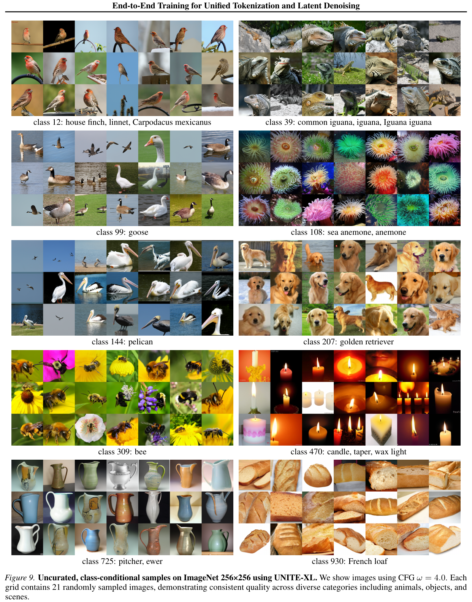

---

<!-- page 18 mode: hybrid_paper -->

**Table 6. Ablation study on ImageNet-256 generation. We systematically evaluate key design choices across architecture, normalization, training dynamics, and augmentation strategies. All ablations are done using the base backbone and trained for 120 epochs.**

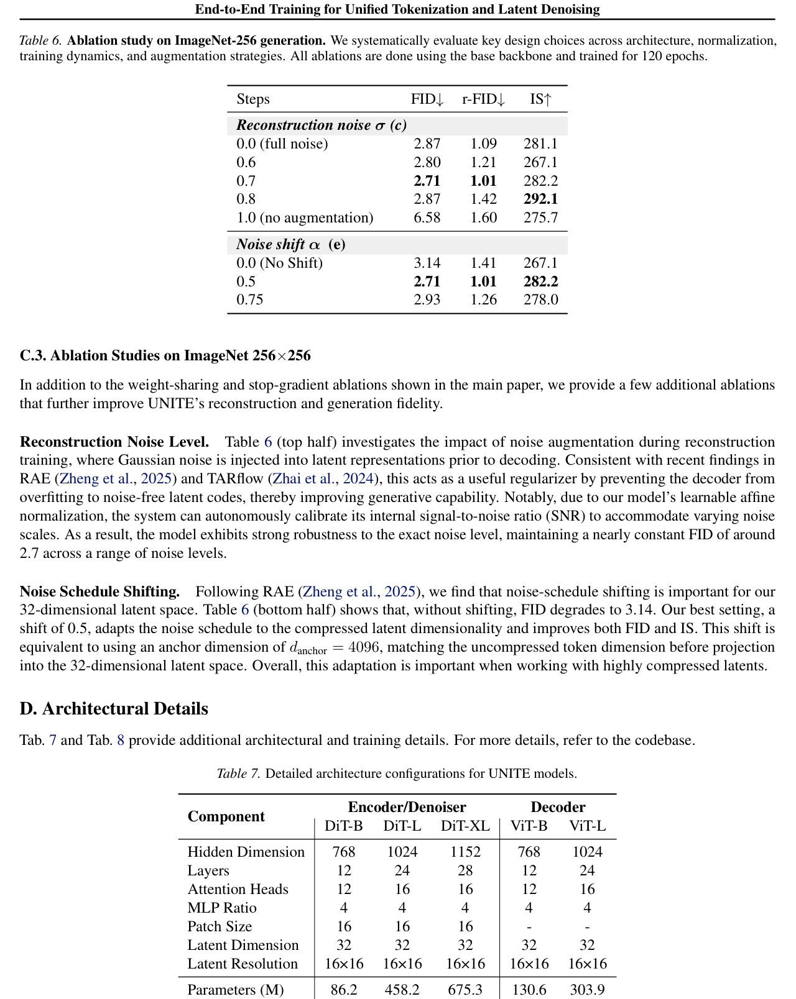

End-to-End Training for Unified Tokenization and Latent Denoising

**Table 7. Detailed architecture configurations for UNITE models.**

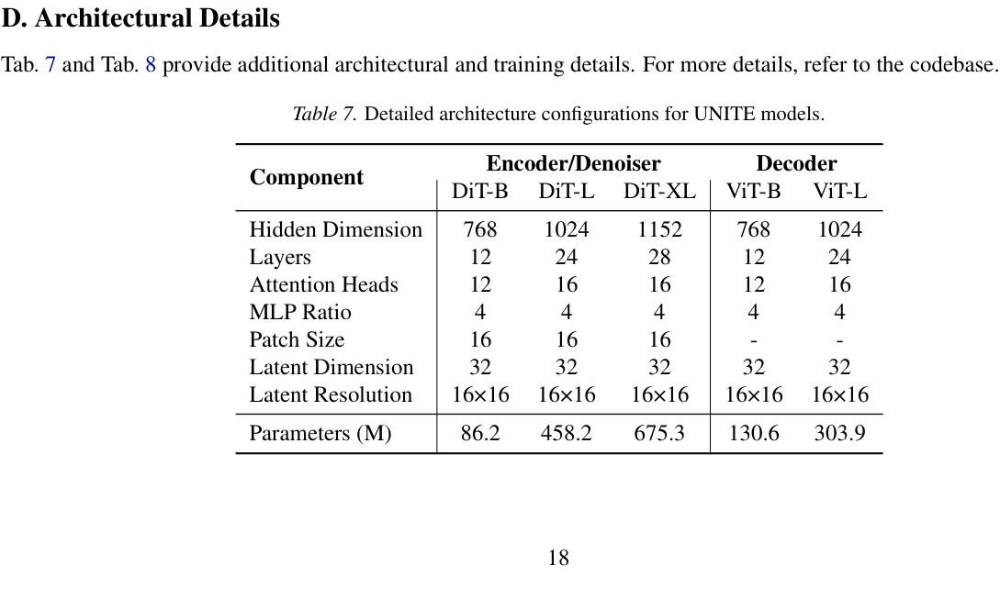

---

<!-- page 19 mode: simple_text -->

End-to-End Training for Unified Tokenization and Latent Denoising

Table 8. Training configuration for ImageNet-256 experiments. All models trained with mixed precision BF16 & gradient clipping at 3.0.

Hyperparameter Value Hyperparameter Value

Base Learning Rate 1 × 10−4 Warmup Epochs 20 Global Batch Size 1024 Total Epochs 240 Optimizer Muon LR Schedule Cosine AdamW Betas (0.9, 0.999) Min LR 1 × 10−6

Weight Decay 0 Gradient Clip 3.0 Reconstruction Noise (σ) 0.7 EMA Decay 0.9978 Flow Steps (Training) 1000 ODE Solver (Inference) dopri5 (adaptive, ∼108 NFE) Flow Mini-batches 14 Noise Schedule Shift (α) 0.5 CFG Scale (ω) Sweep [1.0, 4.0], step 0.2 Integration Interval [0.1, 1.0]

19

---
