# p115

<!-- document_mode: hybrid_paper -->

<!-- page 1 mode: hybrid_paper -->

## arXiv:2603.23502v1 [cs.CV] 24 Mar 2026

### Abstract

Relying on in-domain annotations and precise sensor-rig priors, existing 3D occupancy prediction methods are limited in both scalability and out-of-domain generalization. While recent visual geometry foundation models exhibit strong generalization capabilities, they were mainly designed for general purposes and lack one or more key ingredients required for urban occupancy prediction, namely metric prediction, geometry completion in cluttered scenes and adaptation to urban scenarios. We address this gap and present OccAny, the first unconstrained urban 3D occupancy model capable of operating on out-of-domain uncalibrated scenes to predict and complete metric occupancy coupled with segmentation features. OccAny is versatile and can predict occupancy from sequential, monocular, or surround-view images. Our contributions are three-fold: (i) we propose the first generalized 3D occupancy framework with (ii) Segmentation Forcing that improves occupancy quality while enabling mask-level prediction, and (iii) a Novel View Rendering pipeline that infers novel-view geometry to enable test-time view augmentation for geometry completion. Extensive experiments demonstrate that OccAny outperforms all visual geometry baselines on 3D occupancy prediction task, while remaining competitive with in-domain self-supervised methods across three input settings on two established urban occupancy prediction datasets. Our code is available at https://github.com/valeoai/OccAny .

### 1. Introduction

The innate ability to see and make sense of the world in three dimensions underpins how humans understand and navigate the space. Advancing 3D scene understanding is crucial for spatial intelligent systems such as autonomous driving, robotics, and augmented reality. A key task in this area is 3D occupancy prediction whose goal is to infer a voxelized map of the environment and, when required, provide the corresponding semantics. Despite advances in architecture design [12, 46, 58, 72], training algorithm [5, 27, 30, 44, 76]

## OccAny: Generalized Unconstrained Urban 3D Occupancy

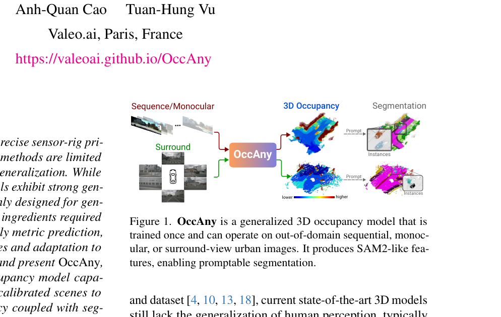

and dataset [4, 10, 13, 18], current state-of-the-art 3D models still lack the generalization of human perception, typically requiring constrained setup with precise sensor calibration.

While humans can effortlessly infer complex 3D structures in any novel scenes, replicating this capability remains a demanding problem.

State-of-the-art supervised approaches for 3D occupancy prediction [23, 32, 34, 67, 69, 76, 82] achieve remarkable results when the training and test data are drawn from the same distribution, i.e. both are collected using the same or a similar sensor rig under comparable conditions. A core component of these methods is the lifting of 2D features into 3D space, performed either via learnable mechanisms [23, 34] or via explicit camera modeling [5, 79]. However, this lifting operation inherently embeds sensor- and domain-specific biases into the models, which limits their ability to generalize to new sensor suites or environments. Recent self-supervised works [6, 15, 24, 28, 70] remove the need for 3D supervision by formulating occupancy prediction as a differentiable volume-rendering problem, thereby leveraging advances in neural rendering [30, 44]. Despite this, self-supervised models still struggle to generalize, as they remain specialized to a particular training domain with strong biases in camera poses and intrinsic parameters. As we look toward a near future with millions of autonomous fleets equipped with different sensor configurations, advancing 3D occupancy prediction requires generalizable and efficient solutions capable of leveraging heterogeneous training data to overcome

---

<!-- page 2 mode: hybrid_paper -->

current generalization barriers.

The advent of visual geometry foundation models [3, 63,

65, 66], built around the concept of direct pointmap prediction, has demonstrated the strong generalization potential of large-scale transformer networks for 3D scene understanding.

However, their general-purpose design remains insufficient for urban occupancy prediction, which simultaneously requires metric-scale accuracy, cluttered geometry completion, and adaptation to the complex nature of urban environments.

We introduce a novel pipeline for urban 3D occupancy prediction that emphasizes scalability and generalization.

Our approach follows the recipe of geometry foundation models that train visual transformers with straightforward point-level objectives on diverse, large-scale datasets. Unlike those prior works, we specialize in the task of occupancy prediction and focus exclusively on outdoor urban datasets, which we argue is essential for optimal adaptation to the unique characteristics of urban scene perception. A major challenge in outdoor urban scenarios is the sparsity of supervised LiDAR point clouds, which leads to irregular predictions in non-supervised regions and exacerbates the difficulty of geometry completion, particularly in highly cluttered areas. To address this, we introduce Segmentation Forcing, a distillation strategy that enriches geometry-focused features with segmentation awareness and thus helps regularize predictions with consistent segmentation cues of object instances and homogeneous regions. For geometry completion, we develop a Novel View Rendering pipeline that infers arbitrary novel-view geometry from a global scene memory. Our rendering pipeline enables Test-time View Augmentation, allowing us to densify and complete scenes at both the pointand voxel-levels. Fig. 1 illustrates our model. In summary, our contributions are three-fold:

• We propose a generalized 3D occupancy framework, OccAny, the first designed to infer dense 3D occupancy and segmentation features for out-of-domain unconstrained urban scenes. A unified OccAny model can operate on either sequential, monocular or surround-view images.

• We introduce Segmentation Forcing, a novel regularization strategy to mitigate the sparsity of LiDAR supervision.

• We develop a Novel View Rendering pipeline targeting geometry completion.

OccAny is trained on five urban datasets and evaluated on two out-of-distribution occupancy datasets: SemanticKITTI and Occ3D-NuScenes. OccAny significantly outperforms baseline visual geometry networks and performs on par with domain-specific SOTA self-supervised occupancy networks trained directly on SemanticKITTI and Occ3D-NuScenes.

### 2. Related works

Visual geometry foundation model.

Dust3r [66] introduced the visual geometry foundation model, which uses large-scale pointmap prediction to solve diverse 3D tasks.

Research has rapidly expanded this paradigm beyond static, binocular inputs in several directions. One branch addresses dynamics by handling moving scenes [54, 84], dynamic video pose estimation [71], and camera rigs [33]. A major thrust has been multi-frame processing through feed-forward, sequential, and memory-based architectures [3, 62, 63, 65, 77]. Other works have explored downstream tasks such as indoor instance prediction [89] and image matching [31], or have leveraged known camera parameters [26]. While some methods explore novel view synthesis [29, 65], they often prioritize image synthesis over geometric fidelity [29] or exhibit limited applicability [65]. Unlike these approaches, we repurpose these models for occupancy prediction by introducing segmentation forcing to enhance geometric fidelity while enabling segmentation output. We further propose a novel pointmap rendering pipeline to enable complete geometry beyond visible scenery.

3D occupancy prediction . This task, which originates from 3D scene completion [53], aims to assign an occupancy state to each voxel in a 3D volume. Initially proposed for indoor depth scenes [53], it expanded to outdoor LiDAR [1, 7, 49, 73] and was later adapted for multi-view images [5].

Subsequent supervised research has focused on projection mechanisms [5, 34, 79], efficient representations [23, 25, 37, 51, 88], network architectures [34, 41, 85], and benchmark creation [35, 40, 59]. However, these methods’ reliance on dense, voxel-wise annotations limits their scalability.

Self-supervised methods mitigate this label dependency by training on posed images, often via volume rendering [6, 70]. Subsequent NeRF-based approaches have improved performance through better losses [21, 24, 83], optimized ray sampling [6, 75, 83], and enhanced representations by distilling foundation models [27, 52, 64]. More recently, 3D Gaussian Splatting has emerged as a more efficient alternative to NeRF [9, 15]. However, these approaches generally require precise camera information and in-domain training data. [15] is a partial exception, avoiding 6D poses via camera overlap, but still requires camera intrinsics and domain-specific information (i.e., adjacent camera overlap).

Other works [28, 43, 80, 87] focus on pseudo-label generation, using open-vocabulary foundation models [28, 87] and sequence-level bundle adjustment [43]. While models trained on these pseudo-labels show promising cross-dataset generalization, they remain limited to specific settings.

### 3. Method

We build OccAny, a 3D occupancy framework that can generalize to arbitrary out-of-domain urban scenes. To this end, we adopt the transformer architecture from the Dust3r family and train the model on multiple urban datasets using standard point-level objectives commonly employed in prior works [3, 63, 66]. OccAny is supervised with metric-scale point-clouds enabling metric predictions at test time, a key

---

<!-- page 3 mode: hybrid_paper -->

**Novel-View Rendering 3D Reconstruction
Scene memory
Scene memory**

| ssoL | Poses SAM2 Frozen LiDAR SAM2 LiDAR Trainable |
|---|---|

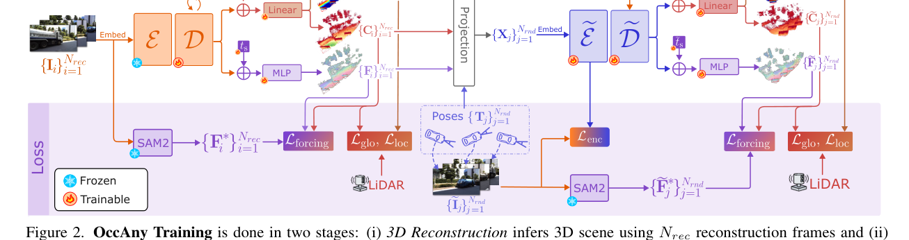

Linear

Embed

MLP

element in occupancy prediction. We propose two novel strategies Segmentation Forcing and Novel View Rendering to accommodate the unique characteristics of 3D occupancy prediction in urban environments.

Fig. 2 illustrates OccAny training process, which consists of two stages: 3D Reconstruction and Novel View Rendering.

For each frame sequence, we randomly select N frames for training. In the reconstruction stage, we set the number of reconstruction frames to Nrec = N. In the rendering stage, we use non-overlapping sets of Nrec reconstruction frames and Nrnd rendering frames, with N = Nrec + Nrnd.

3.1. 3D Reconstruction with Segmentation Forcing

The 3D Reconstruction stage aims to recover the scene geometry from a set of reconstruction frames, providing the geometry basis for the subsequent novel-view rendering stage.

In this stage, OccAny extends MUSt3R [3], a multi-view geometry network, by adding a SAM2 feature prediction head.

SAM2 [47] is a foundation model designed for promptable visual segmentation in images and videos; its features are thus rich in high-fidelity segmentation cues and are beneficial for resolving geometric ambiguity. The Segmentation Forcing loss compels OccAny to predict SAM2-like features.

Our strategy regularizes geometry prediction by leveraging segmentation cues to enforce spatial and temporal feature consistency, thereby improving performance, especially in regions where LiDAR supervision is sparse.

OccAny processes Nrec reconstruction frames {Ii}Nrec i=1 ∈ RH×W ×3 as multi-view inputs to reconstruct the 3D scene. We feed Nrec frames in chronological order through a shared reconstruction encoder E followed by a shared decoder D. The first frame is always designated as the reference frame; all non-reference frames are identified by a specialized token added at the beginning of the shared decoder. The two transformers produce, for each frame Ii:

Linear

Projection

Embed

MLP

Figure 2. OccAny Training is done in two stages: (i) 3D Reconstruction infers 3D scene using Nrec reconstruction frames and (ii) Novel-View Rendering renders geometry of Nrnd new views having camera poses {Tj}Nrnd j=1 . Segmentation Forcing with SAM2 features helps regularize and improve geometry prediction. The scene memory M is dynamically updated during reconstruction, while during rendering, the final scene memory output from the reconstruction stage is used without updating

• SAM2-like feature maps Fi ∈RH′×W ′×C, • global pointmaps Pglobal i,1 ∈RH×W ×3 in the global camera coordinate of the reference frame 1,

• local pointmaps Plocal i,i ∈RH×W ×3 in the local camera coordinate of the current frame i,

• confidence maps Ci ∈RH×W , • and camera poses vi ∈R7 inferred by registering the global and local pointmaps.

For each frame i ∈[3, Nrec], a scene memory Mi−1 of all historical reconstruction frames 1..i −1 is used in the decoding process to infer the geometry of the current frame i via cross-attention between tokens of frame i and memory tokens in Mi−1. The scene memory Mi is then constructed by concatenating Mi−1 with the decoder tokens of the current frame i. To initialize, M2 is formed by concatenating the decoder tokens of the first two frames. With a slight abuse of notation, we use M without a subscript to denote the final global scene memory, which aggregates information from the entire sequence; that is, M ≡MNrec ∈RH′×W ′×(C·Nrec).

The decoder is followed by linear heads for pointmap and confidence prediction, and an MLP head for SAM2-like feature prediction. Because the geometry and segmentation tasks differ in nature, we introduce two learnable task tokens:

tg for the pointmap heads and ts for the SAM2 head. These tokens are added to all decoder tokens before the corresponding head is applied. For clarity, we omit task tokens in the equations and only visualize them in Fig. 2.

The SAM2 head consists of an MLP with two linear layers followed by two upsampling layers. Each upsampling layer uses bilinear interpolation to resize the features, followed by a convolution, layer norm, and GELU.

In summary, the output of this stage is:

D(E({Ii}Nrec i=1 )) =  M, {Fi, Pglobal i,1 , Plocal i,i , Ci, vi}Nrec i=1  .

(1)

---

<!-- page 4 mode: hybrid_paper -->

### 3.2. Novel-View Rendering

We train a rendering encoder e E and decoder e D to predict pointmaps and SAM2-like features for arbitrary novel views along the reconstruction camera trajectories {vi}Nrec i=1 (cf. Eq. (1)). The reconstruction modules E, D are frozen, and their outputs serve as inputs to the rendering stage.

During training, we sample Nrec reconstruction frames and Nrnd rendering frames from the same sequence; the first frame always belongs to the reconstruction set. Let {Tj}Nrnd j=1 be the camera poses of rendering frames e Ij. Our goal is to render pointmaps and SAM2-like features for each Tj, conditioned on reconstruction outputs. Rendering frames are used only for loss computation.

Tokenization.

We merge the global pointmaps {Pglobal i,1 }Nrec i=1 into a single point cloud Pglobal in the reference-frame coordinate system. Projecting Pglobal into {Tj}Nrnd j=1 yields Nrnd xyz-images and point-to-pixel correspondences, enabling 2D projection of SAM2-like features and confidence maps into each novel view. Each modality image is processed by an MLP; the results are concatenated and linearly projected to form novel-view tokens {Xj}Nrnd j=1 .

RoPE is used for positional encoding universally.

Rendering.

Because reconstruction frames cover the scene only partially, projected novel views contain missing areas and projection artifacts. The rendering transformers learn to complete missing geometry and correct projection errors, producing denser pointmaps.

The rendering encoder e E contains 6 transformer blocks, processing novel-view token representations X to predict encoder tokens. During training, we distill knowledge from the large reconstruction encoder E (24 transformer blocks) to the small rendering encoder e E through the Lenc loss (defined in Sec. 3.4). This helps facilitate the optimization process by providing an auxiliary supervision signal, encouraging the rendering encoder to mimic the tokens produced by the larger teacher reconstruction encoder.

The rendering decoder e D has the same architecture as the reconstruction decoder D and is initialized from its weights.

We also introduce two learnable task tokens e tg and e ts, initialized from tg and ts. The scene memory M obtained from the reconstruction stage remained fixed (cf. Eq. (1)) and is used by e D to render the final set of outputs. During decoding, e D applies cross-attention between decoder tokens and the memory tokens in M, making possible reference to the whole reconstructed scene. Intuitively, the explicit reconstruction outputs from the previous stage guides the rendering, while the implicit memory provides supporting information to correct and complete the scene. Segmentation Forcing is also applied to regularize novel-view predictions.

In summary, output of the rendering stage is written:

e D(M, e E({X}Nrnd j=1 )) = {e Fj, e Pglobal j,1 , e Plocal j,j , e Cj}Nrnd j=1 . (2)

Reconstruction view

Novel view

3D Reconstruction

Interpolate

Novel-View Rendering with TTVA

3D Occupancy

Figure 3. OccAny inference undergoes two stages: (i) 3D reconstruction to retrieve Nrec pointmaps with predicted camera poses {vi}Nrec i=1 , and (ii) novel-view rendering with TTVA sampled along the trajectory of {vi}Nrec i=1 . 3D occupancy is obtained by aggregating all pointmaps and voxelizing them with trilinear interpolation.

### 3.3. OccAny Inference

We first retrieve the reconstructed pointmaps, SAM2-like features and the registered camera poses of all Nrec input frames from the 3D Reconstruction stage. We then randomly sample novel views around the predicted camera trajectory {vi}Nrec i=1 (cf. Eq. (1)) and pass them through the Novel View Rendering (NVR) stage to infer the novel-view pointmaps and segmentation features (cf. Eq. (2)). The final 3D occupancy is obtained by aggregating all pointmaps from both stages and voxelizing them into a dense grid via trilinear interpolation. The inference protocol is visualized in Fig. 3.

OccAny is versatile and can predict 3D occupancy for either sequential, monocular, or surround-view inputs. Predicted SAM2-like features can be directly used for segmentation.

NVR Inference.

Thanks to NVR, we can use arbitrary views at test-time to help infer occlusion; this strategy is coined Test-time View Augmentation (TTVA). We first position novel camera views uniformly every ρfwd meters along a straight path along the trajectory of predicted poses {vi}Nrec i=1 .

At each of those Nfwd sampled positions, we vary horizontal viewing angles Φ={0, ±ϕ} and shift the camera by a lateral amount of ±ρlat. Fig. 6 illustrates the NVR setups.

Segmentation w/ SAM2-like features.

We apply Grounded SAM2 [48] pipeline by feeding the first frame to GroundingDINO [38] and obtain candidate bounding boxes of all semantic classes of interest. We then use the pretrained prompt decoder of SAM2 to prompt OccAny’s predicted SAM2-like features with the obtained bounding boxes, resulting in dense semantic masks for the first frame. Semantic masks are then propagated through the entire scene with SAM2 video tracking. Finally we assign the predicted occupancy voxels with predicted semantic classes.

---

<!-- page 5 mode: hybrid_paper -->

### 3.4. Training Losses

Both stages are trained using the same set of losses, i.e.

global- and local- pointmap loss Lglo, Lloc, and Segmentation Forcing loss Lforcing, with the exception of the rendering encoder distillation loss Lenc, which is applied only in the rendering stage. We only describe common losses in the reconstruction stage for brevity.

Pointmap Losses Lglo, Lloc.

The loss weights the difference between the predicted pointmap Pglobal i,1 and ground truth P∗ i,1 using the predicted confidence map Ci [3]:

Ci ⊙  Pglobal i,1 −P∗ i,1  1 −α log  Ci  ,

Nrec X

Lglo = 1

|s|

i=1

where ⊙denotes element-wise multiplication with channelwise broadcasting, and α controls the regularization strength, and s is the normalization scale [3, 65]. The local pointmap loss Lloc is formulated identically.

Geometry-aware Segmentation Forcing Loss Lforcing.

We employ a Mean Squared Error (MSE) loss. We use the same confidence map C in pointmap losses above to weight the MSE error:

Ci ⊙(Fi −F∗ i ) 2

Nrec X

Lforcing = 1

2, (3)

H ′W ′

i=1

where Nrec is the number of reconstruction frames. Since C represents the geometry confidence learned by the pointmap head, our weighting forces the network to focus on highconfidence areas and ignore low-confidence ones like sky.

We note that Lforcing does not update the confidence head.

Encoder Distillation Loss Lenc.

This loss distills knowledge from the larger teacher reconstruction encoder E (24 layers) to the smaller student rendering encoder e E (6 layers).

It minimizes the squared L2 distance between the output tokens from both encoders. Given the output tokens from the rendering encoder e E({Xj}Nrnd j=1 ) and the reconstruction encoder E({e Ij}Nrnd j=1 ), the loss is written as:

E(e Ij) −e E(Xj) 2

Nrec X

Lenc =

2,

j=1

where {e Ij}Nrec j=1 are the novel-view images.

### 4. Experiments

Training.

OccAny is trained on a mixture of five urban datasets, using images from all cameras and projected LiDAR pointmap as ground truth: Waymo [55], DDAD [19], PandaSet [74], VKITTI2 [2], and ONCE [42].

In the reconstruction stage, we initialize with MUSt3R [3], freeze the encoder E and only train the

decoder D for 3D reconstruction. Input frames are resized to 512-width with varying aspect ratios. We sample training sequences with minimum length N=6 and maximum length N=10. Frames are sampled at 2Hz in all datasets.

In the rendering stage, we initialize e D with the pretrained weights of D. We keep the same sequence length N ∈ [6, 10], and randomly select among those Nrnd frames as rendering views; the remaining Nrec = N −Nrnd are used for reconstruction. The first frame serves as reference and it is always part of the reconstruction set.

Evaluation.

We evaluate the generalization of OccAny on two out-of-domain benchmarks: SemanticKITTI [1] and Occ3D-NuScenes [59], detailed in Sec. A.

We use three evaluation settings:

• Sequence: a sequence of 5 frames coming from a single camera on SemanticKITTI and Occ3D-NuScenes,

• Monocular: a single input frame on SemanticKITTI, • Surround-view: all surrounding frames at a single timestep on Occ3D-NuScenes.

NVR inference.

In the Sequence and Surround-view settings, we use the augmentation strategy TTVA with Nfwd = 10, forward shift ρfwd of 3 m, and lateral shift ρlat of 2 m. In the Monocular setting, we sample denser and use Nfwd = 50, forward shift ρfwd of 1 m, lateral shift ρlat of 2 m. All settings use horizontal angle ϕ of {0◦, ±60◦}.

Baselines.

We compare OccAny against four strong baselines: MUSt3R [3], CUT3R [65], VGGT [63], AnySplat [29], and Depth Anything 3 (DA3) [36]. Among them, CUT3R is trained only in the online setting. AnySplat is an VGGT extension with Gaussian Splatting [30] for novel view synthesis and for improving geometric consistency. MUSt3R and CUT3R output metric-scale pointmaps, whereas VGGT and AnySplat produce scale-invariant pointmaps. To resolve the scale ambiguity of VGGT and AnySplat, we calibrate their depth predictions with Metric3Dv2 [22] using their predicted camera intrinsics; those two variants are presented as VGGT† and AnySplat†. For DA3, we use DA3-LARGE to estimate global point map and DA3METRIC-LARGE for metric scaling. Since AnySplat and CUT3R support novelview synthesis, we also apply our proposed TTVA strategy to improve those, referred to as CUT3R* and AnySplat*†.

All models are tested on the same input resolution, with a very slight difference depending on the patch-size.

For reference, we also report published results from vision-based self-supervised occupancy models trained indomain, which are heavily biased to dataset-specific characteristics especially camera intrinsics and extrinsics. We compare against self-supervised methods as both do not require in-domain 3D ground-truth for training. However, OccAny is completely zero-shot while self-supervised methods are trained on in-domain calibrated data.

Metrics.

Similar to [5, 24], we use the standard 3D occupancy metrics Precision, Recall, and Intersection over Union

---

<!-- page 6 mode: ocr -->

<!-- OCR page 6 -->

---

<!-- page 7 mode: ocr -->

<!-- OCR page 7 -->

---

<!-- page 8 mode: hybrid_paper -->

**Table 5. Changing the base foundation models used in OccAny to DA3 [36] and SAM3 [8] results in the OccAny+ variant.**

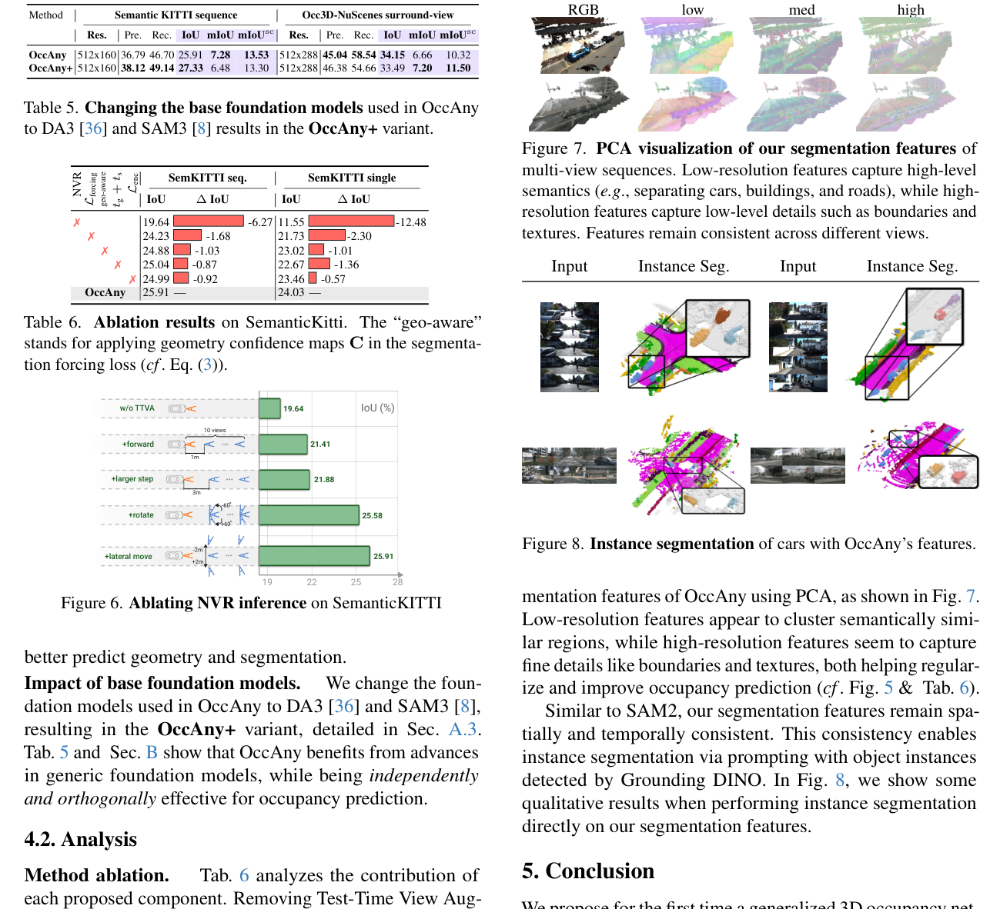

Method

Semantic KITTI sequence Occ3D-NuScenes surround-view

**Table 6. Ablation results on SemanticKitti. The “geo-aware” stands for applying geometry confidence maps C in the segmenta- tion forcing loss (cf. Eq. (3)).**

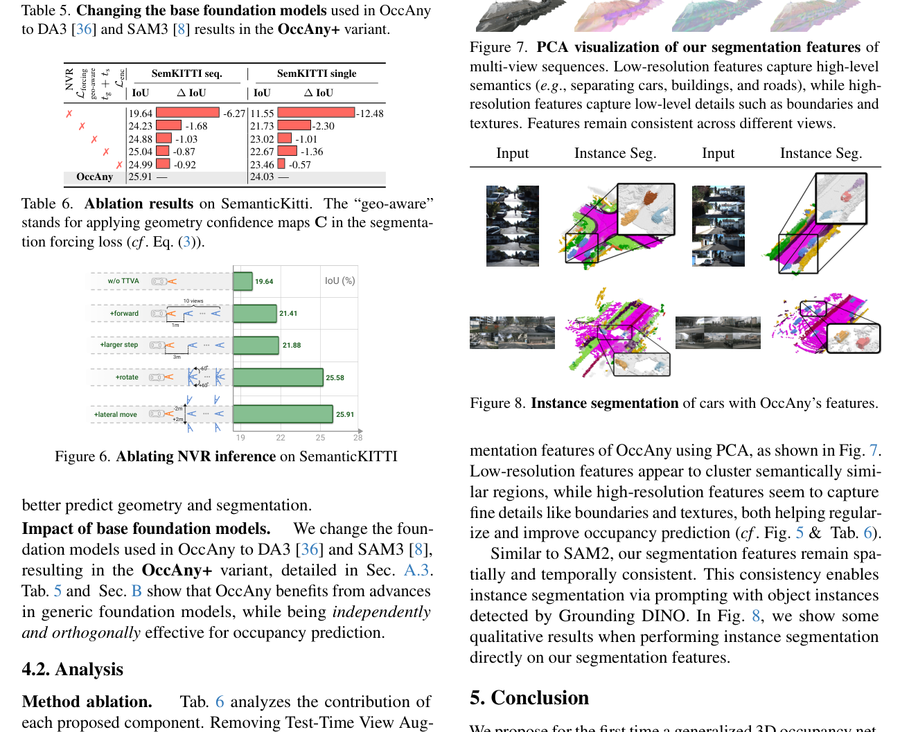

Method ablation.

Tab. 6 analyzes the contribution of each proposed component. Removing Test-Time View Augmentation (TTVA) causes the most significant drop (−6.27% in sequence- and −12.47% in monocular setting), highlighting its critical role in geometry completion. The renderingspecific losses LEnc, geometry-aware Lforcing, and the task tokens also consistently contribute to the final performance, proving their effectiveness. Fig. 5 shows gains brought by Segmentation Forcing and Novel-view Rendering (TTVA).

NVR inference.

We ablate NVR inference in Fig. 6. Starting from the baseline without TTVA, adding simple forward movement helps complete distant geometry (+1.83%). Introducing rotations and lateral shifts further helps complete the geometry by resolving occlusions from diverse views, improving IoU by +4.15% and resulting in the final 25.91%.

Promptable segmentation feature.

We visualize the seg-

**Table 1 (Page 8)**

|  | Pre. Rec. | IoU | mIoU | mIoUsc |  | Pre. Rec. | IoU | mIoU | mIoUsc |
|---|---|---|---|---|---|---|---|---|---|
| 512x160 512x160 | 36.7946.70 38.1249.14 | 25.91 | 7.28 | 13.53 | 512x288 512x288 | 45.0458.54 46.3854.66 | 34.15 | 6.66 | 10.32 |
|  |  | 27.33 | 6.48 | 13.30 |  |  | 33.49 | 7.20 | 11.50 |

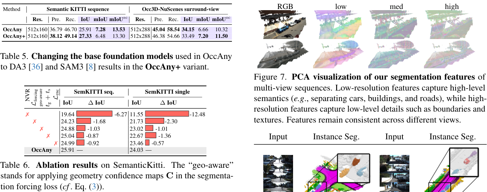

RGB low med high

We propose for the first time a generalized 3D occupancy network, called OccAny, that is trained once and perform zeroshot inference on arbitrary out-of-domain sequential, monocular and surround-view unposed data. With the proposed Segmentation Forcing and Novel-View Rendering strategies, OccAny outperforms generic visual-geometry foundation models on occupancy prediction. OccAny surpasses several in-domain self-supervised models, while remaining behind more recent ones. Our work introduces a novel framework for occupancy prediction prioritizing scalability and generalization, paving the way toward the next generation of versatile and generalized occupancy networks. The gap to fully-supervised in-domain performance remains substantial, leaving room for future improvements in this direction.

---

<!-- page 9 mode: hybrid_paper -->

Acknowledgment.

This work was granted access to the HPC resources of IDRIS under the allocations AD011014102R2, AD011013540R1 made by GENCI. We acknowledge EuroHPC Joint Undertaking for awarding the project ID EHPC-REG-2025R01-032 access to Karolina, Czech Republic.

### References

[1] Jens Behley, Martin Garbade, Andres Milioto, Jan Quenzel, Sven Behnke, Cyrill Stachniss, and Juergen Gall. Semantickitti: A dataset for semantic scene understanding of lidar sequences. In ICCV, 2019. 2, 5, 13

[2] Yohann Cabon, Naila Murray, and Martin Humenberger. Virtual kitti 2. In arXiv, 2020. 5

[3] Yohann Cabon, Lucas Stoffl, Leonid Antsfeld, Gabriela Csurka, Boris Chidlovskii, Jerome Revaud, and Vincent Leroy. Must3r: Multi-view network for stereo 3d reconstruction. In CVPR, 2025. 2, 3, 5, 6, 7

[4] Holger Caesar, Varun Bankiti, Alex H. Lang, Sourabh Vora, Venice Erin Liong, Qiang Xu, Anush Krishnan, Yu Pan, Giancarlo Baldan, and Oscar Beijbom. nuscenes: A multimodal dataset for autonomous driving. In CVPR, 2020. 1, 13

[5] Anh-Quan Cao and Raoul de Charette. Monoscene: Monocular 3d semantic scene completion. In CVPR, 2022. 1, 2, 5, 6

[6] Anh-Quan Cao and Raoul de Charette.

Scenerf: Selfsupervised monocular 3d scene reconstruction with radiance fields. In ICCV, 2023. 1, 2, 6, 13

[7] Anh-Quan Cao, Angela Dai, and Raoul de Charette. Pasco:

Urban 3d panoptic scene completion with uncertainty awareness. In CVPR, 2024. 2

[8] Nicolas Carion, Laura Gustafson, Yuan-Ting Hu, Shoubhik Debnath, Ronghang Hu, Didac Suris, Chaitanya Ryali, Kalyan Vasudev Alwala, Haitham Khedr, Andrew Huang, Jie Lei, Tengyu Ma, Baishan Guo, Arpit Kalla, Markus Marks, Joseph Greer, Meng Wang, Peize Sun, Roman Rädle, Triantafyllos Afouras, Effrosyni Mavroudi, Katherine Xu, Tsung-Han Wu, Yu Zhou, Liliane Momeni, Rishi Hazra, Shuangrui Ding, Sagar Vaze, Francois Porcher, Feng Li, Siyuan Li, Aishwarya Kamath, Ho Kei Cheng, Piotr Dollár, Nikhila Ravi, Kate Saenko, Pengchuan Zhang, and Christoph Feichtenhofer. Sam 3: Segment anything with concepts. In ICLR, 2026. 8

[9] Loick Chambon, Eloi Zablocki, Alexandre Boulch, Mickael Chen, and Matthieu Cord. Gaussrender: Learning 3d occupancy with gaussian rendering. In CVPR, 2025. 2

[10] Angel X Chang, Thomas Funkhouser, Leonidas Guibas, Pat Hanrahan, Qixing Huang, Zimo Li, Silvio Savarese, Manolis Savva, Shuran Song, Hao Su, et al. Shapenet: An informationrich 3d model repository. arXiv, 2015. 1

[11] Dubing Chen, Jin Fang, Wencheng Han, Xinjing Cheng, Junbo Yin, Chenzhong Xu, Fahad Shahbaz Khan, and Jianbing Shen. Alocc: adaptive lifting-based 3d semantic occupancy and cost volume-based flow prediction. In ICCV, 2025.

14, 15

[12] Christopher Choy, JunYoung Gwak, and Silvio Savarese. 4d spatio-temporal convnets: Minkowski convolutional neural networks. In CVPR, 2019. 1

[13] Angela Dai, Angel X Chang, Manolis Savva, Maciej Halber, Thomas Funkhouser, and Matthias Nießner. Scannet: Richlyannotated 3d reconstructions of indoor scenes. In CVPR, 2017. 1

[14] Wanshui Gan, Ningkai Mo, Hongbin Xu, and Naoto Yokoya.

A comprehensive framework for 3d occupancy estimation in autonomous driving. IEEE TIV, 2024. 7

[15] Wanshui Gan, Fang Liu, Hongbin Xu, Ningkai Mo, and Naoto Yokoya. Gaussianocc: Fully self-supervised and efficient 3d occupancy estimation with gaussian splatting. In ICCV, 2025.

1, 2, 14

[16] Shenyuan Gao, Jiazhi Yang, Li Chen, Kashyap Chitta, Yihang Qiu, Andreas Geiger, Jun Zhang, and Hongyang Li. Vista:

A generalizable driving world model with high fidelity and versatile controllability. In NeurIPS, 2024. 15

[17] Simon Gebraad, Andras Palffy, and Holger Caesar. Leap:

Consistent multi-domain 3d labeling using foundation models.

In ICRA, 2025. 6

[18] Andreas Geiger, Philip Lenz, and Raquel Urtasun. Are we ready for autonomous driving? the kitti vision benchmark suite. In CVPR, 2012. 1

[19] Vitor Guizilini, Rares Ambrus, Sudeep Pillai, Allan Raventos, and Adrien Gaidon. 3d packing for self-supervised monocular depth estimation. In CVPR, 2020. 5

[20] Mariam Hassan, Sebastian Stapf, Ahmad Rahimi, Pedro M. B.

Rezende, Yasaman Haghighi, David Brüggemann, Isinsu Katircioglu, Lin Zhang, Xiaoran Chen, Suman Saha, Marco Cannici, Elie Aljalbout, Botao Ye, Xi Wang, Aram Davtyan, Mathieu Salzmann, Davide Scaramuzza, Marc Pollefeys, Paolo Favaro, and Alexandre Alahi.

Gem: A generalizable ego-vision multimodal world model for fine-grained ego-motion, object dynamics, and scene composition control.

In CVPR, 2025. 15

[21] Adrian Hayler, Felix Wimbauer, Dominik Muhle, Christian Rupprecht, and Daniel Cremers. S4c: Self-supervised semantic scene completion with neural fields. In 3DV, 2024.

2

[22] Mu Hu, Wei Yin, Chi Zhang, Zhipeng Cai, Xiaoxiao Long, Hao Chen, Kaixuan Wang, Gang Yu, Chunhua Shen, and Shaojie Shen. Metric3d v2: A versatile monocular geometric foundation model for zero-shot metric depth and surface normal estimation. IEEE TPAMI, 2024. 5, 6, 7, 13

[23] Yuanhui Huang, Wenzhao Zheng, Yunpeng Zhang, Jie Zhou, and Jiwen Lu. Tri-perspective view for vision-based 3d semantic occupancy prediction. In CVPR, 2023. 1, 2

[24] Yuanhui Huang, Wenzhao Zheng, Borui Zhang, Jie Zhou, and Jiwen Lu.

Selfocc: Self-supervised vision-based 3d occupancy prediction. In CVPR, 2024. 1, 2, 5, 6, 7, 13

[25] Yuanhui Huang, Wenzhao Zheng, Yunpeng Zhang, Jie Zhou, and Jiwen Lu. Gaussianformer: Scene as gaussians for visionbased 3d semantic occupancy prediction. In ECCV, 2024.

2

[26] Wonbong Jang, Philippe Weinzaepfel, Vincent Leroy, Lourdes Agapito, and Jerome Revaud. Pow3r: Empowering unconstrained 3d reconstruction with camera and scene priors.

In CVPR, 2025. 2

---

<!-- page 10 mode: hybrid_paper -->

[27] Aleksandar Jevti´ c, Christoph Reich, Felix Wimbauer, Oliver Hahn, Christian Rupprecht, Stefan Roth, and Daniel Cremers. Feed-forward scenedino for unsupervised semantic scene completion. In ECCV, 2025. 1, 2

[28] Haoyi Jiang, Liu Liu, Tianheng Cheng, Xinjie Wang, Tianwei Lin, Zhizhong Su, Wenyu Liu, and Xinggang Wang.

Gausstr: Foundation model-aligned gaussian transformer for self-supervised 3d spatial understanding. In CVPR, 2025. 1, 2, 7

[29] Lihan Jiang, Yucheng Mao, Linning Xu, Tao Lu, Kerui Ren, Yichen Jin, Xudong Xu, Mulin Yu, Jiangmiao Pang, Feng Zhao, Dahua Lin, and Bo Dai. Anysplat: Feed-forward 3d gaussian splatting from unconstrained views. ACM TOG, 2025. 2, 5, 6, 7, 14

[30] Bernhard Kerbl, Georgios Kopanas, Thomas Leimkühler, and George Drettakis. 3d gaussian splatting for real-time radiance field rendering. ACM TOG, 2023. 1, 5

[31] Vincent Leroy, Yohann Cabon, and Jerome Revaud. Grounding image matching in 3d with mast3r. In ECCV, 2024. 2

[32] Bohan Li, Yasheng Sun, Xin Jin, Wenjun Zeng, Zheng Zhu, Xiaoefeng Wang, Yunpeng Zhang, James Okae, Hang Xiao, and Dalong Du. Stereoscene: Bev-assisted stereo matching empowers 3d semantic scene completion. In IJCAI, 2024. 1

[33] Samuel Li, Pujith Kachana, Prajwal Chidananda, Saurabh Nair, Yasutaka Furukawa, and Matthew Brown. Rig3r: Rigaware conditioning for learned 3d reconstruction. In NeurIPS, 2025. 2

[34] Yiming Li, Zhiding Yu, Christopher Choy, Chaowei Xiao, Jose M Alvarez, Sanja Fidler, Chen Feng, and Anima Anandkumar. Voxformer: Sparse voxel transformer for camerabased 3d semantic scene completion. In CVPR, 2023. 1, 2

[35] Yiming Li, Sihang Li, Xinhao Liu, Moonjun Gong, Kenan Li, Nuo Chen, Zijun Wang, Zhiheng Li, Tao Jiang, Fisher Yu, Yue Wang, Hang Zhao, Zhiding Yu, and Chen Feng. Sscbench:

A large-scale 3d semantic scene completion benchmark for autonomous driving. In IROS, 2024. 2

[36] Haotong Lin, Sili Chen, Jun Hao Liew, Donny Y. Chen, Zhenyu Li, Guang Shi, Jiashi Feng, and Bingyi Kang. Depth anything 3: Recovering the visual space from any views.

arXiv, 2025. 5, 6, 7, 8

[37] Haisong Liu, Haiguang Wang, Yang Chen, Zetong Yang, Jia Zeng, Li Chen, and Limin Wang. Fully sparse 3d panoptic occupancy prediction. In ECCV, 2024. 2

[38] Shilong Liu, Zhaoyang Zeng, Tianhe Ren, Feng Li, Hao Zhang, Jie Yang, Qing Jiang, Chunyuan Li, Jianwei Yang, Hang Su, et al. Grounding dino: Marrying dino with grounded pre-training for open-set object detection. In ECCV, 2024. 4

[39] Ilya Loshchilov and Frank Hutter. Decoupled weight decay regularization. In ICLR, 2019. 13

[40] Junyi Ma, Xieyuanli Chen, Jiawei Huang, Jingyi Xu, Zhen Luo, Jintao Xu, Weihao Gu, Rui Ai, and Hesheng Wang.

Cam4docc: Benchmark for camera-only 4d occupancy forecasting in autonomous driving applications. In CVPR, 2024.

2

[41] Qihang Ma, Xin Tan, Yanyun Qu, Lizhuang Ma, Zhizhong Zhang, and Yuan Xie. Cotr: Compact occupancy transformer for vision-based 3d occupancy prediction. In CVPR, 2024. 2

[42] Jiageng Mao, Minzhe Niu, Chenhan Jiang, Hanxue Liang, Jingheng Chen, Xiaodan Liang, Yamin Li, Chaoqiang Ye, Wei Zhang, Zhenguo Li, et al. One million scenes for autonomous driving: Once dataset. In NeurIPS, 2021. 5

[43] R. Marcuzzi, L. Nunes, E.A. Marks, L. Wiesmann, T. Läbe,

J. Behley, and C. Stachniss. SfmOcc: Vision-Based 3D Se-

mantic Occupancy Prediction in Urban Environments. RA-L, 2025. 2

[44] Ben Mildenhall, Pratul P. Srinivasan, Matthew Tancik, Jonathan T. Barron, Ravi Ramamoorthi, and Ren Ng. Nerf:

representing scenes as neural radiance fields for view synthesis. Commun. ACM, 2021. 1

[45] Aljoša Ošep, Tim Meinhardt, Francesco Ferroni, Neehar Peri, Deva Ramanan, and Laura Leal-Taixé. Better call sal: Towards learning to segment anything in lidar. In ECCV, 2024.

6

[46] Charles R Qi, Hao Su, Kaichun Mo, and Leonidas J Guibas.

Pointnet: Deep learning on point sets for 3d classification and segmentation. In CVPR, 2017. 1

[47] Nikhila Ravi, Valentin Gabeur, Yuan-Ting Hu, Ronghang Hu, Chaitanya Ryali, Tengyu Ma, Haitham Khedr, Roman Rädle, Chloe Rolland, Laura Gustafson, Eric Mintun, Junting Pan, Kalyan Vasudev Alwala, Nicolas Carion, Chao-Yuan Wu, Ross Girshick, Piotr Dollár, and Christoph Feichtenhofer.

Sam 2: Segment anything in images and videos. In ICLR, 2025. 3, 7

[48] Tianhe Ren, Shilong Liu, Ailing Zeng, Jing Lin, Kunchang Li, He Cao, Jiayu Chen, Xinyu Huang, Yukang Chen, Feng Yan, et al. Grounded sam: Assembling open-world models for diverse visual tasks. In arXiv, 2024. 4, 7

[49] Luis Roldão, Raoul de Charette, and Anne Verroust-Blondet.

Lmscnet: Lightweight multiscale 3d semantic completion. In 3DV, 2020. 2

[50] Nermin Samet, Gilles Puy, and Renaud Marlet. Losc: Lidar open-voc segmentation consolidator. In 3DV, 2026. 6

[51] Yiang Shi, Tianheng Cheng, Qian Zhang, Wenyu Liu, and Xinggang Wang. Occupancy as set of points. In ECCV, 2024.

2

[52] Sophia Sirko-Galouchenko, Alexandre Boulch, Spyros Gidaris, Andrei Bursuc, Antonin Vobecky, Patrick Pérez, and Renaud Marlet. Occfeat: Self-supervised occupancy feature prediction for pretraining bev segmentation networks. In CVPR, 2024. 2

[53] Shuran Song, Fisher Yu, Andy Zeng, Angel X Chang, Manolis Savva, and Thomas Funkhouser. Semantic scene completion from a single depth image. In CVPR, pages 1746–1754, 2017. 2

[54] Edgar Sucar, Zihang Lai, Eldar Insafutdinov, and Andrea Vedaldi. Dynamic point maps: A versatile representation for dynamic 3d reconstruction. In ICCV, 2025. 2

[55] Pei Sun, Henrik Kretzschmar, Xerxes Dotiwalla, Aurelien Chouard, Vijaysai Patnaik, Paul Tsui, James Guo, Yin Zhou, Yuning Chai, Benjamin Caine, et al. Scalability in perception for autonomous driving: Waymo open dataset. In CVPR, 2020. 5

[56] Stanislaw Szymanowicz, Chrisitian Rupprecht, and Andrea Vedaldi. Splatter image: Ultra-fast single-view 3d reconstruction. In CVPR, 2024. 6

---

<!-- page 11 mode: hybrid_paper -->

[57] Zachary Teed and Jia Deng. DROID-SLAM: Deep Visual SLAM for Monocular, Stereo, and RGB-D Cameras.

In NeurIPS, 2021. 15

[58] Hugues Thomas, Charles R Qi, Jean-Emmanuel Deschaud, Beatriz Marcotegui, François Goulette, and Leonidas J Guibas. Kpconv: Flexible and deformable convolution for point clouds. In ICCV, 2019. 1

[59] Xiaoyu Tian, Tao Jiang, Longfei Yun, Yucheng Mao, Huitong Yang, Yue Wang, Yilun Wang, and Hang Zhao.

Occ3d:

A large-scale 3d occupancy prediction benchmark for autonomous driving. In NeurIPS, 2023. 2, 5, 13

[60] Alexander Veicht, Paul-Edouard Sarlin, Philipp Lindenberger, and Marc Pollefeys. GeoCalib: Single-image Calibration with Geometric Optimization. In ECCV, 2024. 15

[61] Antonin Vobecky, Oriane Siméoni, David Hurych, Spyros Gidaris, Andrei Bursuc, Patrick Pérez, and Josef Sivic. Pop3d: Open-vocabulary 3d occupancy prediction from images.

In NeurIPS, 2023. 14

[62] Hengyi Wang and Lourdes Agapito. 3d reconstruction with spatial memory. In 3DV, 2025. 2

[63] Jianyuan Wang, Minghao Chen, Nikita Karaev, Andrea Vedaldi, Christian Rupprecht, and David Novotny. Vggt:

Visual geometry grounded transformer. In CVPR, 2025. 2, 5, 6, 7, 15

[64] Letian Wang, Seung Wook Kim, Jiawei Yang, Cunjun Yu, Boris Ivanovic, Steven L. Waslander, Yue Wang, Sanja Fidler, Marco Pavone, and Peter Karkus. Distillnerf: Perceiving 3d scenes from single-glance images by distilling neural fields and foundation model features. In NeurIPS, 2024. 2, 7

[65] Qianqian Wang, Yifei Zhang, Aleksander Holynski, Alexei A Efros, and Angjoo Kanazawa. Continuous 3d perception model with persistent state. In CVPR, 2025. 2, 5, 6, 7

[66] Shuzhe Wang, Vincent Leroy, Yohann Cabon, Boris Chidlovskii, and Jerome Revaud.

Dust3r: Geometric 3d vision made easy. In CVPR, 2024. 2

[67] Yu Wang and Chao Tong. H2gformer: Horizontal-to-global voxel transformer for 3d semantic scene completion. In AAAI, 2024. 1

[68] Zehan Wang, Siyu Chen, Lihe Yang, Jialei Wang, Ziang Zhang, Hengshuang Zhao, and Zhou Zhao. Depth anything with any prior. In arXiv, 2025. 14

[69] Yi Wei, Linqing Zhao, Wenzhao Zheng, Zheng Zhu, Jie Zhou, and Jiwen Lu. Surroundocc: Multi-camera 3d occupancy prediction for autonomous driving. In ICCV, 2023. 1

[70] Felix Wimbauer, Nan Yang, Christian Rupprecht, and Daniel Cremers. Behind the scenes: Density fields for single view reconstruction. In CVPR, 2023. 1, 2

[71] Felix Wimbauer, Weirong Chen, Dominik Muhle, Christian Rupprecht, and Daniel Cremers. Anycam: Learning to recover camera poses and intrinsics from casual videos. In CVPR, 2025. 2

[72] Xiaoyang Wu, Li Jiang, Peng-Shuai Wang, Zhijian Liu, Xihui Liu, Yu Qiao, Wanli Ouyang, Tong He, and Hengshuang Zhao.

Point transformer v3: Simpler faster stronger. In CVPR, 2024.

1

[73] Zhaoyang Xia, Youquan Liu, Xin Li, Xinge Zhu, Yuexin Ma, Yikang Li, Yuenan Hou, and Yu Qiao. Scpnet: Semantic scene completion on point cloud. In CVPR, 2023. 2

[74] Pengchuan Xiao, Zhenlei Shao, Steven Hao, Zishuo Zhang, Xiaolin Chai, Judy Jiao, Zesong Li, Jian Wu, Kai Sun, Kun Jiang, et al. Pandaset: Advanced sensor suite dataset for autonomous driving. In ITSC, 2021. 5

[75] Binjian Xie, Pengju Zhang, Hao Wei, and Yihong Wu. Higaussian: Hierarchical gaussians under normalized spherical projection for single-view 3d reconstruction. In ICCV, 2025.

2, 6

[76] Yujie Xue, Huilong Pi, Jiapeng Zhang, Yunchuan Qin, Zhuo Tang, Kenli Li, and Ruihui Li. Sdformer: Vision-based 3d semantic scene completion via sam-assisted dual-channel voxel transformer. In ICCV, 2025. 1

[77] Jianing Yang, Alexander Sax, Kevin J. Liang, Mikael Henaff, Hao Tang, Ang Cao, Joyce Chai, Franziska Meier, and Matt Feiszli. Fast3r: Towards 3d reconstruction of 1000+ images in one forward pass. In CVPR, 2025. 2

[78] Lihe Yang, Bingyi Kang, Zilong Huang, Zhen Zhao, Xiaogang Xu, Jiashi Feng, and Hengshuang Zhao. Depth anything v2. In NeurIPS, 2024. 15

[79] Jiawei Yao, Chuming Li, Keqiang Sun, Yingjie Cai, Hao Li, Wanli Ouyang, and Hongsheng Li. Ndc-scene: Boost monocular 3d semantic scene completion in normalized device coordinates space. In ICCV, 2023. 1, 2

[80] Baijun Ye, Minghui Qin, Saining Zhang, Moonjun Gong, Shaoting Zhu, Hao Zhao, and Hang Zhao. Gs-occ3d: Scaling vision-only occupancy reconstruction with gaussian splatting.

In ICCV, 2025. 2

[81] Zhangchen Ye, Tao Jiang, Chenfeng Xu, Yiming Li, and Hang Zhao. Cvt-occ: Cost volume temporal fusion for 3d occupancy prediction. In ECCV, 2024. 14, 15

[82] Zhu Yu, Runmin Zhang, Jiacheng Ying, Junchen Yu, Xiaohai Hu, Lun Luo, Si-Yuan Cao, and Hui-liang Shen. Context and geometry aware voxel transformer for semantic scene completion. In NeurIPS, 2024. 1

[83] Chubin Zhang, Juncheng Yan, Yi Wei, Jiaxin Li, Li Liu, Yansong Tang, Yueqi Duan, and Jiwen Lu. Occnerf: Advancing 3d occupancy prediction in lidar-free environments. IEEE TIP, 2025. 2, 6, 7

[84] Junyi Zhang, Charles Herrmann, Junhwa Hur, Varun Jampani, Trevor Darrell, Forrester Cole, Deqing Sun, and Ming-Hsuan Yang. Monst3r: A simple approach for estimating geometry in the presence of motion. In ICLR, 2025. 2

[85] Yunpeng Zhang, Zheng Zhu, and Dalong Du. Occformer:

Dual-path transformer for vision-based 3d semantic occupancy prediction. In ICCV, 2023. 2

[86] Jilai Zheng, Pin Tang, Zhongdao Wang, Guoqing Wang, Xiangxuan Ren, Bailan Feng, and Chao Ma. Veon: Vocabularyenhanced occupancy prediction. In ECCV, 2024. 14

[87] Xiaoyu Zhou, Jingqi Wang, Yongtao Wang, Yufei Wei, Nan Dong, and Ming-Hsuan Yang. Autoocc: Automatic openended semantic occupancy annotation via vision-language guided gaussian splatting. In ICCV, 2025. 2

[88] Sicheng Zuo, Wenzhao Zheng, Xiaoyong Han, Longchao Yang, Yong Pan, and Jiwen Lu. Quadricformer: Scene as superquadrics for 3d semantic occupancy prediction. NeurIPS, 2025. 2

---

<!-- page 12 mode: hybrid_paper -->

[89] Lojze Zust, Yohann Cabon, Juliette Marrie, Leonid Antsfeld, Boris Chidlovskii, Jerome Revaud, and Gabriela Csurka.

Panst3r: Multi-view consistent panoptic segmentation. In ICCV, 2025. 2

---

<!-- page 13 mode: hybrid_paper -->

**Table 7. Using pretrained segmentation features to boost seman- tic performance. OccAny+ is the variant using DA3 and SAM3 base models. Parameter counts reflect the forward path from the input to the predicted pointmaps and segmentation features. Note that using "pretrained" semantic features incurs a higher parameter cost due to the use of pretrained encoder.**

**Table 8. Detailed surround-view results. OccAny+ is the variant using DA3 and SAM3 base models.**

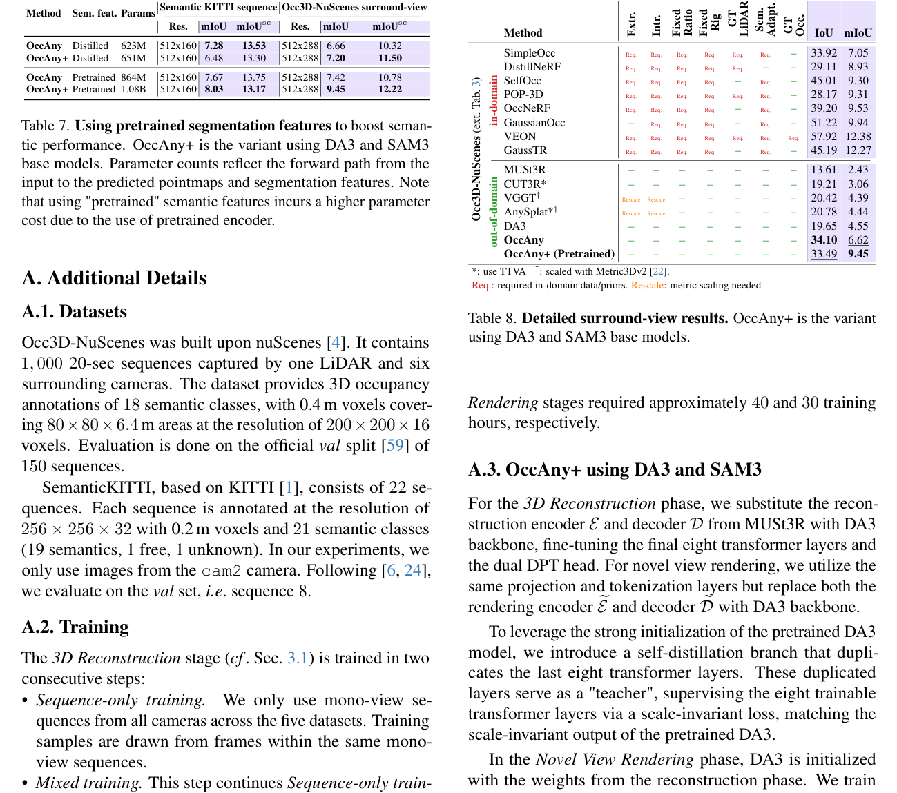

Method

Sem. feat. Params Semantic KITTI sequence Occ3D-NuScenes surround-view

Res.

mIoU mIoUsc Res.

mIoU mIoUsc

OccAny Distilled 623M 512x160 7.28 13.53 512x288 6.66 10.32 OccAny+ Distilled 651M 512x160 6.48 13.30 512x288 7.20 11.50

OccAny Pretrained 864M 512x160 7.67 13.75 512x288 7.42 10.78 OccAny+ Pretrained 1.08B 512x160 8.03 13.17 512x288 9.45 12.22

• Mixed training. This step continues Sequence-only training while mixing surround-view data with sequential data (from the previous step) at a 1 : 1 ratio. For surround-view data, we use frames from different cameras captured at the same timestep.

The Novel-View Rendering stage (cf. Sec. 3.2) is trained exclusively on sequential data. Empirically, we observed no gains when incorporating surround-view data in this stage.

Each stage is trained for 100 epochs using the AdamW optimizer [39] with a learning rate of 7 × 10−5. We utilize a cosine scheduler with a minimum learning rate of 1×10−6 and a 3-epoch warmup. The training set consists of 50, 000 samples (sequences or sets of surrounding images), with 10, 000 drawn from each dataset. Experiments are conducted on 16 NVIDIA A100 40GB GPUs with an effective batch size of 64. The 3D Reconstruction and Novel-View

**Table 1 (Page 13)**

| .rtxE .rtnI dexiF oitaR dexiF giR TG RADiL .meS .tpadA TG .ccO | IoU | mIoU |
|---|---|---|

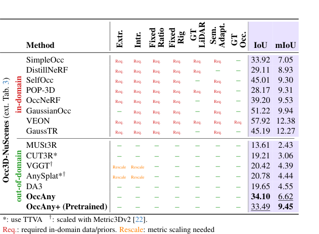

### Method

in-domain

---

<!-- page 14 mode: hybrid_paper -->

### B. Supplementary Studies

We present here the supplementary studies not presented in the main text due to the lack of space.

B.1. Boosting semantic performance.

While the unified OccAny model conveniently uses distilled segmentation features, it can also be combined with the original features from segmentation foundation models at inference. Although this introduces additional overhead, it enables the use of higher-resolution segmentation features and improves semantic performance, as shown in Tab. 7.

B.2. More surround-view results

Tab. 8 details results and method constraints in the surround-view setting, further including POP-3D [61], GaussianOcc [15], and VEON [86].

Existing in-domain approaches, including self-supervised ones, rely heavily on domain-specific priors, and VEON further depends on binary occupancy ground truth for training. In contrast, OccAny promotes a paradigm shift toward generalized and unconstrained occupancy prediction, enabling deployment of a unified model across out-of-domain and heterogeneous sensor setups. Beyond being unconstrained, OccAny can benefit from continual advances in foundation models, and is therefore expected to progressively narrow the remaining performance gap.

As preliminary evidence, upgrading MUSt3R to DA3 and replacing SAM2 with the more recent SAM3 yields an mIoU improvement of approximately 3 points, reaching performance comparable to recent self-supervised methods such as GaussianOcc [15].

B.3. Novel-View Rendering vs. Depth Completion

In this experiment, we compare the effectiveness of our Novel-View Rendering stage (cf. Sec. 3.2) with a baseline that performs depth completion on the projected pointmaps of the novel views. To this end, we replace Novel-View Rendering by using Prior Depth Anything [68], which takes as input the sparse projected pointmaps and the rendered RGB images produced by the state-of-the-art novel-view synthesis method AnySplat [29]. The Prior Depth Anything model outputs dense, completed depth maps for the novel views. We name this baseline OccAnydepth completion and present comparison results in Tab. 9. Both models start from the first-stageonly OccAny and both adopt the TTVA strategy. OccAny significantly outperforms the OccAnydepth completion baseline, validating the effectiveness of our second stage.

B.4. Generalization of State-of-the-art (SOTA) 3D Supervised Occupancy Models

We assess the generalization capability of SOTA 3D fullysupervised models by evaluating models trained on a source

dataset directly on a different target dataset. We evaluate two settings:

• Occ3D-Waymo→Occ3D-NuScenes (surround-view → surround-view).

• Occ3D-NuScenes/Occ3D-Waymo→ SemanticKITTI (surround-view→monocular).

As shown in Table 10, despite careful alignment of sensor configurations, inference areas, and voxel resolutions, these supervised methods exhibit limited generalization capabilities compared to OccAny. Notably, OccAny’s inference is straightforward and does not require any prior knowledge of the sensor configurations (number of cameras, intrinsics/extrinsics and camera poses), adapting effortlessly to any inference areas and any voxel resolutions.

Occ3D-Waymo→Occ3D-NuScenes.

In this setting, we evaluate CVT-Occ [81] using weights trained on Occ3D-Waymo to perform inference on Occ3D-NuScenes.

While the voxel resolutions and voxel sizes are consistent between these datasets, significant differences remain in sensor configurations. To enable inference, we align the sensor setups by mapping the five Occ3D-Waymo cameras to the six Occ3D-NuScenes cameras. Specifically, we map the Occ3D-Waymo Front, Front-Right, and Front-Left to their Occ3D-NuScenes counterparts, while the Occ3D-Waymo Side-Left is mapped to both Back and Back-Left, and SideRight to Back-Right. Regarding image resolution, we follow the official implementation to scale Occ3D-NuScenes input images to the Occ3D-Waymo training resolution of 960 × 640.

We also report inference performance at 1600 × 900, which yields slightly better results. However, as detailed in Table 10, even with these manual adaptations, the model struggles to generalize to the new domain, achieving a peak IoU of only 17.56%, significantly lower than the 34.15% achieved by our method.

Occ3D-NuScenes/Occ3D-Waymo→SemanticKITTI.

Regarding the transfer from surround-view to monocular, we evaluate two SOTA 3D supervised methods: CVTOcc [81] and ALOcc [11]. We use checkpoints trained on Occ3D-NuScenes (for both ALOcc and CVT-Occ) and Occ3D-Waymo (for CVT-Occ) to perform inference on SemanticKITTI.

This scenario presents a significantly greater challenge than the previous setting: in addition to domain shifts and sensor discrepancies (using only the source front camera to align with the target setup), there are substantial divergences in voxel grid extents and resolutions.

For CVT-Occ [81], we use two provided models, one trained on Occ3D-NuScenes (1600 × 900) and another trained on Occ3D-Waymo (960 × 640). We evaluate the Occ3D-NuScenes-trained model on SemanticKITTI at full image resolution (1220 × 370), as it is closely aligned with the training resolution. For the Occ3D-Waymo-trained model, we conduct evaluations at both the full resolution and a resized resolution of 960 × 540, which preserves the

---

<!-- page 15 mode: hybrid_paper -->

Label Method Venue Occ3D-NuScenes surround-view SemanticKITTI monocular
Res. Prec. Rec. IoU Res. Prec. Rec. IoU
Occ CVT-Occ [81] (Trained on Occ3D-Waymo) ECCV’24 1600 × 900 35.38 25.86 17.56 1220 × 370 8.97 34.92 7.69

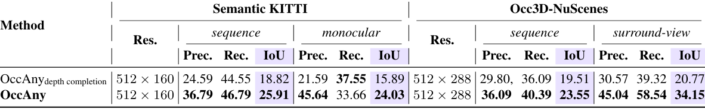

**Table 9. Novel-View Rendering vs. Depth Completion. Occupancy prediction results on SemanticKITTI and Occ3D-NuScenes show the effectiveness of Novel-View Rendering.**

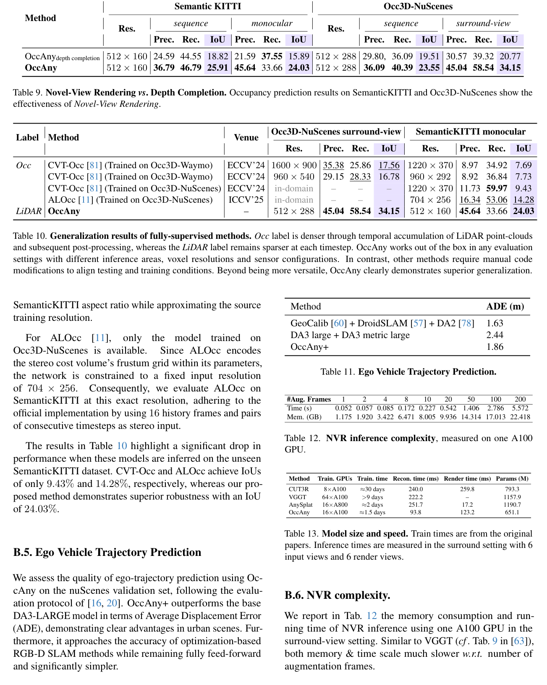

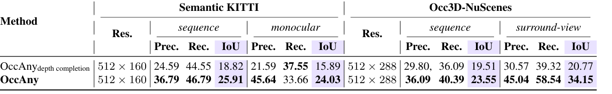

**Table 10. Generalization results of fully-supervised methods. Occ label is denser through temporal accumulation of LiDAR point-clouds and subsequent post-processing, whereas the LiDAR label remains sparser at each timestep. OccAny works out of the box in any evaluation settings with different inference areas, voxel resolutions and sensor configurations. In contrast, other methods require manual code modifications to align testing and training conditions. Beyond being more versatile, OccAny clearly demonstrates superior generalization.**

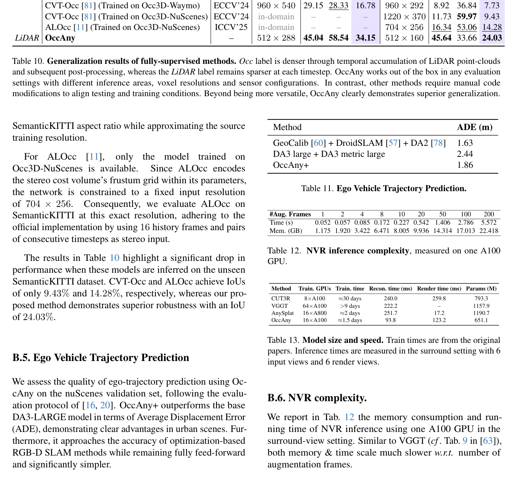

**Table 11. Ego Vehicle Trajectory Prediction.**

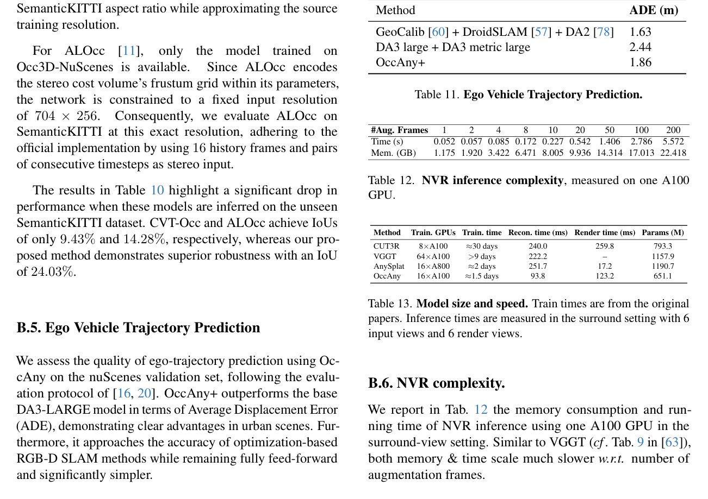

**Table 12. NVR inference complexity, measured on one A100 GPU.**

**Table 13. Model size and speed. Train times are from the original papers. Inference times are measured in the surround setting with 6 input views and 6 render views.**

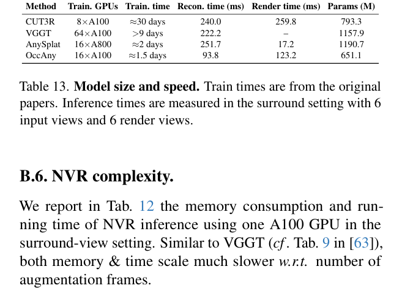

---

<!-- page 16 mode: hybrid_paper -->

B.7. Model sizes and speeds

We are report the model sizes and speeds of OccAny and baselines in Tab. 13.

OccAny has the fewest parameters (∼651M) vs. CUT3R (∼793M) and VGGT/AnySplat (∼1.2B), and is the most runtime efficient in training/inference. OccAny’s rendering is about 2× faster than CUT3R, while AnySplat’s is the fastest thanks to 3DGS.

### C. Qualitative Examples

We show additional qualitative

results

in Fig. 9, Fig. 10, Fig. 11, Fig. 12, and Fig. 13.

---

<!-- page 17 mode: ocr -->

<!-- OCR page 17 -->

---

<!-- page 18 mode: ocr -->

<!-- OCR page 18 -->

---

<!-- page 19 mode: ocr -->

<!-- OCR page 19 -->

---

<!-- page 20 mode: ocr -->

<!-- OCR page 20 -->

---

<!-- page 21 mode: hybrid_paper -->

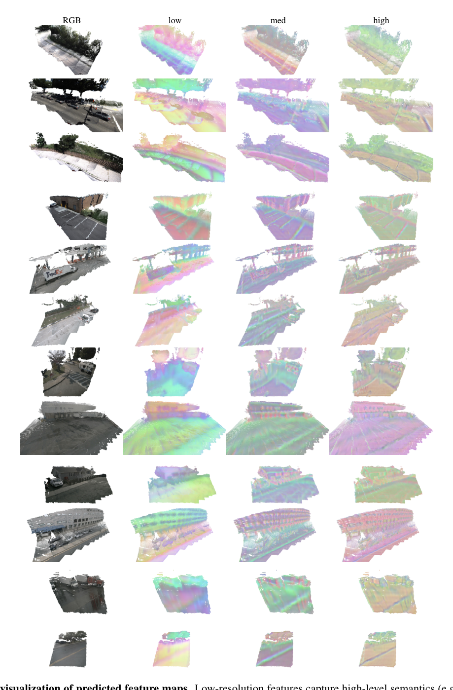

---