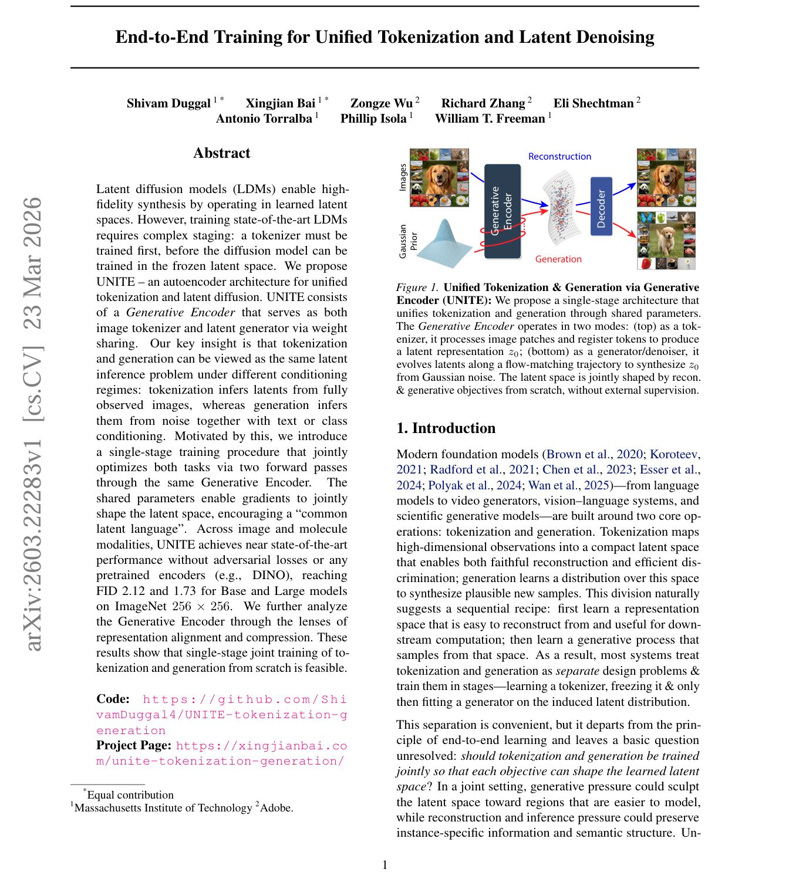
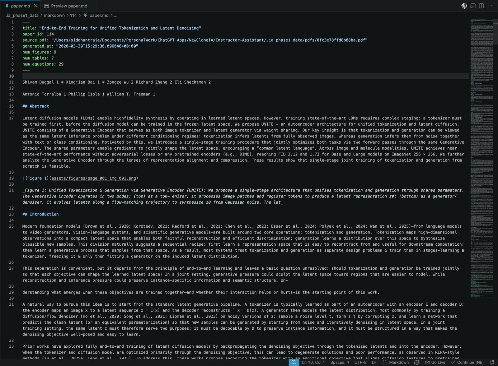
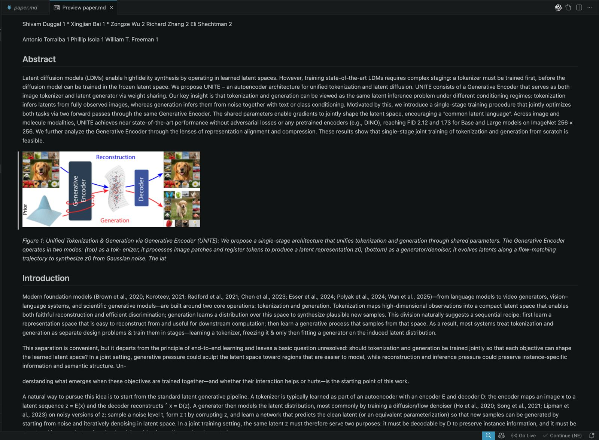

# Markdown Export Module

Files:

- `src/ia_phase1/markdown_export/export.py`
- `src/ia_phase1/markdown_export/bundle.py`
- `src/ia_phase1/markdown_export/models.py`

## What it does

- Converts a PDF paper into a structured markdown bundle.
- Reuses the modular Phase 1 extractors for:
  - text blocks
  - section metadata
  - figures
  - tables
  - equations
- Writes:
  - `paper.md`
  - `manifest.json`
  - bundled asset copies/references under `assets/`
- Places asset references into the markdown near their page/bbox positions.
- Emits figure image references, table JSON references, and equation JSON/image references.
- Reflows normal prose text so the markdown does not preserve raw PDF line wrapping.

## Public API

- `export_pdf_to_markdown(pdf_path, *, paper_id, output_dir=None, blocks=None, source_url=None, metadata=None, config=None) -> MarkdownExportResult`
- `render_markdown_document(*, blocks, bundled_assets, metadata, config) -> str`
- `MarkdownExportConfig`
- `MarkdownExportResult`

Import path:

```python
from ia_phase1.markdown_export import (
    MarkdownExportConfig,
    MarkdownExportResult,
    export_pdf_to_markdown,
    render_markdown_document,
)
```

## Usage

```python
from pathlib import Path

from ia_phase1.markdown_export import MarkdownExportConfig, export_pdf_to_markdown

result = export_pdf_to_markdown(
    Path("paper.pdf"),
    paper_id=42,
    source_url="https://arxiv.org/abs/2501.00001",
    config=MarkdownExportConfig(),
)

print(result.markdown_path)
print(result.manifest_path)
print(result.asset_counts)
```

## Command-line usage

A thin CLI wrapper lives at:

- `backend/scripts/export_pdf_to_markdown.py`

Example:

```bash
backend/.webenv/bin/python backend/scripts/export_pdf_to_markdown.py \
  --pdf-source path/to/paper.pdf \
  --source-url https://arxiv.org/abs/2501.00001 \
  --json
```

`--pdf-source` accepts:

- a local PDF path
- a raw PDF URL, for example `https://arxiv.org/pdf/1706.03762.pdf`
- an arXiv abstract URL, for example `https://arxiv.org/abs/1706.03762`
- a DOI, for example `10.48550/arXiv.1706.03762`

`--paper-id` is optional. If omitted, the CLI derives a stable local id from the resolved PDF content and uses that id for folder naming under `--output-root`.

To place all generated artifacts under one root:

```bash
backend/.webenv/bin/python backend/scripts/export_pdf_to_markdown.py \
  --pdf-source https://arxiv.org/abs/1706.03762 \
  --output-root /tmp/paper_export
```

DOI example:

```bash
backend/.webenv/bin/python backend/scripts/export_pdf_to_markdown.py \
  --pdf-source 10.48550/arXiv.1706.03762 \
  --output-root /tmp/paper_export
```

That creates:

- `/tmp/paper_export/pdfs/<paper_id>/...`
- `/tmp/paper_export/tables/<paper_id>/...`
- `/tmp/paper_export/equations/<paper_id>/...`
- `/tmp/paper_export/figures/<paper_id>/...`
- `/tmp/paper_export/markdown/<paper_id>/...`

Useful flags:

- `--output-dir`
- `--output-root`
- `--no-frontmatter`
- `--include-page-markers`
- `--no-ensure-assets`
- `--asset-mode reference`
- `--asset-path-mode absolute`

## Bundle layout

Default output root:

- `.ia_phase1_data/markdown/<paper_id>/`

Bundle contents:

- `paper.md`
- `manifest.json`
- `assets/figures/...`
- `assets/tables/...`
- `assets/equations/...`

## Config

`MarkdownExportConfig` fields:

- `asset_mode`
  - `"copy"` or `"reference"`
- `asset_path_mode`
  - `"relative"` or `"absolute"`
- `include_frontmatter`
- `include_page_markers`
- `prefer_equation_latex`
- `include_equation_fallback_assets`
- `ensure_assets`
- `overwrite`

Typical default behavior:

- bundle assets are copied into the markdown bundle
- markdown uses relative asset paths
- YAML frontmatter is included
- page markers are omitted
- equation LaTeX is preferred when available
- figure/table/equation assets are ensured before rendering

## Environment variables

- `MARKDOWN_OUTPUT_DIR`

The exporter also respects the output locations of the upstream asset modules:

- `FIGURE_OUTPUT_DIR`
- `TABLE_OUTPUT_DIR`
- `EQUATION_OUTPUT_DIR`

## Notes

- Figure references in markdown are image paths.
- Table references in markdown are JSON paths plus caption lines.
- Equation rendering in markdown prefers `$$...$$` when usable, and keeps JSON/image fallback references.
- The backend compatibility wrapper lives at `backend/rag/markdown_exporter.py`.

## Tests

- `modules/phase1-python/tests/test_markdown_export.py`

## Screenshots of the PDF, Markdown file and Markdown Preview

Original PDF

<br><br>

Converted markdown file

<br><br>

Preview of converted markdown file

<br><br>
