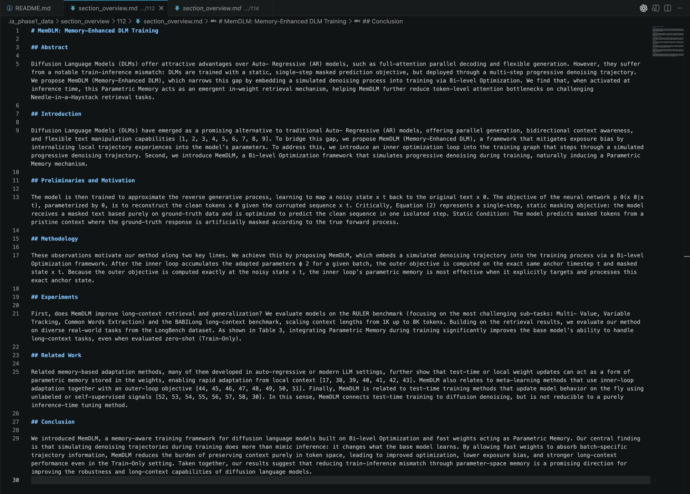

# Section Overview Module

Files:

- `src/ia_phase1/section_overview.py`

## What it does

- Builds a section-wise overview of a PDF.
- Reuses block extraction and section annotation from the existing Phase 1 pipeline.
- Produces one moderately detailed paragraph per section using deterministic extractive summarization.
- Reflows prose and removes common PDF artifacts such as captions, URLs, and label noise before summarizing.

## Public API

- `build_section_overview(pdf_path, *, blocks=None, source_url=None, metadata=None, config=None) -> SectionOverviewResult`
- `render_section_overview_markdown(result) -> str`
- `SectionOverviewConfig`
- `SectionOverviewItem`
- `SectionOverviewResult`

Import path:

```python
from ia_phase1.section_overview import (
    SectionOverviewConfig,
    SectionOverviewItem,
    SectionOverviewResult,
    build_section_overview,
    render_section_overview_markdown,
)
```

## Usage

```python
from pathlib import Path

from ia_phase1.section_overview import SectionOverviewConfig, build_section_overview

result = build_section_overview(
    Path("paper.pdf"),
    source_url="https://arxiv.org/abs/2501.00001",
    config=SectionOverviewConfig(),
)

for section in result.sections:
    print(section.section_title)
    print(section.summary_paragraph)
```

## Command-line usage

A thin CLI wrapper lives at:

- `backend/scripts/export_pdf_to_section_overview.py`

Example:

```bash
backend/.webenv/bin/python backend/scripts/export_pdf_to_section_overview.py \
  --pdf-source path/to/paper.pdf \
  --json
```

`--pdf-source` accepts:

- a local PDF path
- a raw PDF URL, for example `https://arxiv.org/pdf/1706.03762.pdf`
- an arXiv abstract URL, for example `https://arxiv.org/abs/1706.03762`
- a DOI, for example `10.48550/arXiv.1706.03762`

`--paper-id` is optional. If omitted, the CLI derives a stable local id from the resolved PDF content and uses that id for folder naming under `--output-root`.

To write both `section_overview.json` and `section_overview.md`:

```bash
backend/.webenv/bin/python backend/scripts/export_pdf_to_section_overview.py \
  --pdf-source path/to/paper.pdf \
  --output-dir /tmp/section_overview_42
```

To place a copied PDF and the overview under one root:

```bash
backend/.webenv/bin/python backend/scripts/export_pdf_to_section_overview.py \
  --pdf-source https://arxiv.org/abs/1706.03762 \
  --output-root /tmp/paper_overview
```

DOI example:

```bash
backend/.webenv/bin/python backend/scripts/export_pdf_to_section_overview.py \
  --pdf-source 10.48550/arXiv.1706.03762 \
  --output-root /tmp/paper_overview
```

That creates:

- `/tmp/paper_overview/pdfs/<paper_id>/...`
- `/tmp/paper_overview/section_overview/<paper_id>/section_overview.json`
- `/tmp/paper_overview/section_overview/<paper_id>/section_overview.md`

## Result shape

Each `SectionOverviewItem` includes:

- `section_title`
- `section_canonical`
- `section_level`
- `page_start`
- `page_end`
- `block_count`
- `word_count`
- `summary_paragraph`
- `source_sentences`

## Config

`SectionOverviewConfig` fields:

- `include_front_matter`
- `include_references`
- `include_acknowledgements`
- `include_appendix`
- `min_sentences_per_section`
- `max_sentences_per_section`
- `min_words_per_section`
- `max_words_per_section`
- `sentence_similarity_threshold`
- `max_sentence_chars`

## Notes

- The module is deterministic; it does not require an LLM.
- By default it skips front matter, references, and acknowledgements.
- Default output aims for a slightly longer section paragraph, typically around `75-220` words with up to `4` selected sentences.
- It is designed for reusable structured output first, with optional markdown rendering on top.

## Tests

- `modules/phase1-python/tests/test_section_overview.py`

## Screenshots of Section overview result markdown
Overview of [https://arxiv.org/abs/2603.22241](https://arxiv.org/abs/2603.22241)
<br><br>

<br><br>

